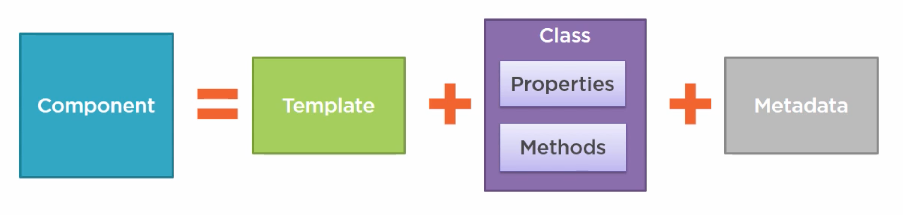
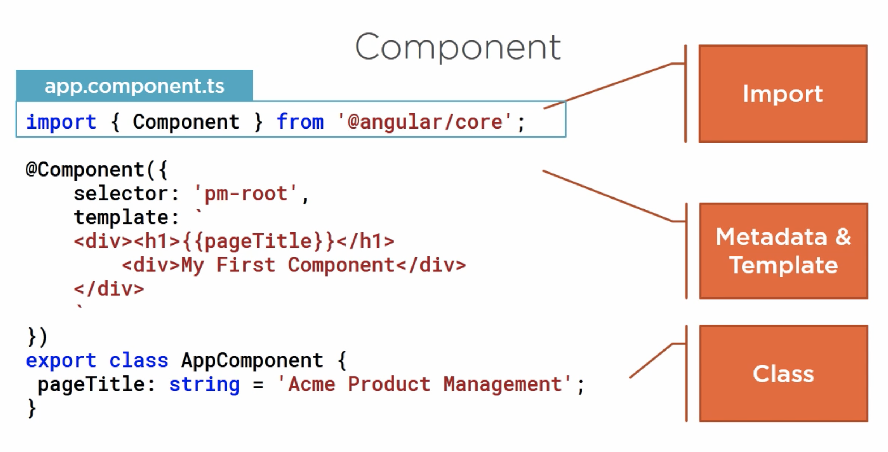
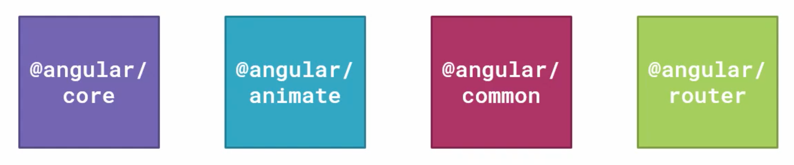
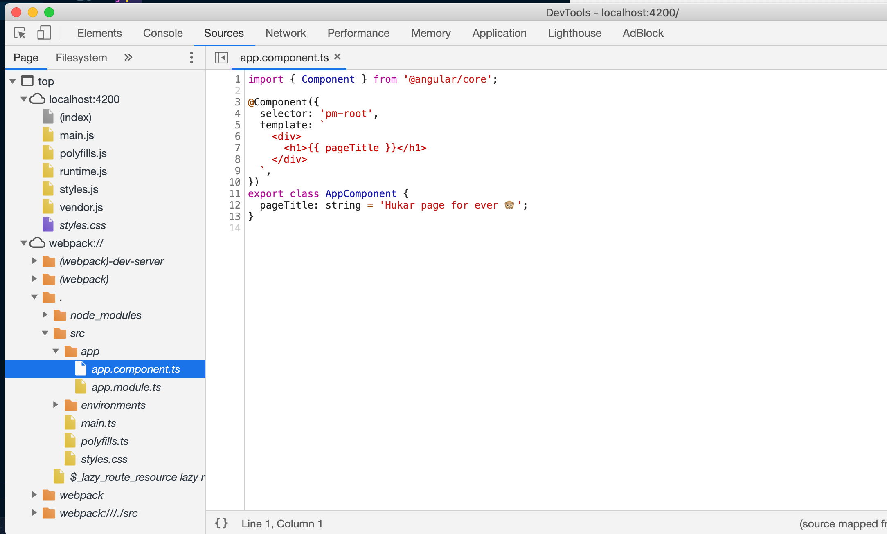
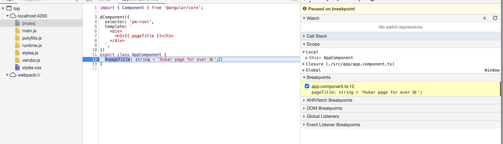

# 01 component



## Simple Component



## Décorateur

Une fonction qui ajoute des `metadata` à une classe ses membres ou ses méthodes.

Préfixé par `@`.


## Modules `Angular`




## Component Base Skeleton

```typescript
import { Component } from '@angular/core';

@Component({
  selector: 'pm-root',
  template: `
    <div>
      <h1>{{ pageTitle }}</h1>
    </div>
  `,
})
export class AppComponent {
  pageTitle: string = 'Hukar page for ever 🐵';
}
```


## Debug dans le navigateur

`Webpack` crée des fichiers `map` qui permettent de débuguer `Typescript` directement dans le navigateur :



On peut ajouter un `break point` :



## Compilation

Par le passé `Angular` utilisait une compilation `Just In Time` pour le développement et une compilation `Ahead of Time Compiler` (`AOT`) pour la production.

Depuis la `v9` la compilation `AOT` est suffisamment rapide pour être aussi utilisé pour le développement.

