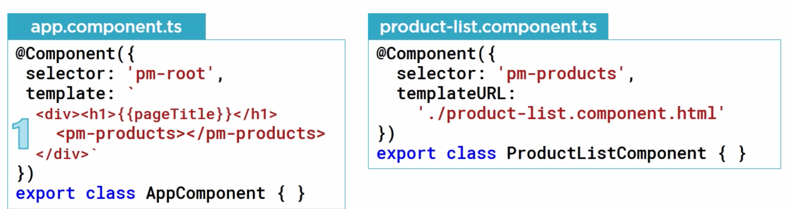
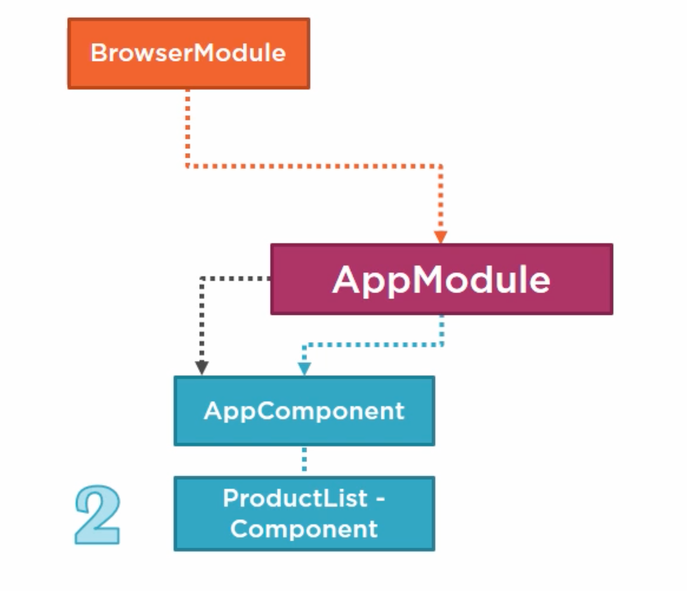

# 02 `template` et `directive`

## Linked `Template`



```typescript
@Component({
    selector: 'pm-product-list',
    templateUrl: './product-list.component.html',
})
```



On doit déclarer notre `component` dans notre `module`.

`app.module.ts`

```typescript
import { AppComponent } from './app.component';
import { ProductListComponent } from './product/product-list.component';

@NgModule({
    declarations: [AppComponent, ProductListComponent],
    imports: [BrowserModule],
    bootstrap: [AppComponent],
})
```


## Binding

### Interpolation

One Way Binding

Le code placé entre double accolade est appelé `template expression`.


Un `template expression` est converti par **Angular** en chaîne de caractère et remplacé dans le `html`.

