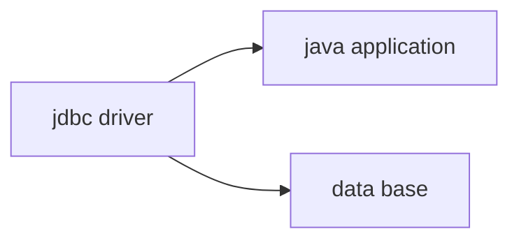

## Warning


Il faut toujours lancer une application par le servlet pour la connection à la base de données


## Trouver la librairie de connection

Sur le site de mysql :

https://dev.mysql.com/downloads/connector/j/5.1.html

Il suffit de taper sur google mysql connector java.

mettre le __.jar__ dans ```WEB-INF/lib```

## Récupérer un paramètre de formulaire dans un servlet

Dans le formulaire :

```html
<input type="hidden" name="command" value="ADD" />
```

Dans le servlet:

```java
String theCommand = request.getParameter("command");
```

## Récupérer la `dataSource` dans le servlet

```java
@Resource(name="jdbc/web_student_tracker")
private DataSource dataSource;
```

## Schéma d'une architecture JDBC



Le driver crée le lien entre l'application et la base de données


## Les classes clées

java.sql.DriverManager

java.sql.Statment

java.sql.Connection

java.sql.ResultSet

javax.sql.DataSource -> connecting pooling


#Un simple CRUD

## Les étapes du processus

1. Get a connection to database
2. Create a statement object
3. Execute SQL query
4. Process result set


## Create

```java
String url = "jdbc:mysql://localhost:3306/jdbc_luv2code";
String user = "root";
String password = "root";

try {
    // 1. Get the connection
    Connection myConn = DriverManager.getConnection(url, user, password);

    // 2. Create a statement
    Statement myStmt = myConn.createStatement();

    // 3. Execute SQL update statement
    // attention au simple quote dans une requête, ceci ne marche pas à cause de l\' :
    // String sql = "insert into story (title_of_chapter,story_name) values('l\' inclusion','un héro au repos')";
    String sql = "insert into bobos (name,age) values('zozo',28)";
    myStmt.executeUpdate(sql);


} catch (Exception e) {
    // TODO: handle exception
    System.out.println(e.getMessage());
}
```


remarques :

* trois étape :
  1. Get the connection
  2. Create a statement
  3. Execute SQL update statement
* Attention avec l'imbrication des quotes ```\'```ne fonctionne apparement pas.

## Read

```java
String url = "jdbc:mysql://localhost:3306/jdbc_luv2code";
String user = "root";
String password = "root";

try {
    // 1. Get a connection
    Connection myConn = DriverManager.getConnection(url, user, password);

    // 2. Create a statement
    Statement myStmt = myConn.createStatement();

    // 3. Execute SQL query
    String sql = "select * from bobos";
    ResultSet myRs = myStmt.executeQuery(sql);

    // 4. Process the result set
    while(myRs.next()) {
        System.out.print(myRs.getInt(1) + " : ");
        System.out.print(myRs.getString("name") + " : ");
        System.out.print(myRs.getInt(3) + "\n");
    }

} catch (Exception e) {
    e.getStackTrace();
}
```

On utilise ```myStmt.executeQuery(sql)```  et ```while(myRs.next())``` pour la lecture des données.

## Update

 ```java
String url = "jdbc:mysql://localhost:3306/jdbc_luv2code";
String user = "root";
String password = "root";

try {

    // 1. Get the connection
    Connection myConn = DriverManager.getConnection(url, user, password);

    // 2. Create a statement
    Statement myStmt = myConn.createStatement();

    //3. Execute SQL update
    String sql = "update bobos " +
        "set name='mirabelle'" +
        "where id=3";

    myStmt.executeUpdate(sql);


} catch (Exception e) {
    // TODO: handle exception
    System.out.println(e.getMessage());
}
 ```

## Delete

```java
String url = "jdbc:mysql://localhost:3306/jdbc_luv2code";
String user = "root";
String password = "root";

try {
    // 1. Get the connection
    Connection connection = DriverManager.getConnection(url, user, password);

    // 2. Create a statement
    Statement statement = connection.createStatement();

    // 3. Execute SQL update query
    String sql = "delete from bobos where id in (1,3)";

    int rowAffected = statement.executeUpdate(sql);
    System.out.println(rowAffected + " row[s] deleted");

} catch (Exception e) {
    // TODO: handle exception
    System.out.println(e.getMessage());
}
```

```sh
2 row[s] deleted
```

# JDBC avancé

## requête préparée

```java
try {
			// 1. Get a connection
			Connection myConn = DriverManager.getConnection(url, user, password);
			
			// 2. Create a prepared statement
			// ? is the placeholder
			String sql = "select * from employees where salary>?";
			PreparedStatement myStmt = myConn.prepareStatement(sql);
			
			// 3. Set parameter values for type and position
			myStmt.setDouble(1,70000);
			
			// 4. Execute SQL query
			ResultSet myRs = myStmt.executeQuery();
			
			// 5. Process the result set
			display(myRs);
			
			// 3.bis. Set parameter values for type and position
			myStmt.setDouble(1,110000);
						
						
			// 4.bis. Execute SQL query
			myRs = myStmt.executeQuery();
			
			// 5.bis. Process the result set
			System.out.println();
			display(myRs);
			
		} catch (Exception e) {
			System.out.println(e.getMessage());
		}
```

* Facilite l'utilisation de paramètre
* évite la faille de sécurité : "injections de dépendances"
* permet de réutiliser une requête et améliore les performances