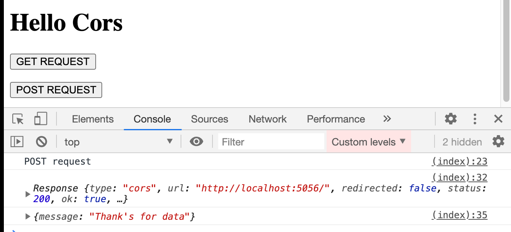
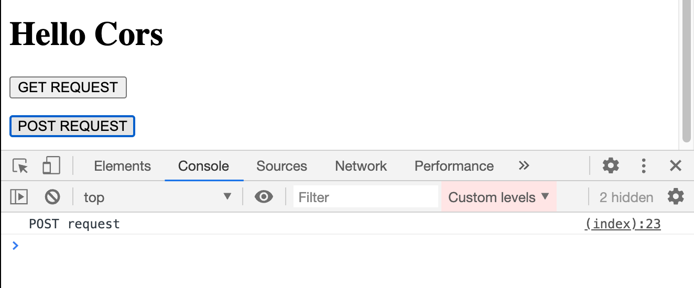
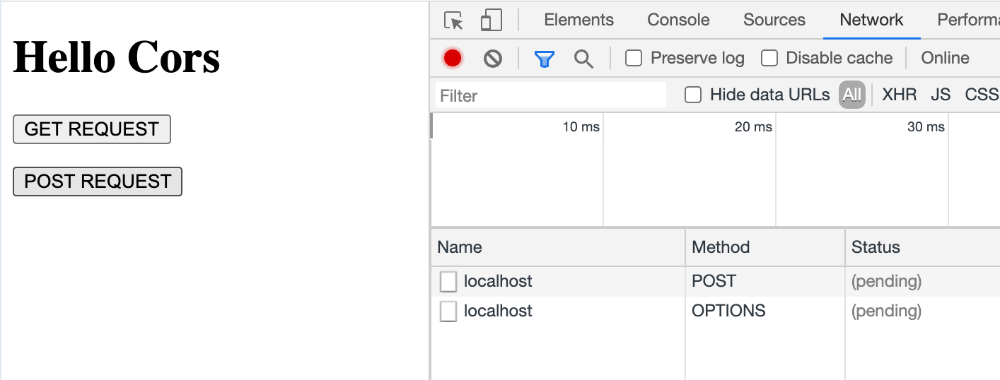
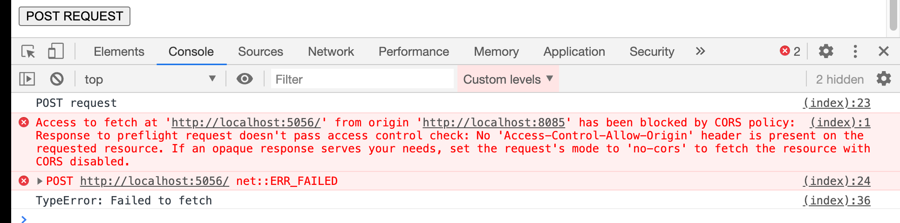
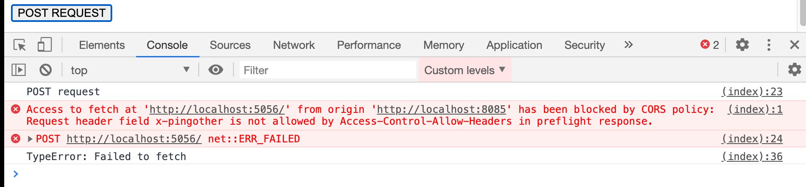
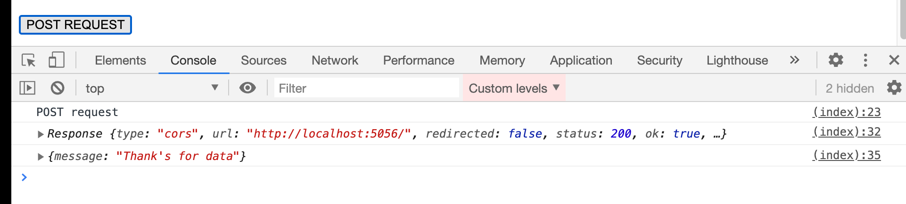

# `CORS` avec `POST`

Si on a une requête avec la méthode `POST` cela va fonctionner comme avec `GET`.

`HTML sur http://localhost:8085`

```html
<!DOCTYPE html>
<html lang="en">
  <body>
    <h1>Hello Cors</h1>
    <p><button onclick="postRequest()">POST REQUEST</button></p>
    <script>
      function postRequest() {
        console.log("POST request");
        fetch("http://localhost:5056", {
          method: "post",
          body: JSON.stringify({ message: "Hello I'm a post request" }),
        })
          .then((response) => {
            return response.json();
          })
          .then((data) => console.log(data))
          .catch((err) => console.log(err));
      }
    </script>
  </body>
</html>
```

`JSON SERVER`

```js
const server = http.createServer((req, res) => {
  req.on("data", (data) => console.log(`data : ${data}`));

  res.writeHead(200, {
    "Content-Type": "application/json",
    "Access-Control-Allow-Origin": "http://localhost:8085", // ici on autorise l'appel AJAX
  });
  res.end(JSON.stringify({ message: "Thank's for data" }));
});

server.listen(5056, () => console.log("server is running on port 5056"));
```

Cela fonctionne sans problème.



## Ajout d'un nouveau `header`

Par contre dès que l'on va ajouter un `header` spécifique :

`HTML`

```js
function postRequest() {
  console.log("POST request");
  fetch("http://localhost:5056", {
    method: "post",
    body: JSON.stringify({ message: "Hello I'm a post request" }),
    headers: {
      "X-PINGOTHER": "pingpong",
    },
  })
    .then((response) => {
      console.log(response);
      return response.json();
    })
    .then((data) => console.log(data))
    .catch((err) => console.log(err));
}
```

BAM on ne reçoit plus rien :



En fait une requête de vérification `preflight request` est envoyée par le navigateur avec pour méthode `OPTIONS` :



On doit donc répondre à cette méthode :

`JSON SERVER`

```js
const server = http.createServer((req, res) => {
  if (req.method === "POST") {
    req.on("data", (data) => console.log(`data : ${data}`));

    res.writeHead(200, {
      "Content-Type": "application/json",
      "Access-Control-Allow-Origin": "http://localhost:8085",
    });
    res.end(JSON.stringify({ message: "Thank's for data" }));
  } else if (req.method === "OPTIONS") {
    res.end();
  }
});
```

## Nouvelle erreur `CORS`

De nouveau on obtient :



Facile il suffit d'autoriser le serveur lançant l'appel `AJAX` :

### `"Access-Control-Allow-Origin":"http://localhost:8085`

```js
res.writeHead(200, {
  "Access-Control-Allow-Origin": "http://localhost:8085",
});

res.end();
```

## Erreur sur un `header` bien précis



Maintenant c'est le `header` `Access-Control-Allow-Headers` qui doit être configuré dans la `preflight response` :

`JSON SERVER`

```js
// ...

// ceci est la preflight response
else if (req.method === "OPTIONS") {

    res.writeHead(200, {
        "Access-Control-Allow-Origin": "http://localhost:8085",
        "Access-Control-Allow-Headers": "X-PINGOTHER",
    });
    res.end();
}

// ...
```

### `"Access-Control-Allow-Headers": "X-PINGOTHER"`


