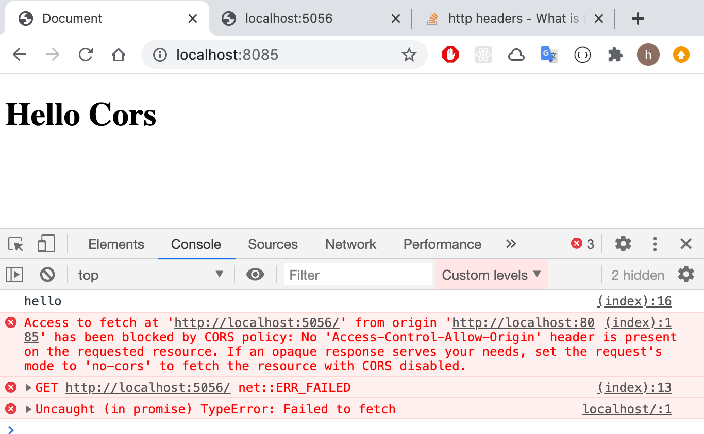
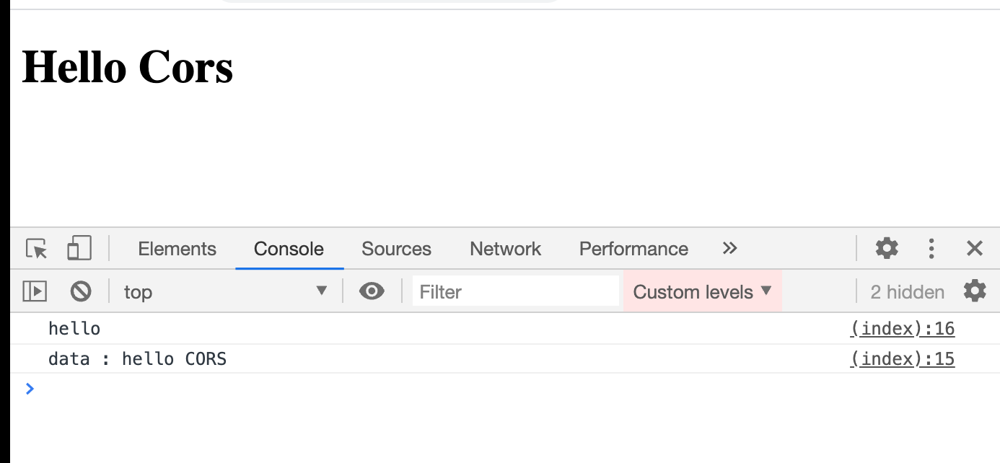

# 01 CORS

## `C`ross `O`rigin `R`esource `S`haring

Partage de ressources d'origines multiple.

Par défaut, les navigateurs ne permettent pas le partage de ressource entre différentes origines.

Une origine est considérée comme identique si le `protocole` et le `host` et le `port` sont identique.

## Test avec `NodeJS`

Quatre fichiers;

Deux serveurs sur deux ports différents, un pour le html : `app.js` et l'autre pour une requête `ajax` : `json-app.js`.

`app.js`

```js
const http = require("http");
const fs = require("fs");
const path = require("path");

const server = http.createServer((request, response) => {
  response.writeHead(200, { "Content-Type": "text/html" });
  const index = fs.createReadStream(path.join(__dirname, "index.html"));

  index.pipe(response);
});

server.listen(8085, () => console.log("server is running on port 8085"));
```

`json-app.js`

```js
const http = require("http");
const fs = require("fs");
const path = require("path");

const server = http.createServer((req, res) => {
  res.writeHead(200, { "Content-Type": "application/json" });
  const data = fs.createReadStream(path.join(__dirname, "data.json"));

  data.pipe(res);
});

server.listen(5056, () => console.log("server is running on port 5056"));
```

`index.html`

```html
<!DOCTYPE html>
<html lang="en">
  <head>
    <meta charset="UTF-8" />
    <meta name="viewport" content="width=device-width, initial-scale=1.0" />
    <title>Document</title>
  </head>

  <body>
    <h1>Hello Cors</h1>
    <script>
      fetch("http://localhost:5056")
        .then((response) => response.json())
        .then((data) => console.log(`data : ${data.message}`));
      console.log("hello");
    </script>
  </body>
</html>
```

`data.json`

```json
{
  "message": "hello CORS"
}
```



## Correction `Access-Control-Allow-Origin`

Pour remédier à ce problème il suffit de dire au serveur qu'il peut accepter des requête venant d'un autre domaine :

`json-app.js`

```js
const server = http.createServer((req, res) => {
  const data = fs.createReadStream(path.join(__dirname, "data.json"));

  res.writeHead(200, {
    "Content-Type": "application/json",
    "Access-Control-Allow-Origin": "http://localhost:8085",
  });

  data.pipe(res);
});
```

Maintenat cela fonctionne :



### N'importe quelle origine

```js
"Access-Control-Allow-Origin": "*"
```
