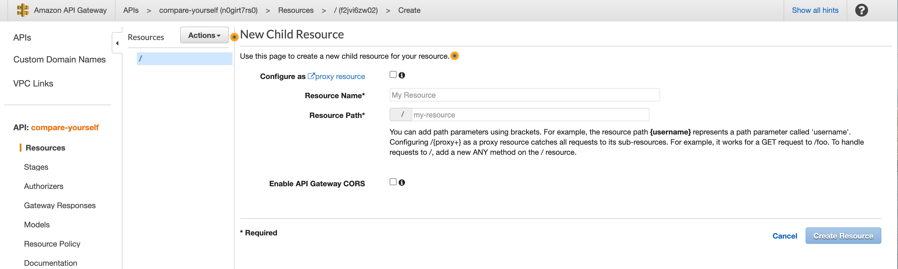
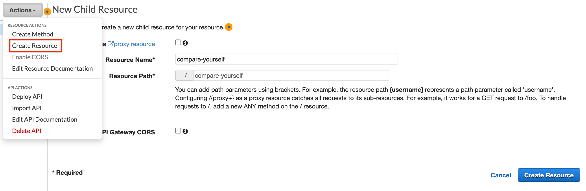

# 02 API Gateway

Ce service de `AWS` permet de créer une `API` dite **serverless**.

Une `resource` est en fait un `path`.

## Proxy

`Proxy` vient du mot procuration, c'est un intermédiaire dans une discussion réseau.

`Configure as proxy resource` permet de récupérer tous les `path` et toutes les `method` pour les rediriger vers une unique `Lambda Function`.

## créer une ressource : `Create resource`

