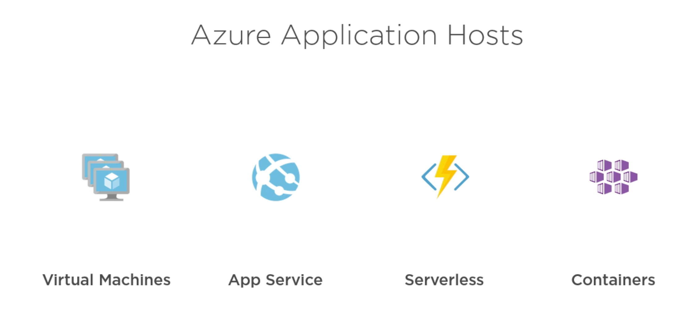
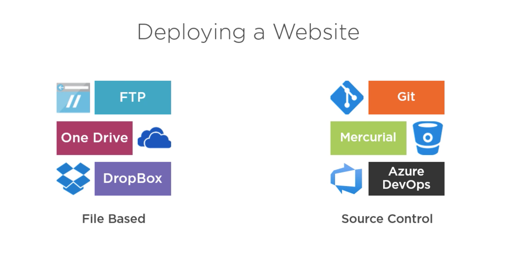
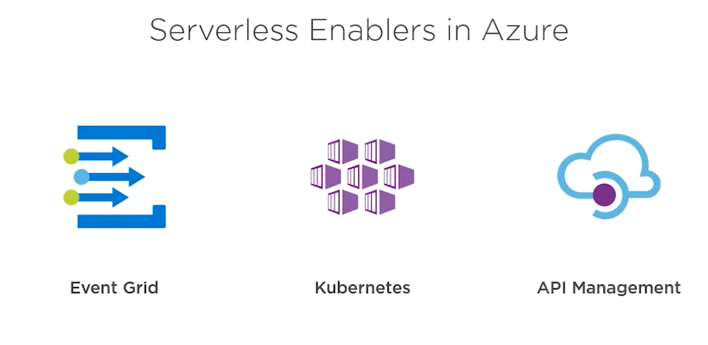
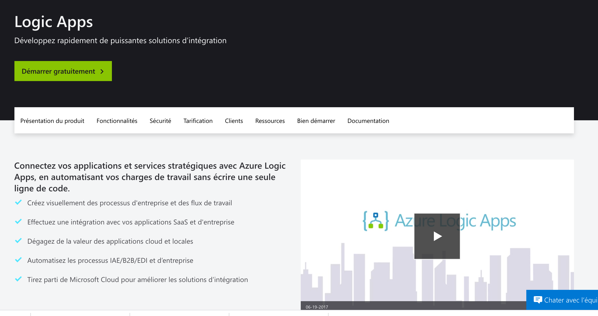

# Azure solutions

Il y a quatre possibilités :

Deux choix `App Service` et `Serverless`

## 1 App Service

On peut déployer depuis `One Drive`.

Utiliser les variables d'environnement dans `config.js` pour pouvoir l'ajouter dans le dépôt GIT sans danger pour certaines données.

## 2 Serverless

API Management = API Gateway (AWS).

### Programmation Visuel : Azure Logic App

On peut relier la logique d'une `Azure Function` avec `One Drive` et `Office 365 Outlook` par exemple, pour construire des workflow complexes.
