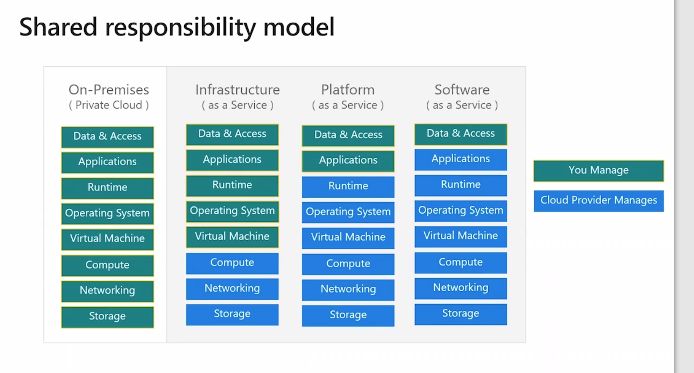
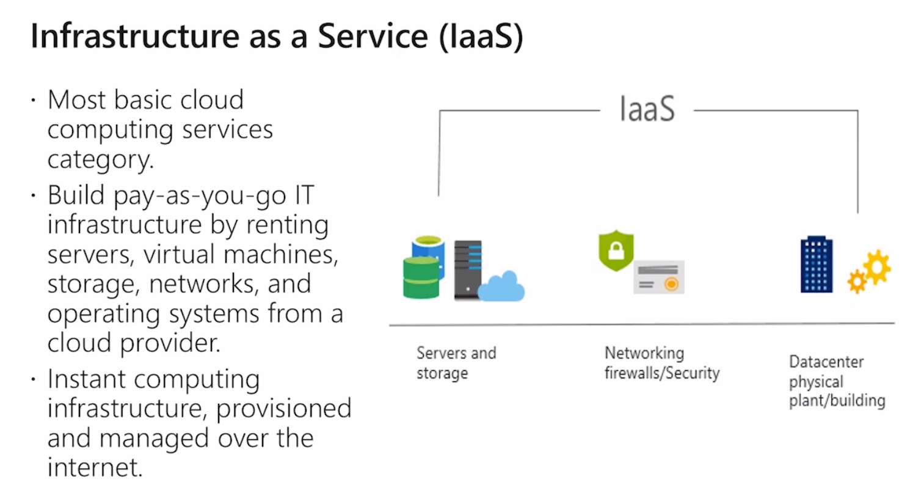
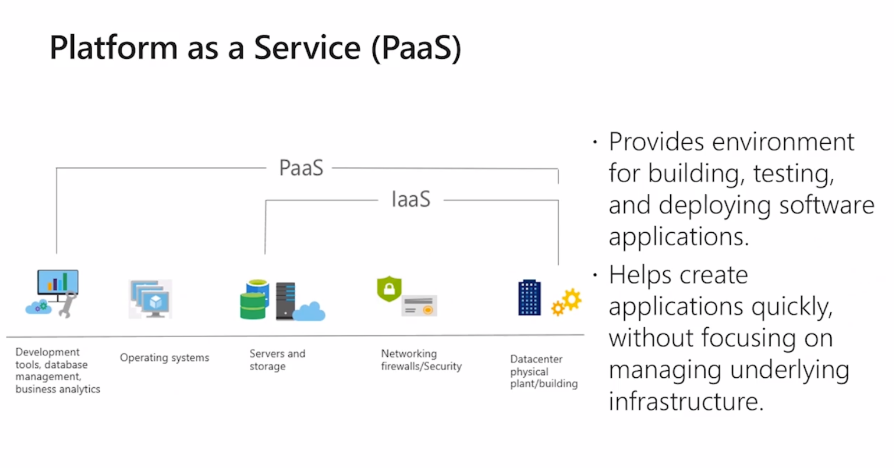
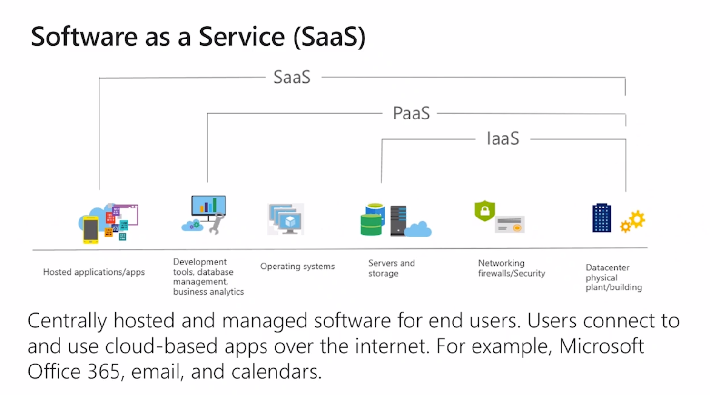
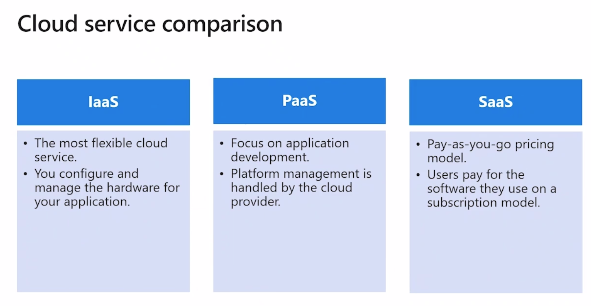

# 01 concepts fondamentaux

certification 40 questions 1h 700/1000.

questions choix multiple, pas d'action a exécuter.

Passer la certification depuis le domicile poste windows 10, webcam, filmé.

## Fin octobre 2008 Los Angeles

Conférence microsoft PDC

Naissance de `Windows Azured`

février 2010 offre commercial

2012 IAAS

2014 la plateforme devient microsoft Azure (opposition AWS)

-> Direction vers Open Source

## Objectifs

Pourquoi le cloud public

cloud public, cloud privé, cloud hybride

### Pourquoi ?

fournisseur : cloud service provider

materiel virtualisé sur serveur physique pour des client

IAAS infrastructure is a service

- force de calcul
- storage 
- network
- analytics : visualisation

## Concepts clés

- `haute disponibilité` = temps de disponibilité important ≠ indisponibilité
	infrastructure matériel cluster, reprise en cas d'erreur, redondance
- `tolérance aux pannes` : mode dégradé
- `scalabilité` s'adapter à la demande augmenter/diminuer les ressources
- `elasticité` : capacité à s'adapter le plus rapidement possible de manière automatisé (scalabilité automatisé)
- `global reach` : plusieurs régions, 148 pays, data center un peu partout, la latence est un élément essentiel
	Les data center sont au plus proche des utilisateur
- `agilité` : travaillé sur plusieurs service en même temps
- `coût` : calculatrice
- `disaster recovery` :  basculer vers une autre région en cas de catastrophe fail hover fail back
- `sécurité` : exigence de norme et de certification, outils pour sécuriser son infrastructure,le client est partie prenante de la sécurité.

les racks sont regroupé en clusters, grande quantité, meilleur prix pour la partie physique.

CapEx vs Opex

**CapEx** : dépenses infrastructure physique : maintenance et nouveau matériel

-> cloud privé

**OpEx** dépense d'exploitation coût récurant salaire, loyer paiement à la consomation : cloud public

on paie ce qu'on consomme. On loue des ressources, on est pas propriétaire de ses ressources.

Pas de ticket d'entrée, pas de frais initiaux.

Pas de frais infrastructure = microsoft qui en a la charge.

On paie des services.

On peut arrêter de payer à tout moment, si on utilise plus les ressources : **OpEx**.

## Partie 3

`cloud public` :  **OpEx** fournisseur de service cloud : Azure

On gère grace au navigateur ou de langage de script.

**avantages** : coût inférieur, pas de maintenance matériel, extensibilité pratiquement illimité (monter en charge), haute fiabilité

`cloud privé` : **CapEx** data center matériel physique, la maintenance des infrastructure est privé, les infrastructure sont propres à l'organisation. data center dédié. (prestataire tier possible).

avantages: flexibilité, sécurité (niveau supérieur sécurité), extensibilité des ressources

`cloud hybride` cloud privé : **on premise** connecté à un cloud public =>  `Azure Stack` bénéficié de l'offre Azure dans le cloud privé;

avantage: contrôle, flexibilité, coût, facilité

## Partie 4 type responsabilité

On-premise private cloud

compute = hyperviseur

`IaaS` Infrastructure as a Service

`PaaS` Platform as a Service on se concentre sur l'applicatif

`SaaS` Software as a Service on loue l'applicatif : abonnement

## `IaaS`

On garde un administrateur, l'aspect physique est dévolue à Microsoft.

Machine Virtuel.

## `PaaS`

environnement complet dans le cloud

`express route`, `https`, `vpn`

Site web, application

Développement 

## SaaS

Office 365

Solution Logiciel complète

En générale disponible par navigateur.

version finale de l'applicatif.

modèle abonnement

