# 02 Service fondamentaux

## 01 Regions

collection de Data Center (en général 3 data center).

influence la latence.

La région influence le prix.

Appréhender la loi par pays. aspect legislatifs

Les data center communiques 58 regions 140 pays

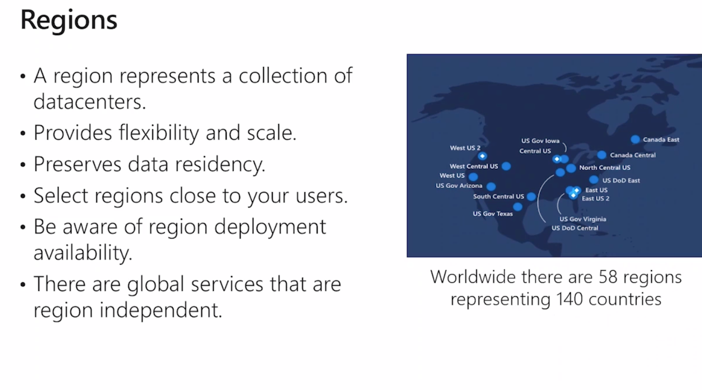

Les régions sont séparées par paire en cas de catastrophe. Elle peuvent répliquer les données de la régions primaire à la région secondaire :

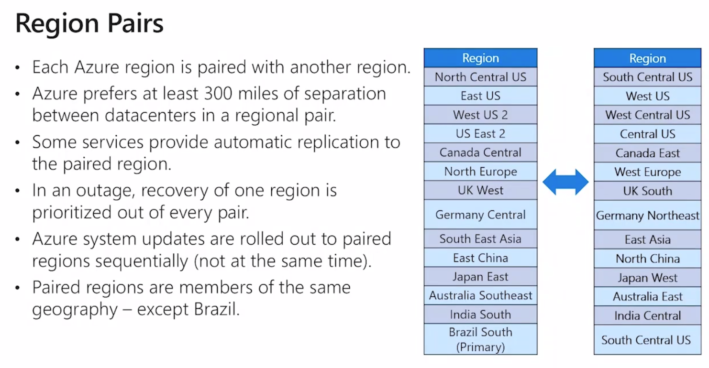

Ce n'est pas manageable par le client, la géo-réplication est géré par Microsoft.

## Azure Géographie

Zone géographique souveraineté des données respecté les limites géographiques

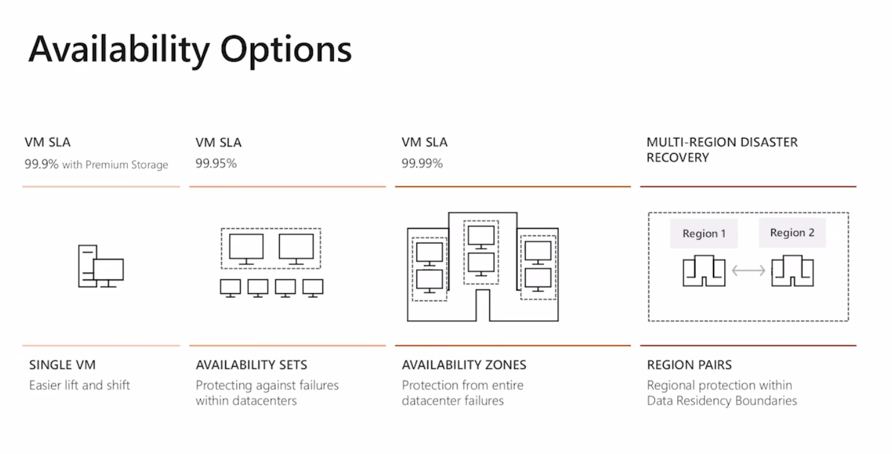

disque prenium = ssd.  SLA de 99,99%

Panne au sein d'un même data center 99,95 % SLA

Zones de disponibilités (plusieurs data center , une région) 99,99% SLA

Réplication Multi-Région (paire ou autre) 99,99% plus la perte d'une région.

surcoût avec la zone de disponibilités et la réplication Multi-Région.


## Availibility sets


Les machines virtuelles sont réparties

## Availibility zones

emplacement physique unique


Trois Data Center.

99,99% de SLA

Si une zone est compromise les données sont disponible automatiquement dans un autre Data Center

## Resource Groups


C'est un classeur.

Il contient des ressources une ressource ne peut appartenir qu'a un seul groupe de ressource.

Si on supprime un groupe toutes les ressources sont supprimés

Un groupe de ressource correspond à un projet.

un groupe de ressource ne peut pas contenir un autre groupe de ressource.

On peut déplacer les ressources d'un groupe à l'autre.

Un groupe de ressource de différentes régions.

## Abonnement

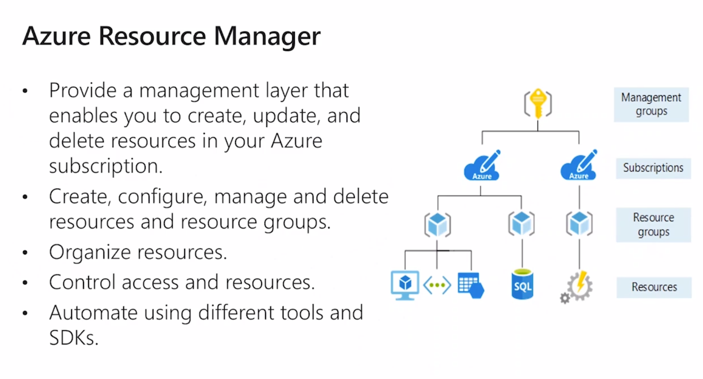

Les ressources ne peuvent pas communiquer avec un autre abonnement.

Sauf via un Piring V-net.

Chaque abonnement contient un ou plusieurs groupe de ressource.

On peut regrouper les abonnements dans un `management group`.

abonnement => limite facturation

`Azure ressource manager` géré les ressources et les déploiement.


## Partie 3

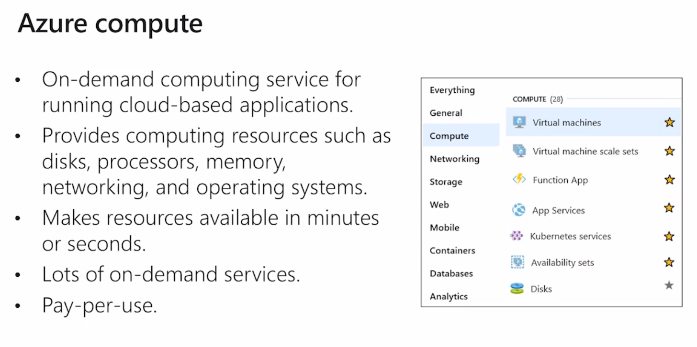

`function app` serverless

PaaS `app Services`

`Azure Kubernetes Services`

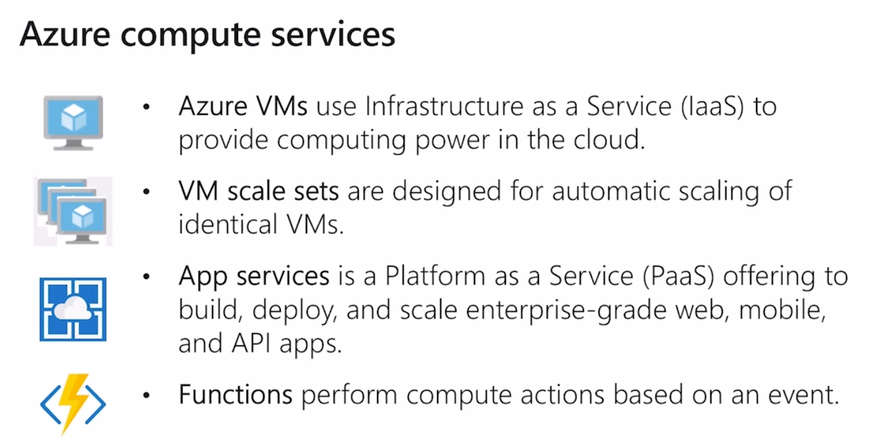

VM scale sets monter en charge

`api app`

`mobile app`

### démo créer une machine virtuelle

Place de marché Azure : pour créer une machine virtuelle.

Ressource Microsoft et éditeur tier.

Il faut :

- un abonnement
- un groupe de ressource
- un nom (naming convention azure : site web) : bien nommer ses ressources
- region : France Centre
- availability sets ou zone c'est ici qu'on ajoute.
- Taille de la VM (on peut en changer mais ça re-démare la VM)
- administrateur
- disque (prenium)
- v-net 

## Création de conteneur

Azure Container Instance ACI PaaS

Azure Kubernetes Service AKS

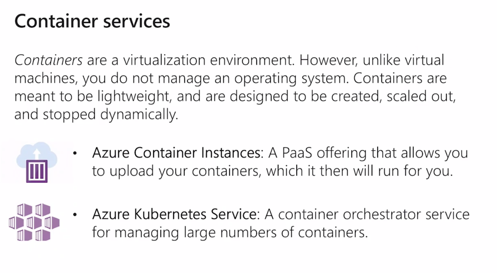

ACI version conteneurisé d'une application.


## Azure Network Service

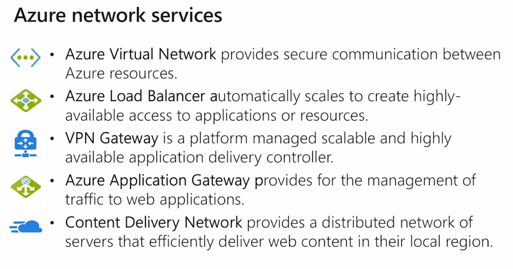

### VPN Gateway On-Premise et Azure 3 composants

1. Gateway subnet
2. virtual network gateway ip public
3. Local Network Gateway On Premise

On utilise une PSK

### Azure Application Gateway : reverse proxy

redirige vers un pool de machine

ip publique 

Déchargement SSL https redirige vers les ressources Azure en http

Il porte le certificat SSL

Produit complet

Travaille sur l'http et l'https des app.

### CDN Content Delivery Network

 Mise en cache stockée au plus proche des utilisateurs.

## Créer un réseau virtuel

- abonnement
- groupe de ressource
- Région
- adresse ipV4 du v-net
- définir un subnet


## Azure Data

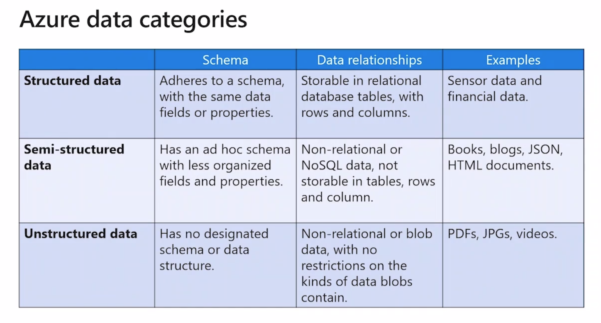

structured : SQL

Semi-Structured : NoSQL, JSON, HTML document

Unstructured Data : [PDF, JPG, video] stocké dans des blob, stocké dans des conteneurs, stocké dans des storage account

## Azure Storage Service

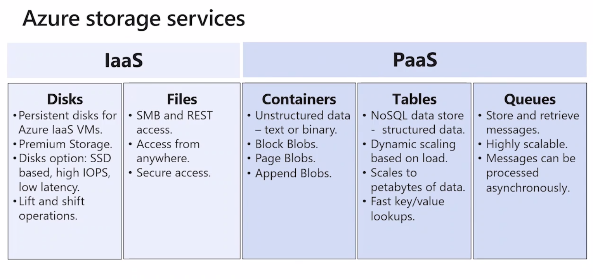

### IaaS

`Disk` : Disque managé disque dur virtuel :

- disque prenium SSD
- disque standard

`Files` : Protocole SMB pour partager les fichiers

### PaaS

`Containers` : blobs

`Tables`: NoSQL

`Queues` : loging sur une BDD

Stockage redondant, chiffré.

4 services :

- Files

- Blob

- Table

- Queue


## Upload d'un fichier

- créer un container images
- upload fichier

Le blob a une URL et on peut ainsi le visionner sur le navigateur.


## BDD

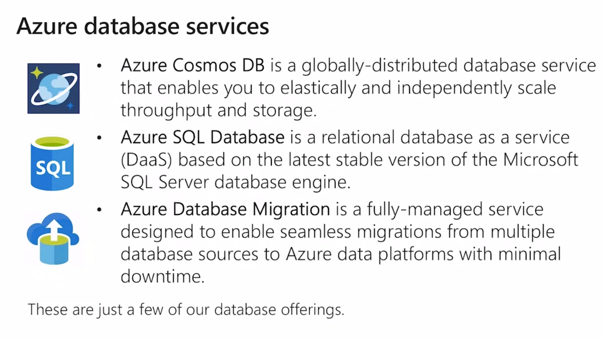

`Azure Cosmo DB` élastique, multi-paradigme, hautement disponible, répliqué. modèle PaaS. NoSQL. 

`Azure SQL Database` PaaS (Daas Database as a Service) SQL éventuellement répliqué

`Azure Database Migration` outil On-Premise vers un service PaaS, à froid ou à chaud


## Azure Market Place

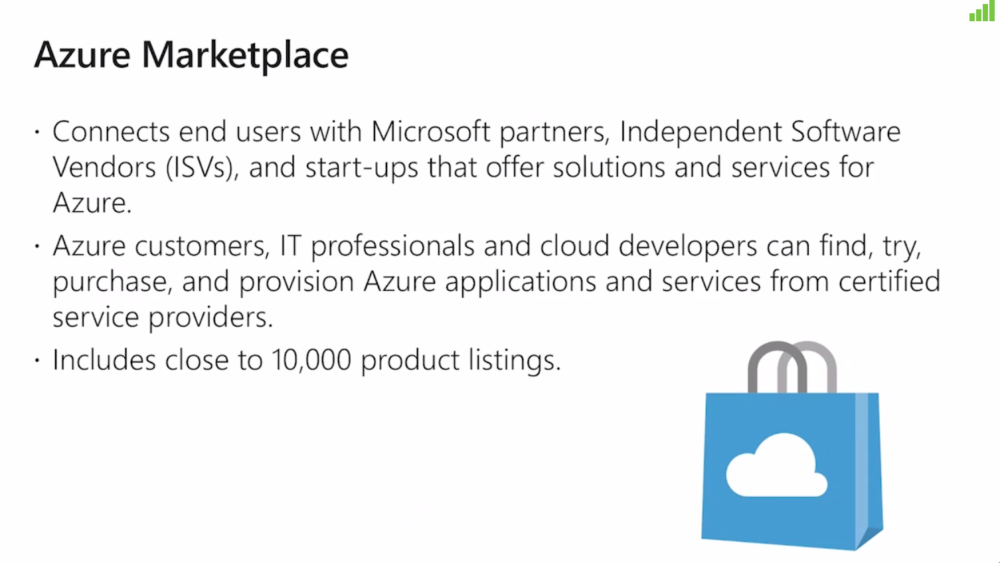

Plus de 10 000 produits.

Galaxy des services Azure

# 4 partie

## Solutions pré-Packagé par Microsoft

### IOT :

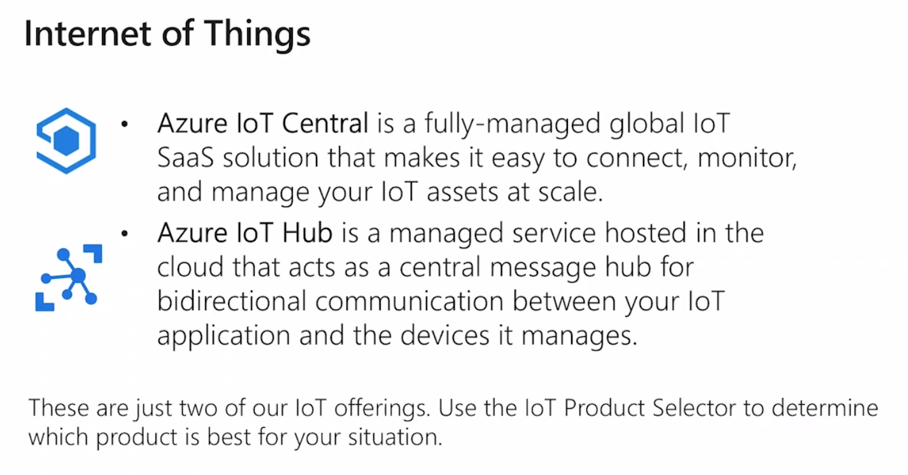

Remonter des valeurs de capteur sur le cloud.

`Azure IOT central` va utiliser `Azure IOT Hub` 

`Azure IOT Hub` synchroniser des paramètres 

### Azure Synaps: Service Analytic

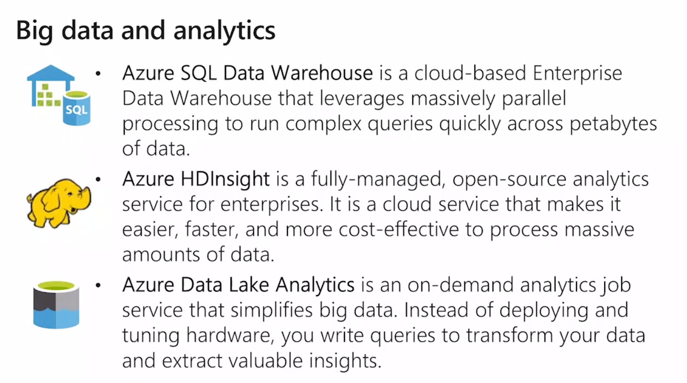

`Azure SQL Data warehouse` ETN Extract Transform Load

`Azure Data Lake Analytics` requête pour extraire des informations importante.

### AI

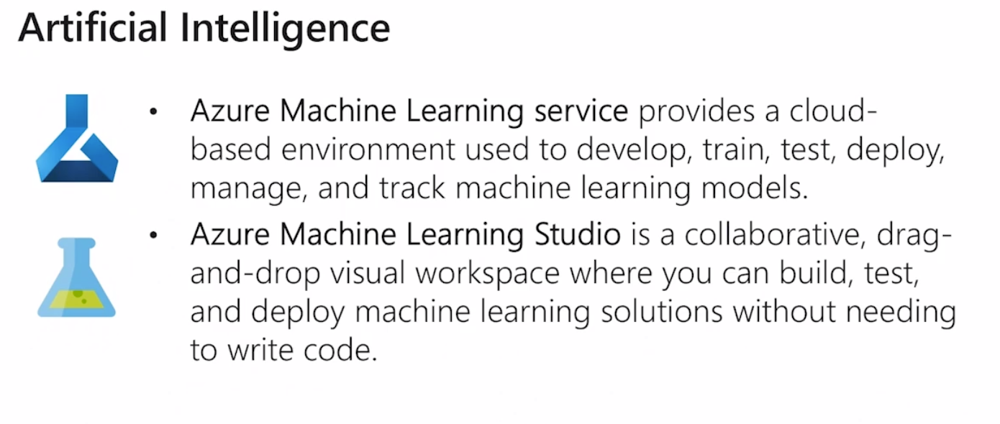

Prévision, recommandation dans les achats en ligne.

Analyse prédicitive.

### serverless

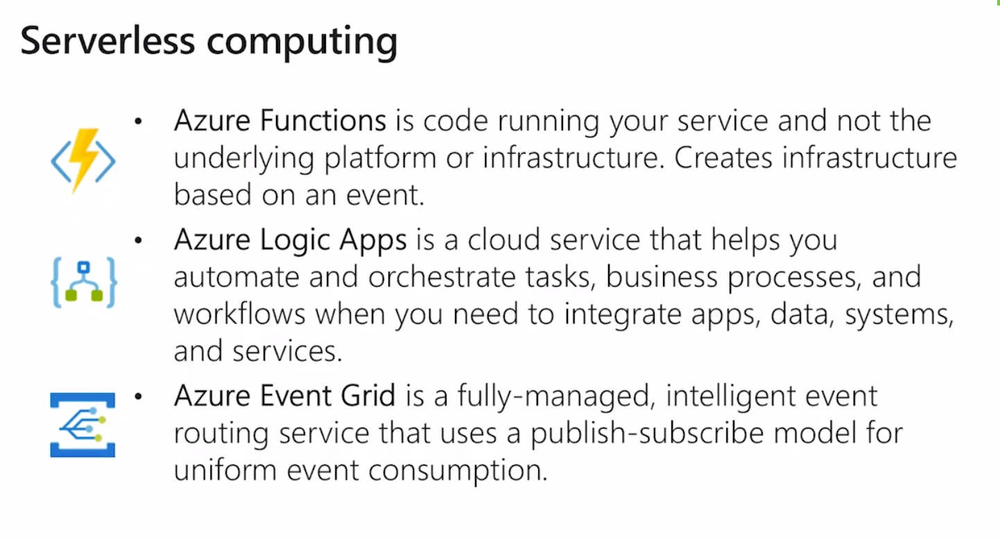

Exécution du code (pas de VM, pas de Service PaaS).

Du code déclenché par des événements.

Trigger : Déclencheur.

`Azure Logics App` workflow déplacer des fichiers, créer des alertes

`Azure Event Grid` application basé sur des événements. j'upload un fichier -> ça déclenche un autre service.


## DevOps

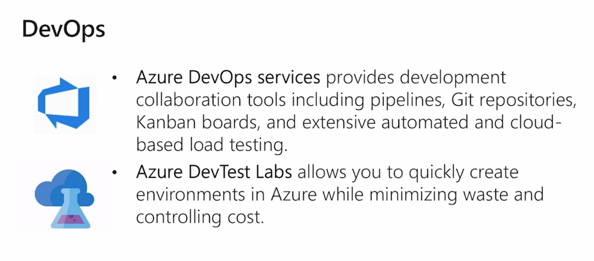

Développement et Opération.

`Azure DevOps services` pipeline, azure depot, pour la production.

`Azure DevTest Labs` environnement de tests.


## Azure App service

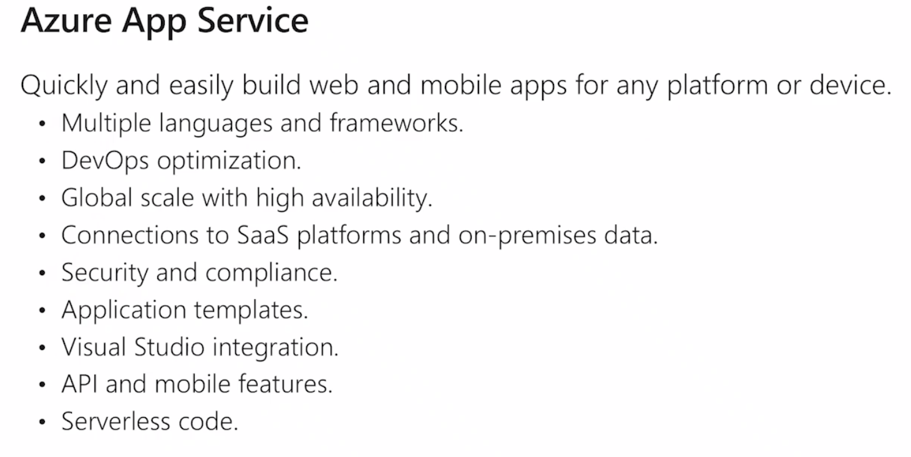

`web-app` plein de langages. publication d'un applicatif.

## Demo création `Web App`

web app dans le market place

à partir d'un langage ou d'un conteneur `Docker`.

On peut choisir un SE (windows ou linux)

Service Plan taille de la web app.

isolated réseaux privé.

#### `Deploiement slot` : clone l'environnement de production, permet de créer des environnement `dev` et `prod`.

Switcher le `dev` en `prod`.

On peut back-uper son app dans un storage account.

On peut changer la taille ou dupliquer le site web.


## Partie 5  : outils de management

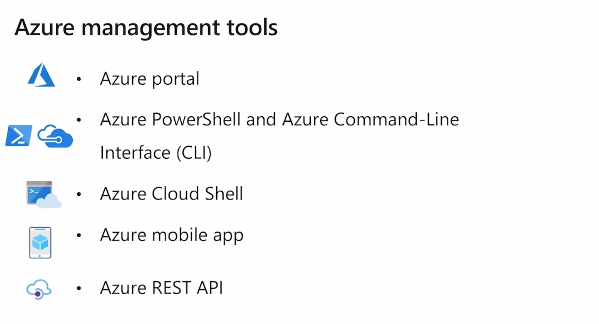

### Portail Azure


## CLI

- power-shell
- azure cli
- azure cloud shell

```shell
get-azvm

get-azwebapp

new-azvm

remove-azStorageAccount
```


Azure CLI : bash

```bash
az vm create

az vm show
```

Tout ça disponible dans le navigateur


### Son smartphone app Azure : on peut manager les ressources azures


## azure Advisor

Optimiser son abonnement Azure. Recommandation Azure pour :

- Disponibilité

- Sécurité : HTTPS plutôt que HTTP

- Performance: utilisation du CPU modifier la taille des machines virtuelles

- Prix : réduire les coûts, supprimer les disques managé par exemple

Propose des corrections.