# 03 la sécurité

## Sécurisation des accès réseaux

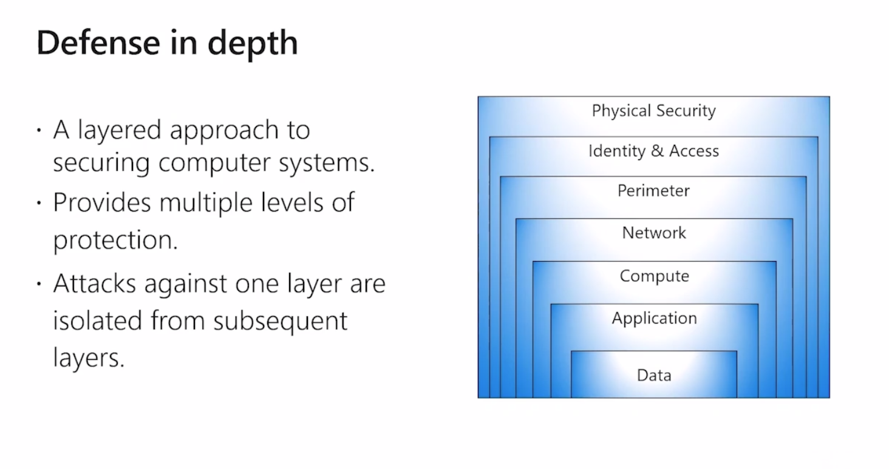

Sécuriser les données en plusieurs couchent.

Les accès sont sécurisés.

Défense réseau.

Responsabilité de microsoft pour la couche physique.

Responsabilité en PaaS de l'utilisateur : compte client, droits d'accès.

## Network Security Group

C'est un `firewall` attaché à la carte réseau de la Machine Virtuel (VM).

Travaille en co-existence entre les règles du NSG et celle de la carte réseau virtuel.

règle : source, destination, port.

Le même NSG peut être partagé par plusieurs v-net, il est dédié aux VM.

#### 

### **Traffic entrant**

**Règles par défaut de communication :**

Un v-net peut communiquer avec ses sub-net : `65000`

les load-balancer peuvent accèder aux ressource : `65001`

On refuse tout : `65500`

Créer une règle

adresse IP ou espace d'adressage

port source

port destination

protocol

priorité plus le chiffre est faible plus la règle est prioritaire.

Ajouter des service azure (service tag)

ASG regroupe les règles

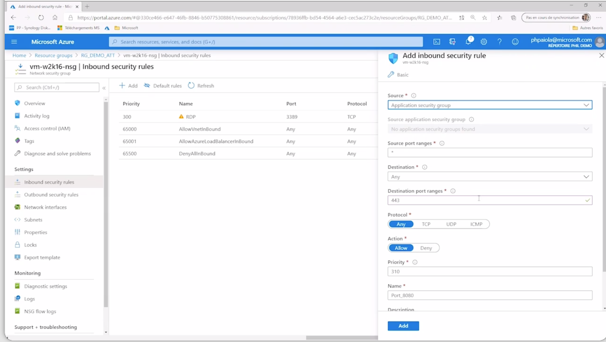

### **Traffic sortant**

associer un sub-net

associer un ASG

règle par défaut 

## ASG application security group

Sécurité centrée sur l'applicatif

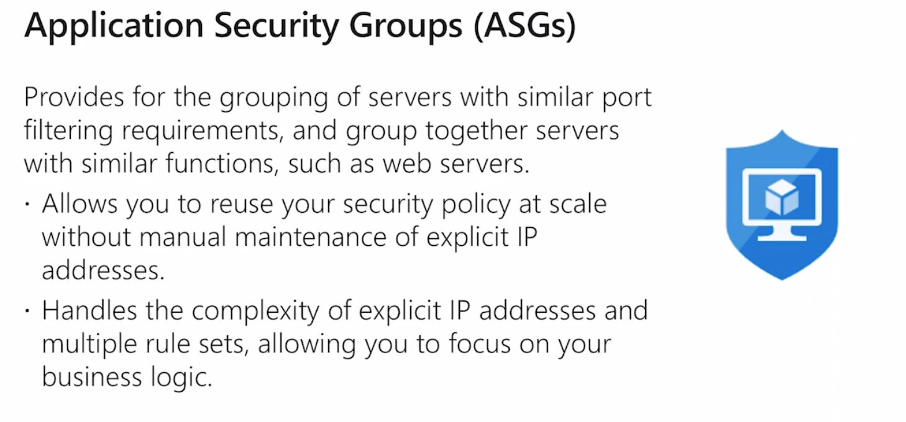

regroupement de règles.

## Azure Firewall

Service de sécurité réseau

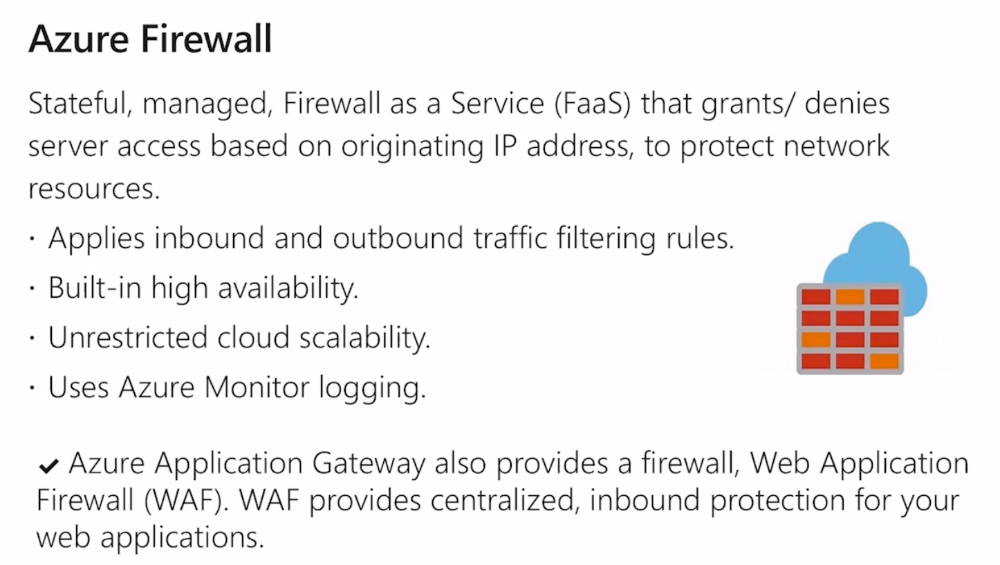

Ip public statique

totalement intégré à Azure Monitor.

S-Nat et NAT entrant

Tout peut être configuré

Manage la sécurité du réseau

## Attaque par Dénie de Service DDoS

épuise les ressources de l'application.

### Version de base

Service DDoS de **base** dans Azure en standard, automatiquement activée.

Surveillance du traffic. (gratuite par défaut)

### Version standard

Stratégie de protection

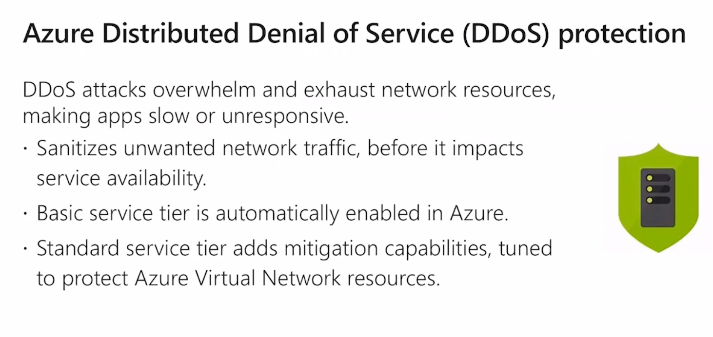

Pas applicable à une Web App.

Outil de filtrage plus avancé

## Résumé

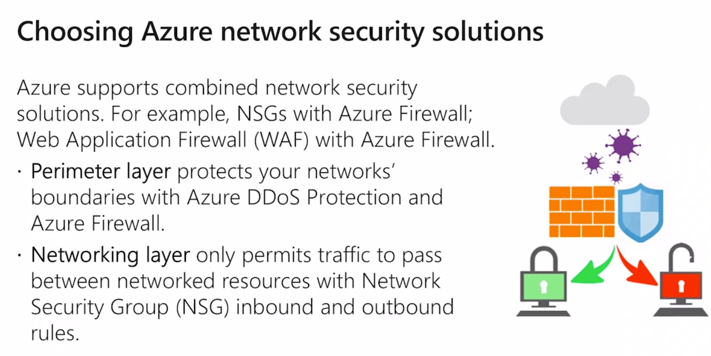

NSG c'est gratuit avec les VM

## Authentification et autorisation

### Authentification

Vérifier qu'une personne est bien elle-même.

### Autorisation

Sur le rôle dans l'entreprise, accès à tel ou tel ressource Azure

## Azure Active Directory

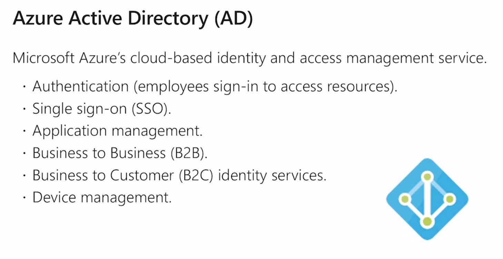

AAD dédié (avec office 365 par exemple).

Authentifier les employés.

B2B B2C

Annuaire stocké sur Azure

Installer en On-Premise pour lier avec l'AD sur site et l'AAD

Synchroniser les comptes utilisateurs.

## Azure Multi-Factor Authentification MFA

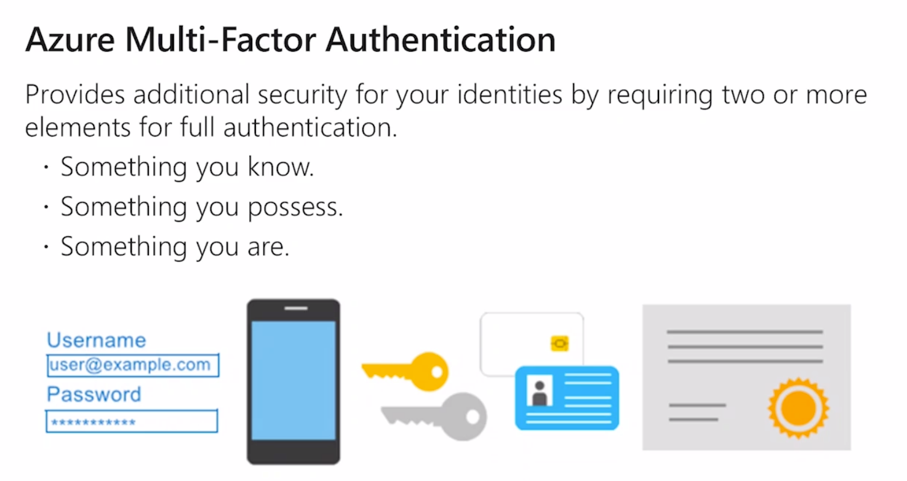

Avec le smartphone one time password

empreinte digital données biométriques

C'est gratuit, sécurise l'accès.

## Azure Security Center

Analyse du réseau virtuel

Conseil donnés et une note.

Visualiser la sécurité On-Premise.

Si on le souhaite on corrige automatiquement les failles de sécurité.

## Azure Key Vault

Coffre fort mots de passe et certificats

Secret puce chiffrée matériellement.

## Azure Information Protection AIP

Sécurisé les échanges numériques

Règle sur les mail : correspondances électronique et documents joints.

- editer le document ou non

- faire un reply ou non
- copier/coller du contenu
- ouvrir le document
- impression écran
- reply to all ou non

AIP protège la correspondance et les documents joints.

## Azure Advanced Treat Protection

Détection des failles, des actions illégitme

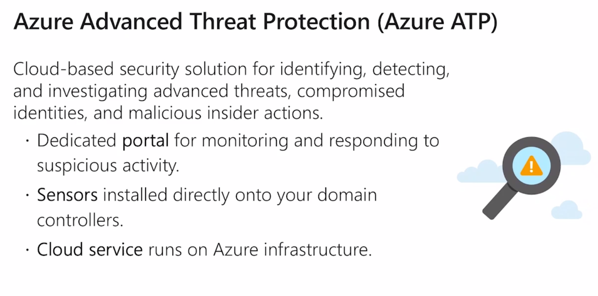

## Gouvernance

### Azure Policy

On veut restreindre les régions pour des raisons réglementaires, legislative.

On restreint la création de ressource à une région.

On peut aussi le faire sur certaine catégorie de service.

Contrainte legislative et contrainte budgétaire respecté.

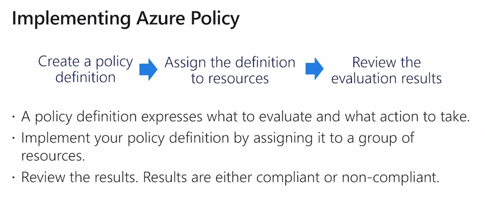

On peut appliquer l'Azure Policy sur certain groupes.

## Policy Initiatives

Police Définition

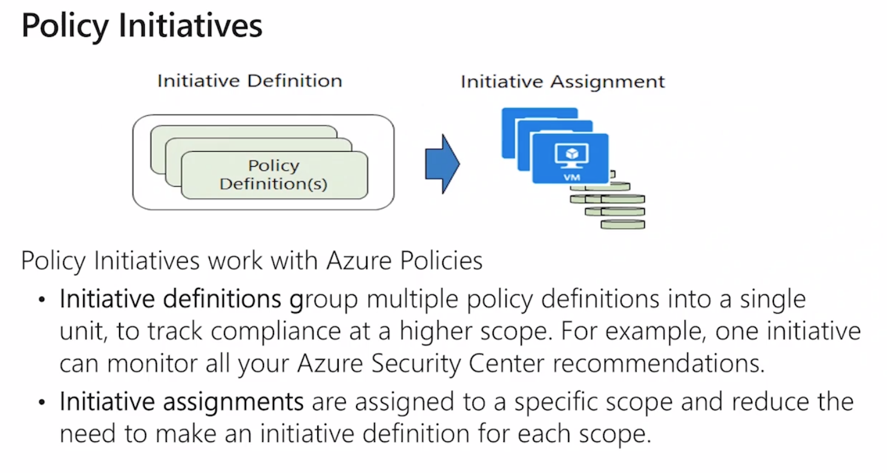

## Role Based Access Control RBAC

Synchronisation des compte On-Premise - cloud.

Rôle prédéfini

Rôle créer

access control IAM

`owner` utilisateur peut tout faire supprimer/editer/créer et donner des droits

`contributor` même accès aux ressources que le `owner` mais n'a pas la possibilité de définir des droits à d'autres utilisateurs

`reader` accès en lecture

## Ressource Lock

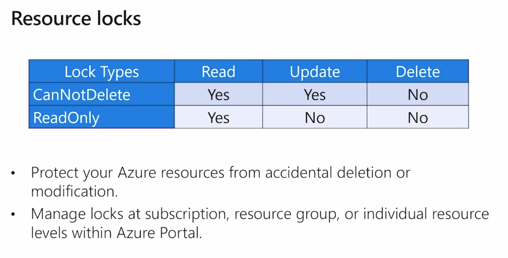

ace au erreur on propose des verrous.

`canNotDelete` ou `readOnly`.

`add` pour ajouter un `lock`

## Azure Blueprint

Configuration de l'environnement.

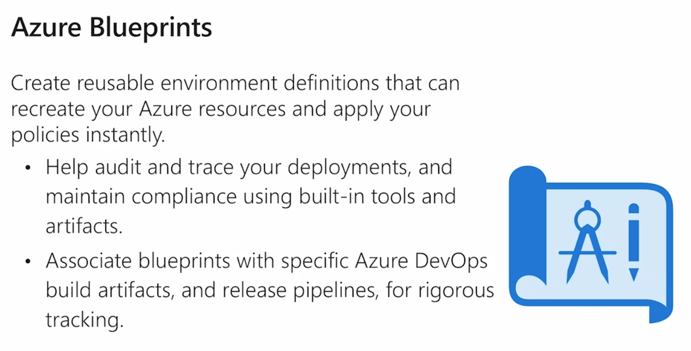

Chaque Blueprint est associé à un abonnement.

Déployer une infra automatiser de A à Z

## Gouvernance Abonnement

Consommation

droits d'accès

Limites par région par défaut : quotas

dans `usage + quotas`.

`request increase` augmentation de quota.

## Monitoring et tags

### Tag

étiquette apposée sur une ressource, groupe de ressources, un abonnement.

Permet d'organiser les ressources. 

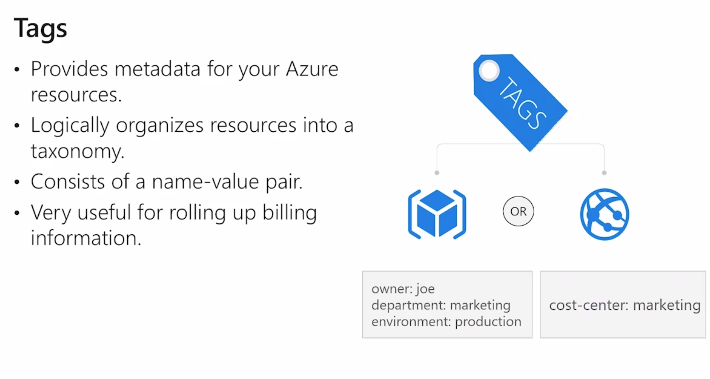

`managed by`

`cost center` 

`environment`

On peut alors en CLI faire des requêtes sur les tags.

## Azure Monitor

Journaux activité

Métriques utilisation des ressources %cpu, %accès disques cloud Azure et On-Premise

On peut créer des alertes.

### démo alerte %cpu

S le cpu est à 90% pendant 15 mn => alerte alors on crée un `action group`

dans `action group` exécuter du code, envoyer un email, un sms, notification push, logique app

## Azure Service Health

être au courant sur l'infrastructure Azure :

Par régions une visu de l'état de santé des services Azure

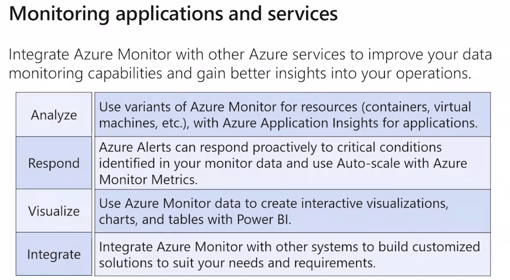

4 phases

- analyse
- réponse
- visualisation
- intégration

## Visualiser l'état de sécurité de son infra Azure

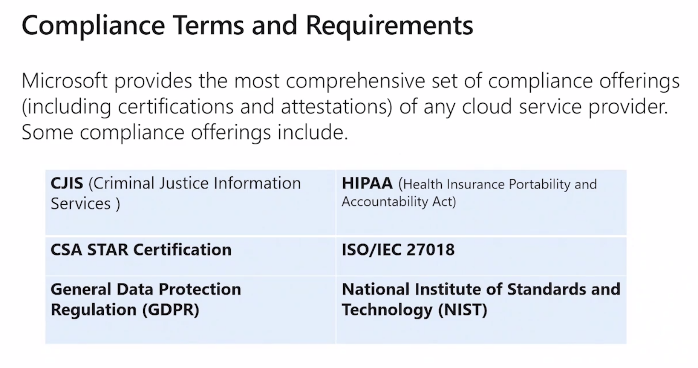

50 certifications que Microsoft respecte

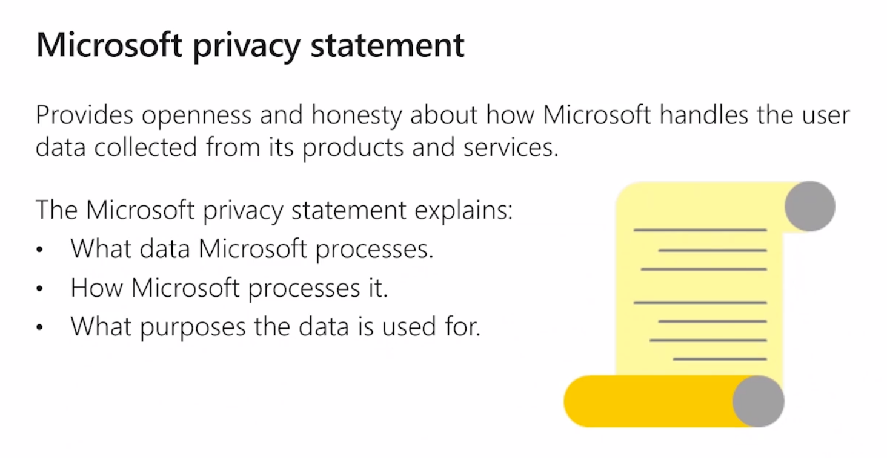

Protection des données.

## Trust Center

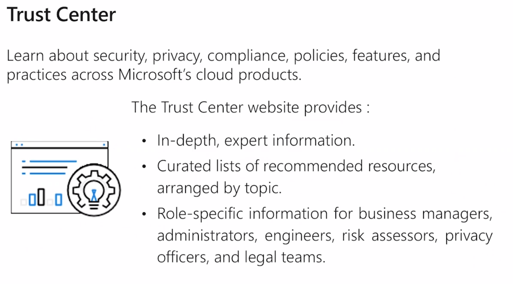

www.microsoft/trust-center

## Rapport audites indépendantes

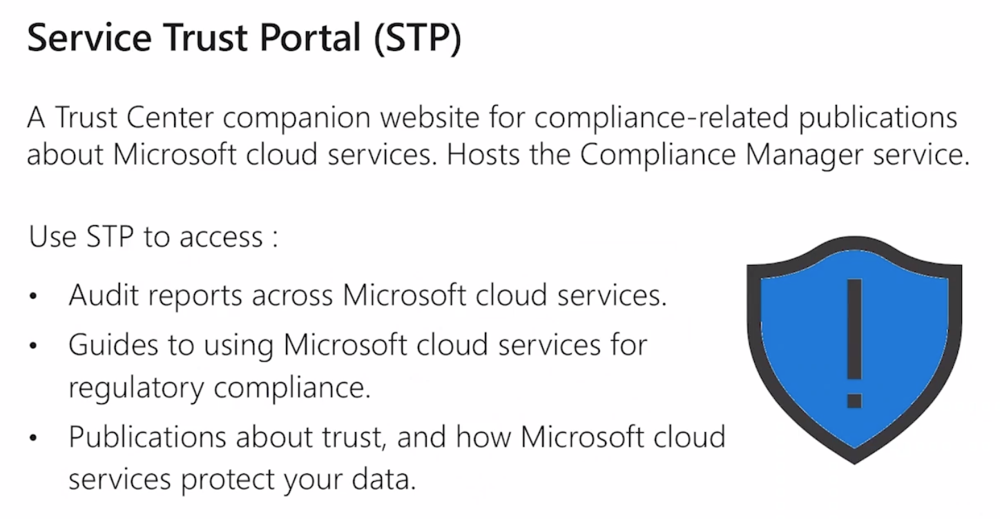

Audit d'organisations externe.

Prévenir microsoft en cas de Pen Test

## Azure Government Services

Deux exception Azure Gouvernment USA

Azure China dédié à la Chine

