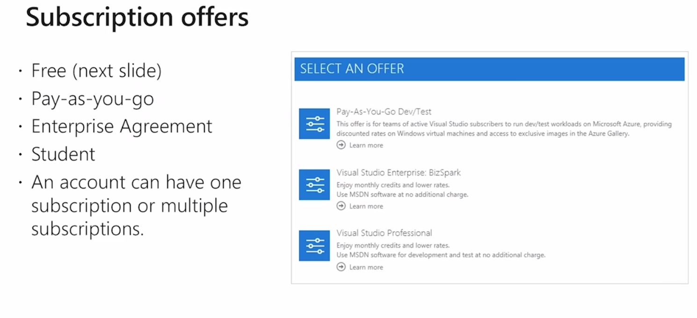
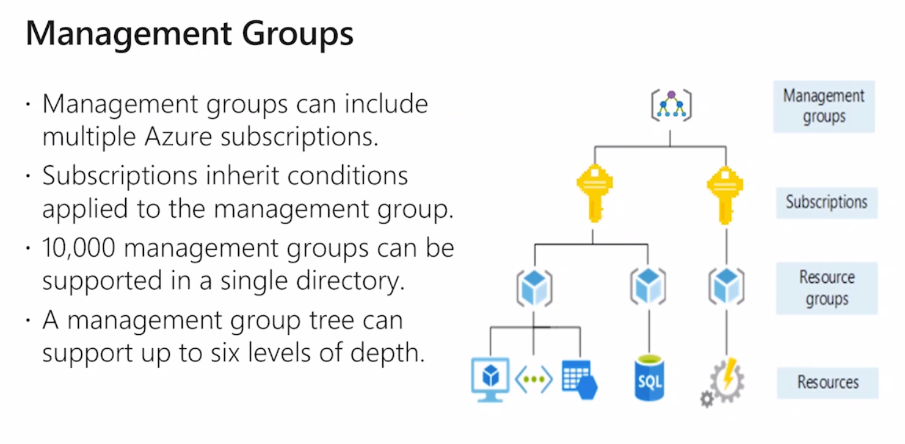
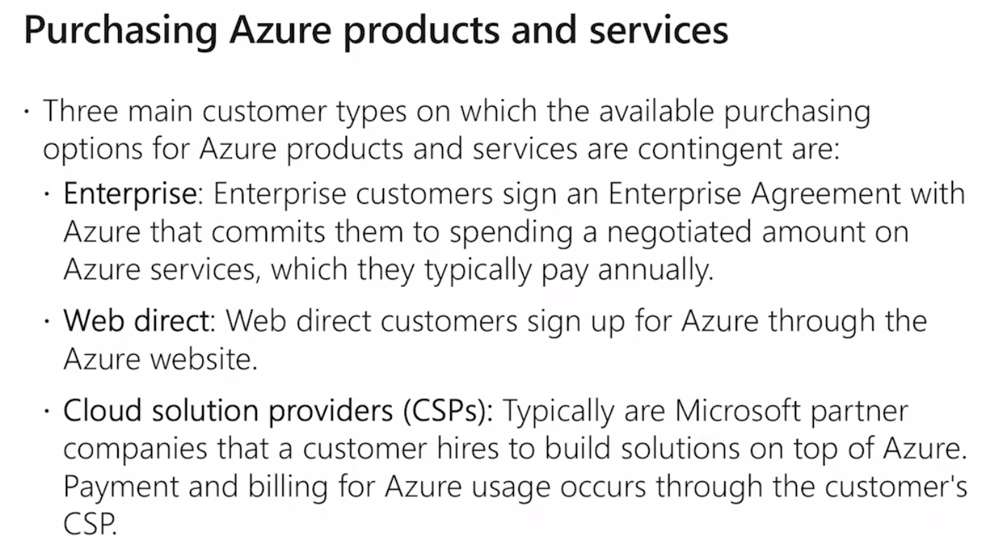
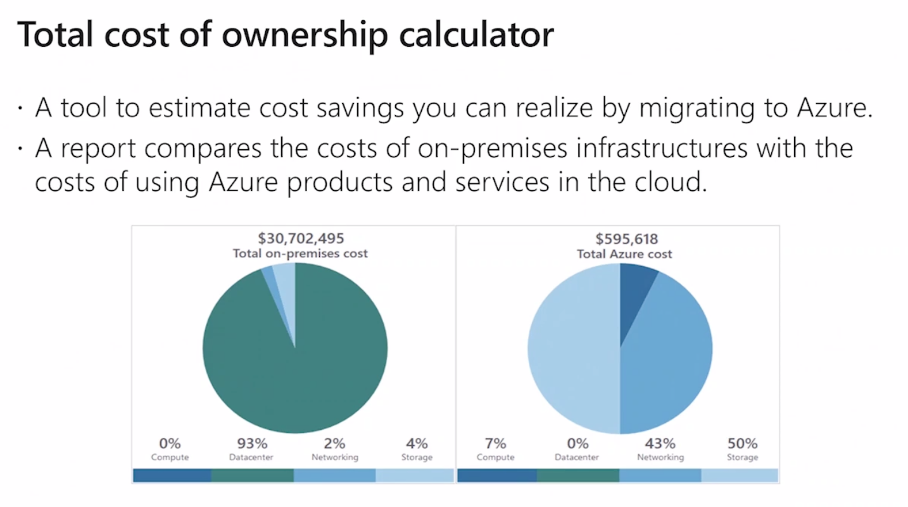
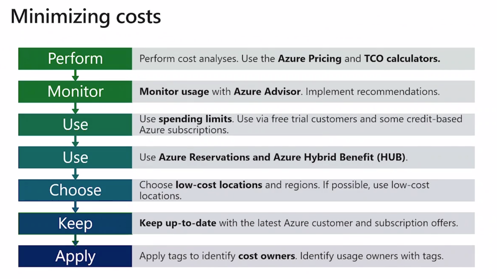
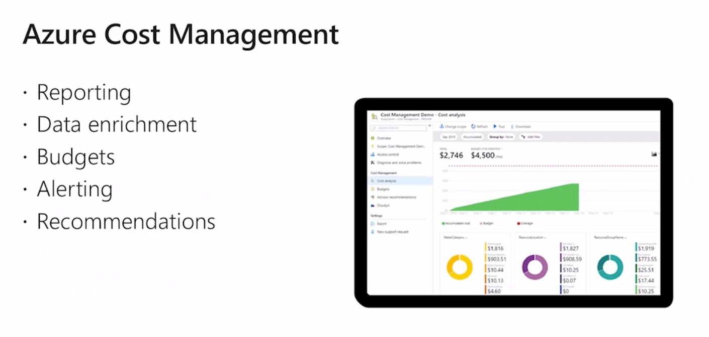
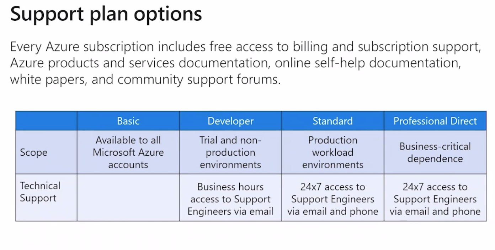
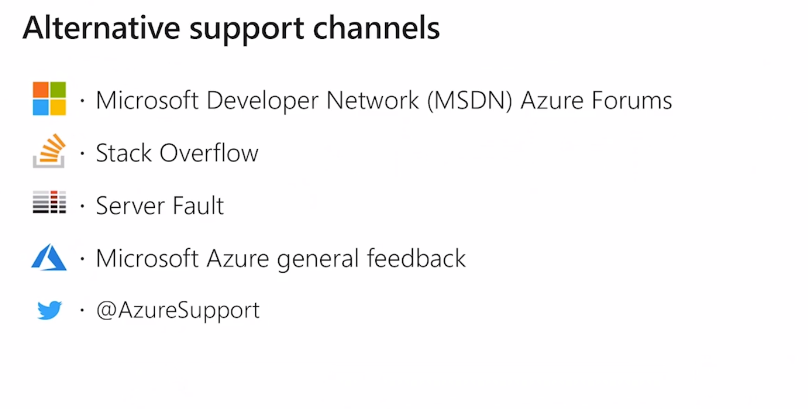
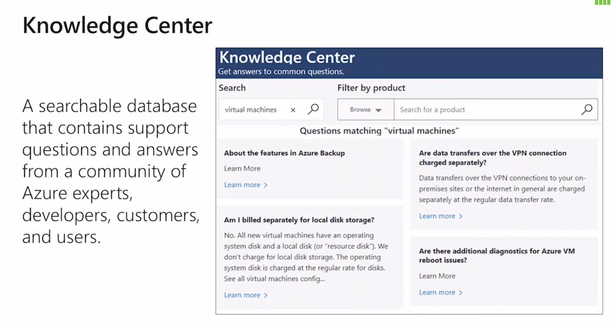
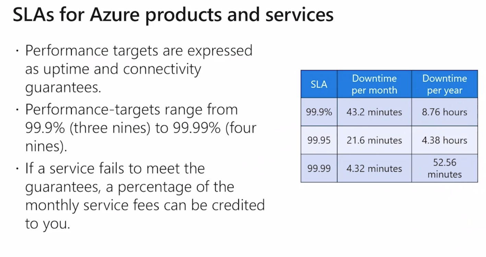

# 04 Tarification

## abonnement Azure

Chaque abonnement a des limites ou des quotas.

Chaque client peut souscrire à plusieurs abonnement.

Par défaut un abonnement représente une limite d'administration.

## Types d'abonnement

Pay-as-you-go on ne paye que ce qu'on utilise

Enterprise Agreement engagement de trois an CapEx provisionne de l'argent

student 100$ pour tester la plateforme

free l'abonnement gratuit pendant 12 mois, le premier cadeau de 200$.

## Management Group

Grouper les abonnements (prod par exemple).

Azure Policy pour restreindre les abonnements

La facturation

## estimation des coûts

Optimiser les coûts.

Enterprise Agreement

Web Direct: web potail Azure

Partenaire Microsoft un petit peu plus cher

## Les facteurs influent le coût

-  type de ressource

- type de contrat

- Région

Toutes données envoyés vers le data centre sont gratuites

Les données sortantes sont payantes.

## Calculatrice Azure

`pricing/calculator`

Utiliser la calculatrice avant de créer les ressources.

### Comparer On-Premise - Azure

Définir des limites

Récupérer ses licences Windows -> Hybrid Benefit

## Azure Cost Management

Outil de visualisation sa consommation et de mettre des alertes.

## Support

Choisir un support approprié.

Comment optimisé ses coûts, optimiser ses ressources

`standard`

### Alternative

Microsoft met à disposition des clients un forum pour les nouvelles fonctionnalités. General Feedback

## Knowledge Center

Site Web `azure.microsoft/us-en/ressources/knowledge-center`

rediriger vers `docs.microsoft` mine d'or d'informations

## SLA Service Level Agreement

C'est un document par service Azure :

Le service pourrait être indisponible : voire le SLA.

Plus le SLA est élevé plus le service est disponible.

C'est un document qui va établir la qualité du service: performance, disponibilité.

Contrats défini par service.

Microsoft s'engage à dédommager en avoir.

Cela ne prend pas en compte les erreurs du client.

Calcule de SLA liés entre eux on multiplie `*`.

Méthode pour augmenter le SLA.

## Cycle de vie

`Private preview` bénéficier en avant première des nouveaux services Azure.

Pas de SLA associé, support limité.

Le service n'est pas facturé.

`Public preview` tous les clients, tester le services.

Pas de SLA, pas de facturation (pas fait pour de la production).

Nouvelles versions d'un service, nouveaux services.

-> `genral availability` prod, facturation, SLA, support

## Azure Update

Liste les nouveau services Azure.

Suivre les notifications via RSS.