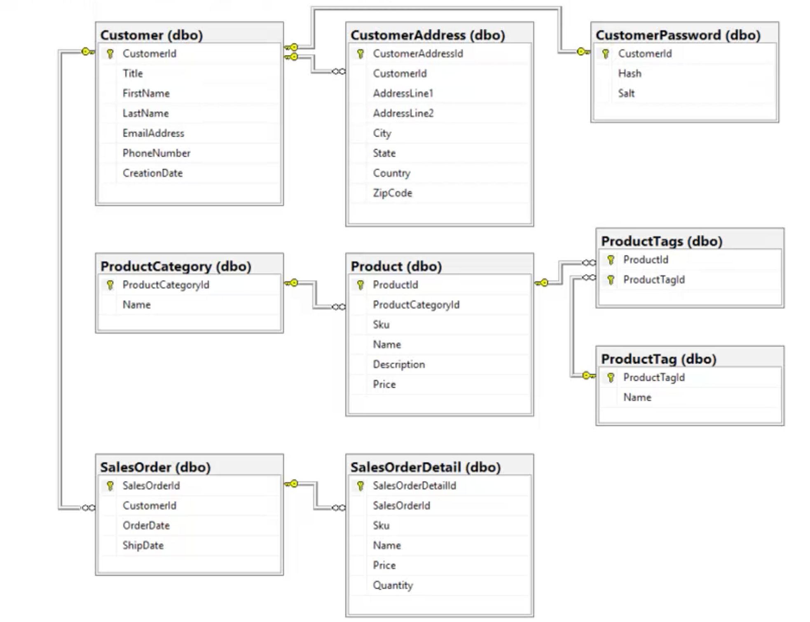
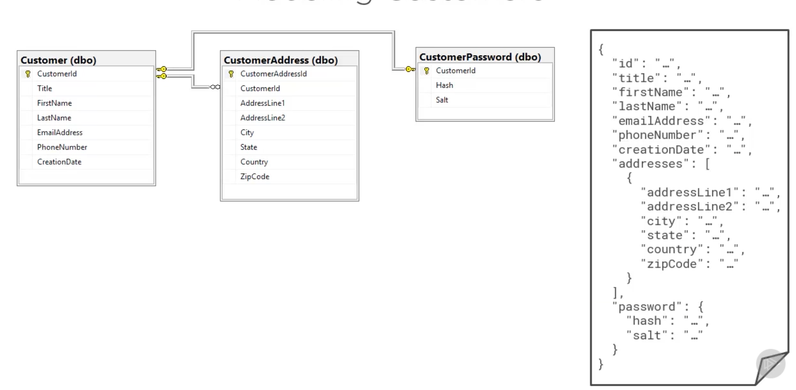
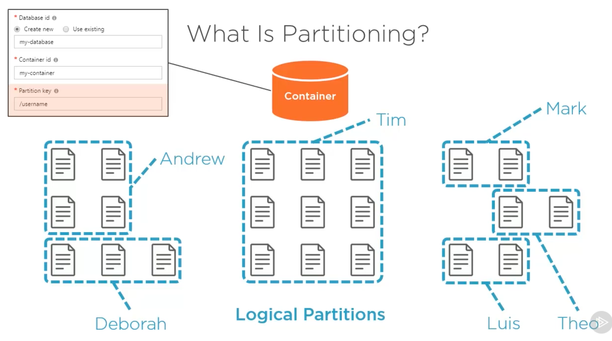
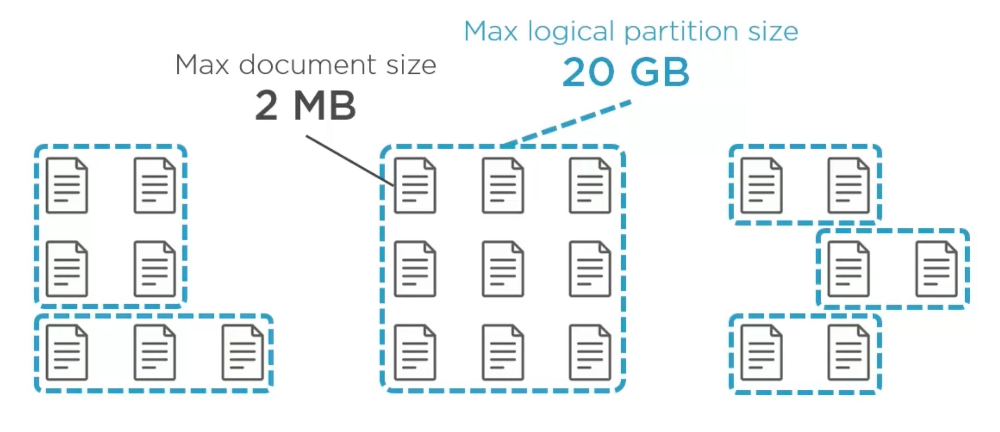
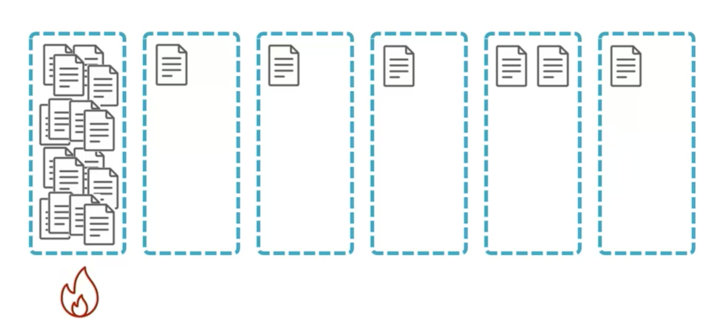
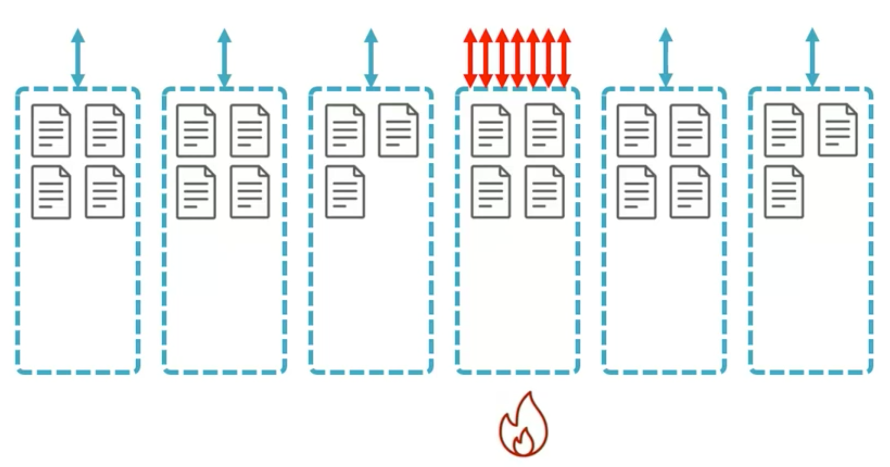
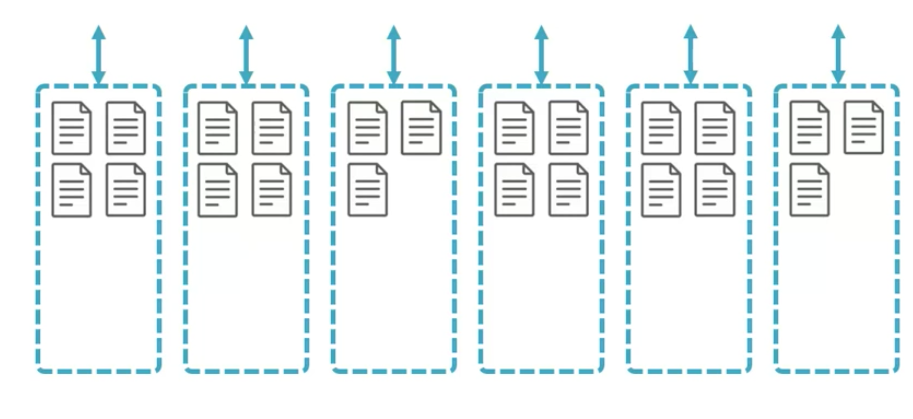
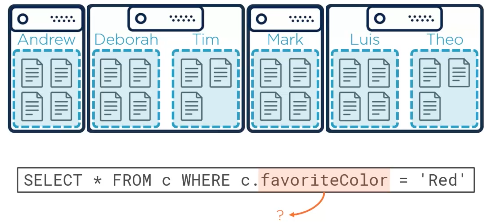

# Notes sur le `data modeling`

`Change Feed` => `Azure Function`

Dans `Cosmos DB` chaque `document` doit posséder une propriété `id` en minuscule.

## Embedded : imbriqué

`json` permet une hiérarchie d'imbrication au sein d'un même `document`.

les relations `one to one` et `one to few` peuvent être représentée par une imbrication (encapsulation) des données :

`1:few` si la propriété a une limite maximum (par exemple pas plus de 3 adresses différentes, pas plus de deux numéro de téléphone) `=>` `embedded`.

C'est aussi une bonne idée si les `documents` sont réclamé ou mis à jour ensemble.

## Referenced : référencé

`1:many` si le `many` n'a pas de borne (pas de limite), par exemple un article et ses tags.

`many:many` obligatoire.

Les `documents` sont demandés ou mis à jour séparément.

## `partition key`

Les `documents` avec la même `partition key` on la garantie d'être enregistré sur le même serveur physique.

## Valeur Maximum

### `2MB` pour un `document`

C'est aussi cette valeur qui va déterminer quand imbriqué ou quand référencer les `documents` entre eux.

### `20GB` pour une `logical partition`

Ce qui implique que pour une mise à l'échelle *infini*, il faut bien choisir sa `partition key`.

On doit choisir une `partition key` qui prends une large quantité de valeur (`couleur yeux` : 4 ou 5 valeur, `prénom`: des milliers de valeur différentes).

## `BAD` : Hot Partition

#### ! la date est une mauvaise `partition key`

## `GOOD`

## cross-query : fan out query

#### Pas plus de `20%` des requêtes totales = 👍🏽.

