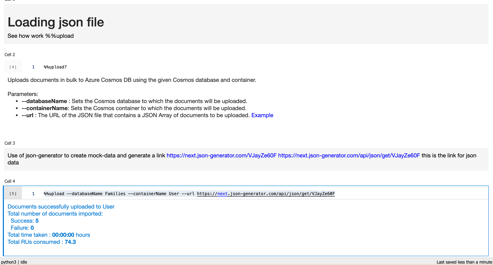

# 01 utilisation du `notebook`

## Différents coûts : `sql query` vs `point read`

Une requête `SQL` coûtera toujours plus cher que d'utiliser la méthode spécifique `read_item` pour retrouver un `document` dont la `partition key` est son `id`.


### Chargement des données grâce à `notebook`

```python
%%upload --databaseName Families --containerName User --url https://next.json-generator.com/api/json/get/VJayZe60F
```



### requête avec `notebook`

#### Comparaison entre `point read` et `sql query`

```python
import json

def printJson(result):
    print(json.dumps(result, indent=4))

def printCount(result):
    print("retrieved " + str(len(result)) + " document(s)")

def printRequestCharge(container):
    print("cost " + container.client_connection.last_response_headers["x-ms-request-charge"] + " RU(s)")
```

```python
database = cosmos_client.get_database_client("Families")
userContainer = database.get_container_client("User")
```

```python
# Rechercher un unique User (point read)
user = userContainer.read_item('600402346b7b58173a4edc2c', '600402346b7b58173a4edc2c')

printJson(user)
printRequestCharge(userContainer)
```

```
{ ... }
cost 1 RU(s)
```

On a un coût minimum : `1RU`

```python
# Retrieve a single user (SQL query)
user2 = list(userContainer.query_items(query="SELECT * FROM c WHERE c.pk = '600402346b7b58173a4edc2c'"))[0]

printJson(user2)
printRequestCharge(userContainer)
```

```
{ ... }
cost 2.83 RU(s)
```

Rien que le fait d'utiliser plutôt une requête `SQL` on triple presque le coût.

Le moins couteux quand c'est possible est d'utiliser la lecture direct d'un document avec `read_item(<pk>, <i>)`.


## Créer plusieurs `documents`

```python
database = cosmos_client.get_database_client("Shop")
userContainer = database.get_container_client("Product")

orders = [
    {
    "id": "600592ba5674462cba1b668",
    "userId": "600592ba06264462cba1b668",
    'category': '600592baad02fb6bdbb27388',
    'type': 'order'
    },
    {
    "id": "600592ba5674462cba1b669",
    "userId": "600592ba06264462cba1b668",
    'category': '600592ba3c531ac1827ae4f5',
    'type': 'order'
    },
    {
    "id": "600592ba5674462cba1b670",
    "userId": "600592ba06264462cba1b668",
    'category': '600592baad02fb6bdbb27388',
    'type': 'order'
    },
]

for o in orders:
    userContainer.create_item(o)
```


## Authoriser les `cross partition query`

### `enable_cross_partition_query=True`

```python
products = list(productContainer.query_items(query = """
                                                    SELECT * 
                                                    FROM c 
                                                    WHERE c.type='product'
                                                    ORDER BY c.orderCount DESC
                                                """, enable_cross_partition_query=True))

printJson(products)
printRequestCharge(productContainer)
```

