# 02 denormalisation

## Requête sur un petit nombre de propriétés

`SELECT *` sera toujours plus cher en `RUs` que de sélectionner juste les propriété utile :


Maintenant en ne sélectionnant que l'`id` par exemple :


Une différence minim qui pourrait être plus importante avec beaucoup de données.

À surveiller !

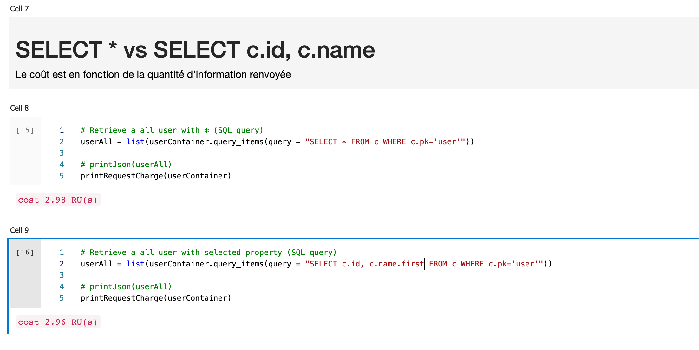


## Avoir tous les mots clés (`tags`) dans une même partition logique :

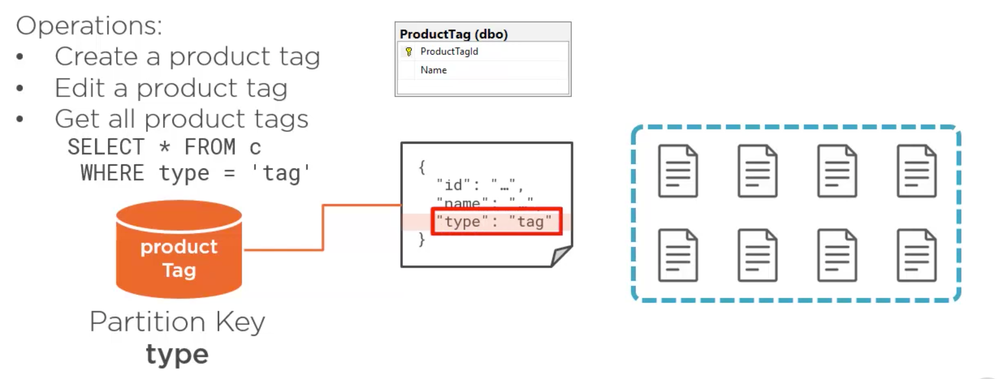

C'est une bonne stratégie pour lire une liste de `documents` de taille raisonnable.


## Many to many

C'est un mélange d'intégration (`embedded`) et de référencement.


Ici on crée un tableau avec les `id` des mots clé `tags`.

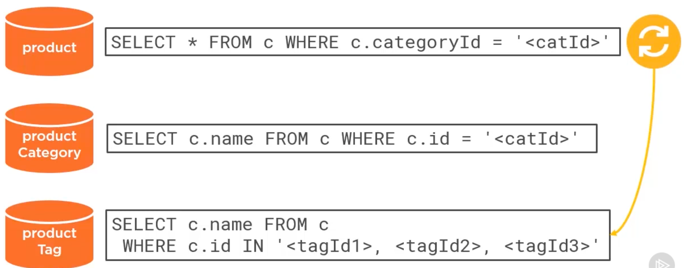

En intégrant la `categoryId` et les `tagId` dans notre `product`, on doit effectuer 4 requêtes pour avoir toutes les infos.

C'est la `denormalisation` qui va résoudre ce problème.

En générale toute l'information nécessaire est empaquetée dans un seul `document`.

Il ne faut donc pas avoir peur de dupliquer les données.

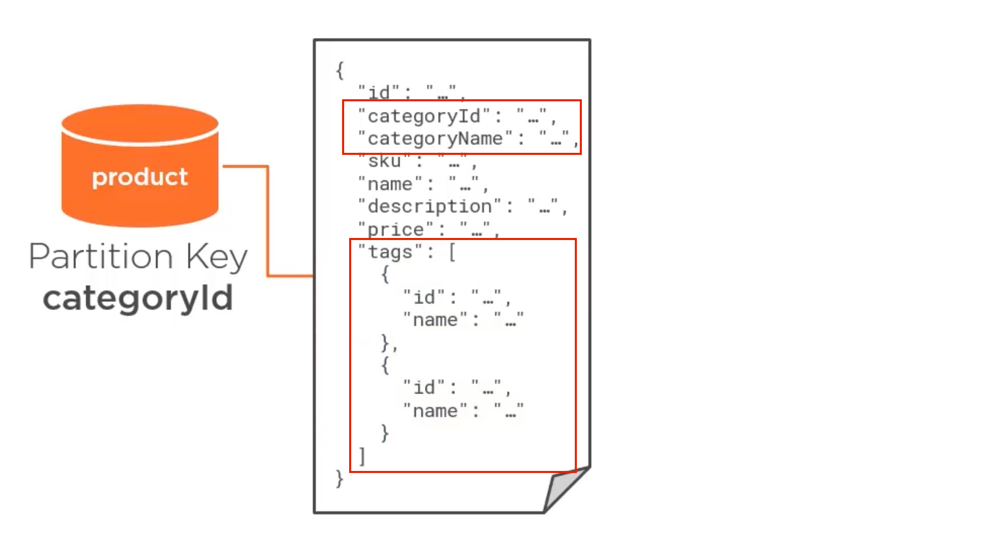


## Change Feed

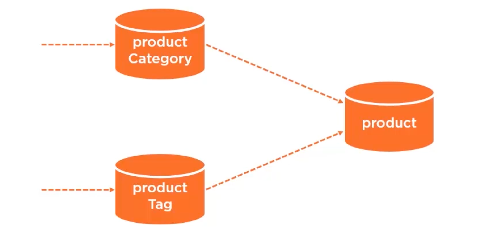

Si on veut mettre à jour une catégorie ou un mot clé, il faut que cette mise à jour se répercute sur les produits, pour ça on a : `change feed`.

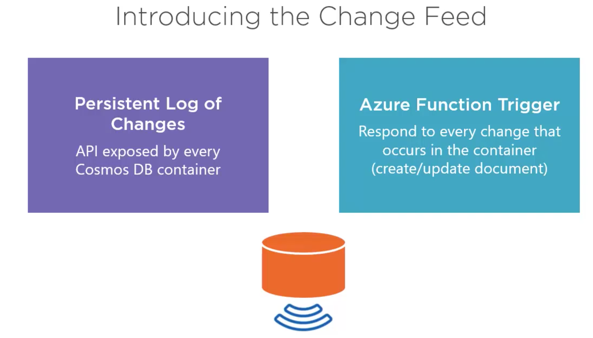

Pour cela on va utiliser les `azure function` :

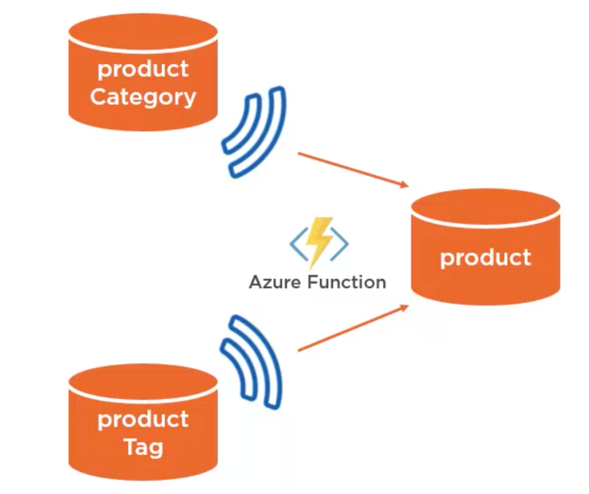

À chaque fois qu'une catégorie ou qu'un mot clé est modifié, une fonction `Azure` recevra cette modification et pourra mettre à jour les produits impactés.


## Fusionner deux `container`

Deux `container` avec la même `partition key` doivent être fusionnés.

Il faut parfois copier et renommer la `partition key` d'un document pour que ce soit possible.

Encore une fois, la duplication de données n'est pas un problème en `NoSQL`.

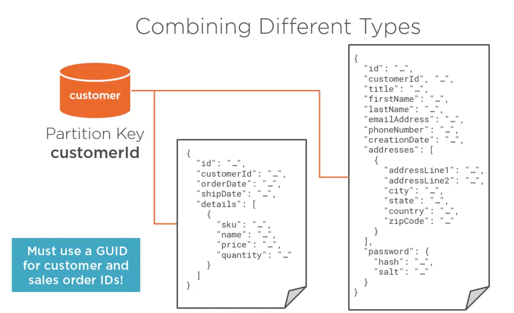

#### ! toujours utiliser des `GUID` (Global Unique Id) pour éviter tous risques de collision en cas de fusion de `container`.

## Ajouter une propriété `type`

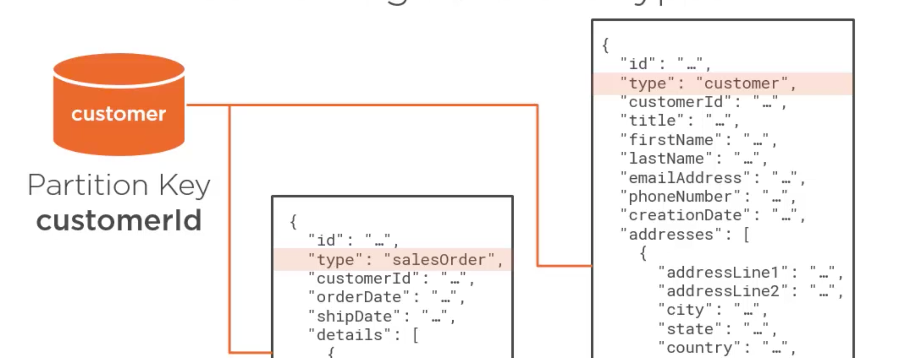


## Procédure stockée

Elle utilise une `transaction`, cela veut dire par exemple qu'on est certain qu'une commande est bien ajouté avant de mettre à jour la propriété `oderCount` d'un `customer`.

Les procédures stockées sont écrites en `javascript`.

exemple de procédure stockée :


```js
function spCreateSalesOrder(salesOrderDoc) {

	if (!salesOrderDoc) {
		throw new Error("Parameter 'salesOrderDoc' is null or undefined.");
	}

	var context = getContext();
	var collection = context.getCollection();
	var collectionLink = collection.getSelfLink();
	var customerDocLink = collection.getAltLink() + "/docs/" + salesOrderDoc.customerId;
	var response = context.getResponse();

	// Retrieve customer document	
	collection.readDocument(customerDocLink, function (err, customerDoc) {
		if (err) throw err;
		// Increment sales order count in customer document and replace it in the container
		customerDoc.salesOrderCount++;
		collection.replaceDocument(customerDoc._self, customerDoc, function (err) {
			if (err) throw err;
			// Create the sales order document
			collection.createDocument(collectionLink, salesOrderDoc, function (err, doc) {
				if (err) throw err;
				response.setBody(customerDoc.salesOrderCount);
			});
		});
	});
}
```

On exécute la procedure dans le `notebook` :

```python
customerContainer.scripts.execute_stored_procedure(<storeProcedureName>, partion_key=<partitionKey>, params=<newDocument>)
```

```python
customerContainer.scripts.execute_stored_procedure(
  	'spCreateSalesOrder'
  	partition_key = customerId,
  	params = newOrder
)
```

Les `procédures stockées` ont une portée de `logical partition`.


## Fusion de `container`

Pour des listes relativement courtes, il est intéressant de fusionner des container en prenant comme `partition key` le `type` des documents. Par exemple si on a deux `container`, un pour `category` et un pour `tag`, on peut les fusionner :

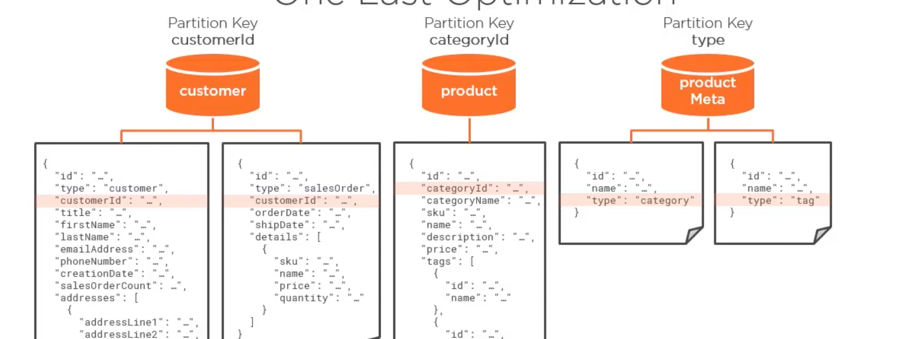

Cela permet aussi de fusionner de fonction `change feed` en une seule.


### Fusion total ?

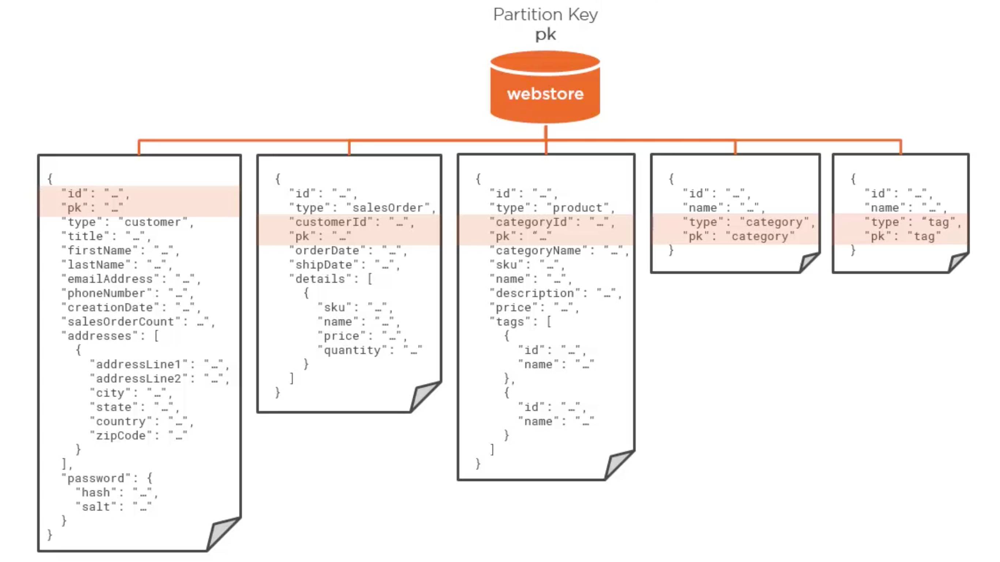

Pourquoi pas, si on a pas besoin de `throughput` différent pour les différents documents.

Il suffit de créer une propriété `pk` générique dans laquelle on met la valeur de la `partition key` que l'on désire.