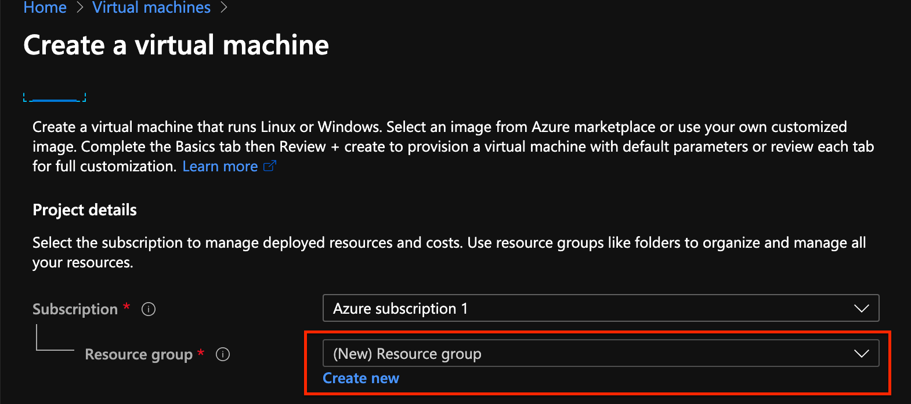
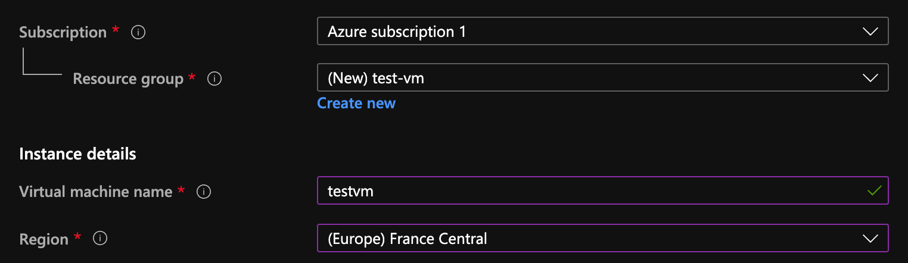
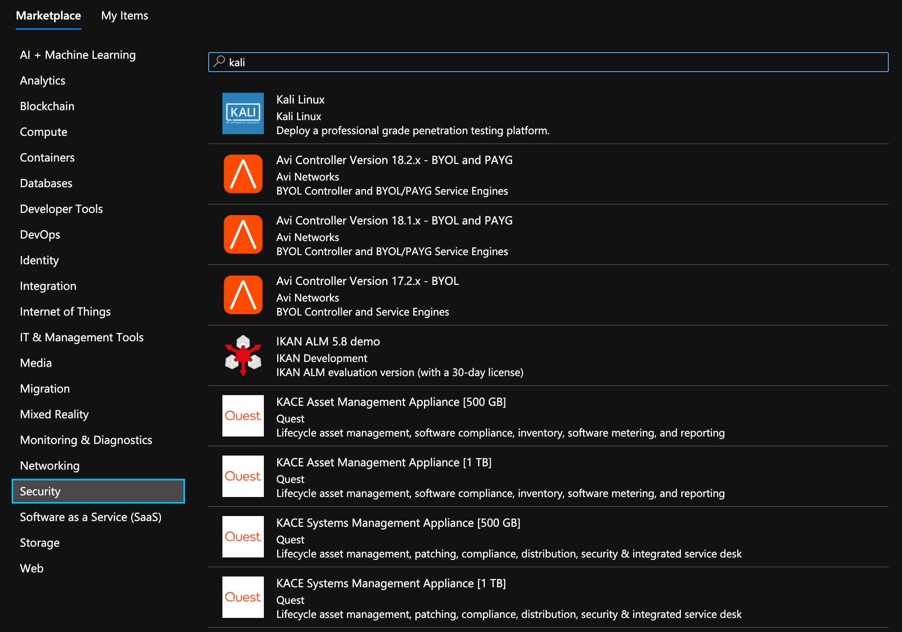
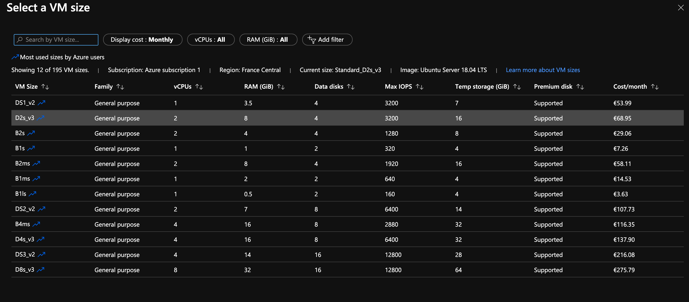
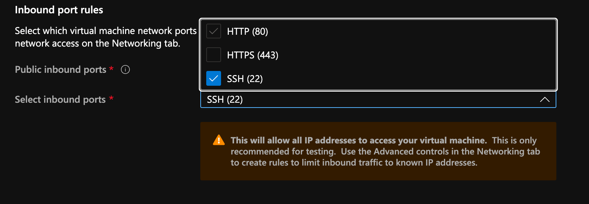
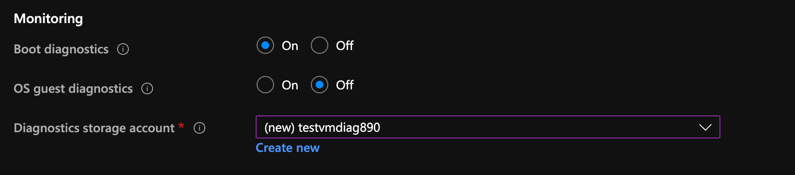
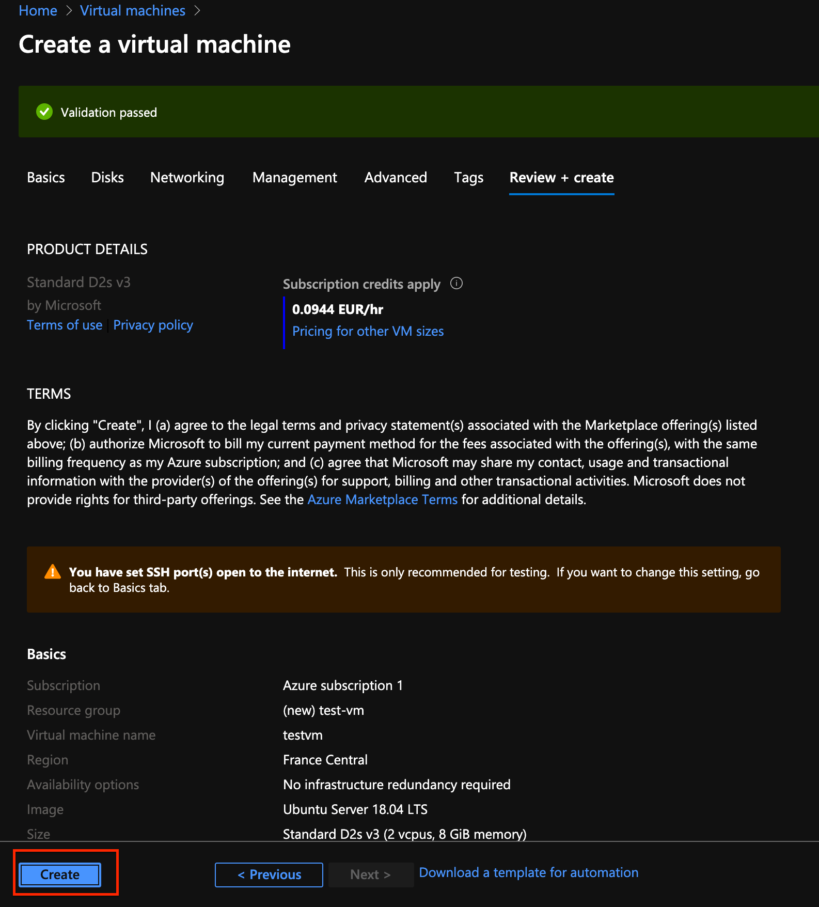
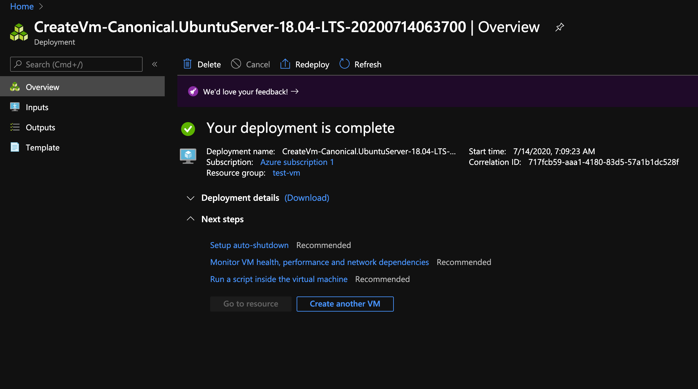

# 02 Créer une machine virtuelle

## resource Group

C'est un moyen logique d'organiser les ressources.

Il est obligatoire de créer un `resource group` pour y associer sa ressource.

## Région

On va choisir un nom et une région.

## Image

On peut parcourir les images système disponible :

On trouve ici tous les systèmes disponibles.

On peut choisir la taille de sa machine virtuel, le prix dépendra de ce choix.

## Utiliser SSH

## Ouvrir le port 80 HTTP

## Mettre sur `off` `Boot diagnostics`

## Créer la machine

Il y a beaucoup plus d'options, ceci est un minimum.

Maintenant que la validation est passée, il suffit d'appuyer sur `create` :

Il faut ensuite télécharger la `private key`.

Le déploiement prend un certain temps.

