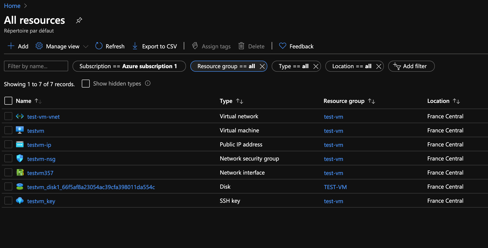
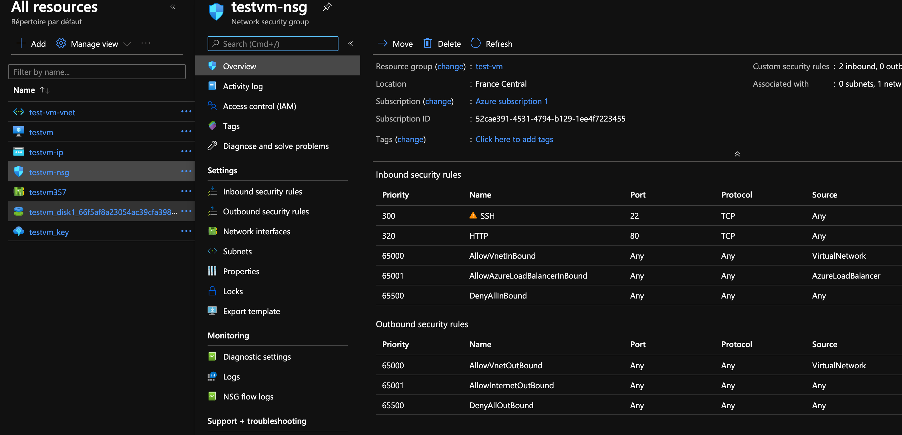
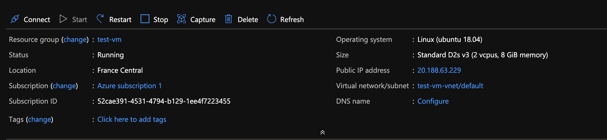
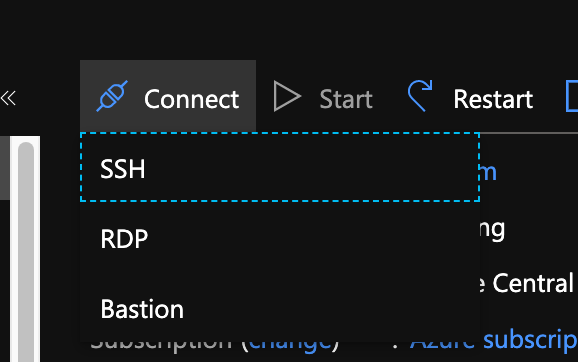

# 03 Se connecter à la machine virtuel

## Les ressources créées

Si on va dans `resource all`, on peut voire que la création de notre VM a aussi créée plusieurs ressources :



`Network security group` défini les ports :



## testvm

On click sur la machine virtuelle en elle-même :



On voit qu'elle tourne et que son IP public est `20.188.63.229`.

### `connect` Connection via ssh



On a récupéré une clé privée lors du réglage de `SSH` pendant la création de la `VM`.

Cette clé est placée dans :

`~/.ssh/AzureUser/testvm_key.pem`

On doit mettre les autorisations à `400`

```bash
🦄 AzureUser ls -l
-rw-r--r--@ 1 kar  staff  2494 Jul 14 07:09 testvm_key.pem

🦄 AzureUser chmod 400 testvm_key.pem

🦄 AzureUser ls -l
total 8
-r--------@ 1 kar  staff  2494 Jul 14 07:09 testvm_key.pem
```

Puis connection via `SSH`:

```bash
🦄 ~ ssh -i ~/.ssh/AzureUser/testvm_key.pem AzureUser@20.188.63.229
```

`[-i identity_file]`

```bash
AzureUser@testvm:~$
```
