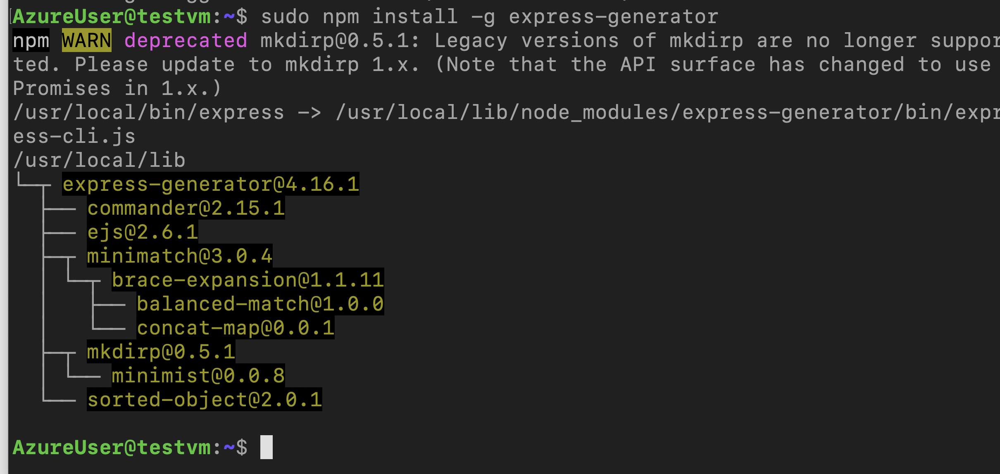
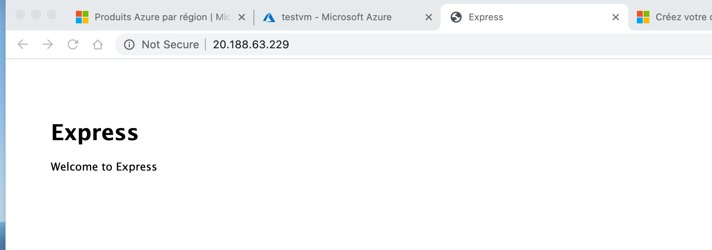
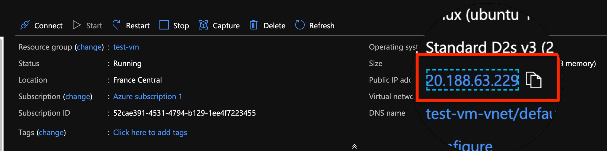

# 04 Installation d'une application `NodeJS`

## 1. mise à jour du package manager

```bash
sudo apt-get update
```

## 2. Installer NodeJs et NPM

```bash
sudo apt-get install nodejs npm
```

## 3. Installer Express-generator

```bash
sudo npm install -g express-generator
```



## 4. Créer une application express

```bash
express test
cd test
npm install
```

## 5. lancer l'application

```bash
sudo PORT=80 npm run start
```



L'`IP` étant celle de notre machine virtuelle :


