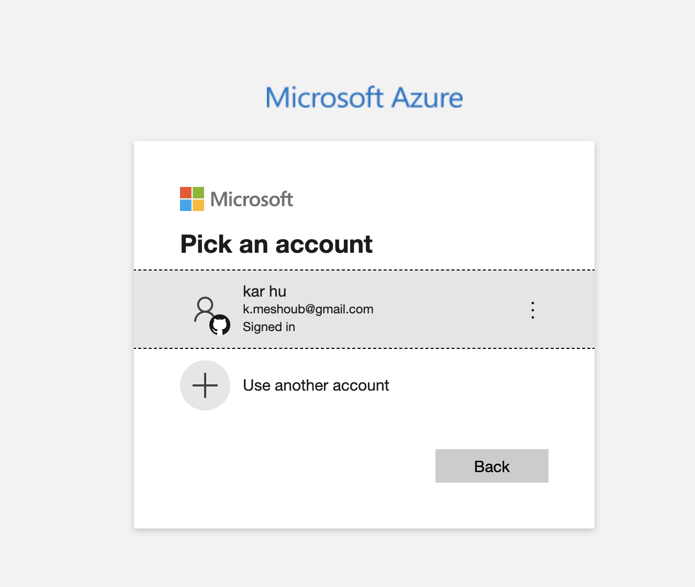
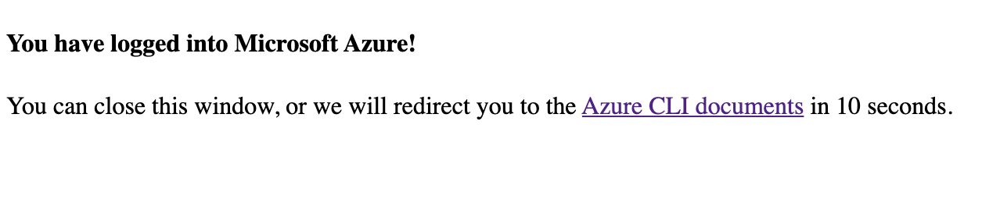
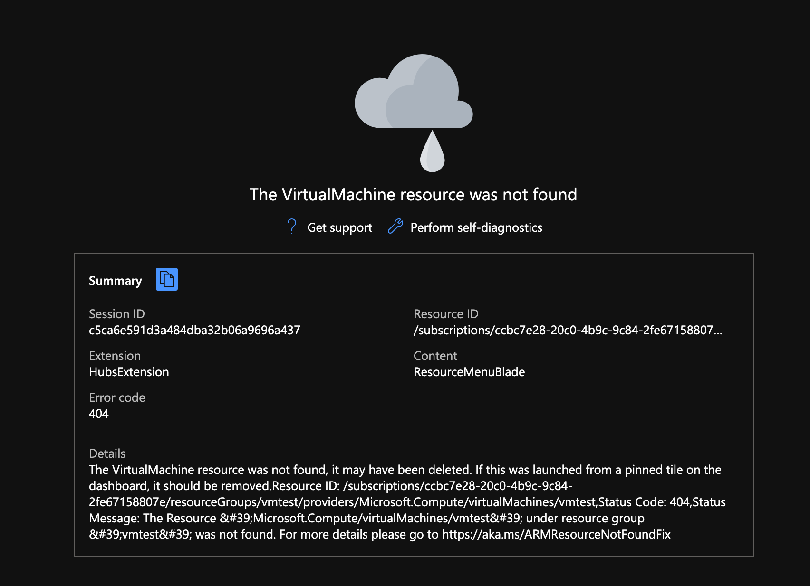
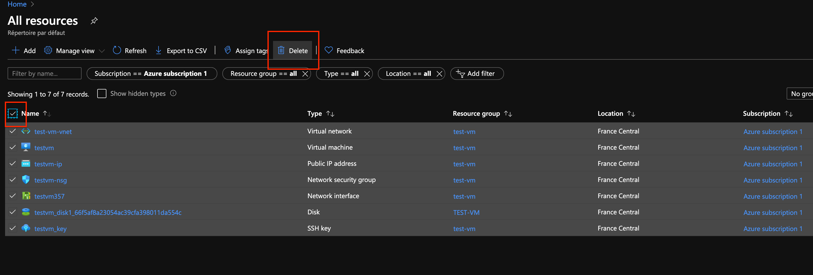
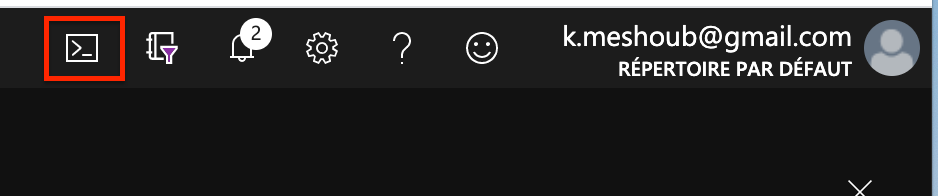
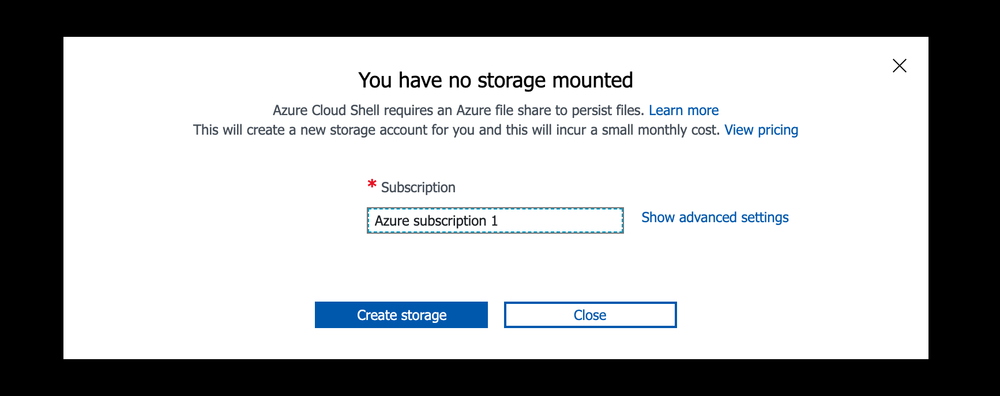

# 05 Azure CLI

## Installation

https://docs.microsoft.com/fr-fr/cli/azure/install-azure-cli?view=azure-cli-latest

```bash
brew update && brew install azure-cli
```

### Vérifier l'installation

```bash
az --version

azure-cli                          2.8.0 *
```

## Login

```bash
az login
```

Cette commande ouvre une page de log dans le navigateur :





Azure renvoie nos souscriptions :

```bash
🦄 ~ az login

You have logged in. Now let us find all the subscriptions to which you have access...
[
  {
    "cloudName": "AzureCloud",
    "homeTenantId": "87a44fc9-5e38-4f50-9d13-76e7774bf441",
    "id": "52cae391-4531-4794-b129-1ee4f7223455",
    "isDefault": true,
    "managedByTenants": [],
    "name": "Azure subscription 1",
    "state": "Enabled",
    "tenantId": "87a44fc9-5e38-4f50-9d13-76e7774bf441",
    "user": {
      "name": "k.meshoub@gmail.com",
      "type": "user"
    }
  },
  {
    "cloudName": "AzureCloud",
    "homeTenantId": "87a44fc9-5e38-4f50-9d13-76e7774bf441",
    "id": "44953d8e-5226-49e3-886a-2a889007e690",
    "isDefault": false,
    "managedByTenants": [],
    "name": "Paiement à l’utilisation",
    "state": "Warned",
    "tenantId": "87a44fc9-5e38-4f50-9d13-76e7774bf441",
    "user": {
      "name": "k.meshoub@gmail.com",
      "type": "user"
    }
  },
  {
    "cloudName": "AzureCloud",
    "homeTenantId": "87a44fc9-5e38-4f50-9d13-76e7774bf441",
    "id": "87956b53-5eea-423d-8c3a-dd2c76104e5a",
    "isDefault": false,
    "managedByTenants": [],
    "name": "Pay-As-You-Go",
    "state": "Warned",
    "tenantId": "87a44fc9-5e38-4f50-9d13-76e7774bf441",
    "user": {
      "name": "k.meshoub@gmail.com",
      "type": "user"
    }
  }
]
```

## Liste des commandes

Pour avoir la liste des commandes :

```bash
🦄 ~ az

Welcome to Azure CLI!
---------------------
Use `az -h` to see available commands or go to https://aka.ms/cli.

Telemetry
---------
The Azure CLI collects usage data in order to improve your experience.
The data is anonymous and does not include commandline argument values.
The data is collected by Microsoft.

You can change your telemetry settings with `az configure`.


     /\
    /  \    _____   _ _  ___ _
   / /\ \  |_  / | | | \'__/ _\
  / ____ \  / /| |_| | | |  __/
 /_/    \_\/___|\__,_|_|  \___|


Welcome to the cool new Azure CLI!

Use `az --version` to display the current version.
Here are the base commands:

    account             : Manage Azure subscription information.
    acr                 : Manage private registries with Azure Container Registries.
    ad                  : Manage Azure Active Directory Graph entities needed for Role Based Access
                         Control.
    advisor             : Manage Azure Advisor.
    aks                 : Manage Azure Kubernetes Services.
    ams                 : Manage Azure Media Services resources.
    apim                : Manage Azure API Management services.
    appconfig           : Manage App Configurations.
    appservice          : Manage App Service plans.
    aro                 : Manage Azure Red Hat OpenShift clusters.
    backup              : Manage Azure Backups.
    batch               : Manage Azure Batch.
    billing             : Manage Azure Billing.
    bot                 : Manage Microsoft Azure Bot Service.
    cache               : Commands to manage CLI objects cached using the `--defer` argument.
    cdn                 : Manage Azure Content Delivery Networks (CDNs).
    cloud               : Manage registered Azure clouds.
    cognitiveservices   : Manage Azure Cognitive Services accounts.
    configure           : Manage Azure CLI configuration. This command is interactive.
    consumption         : Manage consumption of Azure resources.
    container           : Manage Azure Container Instances.
    cosmosdb            : Manage Azure Cosmos DB database accounts.
    deployment          : Manage Azure Resource Manager template deployment at subscription scope.
    deployment-scripts  : Manage deployment scripts at subscription or resource group scope.
    deploymentmanager   : Create and manage rollouts for your service.
    disk                : Manage Azure Managed Disks.
    disk-encryption-set : Disk Encryption Set resource.
    dla                 : Manage Data Lake Analytics accounts, jobs, and catalogs.
    dls                 : Manage Data Lake Store accounts and filesystems.
    dms                 : Manage Azure Data Migration Service (DMS) instances.
    eventgrid           : Manage Azure Event Grid topics, event subscriptions, domains and domain
                         topics.
    eventhubs           : Manage Azure Event Hubs namespaces, eventhubs, consumergroups and geo
                         recovery configurations - Alias.
    extension           : Manage and update CLI extensions.
    feature             : Manage resource provider features.
    feedback            : Send feedback to the Azure CLI Team!
    find                : I'm an AI robot, my advice is based on our Azure documentation as well as
                         the usage patterns of Azure CLI and Azure ARM users. Using me improves
                         Azure products and documentation.
    functionapp         : Manage function apps. To install the Azure Functions Core tools see
                         https://github.com/Azure/azure-functions-core-tools.
    group               : Manage resource groups and template deployments.
    hdinsight           : Manage HDInsight resources.
    identity            : Managed Service Identities.
    image               : Manage custom virtual machine images.
    interactive         : Start interactive mode. Installs the Interactive extension if not
                         installed already.
    iot                 : Manage Internet of Things (IoT) assets.
    keyvault            : Manage KeyVault keys, secrets, and certificates.
    kusto               : Manage Azure Kusto resources.
    lab                 : Manage Azure DevTest Labs.
    local-context       : Manage Local Context.
    lock                : Manage Azure locks.
    login               : Log in to Azure.
    logout              : Log out to remove access to Azure subscriptions.
    managedapp          : Manage template solutions provided and maintained by Independent Software
                         Vendors (ISVs).
    managedservices     : Manage the registration assignments and definitions in Azure.
    maps                : Manage Azure Maps.
    mariadb             : Manage Azure Database for MariaDB servers.
    monitor             : Manage the Azure Monitor Service.
    mysql               : Manage Azure Database for MySQL servers.
    netappfiles         : Manage Azure NetApp Files (ANF) Resources.
    network             : Manage Azure Network resources.
    openshift           : Manage Azure Red Hat OpenShift Services.
    policy              : Manage resource policies.
    postgres            : Manage Azure Database for PostgreSQL servers.
    ppg                 : Manage Proximity Placement Groups.
    provider            : Manage resource providers.
    redis               : Manage dedicated Redis caches for your Azure applications.
    relay               : Manage Azure Relay Service namespaces, WCF relays, hybrid connections, and
                         rules.
    reservations        : Manage Azure Reservations.
    resource            : Manage Azure resources.
    rest                : Invoke a custom request.
    role                : Manage user roles for access control with Azure Active Directory and
                         service principals.
    search              : Manage Azure Search services, admin keys and query keys.
    security            : Manage your security posture with Azure Security Center.
    servicebus          : Manage Azure Service Bus namespaces, queues, topics, subscriptions, rules
                         and geo-disaster recovery configuration alias.
    sf                  : Manage and administer Azure Service Fabric clusters.
    sig                 : Manage shared image gallery.
    signalr             : Manage Azure SignalR Service.
    snapshot            : Manage point-in-time copies of managed disks, native blobs, or other
                         snapshots.
    sql                 : Manage Azure SQL Databases and Data Warehouses.
    staticwebapp        : Manage static apps.
    storage             : Manage Azure Cloud Storage resources.
    tag                 : Manage resource tags.
    version             : Show the versions of Azure CLI modules and extensions in JSON format by
                         default or format configured by --output.
    vm                  : Manage Linux or Windows virtual machines.
    vmss                : Manage groupings of virtual machines in an Azure Virtual Machine Scale Set
                         (VMSS).
    webapp              : Manage web apps.
```

## liste des options

Pour avoir des infos sur les options de la commande `vm`

```bash
🦄 ~ az vm -h

Group
    az vm : Manage Linux or Windows virtual machines.

Subgroups:
    availability-set       : Group resources into availability sets.
    boot-diagnostics       : Troubleshoot the startup of an Azure Virtual Machine.
    diagnostics            : Configure the Azure Virtual Machine diagnostics extension.
    disk                   : Manage the managed data disks attached to a VM.
    encryption             : Manage encryption of VM disks.
    extension              : Manage extensions on VMs.
    host                   : Manage Dedicated Hosts for Virtual Machines.
    identity               : Manage service identities of a VM.
    image                  : Information on available virtual machine images.
    monitor                : Manage monitor aspect for a vm.
    nic                    : Manage network interfaces. See also `az network nic`.
    run-command            : Manage run commands on a Virtual Machine.
    secret                 : Manage VM secrets.
    unmanaged-disk         : Manage the unmanaged data disks attached to a VM.
    user                   : Manage user accounts for a VM.

Commands:
    auto-shutdown          : Manage auto-shutdown for VM.
    capture                : Capture information for a stopped VM.
    convert                : Convert a VM with unmanaged disks to use managed disks.
    create                 : Create an Azure Virtual Machine.
    deallocate             : Deallocate a VM.
    delete                 : Delete a VM.
    generalize             : Mark a VM as generalized, allowing it to be imaged for multiple
                             deployments.
    get-instance-view      : Get instance information about a VM.
    list                   : List details of Virtual Machines.
    list-ip-addresses      : List IP addresses associated with a VM.
    list-sizes             : List available sizes for VMs.
    list-skus              : Get details for compute-related resource SKUs.
    list-usage             : List available usage resources for VMs.
    list-vm-resize-options : List available resizing options for VMs.
    open-port              : Opens a VM to inbound traffic on specified ports.
    perform-maintenance    : The operation to perform maintenance on a virtual machine.
    reapply                : Reapply VMs.
    redeploy               : Redeploy an existing VM.
    resize                 : Update a VM's size.
    restart                : Restart VMs.
    show                   : Get the details of a VM.
    start                  : Start a stopped VM.
    stop                   : Power off (stop) a running VM.
    update                 : Update the properties of a VM.
    wait                   : Place the CLI in a waiting state until a condition of the VM is met.
```

## Dés-allouer une VM

`stop` arrête la machine virtuel mais le paiement pour la ressource continu.

`deallocate` arrête le paiement.

```bash
🦄 ~ az vm deallocate
(--resource-group --name | --ids) are required
```

On doit spécifier soit le `resource-group` et le `name` soit l'`ids`.

```bash
🦄 ~ az vm deallocate --resource-group test-vm --name testvm
🦄 ~
```

## Supprimer un VM en `CLI`

```bash
az vm delete -g vmtest -n vmtest --yes
```

`-g` ressource group

`-n` ressource name

`--yes` dis oui à tout



## Supprimer une VM

On retourne sur l'interface web :



## Azure CLI dans le navigateur





