# 07 Créer un App service

## `Express-generator`

```bash
sudo npm i -g express-generator
```

```bash
express webapp
cd webapp
npm i
```

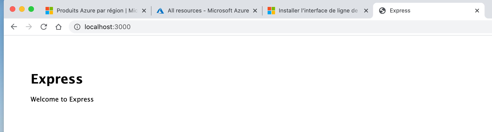

## Ouvrir dans VSCode et créer un dépôt `GIT`

Utilisation du plugin VSCode `gitignore template` pour générer un fichier `.gitignore`.

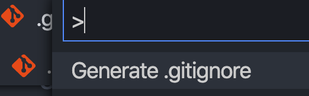

Faire un `commit` initiale.

## Création de `App Services`

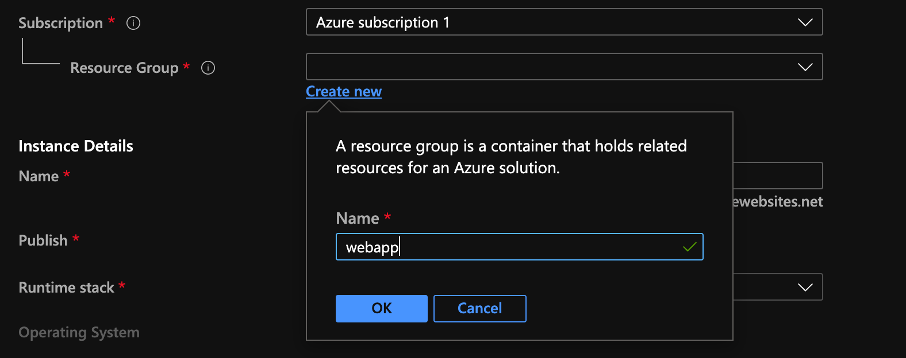

On doit toujours créer un groupe de ressource.

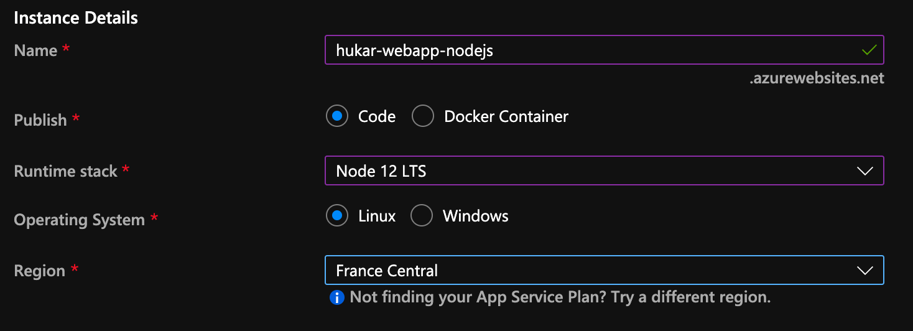

Le nom doit être unique globalement.

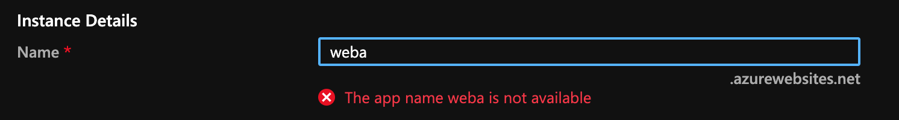

### App Service Plan

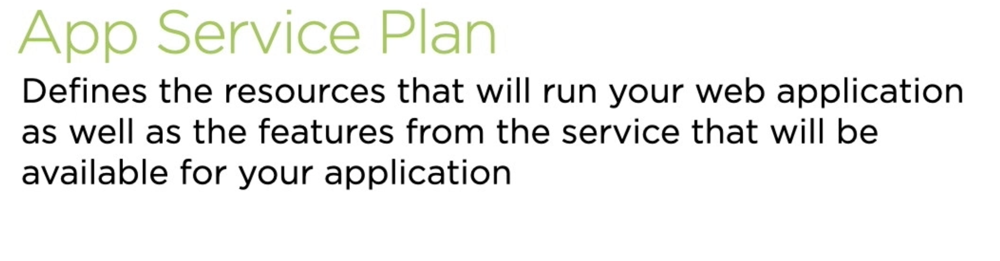

Va définir les ressources et les fonctionnalités disponible pour notre application.


### Niveau de prix

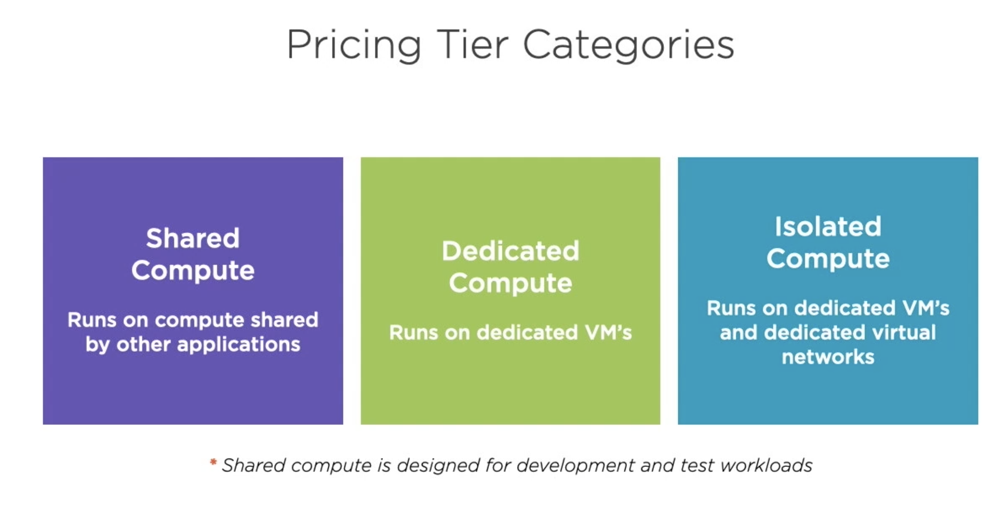

L'hébergement partagé est a évité en production, il sert aux tests et aux développement.

### Mise à l'échelle : scaling

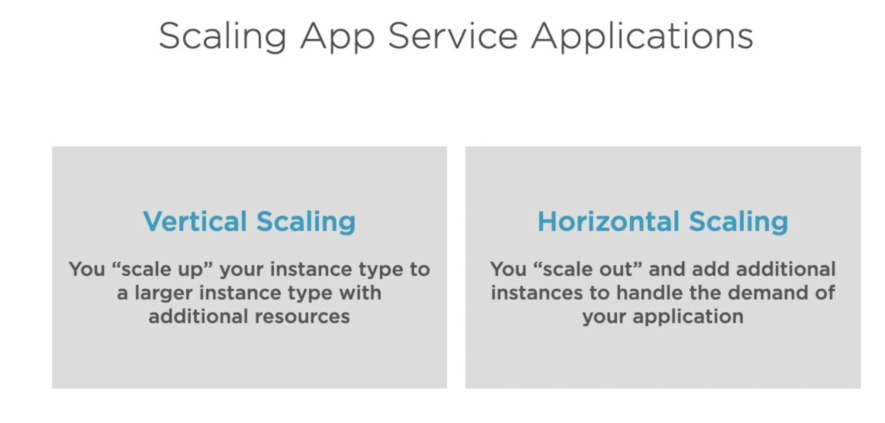

`vertical scaling` augmenter l'instance elle-même dans ses capacités.

`horizontal scaling` augmenter le nombre d'instance.

### Azure Compute Unit `ACU`

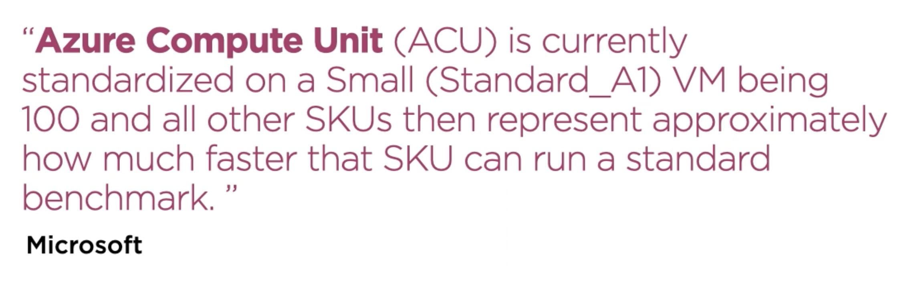

C'est une valeur (unité) de puissance relative à une configuration de référence.

### `SKU`

Il signifie «Stock-Keeping Unit». Extrait des [documents Microsoft](https://docs.microsoft.com/en-us/partner-center/develop/product-resources#sku) :

> # Sku
>
> Représente une unité de stockage (SKU) achetable sous un produit. Ceux-ci représentent les différentes formes du produit.

Cela semble conforme à la [définition de Wikipedia](https://en.wikipedia.org/wiki/Stock_keeping_unit) :

> Dans le domaine de la gestion des stocks, une unité de stockage est un type distinct d'article à vendre.

On pourrait penser aux déclinaisons du produit.

Un SKU est un produit unique et le plus précis possible.

### Choix de l'App Service Plan

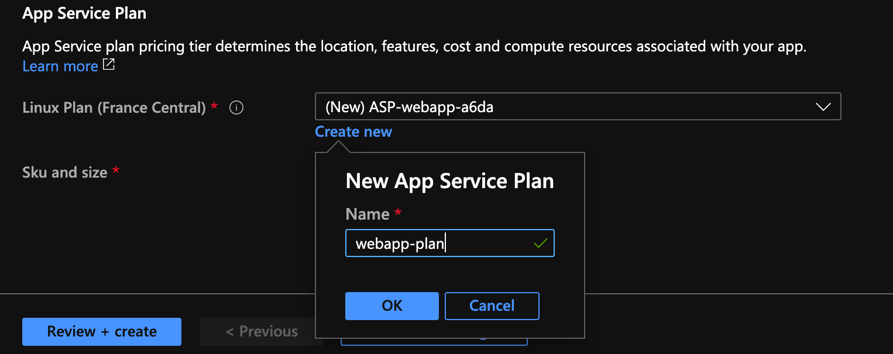

On donne un nom à son plan.

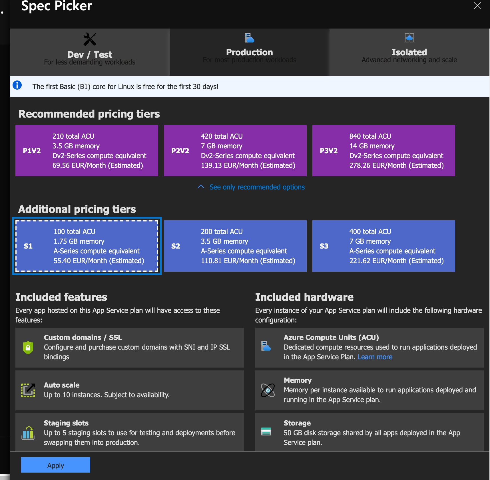

On choisie le S1 qui a des fonctionnalités en plus par rapport à un plan `Dev/Test` dont `Custom domains`.

`Review + create` et enfin `create`.

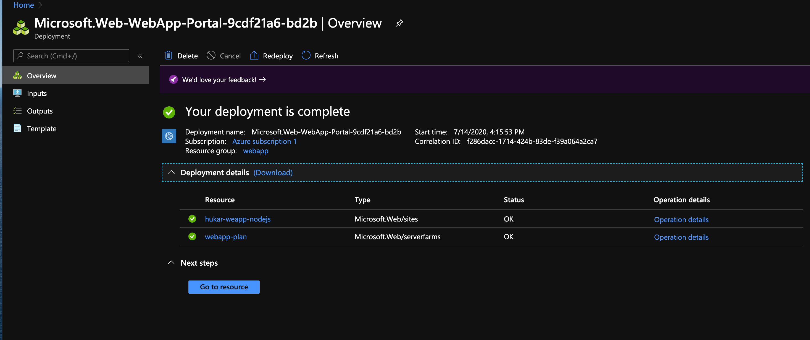

`Go to resource` :

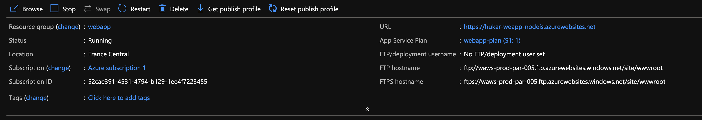

On voit l'`URL` de notre application

`https://hukar-weapp-nodejs.azurewebsites.net`
