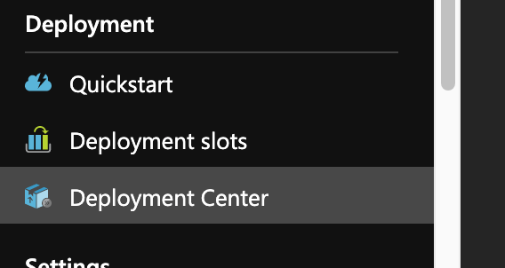
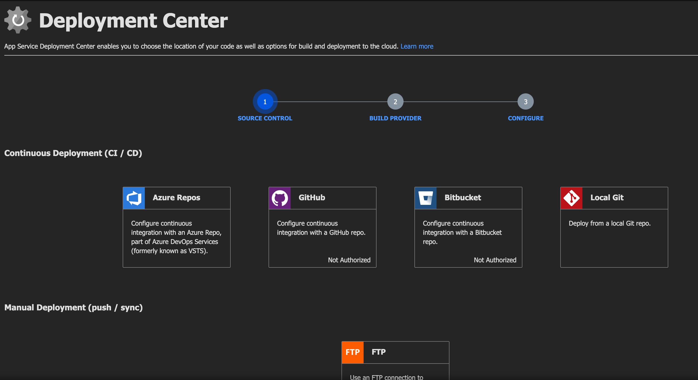
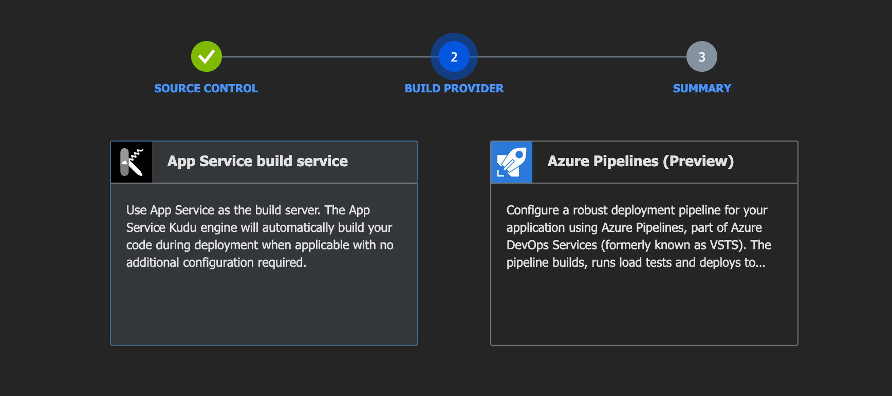
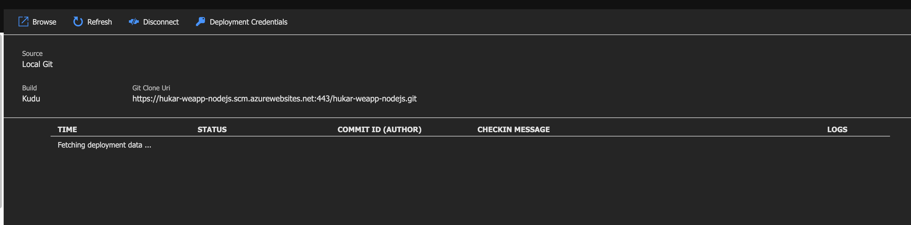
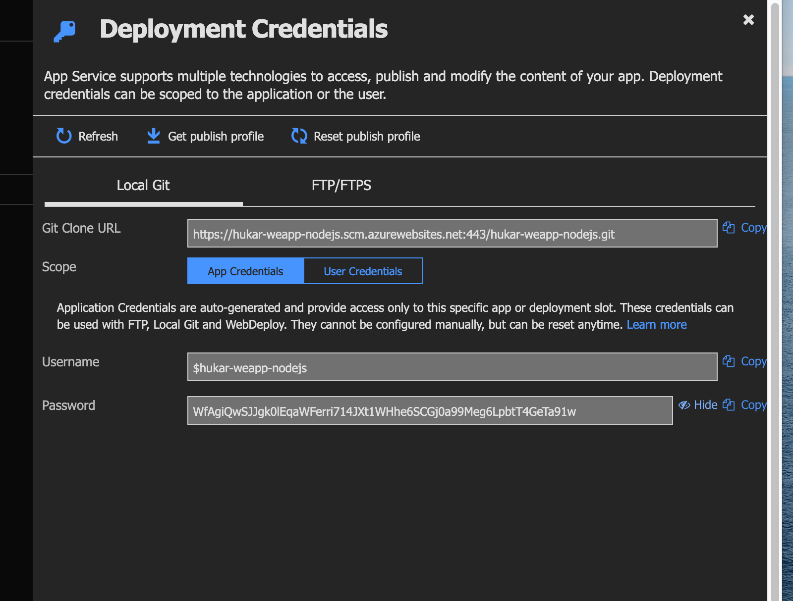
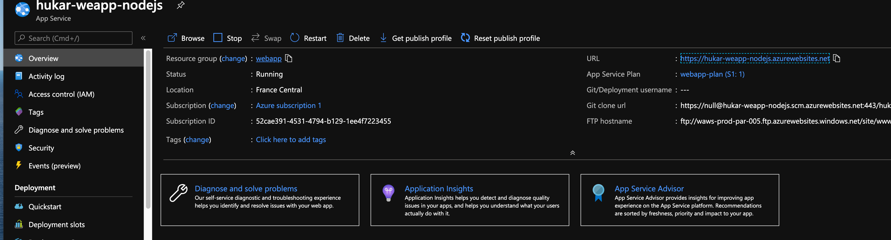
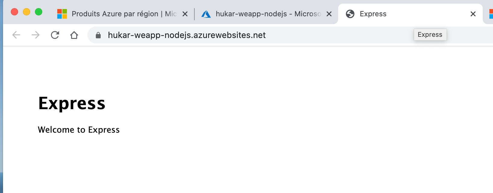
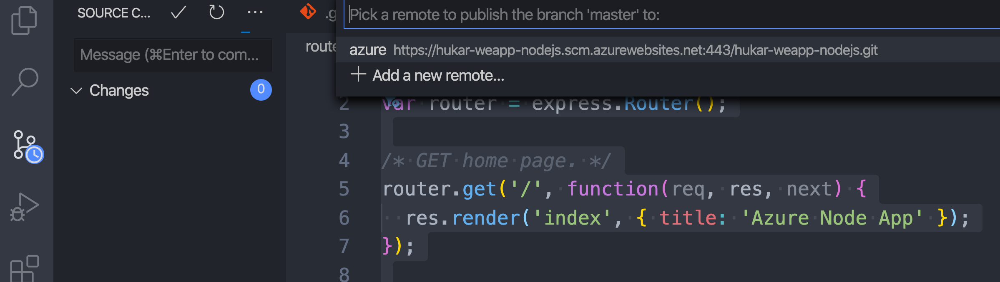
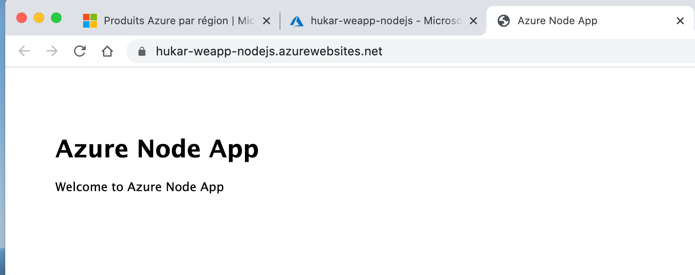

# 08 Déploiement



Nous allons déployer notre dépôt `GIT` local.



On choisie `Local Git`.



Ici on choisie `Kudu`.



On obtient l'`URL` du remote repository.

`https://hukar-test.scm.azurewebsites.net:443/hukar-test.git`

## Credential Deployment



On trouve ici le nom et le mot de passe pour le déploiement.

On peut maintenant utiliser `Git`.

```bash
🦄 webapp git remote add azure https://hukar-weapp-nodejs.scm.azurewebsites.net:443/hukar-weapp-nodejs.git

🦄 webapp git push azure master
```

`Kudu` s'occupe du déploiement.

```bash
Enumerating objects: 18, done.
Counting objects: 100% (18/18), done.
Delta compression using up to 12 threads
Compressing objects: 100% (15/15), done.
Writing objects: 100% (18/18), 10.54 KiB | 2.63 MiB/s, done.
Total 18 (delta 1), reused 0 (delta 0)
remote: Deploy Async
remote: Updating branch 'master'.
remote: Updating submodules.
remote: Preparing deployment for commit id '6b4815a26d'.
remote: Repository path is /home/site/repository
remote: Running oryx build...
...
```



Dans `Overview` il suffit de cliquer sur l'`url` pour accéder à l'app.



## Mise à jour du code

On effectue un changement dans le code en local.

```js
var express = require("express");
var router = express.Router();

/* GET home page. */
router.get("/", function (req, res, next) {
  res.render("index", { title: "Azure Node App" }); // au lieu de Express
});

module.exports = router;
```

On `commit` et on `push`.



`Kudu` s'occupe du déploiement, lorsque c'est terminé on obtient :


