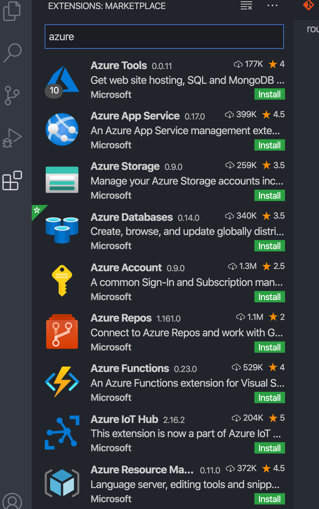
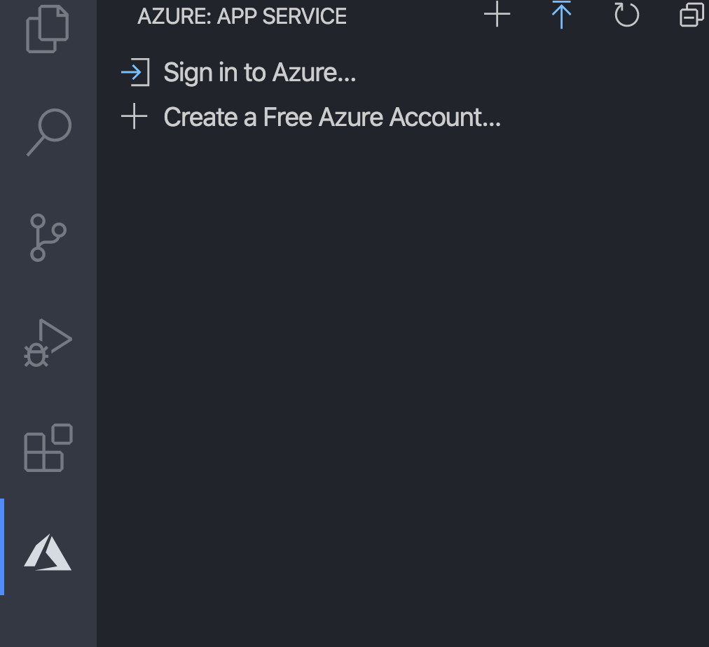
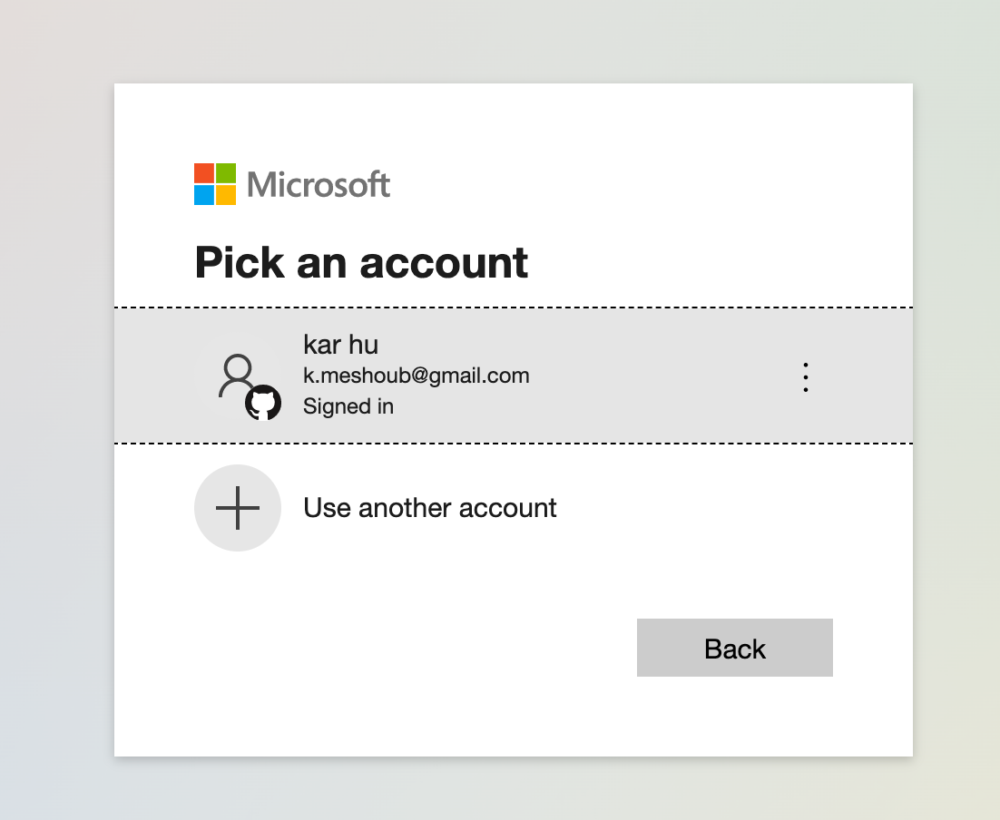
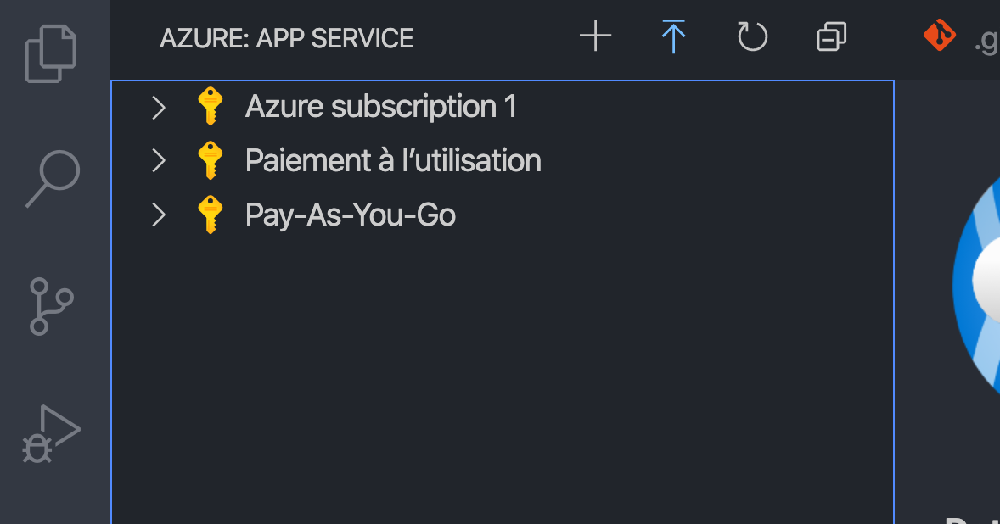
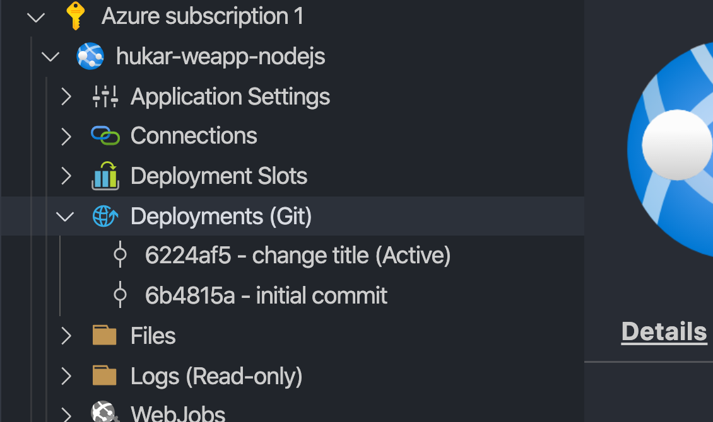
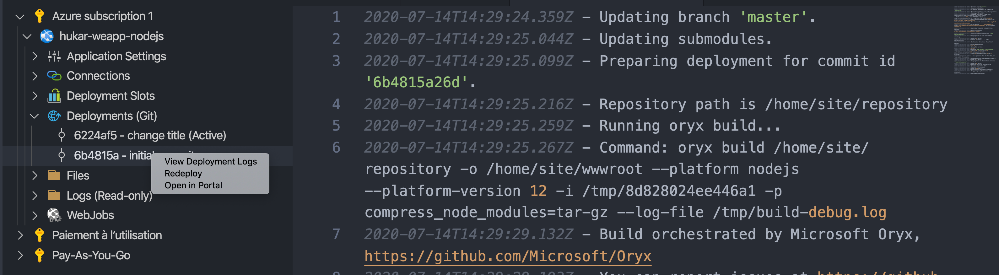
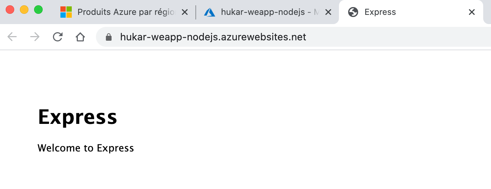
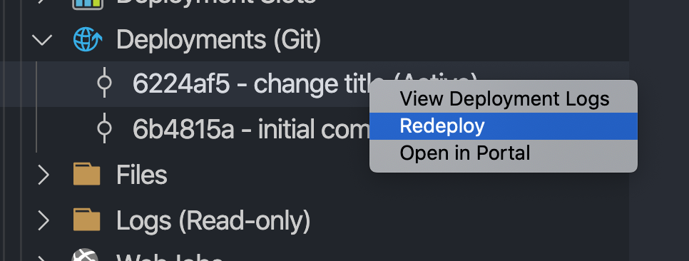
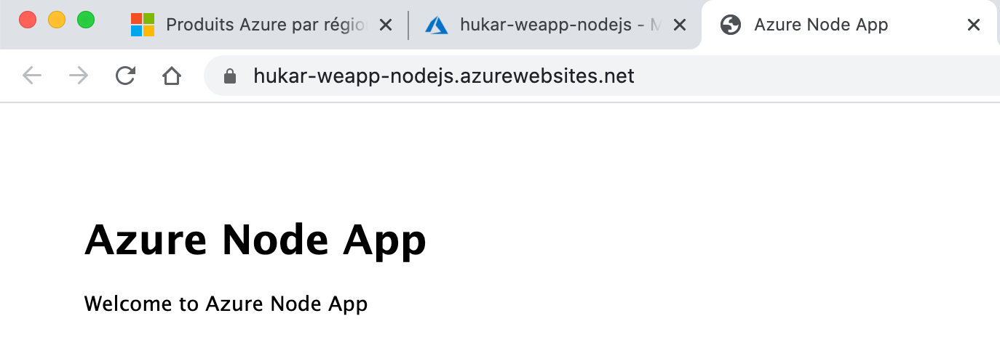

# 09 Gérer son `App Services` via `VSCode`

## Installation Plugin VSCode

On va installer `Azure App Service`.

On a maintenant une section Azure ajoutée à VSCode :

On se connecte (`signin`) ce qui ouvre une fenêtre dans le navigateur :

Je vois mes souscription :

Et en cliquant sur ma première souscription je retrouve ma ressource :

## Redéployer un `commit`

Je choisie un commit et je redéploie mon code :

Je retrouve dans le navigateur mon application au stade du commit initial :

Je redéploie le dernier `commit` :

Et je retrouve mon application au dernier `commit :`

