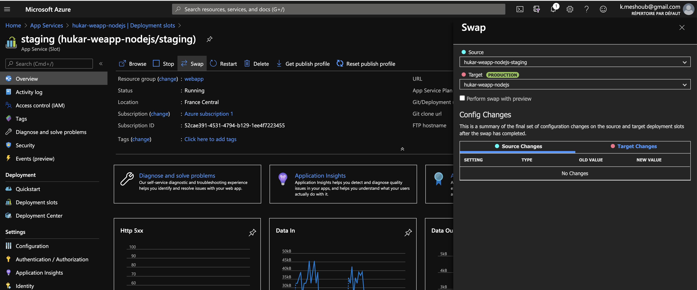
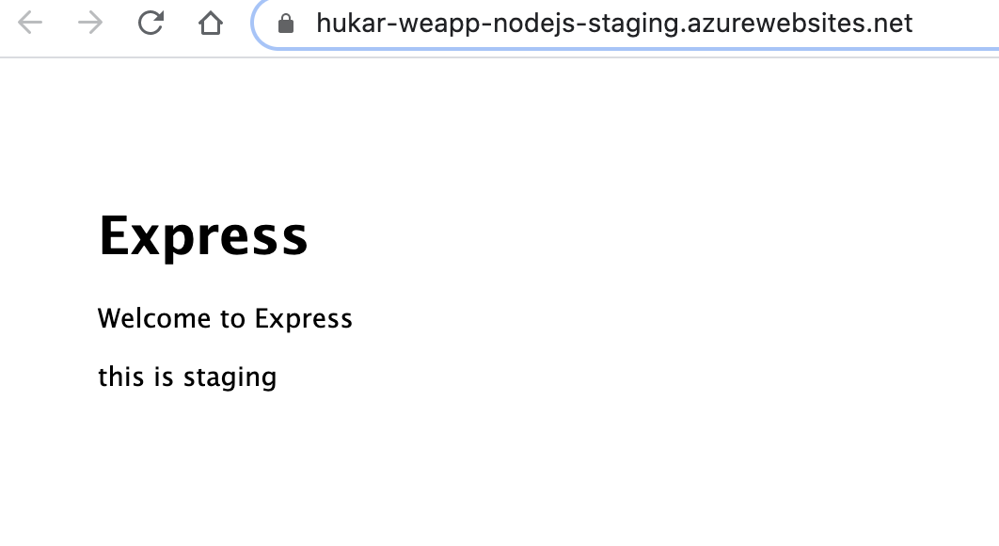
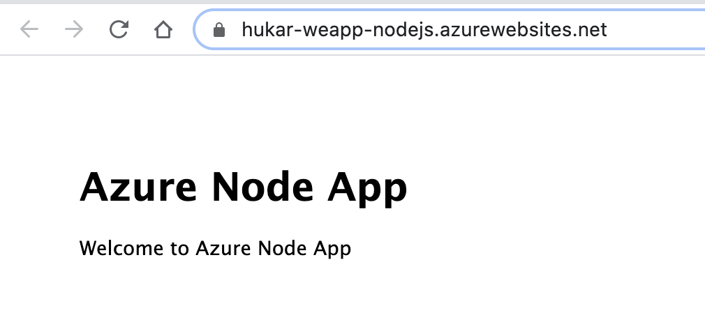
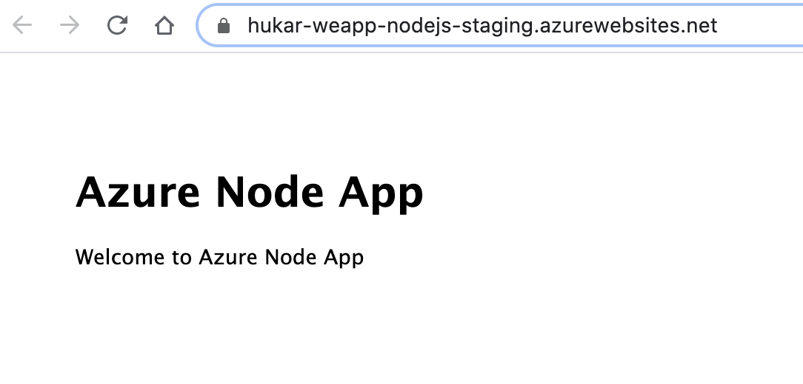
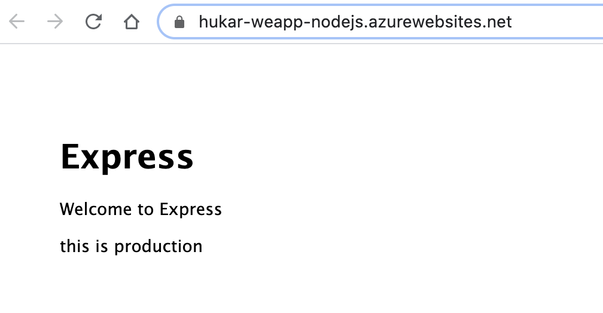
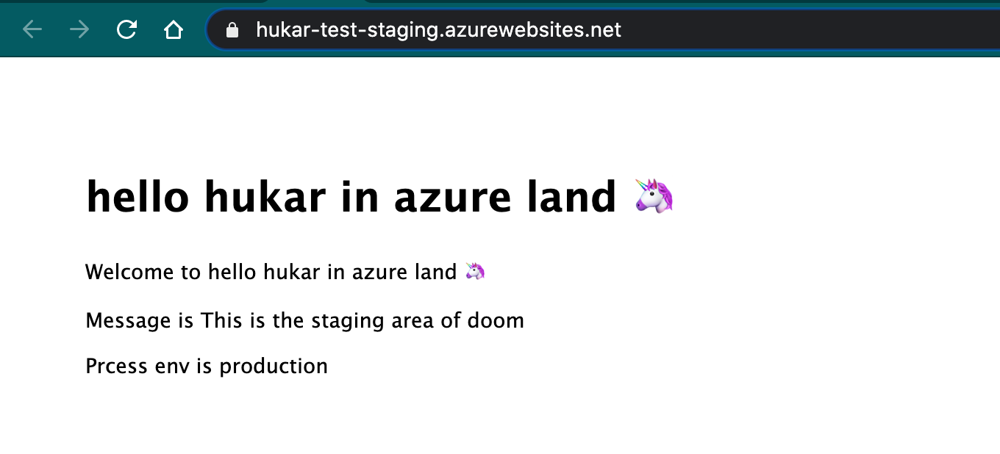
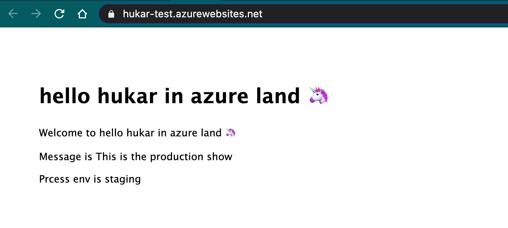

# Intervertir les slots de déploiement

Il faut cliquer sur `swap`.

Les variables d'environnement dont `Deployment slot setting` est coché ne seront pas copier lors du `swap`.

On devrait donc avoir un nouveau `MESSAGE`.

### Avant le swap

#### `staging`

#### `production`

### après le `swap`

#### `staging`

#### `production`

On voit que la variable d'environnement `MESSAGE` est restée liée à un `slots` (ici `production`).

Si on affiche aussi la variable d'environnement `NODE_ENV` qui n'est pas attachée au `slot` on obtient :

### staging

 

`MESSAGE`  : `Deployment slot setting = true` staging (la valeur reste attachée au `slot`).

`NODE_ENV` : `Deployment slot setting = false`  production la valeur est attachée à l'application.

### `production`

Ici c'est l'inverse.