# 12 Monitoring

## `Metrics`

Le service `metrics` permet d'avoir une vue sur nos applications.

Ce service fait maintenant partie de `monitor`:

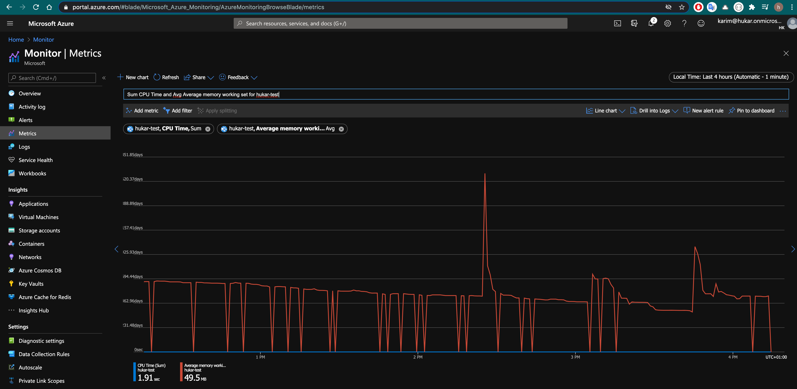

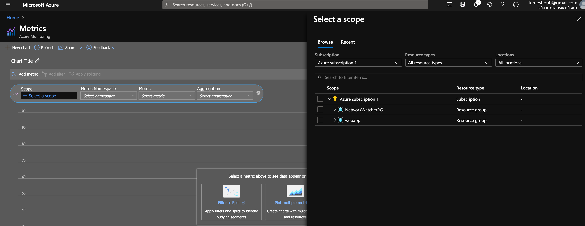

Je choisie d'avoir des infos sur la consommation `cpu` ainsi que la mémoire :

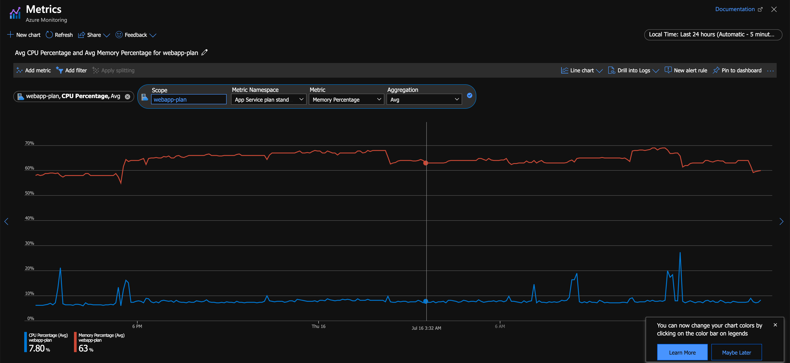

## Alertes

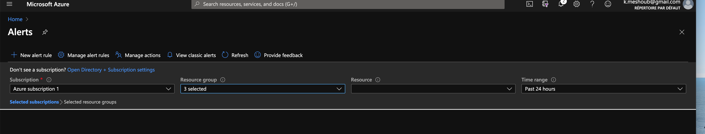

On va créer une alerte basée sur le monitoring.

On choisie `App Resource Plan` et `webapp-plan` :

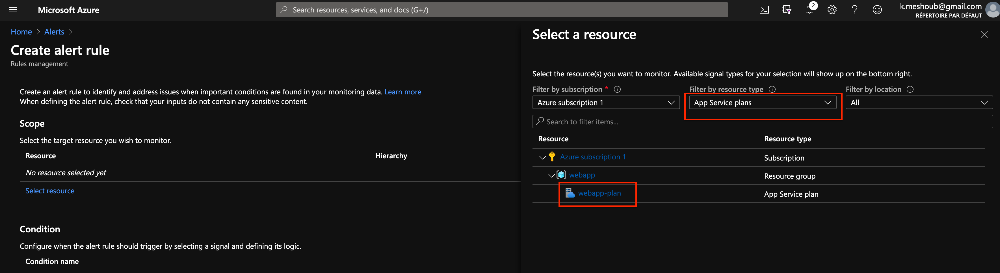

### Problème

Le bouton `condition` n'apparaissait pas.

J'ai dû enregistrer des `provider` :

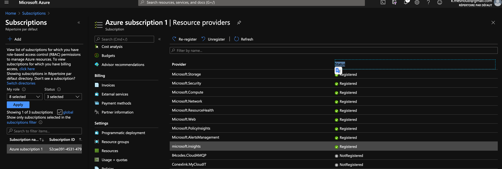

`Microsoft.Insight` et `Microsoft.AlertsManagment` n'étaient pas enregistrés.

### Retour à l'alerte

Ajout d'une condition :

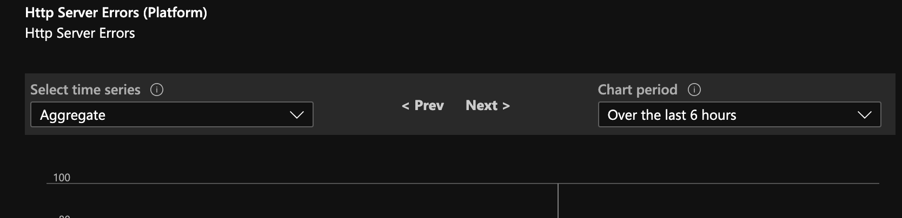

Condition sur les erreurs HTTP.

On défini un seuil :

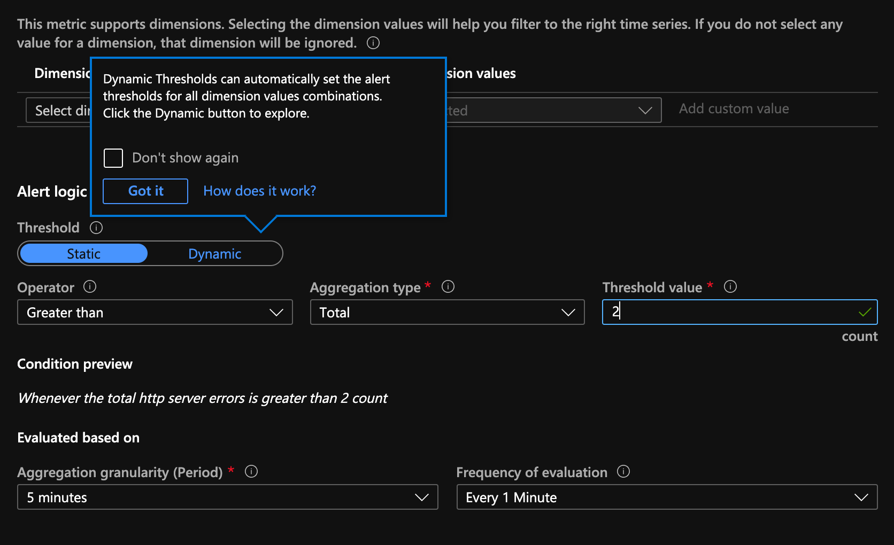

Plus de deux erreurs sur 5mn.

On crée ensuite un Action Group :

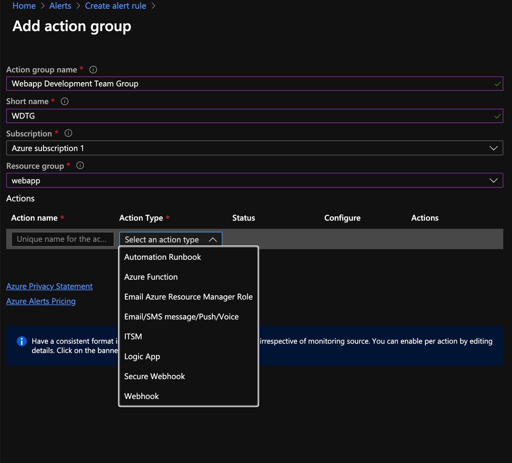

On peut choisir le type d'action, et il y a plein de possibilités : Logic App Azure Function, email-sms, ...

### Email / SMS

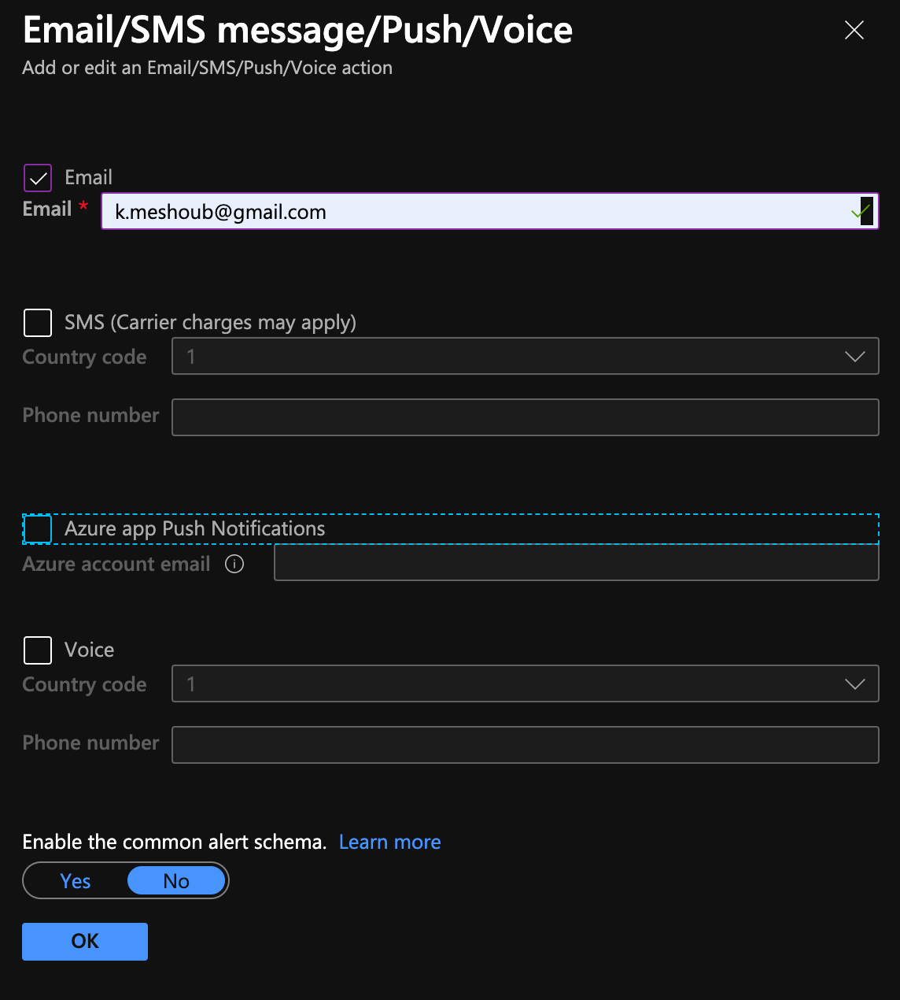

Il ne reste plus qu'à cliquer sur `ok` :

J'obtiens aussi une estimation du coût, ici 0.10 $ par mois.

### Détails de l'alerte

On doit maintenant donner un nom à l'alerte :

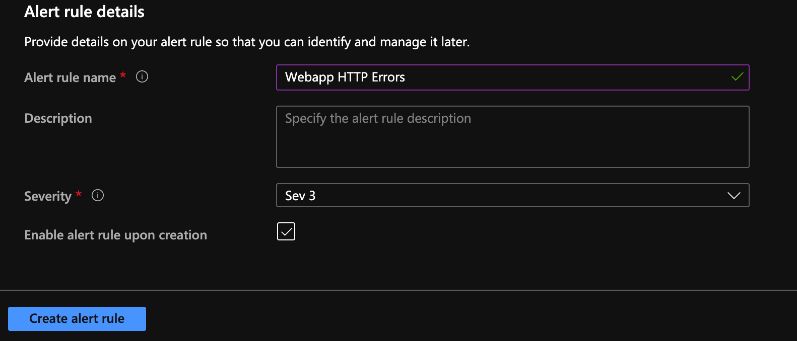

On la retrouve dans l'onglet Alert Managment :

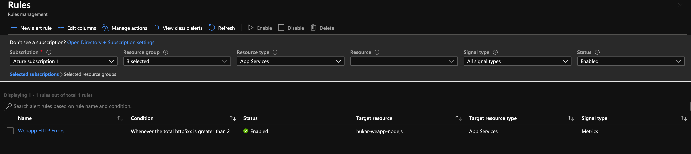

### Reception de l'alerte

Après avoir volontairement déclenché des erreurs http.
