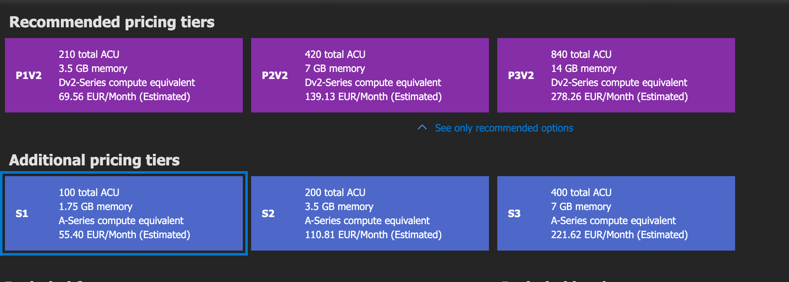
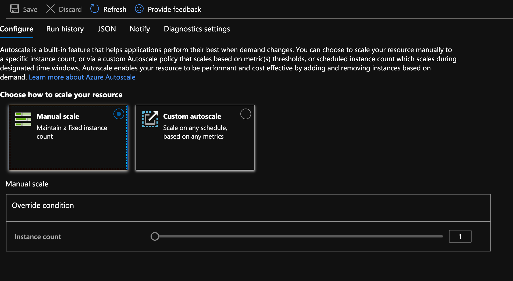
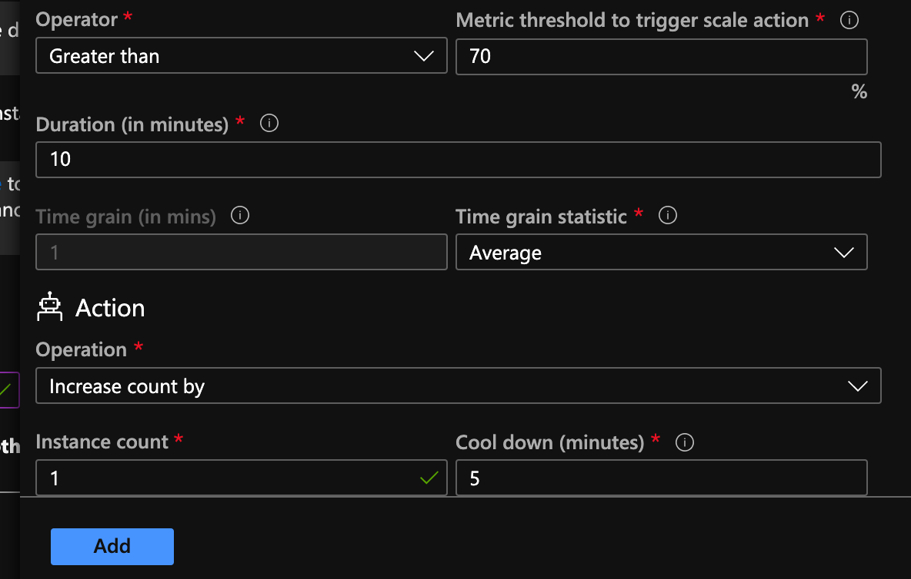
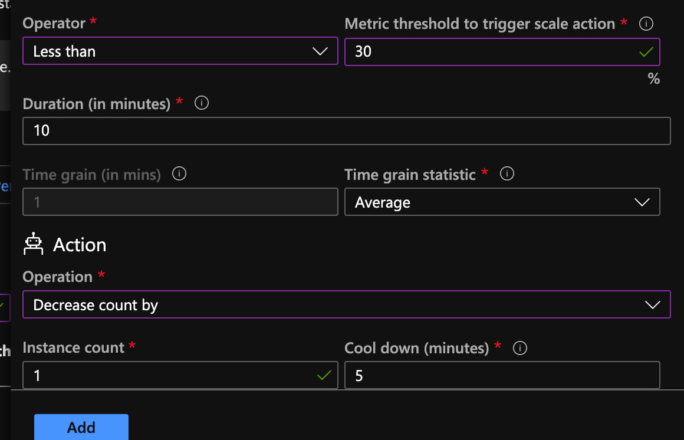
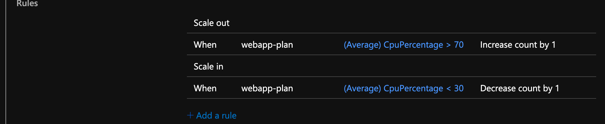
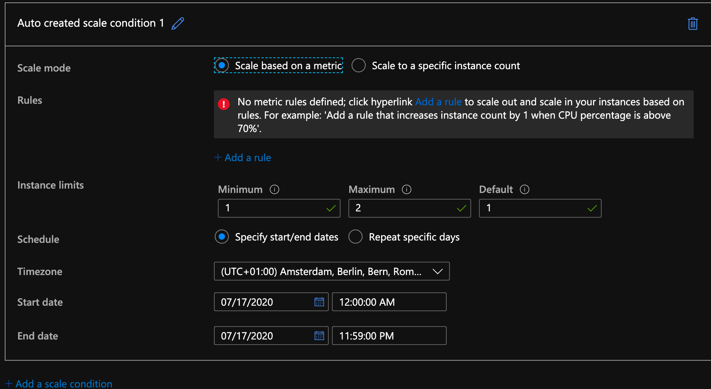
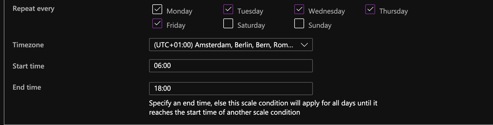

# 13 Application Scaling

`Scale Up` revient à prendre une machine plus performante :

On revient au choix de sa configuration.

`Scale Out` permet de modifier le nombre d'instance de sa machine :

`Manual Scale` permet de changer ce nombre manuellement.

`Custom Autoscale` permet de mettre des conditions à la mise à l'échelle (scaling).

On règle le nombre d'instance minimum et maximum :

## Ajout de règles

### Ajouter des instances

Ici si la charge `cpu` est supérieur à 70% pendant 10mn on ajoute une instance.

`Cool down` signifie qu'après une nouvelle instance le système atant 5mn que la charge se stabilise avant d'jouter encore une nouvelle instance.

### Retirer des instances

Il faut maintenant ajouter une règle pour redescendre le nombre d'instances.

On a donc deux règles :

### Augmenter le nombre d'instances pour une date spécifique

Si on sait qu'à une période donnée on va avoir besoin de plus de ressource on peut le programmer.

On peut aussi se baser sur les jours ouvrable de la semaine :

