# 14 monitoring et debugging

## Log stream

Dans `App service > Monitoring > Log stream` on peut retrouver les logs en live :

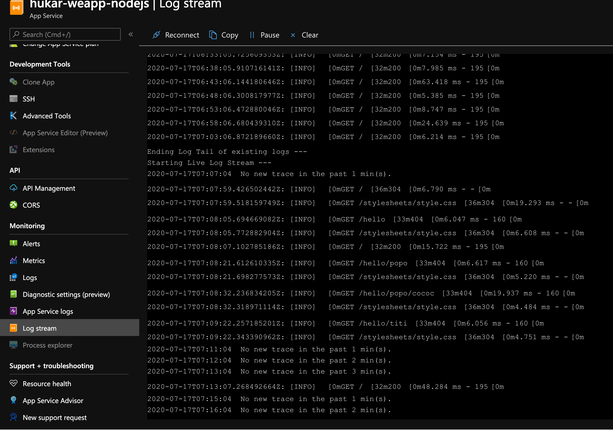

On peut voire les requêtes HTTP et le démarrage.

### Log stream dans VSCode

On retrouve `Log stream` directement dans **VSCode** :

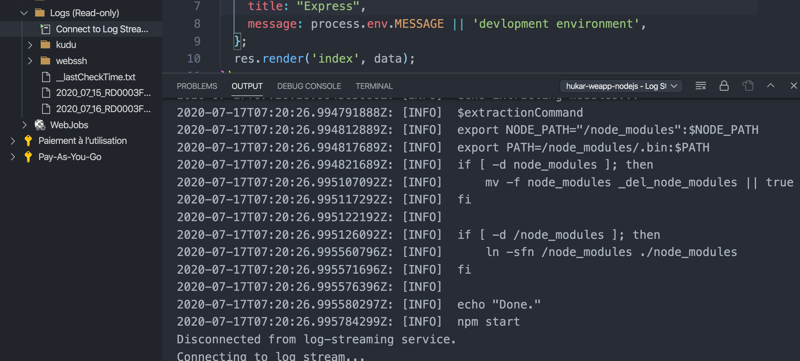

Chez moi ça ne fonctionne pas très bien.

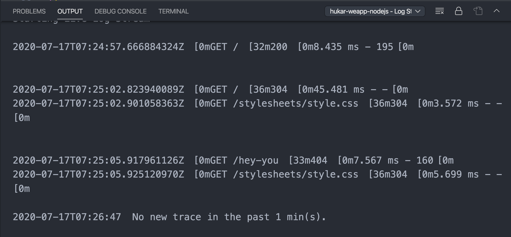

Après un certain temps j'ai bien eu les logs.

Pour fermer le `stream` de `logs` : `cmd + shift +p`

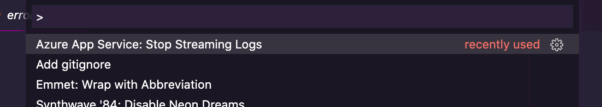

## Monitoring / Diagnostic setting

On peut ajouter d'une manière flexible une collecte de logs ou de métriques.

On peut les archiver dans un `storage account`.

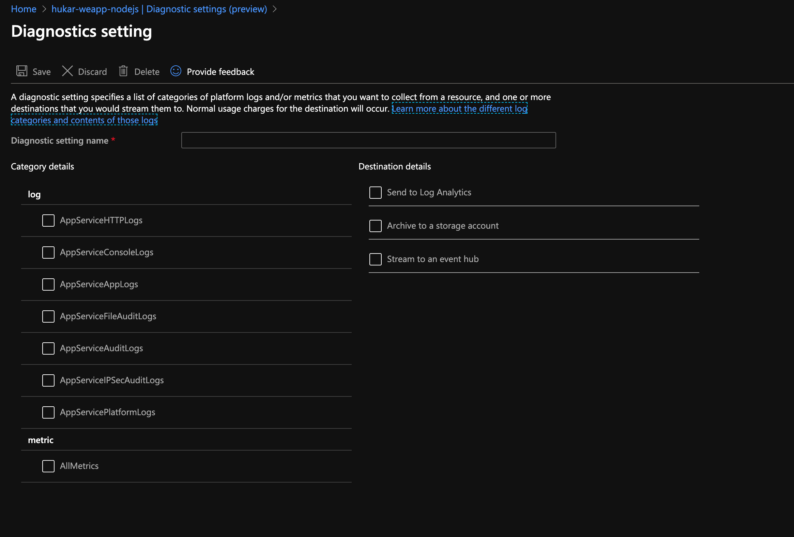

## Application insight

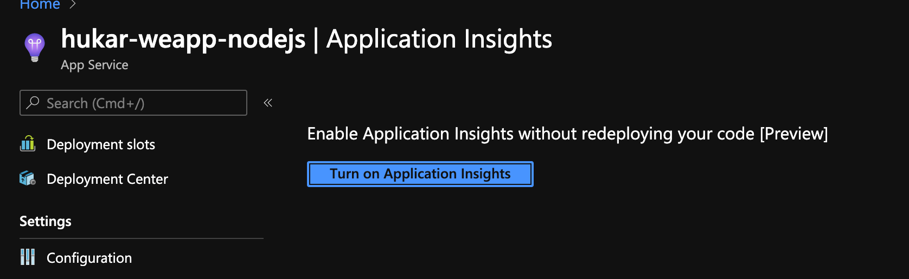

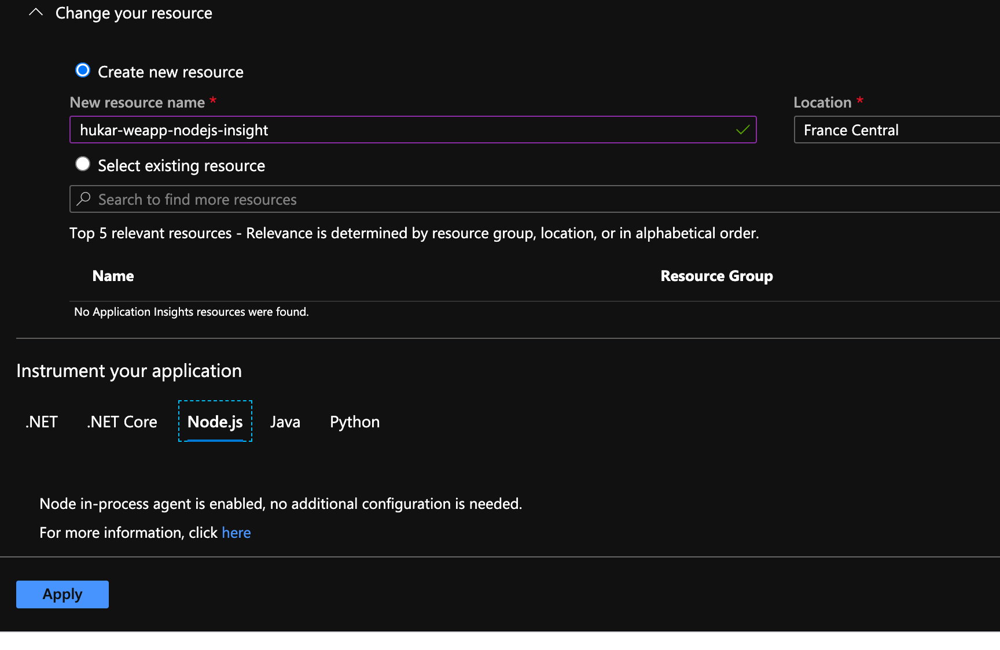

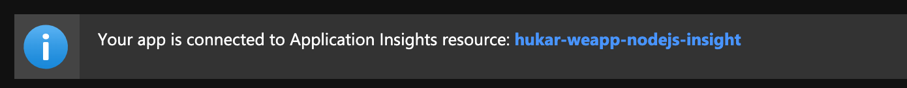

On peut cliquer sur le lien :

### Live Metrics

Un peu comme `Log stream`.

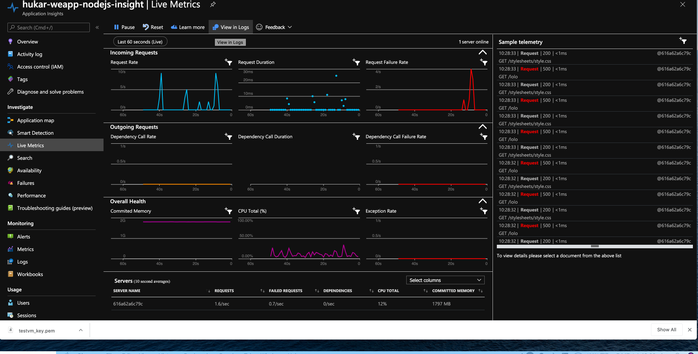

### `robots933456.txt`

Fichier test du conteneur utilisé par Azure pour voire si l'application répond correctement.

### Performance

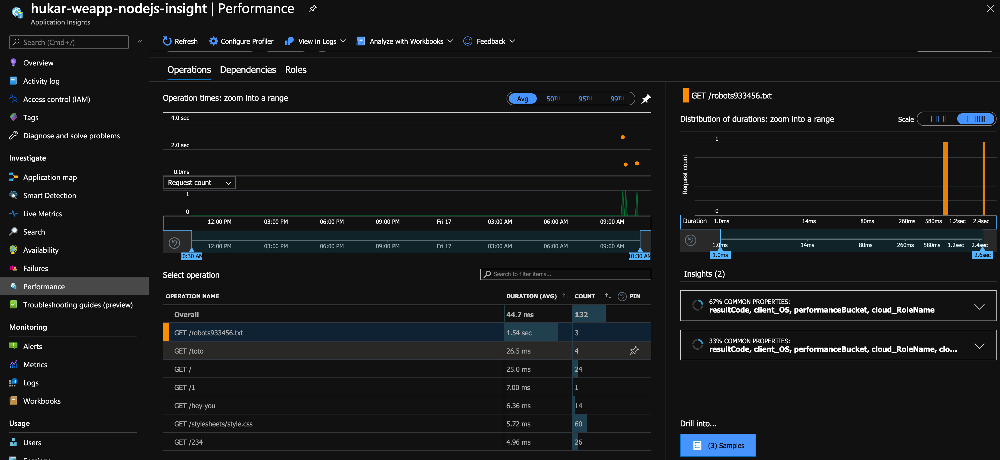

On peut voire les temps de réponse des requêtes.

On peut aussi voire d'où viennent les requêtes :

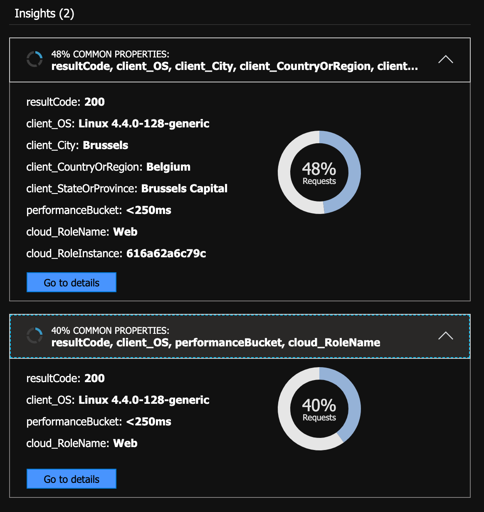

## Failures

On peut voire toutes les requêtes ayant provoquées une erreur :

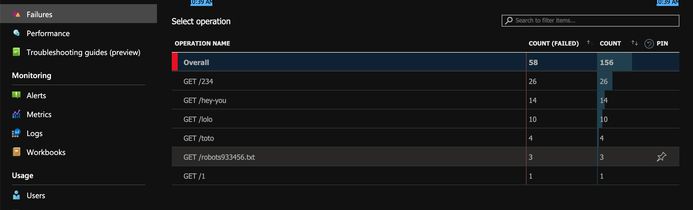
