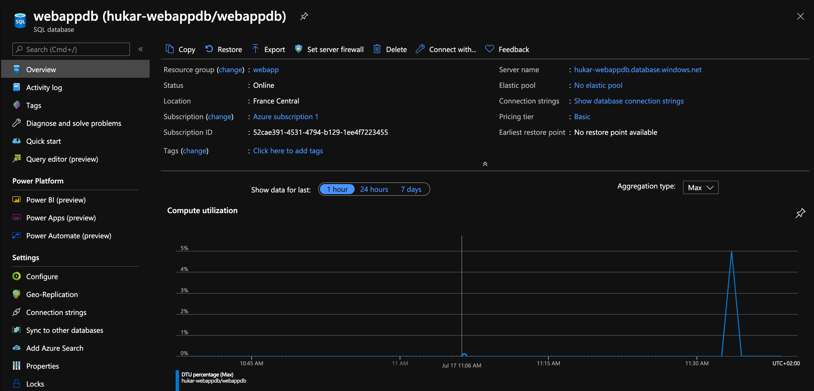
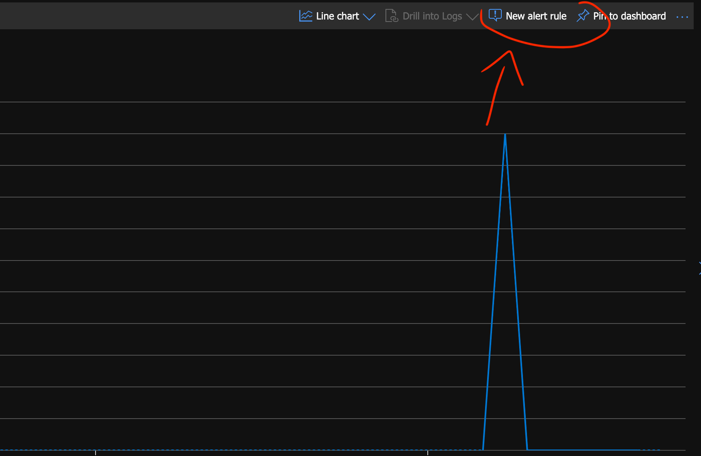
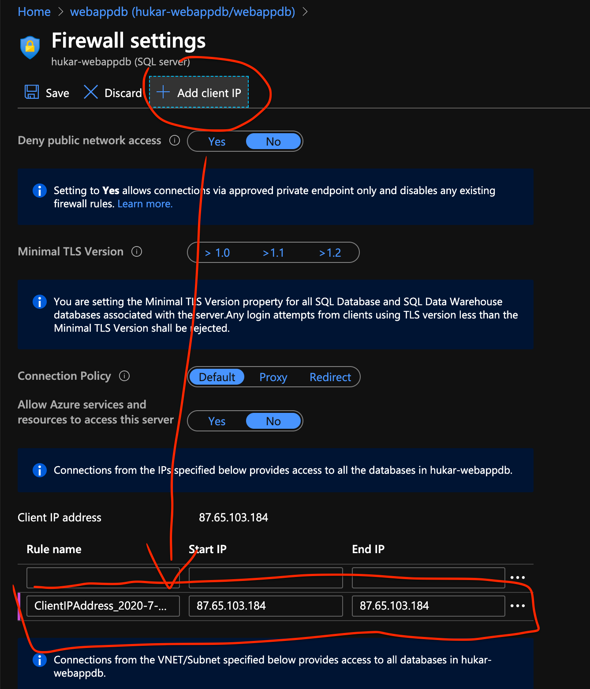
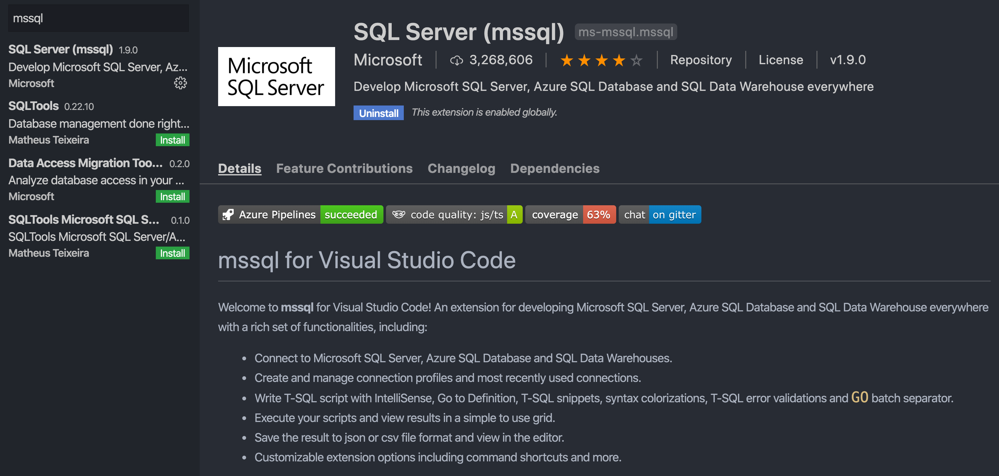
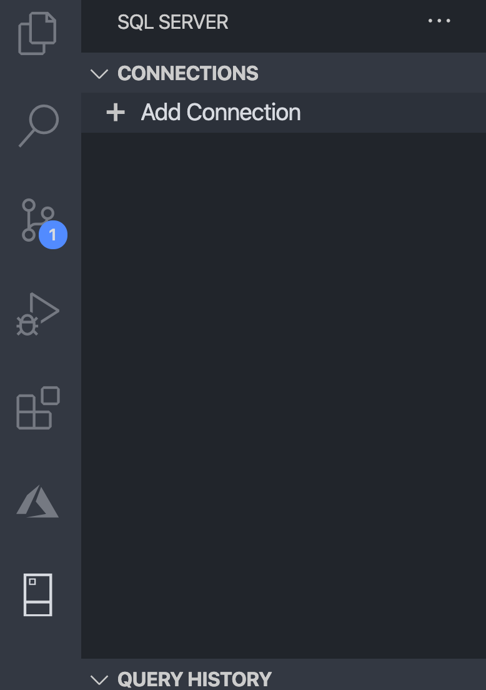
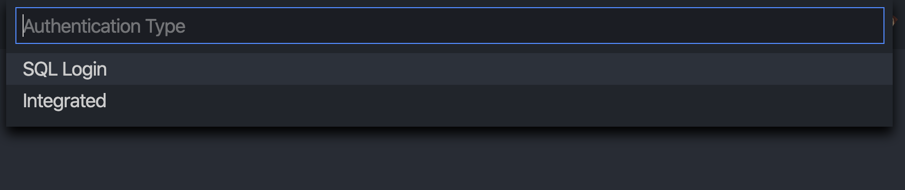
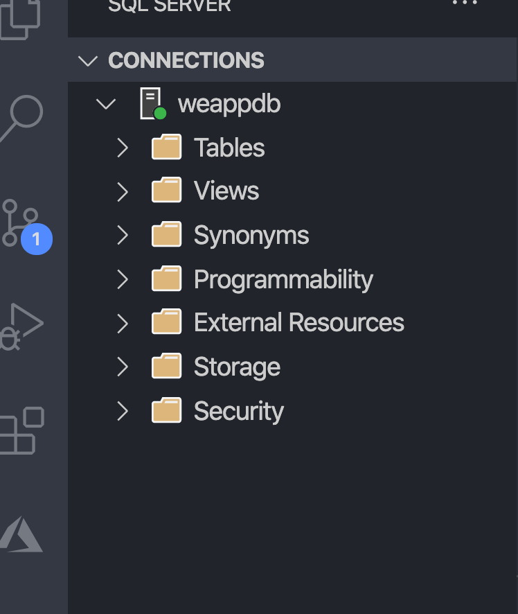
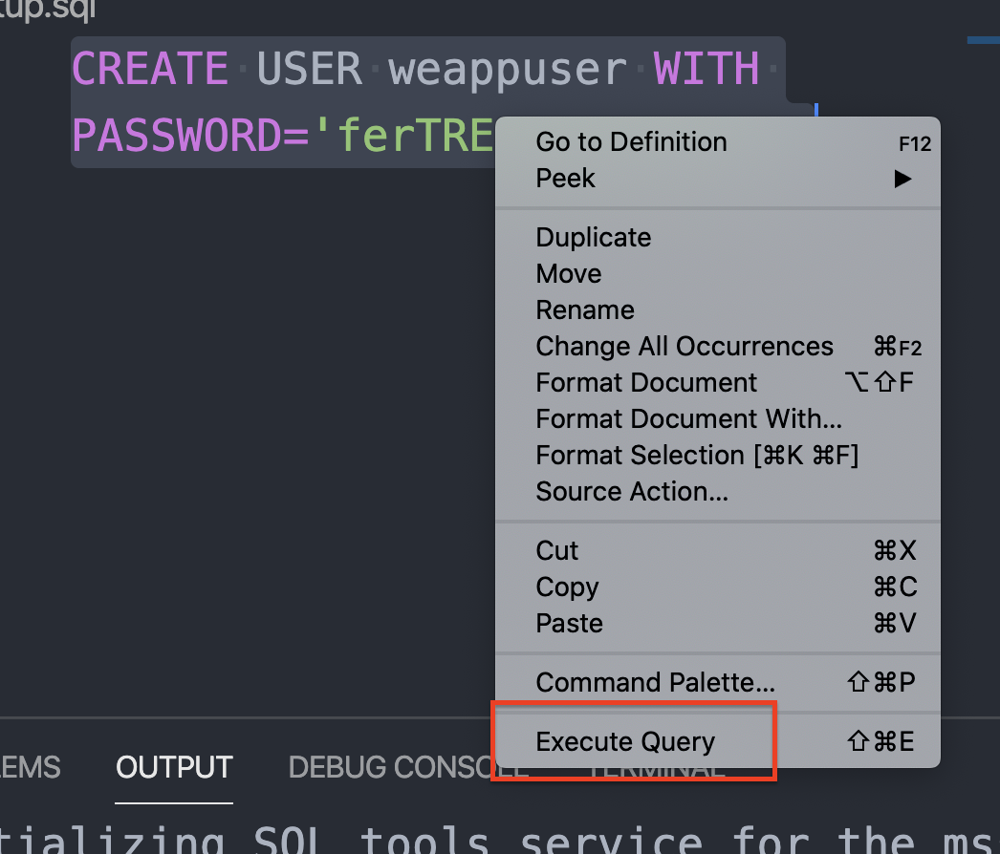
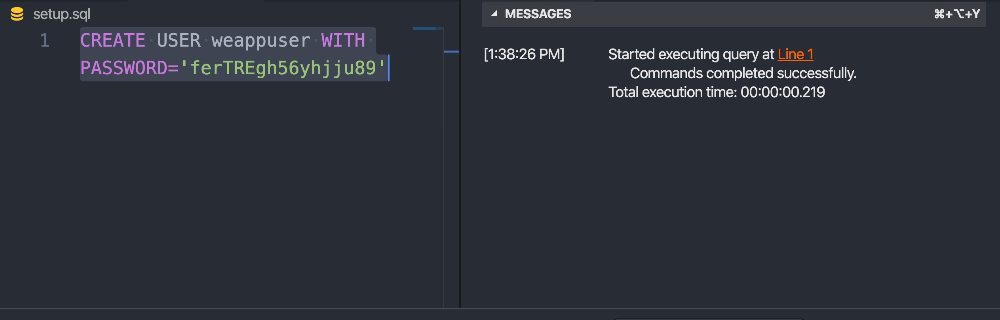
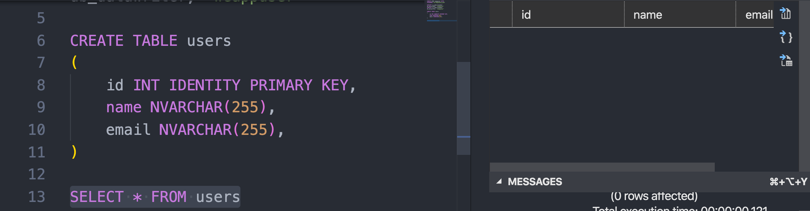

# 16 Connexion et configuration Azure SQL



## Alertes

Un click sur le graphe permet de faire apparaître une option d'alerte :



## Firewall

On ajoute son adresse `IP` :



Seul cette adresse peut accéder à la base de données.

## VSCode

On installe l'extension `mssql`.



### Connexion à la DB



On crée une nouvelle connexion.



On renseigne les credentials, on choisie le SQL login.



On est connecté.

## Création d'un `USER`

On crée à la racine un fichier `setup.sql` :


On peut taper dedans ses requêtes :

```sql
CREATE USER weappuser WITH PASSWORD="ferTREgh56yhjju89"
```

> **new** : `webhuk` pwd:`abc123babyYouAndMe`

Et l'exécuter :





### Ajouter des droits en lecture et en écriture

Ce sont des procédures stockées `stored procedure` = `sp_`

```sql
EXECUTE sp_addrolemember db_datareader, "weappuser"
EXECUTE sp_addrolemember db_datawriter, "weappuser"
```

Puis `execute query`.

## Création d'une table `users`

```sql
CREATE TABLE users
(
    id INT IDENTITY PRIMARY KEY,
    name NVARCHAR(255),
    email NVARCHAR(255),
)
```



Pour l'instant la table est vide.
