# 18 Cosmos DB

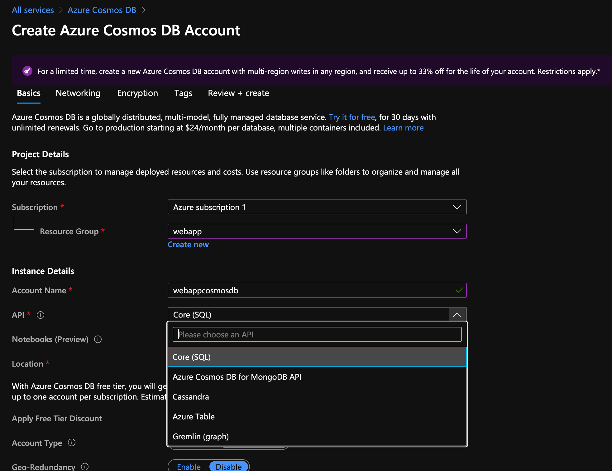

La particularité de Cosmos Db est de puvoir travailler avec de différentes manières.

On a aussi des options `Production` qui active des fonctionnalités :

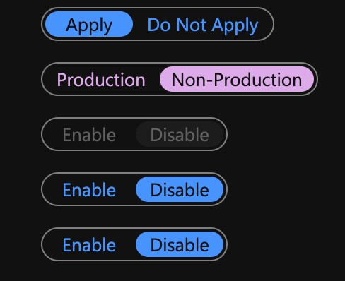

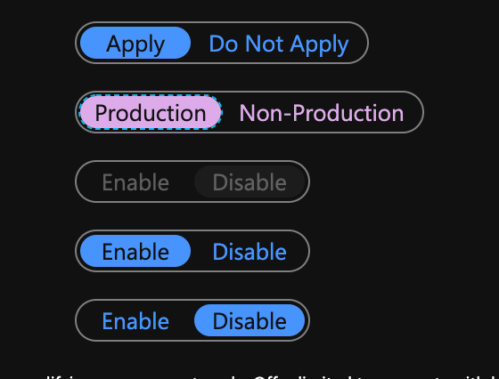

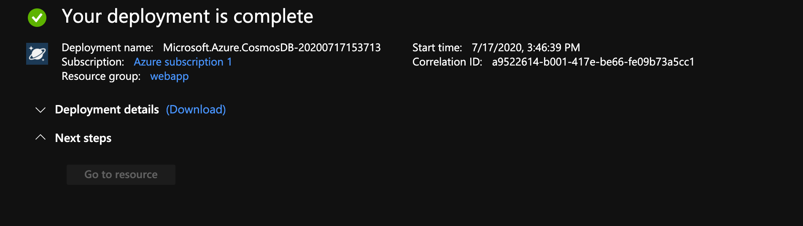

On peut maintenant aller sur la ressource.

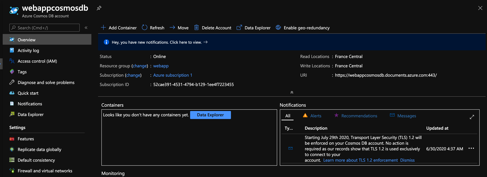

## Connection à `Cosmos DB`

On se connect à `Cosmos DB` avec une `URL` plutôt qu'avec un num et un mot de passe.

On peut considérer `Cosmos DB` comme une grosse `rest API`.

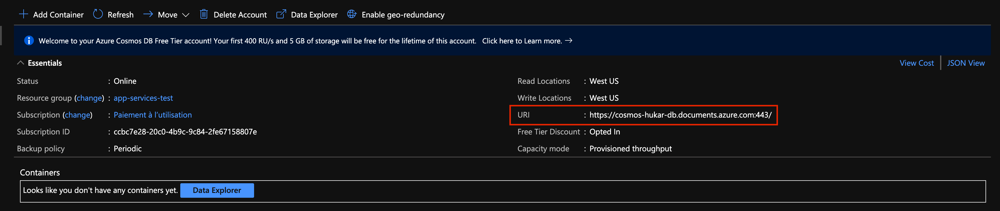

## Créer un conteneur

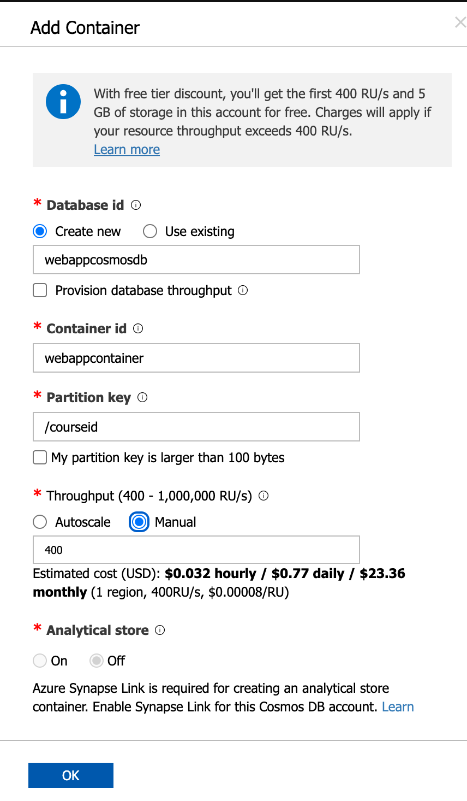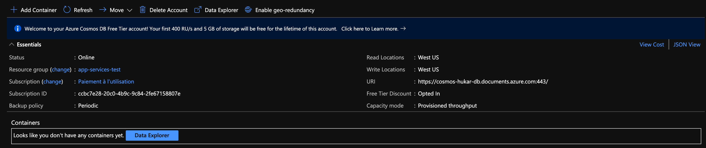

On a maintenant un conteneur.

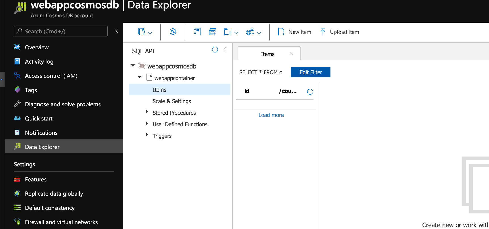

## Relier `Cosmos Db` à son application `NodeJS`

### Installer le `sdk`

```bash
npm i @azure/cosmos
```

### Créer une route `routes/courses.js`

```js
const express = require('express')
const router = express.Router()
const coursedb = require('../data/coursedb')

router.get('/', async (req, res, next) => {
    try {
        const items = await coursedb.queryCourses()
        res.send(items)
    } catch (error) {
        res.status(500).send(error.message)
    }
})

router.put('/', async (req, res, next) => {
    try {
        const { itemCount } = await coursedb.createCourses()
        res.send(`${itemCount} courses are created`)
    } catch (error) {
        res.status(500).send(error.message)
    }
})

module.exports = router
```

### l'inclure dans `app.js`

```js
// ...

var indexRouter = require('./routes/index')
var usersRouter = require('./routes/users')
const coursesRouter = require('./routes/courses')

// ...
```


###Créer un CosmosClient

Dans un dossier `data` on crée le fichier `coursedb.js`

```js
const { CosmosClient } = require('@azure/cosmos')
const coursesData = require('./courses.json')
```

Ici on importe le client Cosmos `require('@azure/cosmos').CosmosClient` et les données des cours `courses.json`

```js
const client = new CosmosClient({
    endpoint: 'https://hukar-cosmos.documents.azure.com:443/',
    key:
        'QjvFpNiE0BLT2LdD1OQOjLhOXWXgAkv0j9K45IDhWgJGlOzycJJpWrQ8XuORa9RIoNGOnClqz2IDcZDDwEehkQ==',
})

const databaseId = 'hukardb'
const containerId = 'hukarcontainer'

let container

const getContainer = async () => {
    if (!container) {
        container = await client.database(databaseId).container(containerId)
    }

    return container
}

module.exports.queryCourses = async () => {
    const c = await getContainer()
    const { resources } = await c.items.readAll().fetchAll()

    return resources
}

module.exports.createCourses = async () => {
    const c = await getContainer()
    await Promise.all(coursesData.map((course) => c.items.create(course)))

    return { itemCount: coursesData.length }
}
```

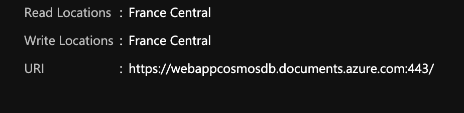

Dans overview on retrouve l'`URI` :

```
https://webappcosmosdb.documents.azure.com:443/
```

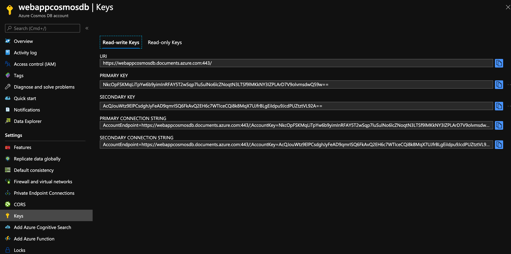

Dans `Keys` on trouve deux clés différente mais ayant le même rôle (deux pour des raisons de stratégie de sécurité).

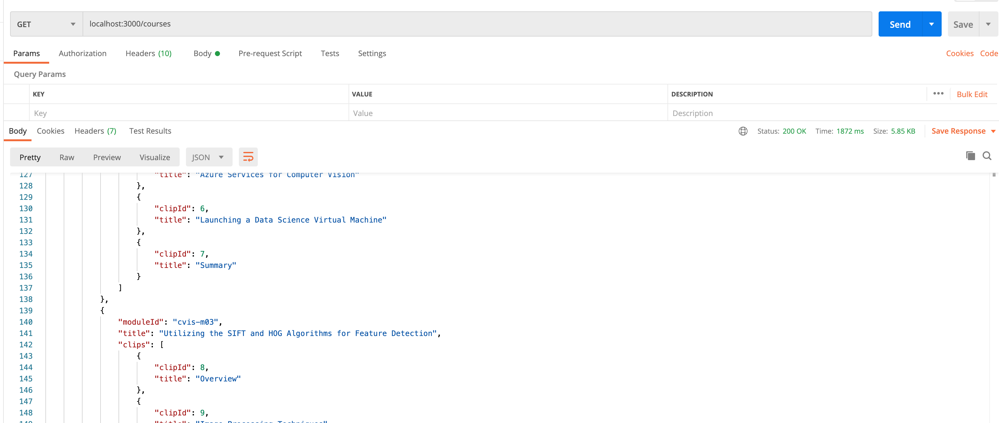


## Monitoring Cosmos DB

`scale` n'apparait pas avec la tarification `serverless`.

### Alert sur le status 429

`Total Request Units`

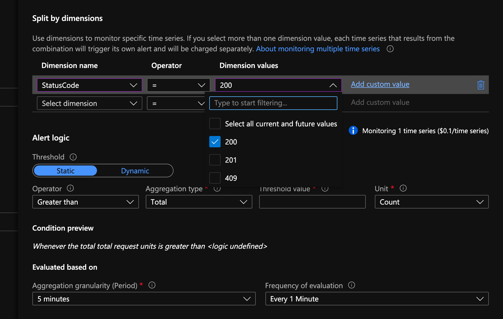

Le `status 429` n'est pas proposé : cohérent avec `serverless`.


