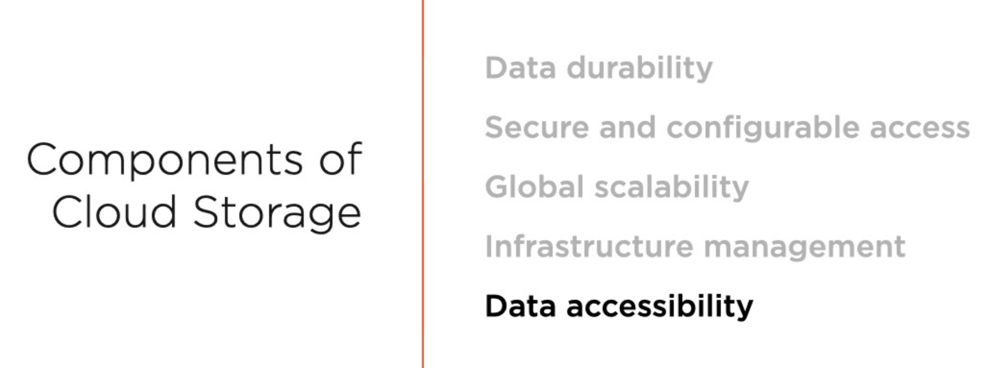
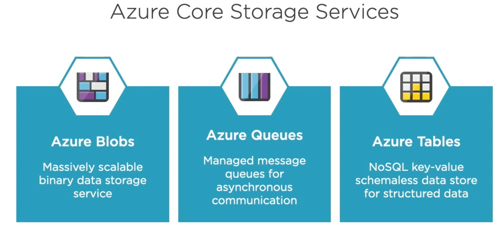
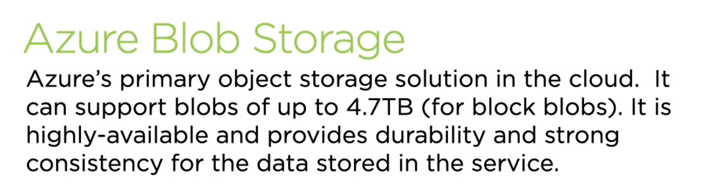
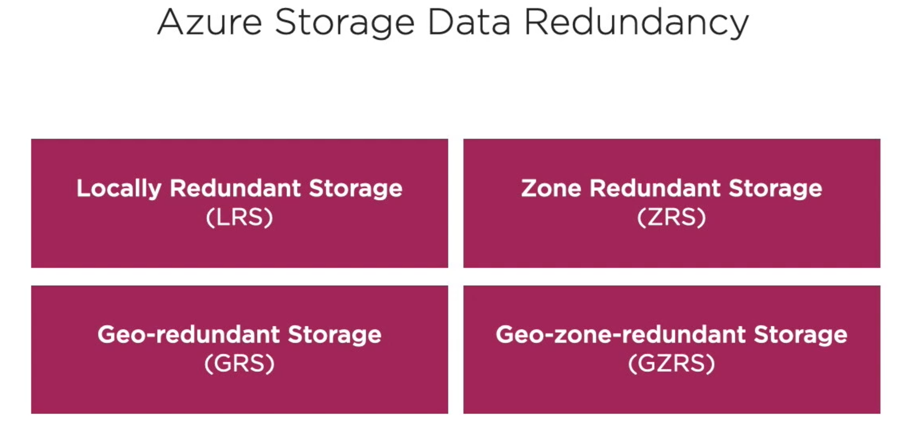
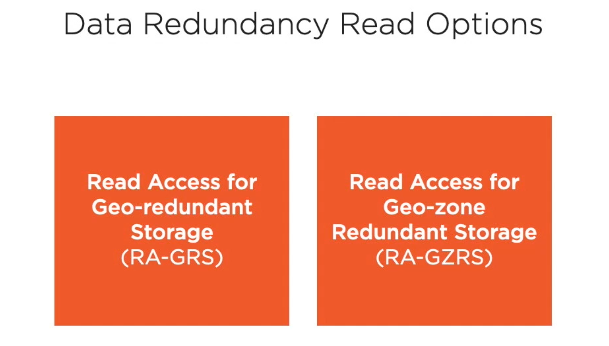
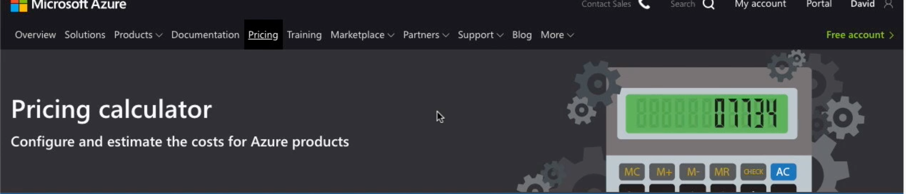
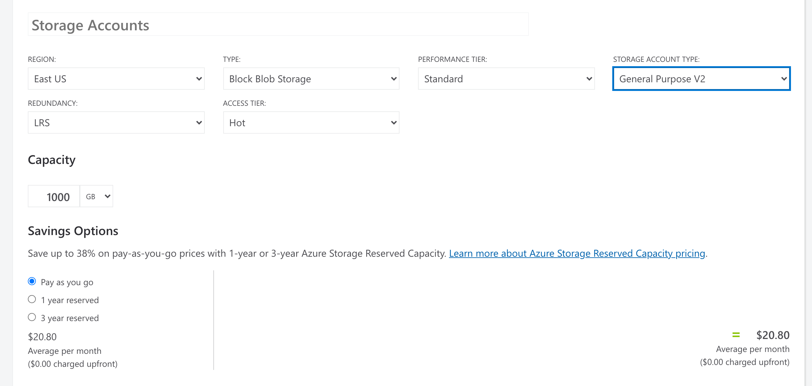
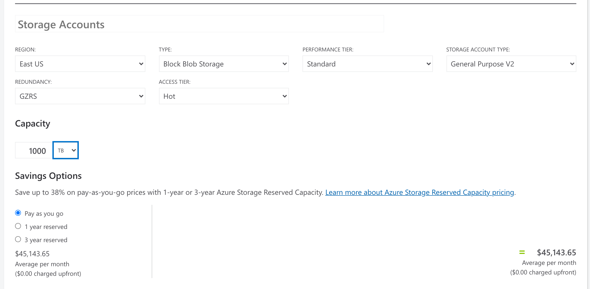
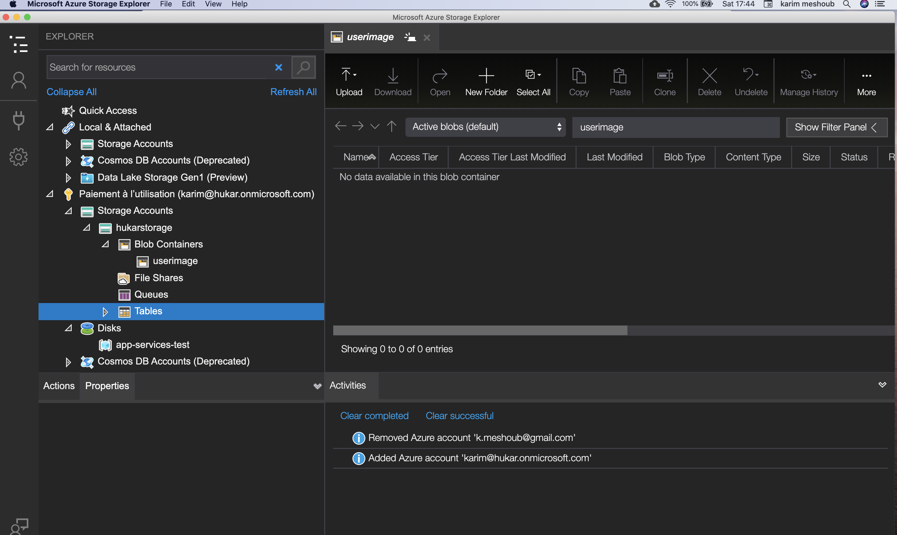

# 19 Cloud Storage

- les données sont préservées d'une altération physique
- l'accès est configurable et sécurisé
- On peut rendre les données accessible largement.
- On peut configurer son infrastructure
- Les données sont accessible dans le cloud en lecture et en écriture

## Blobs

### `B`inary `l`arge `ob`ject`s`

On peut avoir des blobs jusqu'à `4,7TB`.

### Anatomy

## Créer un `storage account`

performance :

`Standard` : Disque Dur HDD Hard Disk Drive (`drive` : lecteur)

`Prenium` : SSD Solid State Drive

Choisir `StorageV2` qui a plus d'options (à vérifier ?).

access tier : niveau d'accès

`cold` stockage à froid -> écriture, très peu de lecture

`hot`  -> lecture écriture

Il existe aussi dans les `Blobs storage` un autre choix : `archive`.

### `Replication` 

Les données sont au moins répliquées sur trois endroit physique.

`Locally Redundant Storage` option la moins chère, trois différente place dans le même endroit physique (le même data center).

`Zone Redundant Storage` données sauvegardées dans trois Zone distante de la même région.

`Geo-redundant Storage` Les données sont stockées dans trois endroits physiques dans une seule **zone** et une autre **zone** dans une autre **région**.

`Geo-zone-redundant Storage` combine **Zone** et **Region**

Il y a aussi des options en lecture :

`Read Access for Geo-redundant Storage` Les données sont stockées dans une unique **Zone**, on peut lire les données dans les différentes **régions**, si une **région** n'était plus disponible, on pourrait directement lire les données dans l'autre **région**.

`Read Access for Geo-zone Redundant Storage` Plusieurs **Zone** et une autre **région**.

## Azure calculator

De base : 

### `$20.80`

Super `Geo-zone Redundant Storage` pour `1000TB` :

### `$45 143.65`

#### ! si on prend des options `cool storage` ou `archive storage` le coût de conservation est faible mais le coût des opérations est très élevé.

## Créer l'`account storage`

## Azure storage container

`public access level` règle les accès anonyme :

`Private` pas d'accès anonyme.

`Blob` un accès anonyme au fichier.

`Container` un accès anonyme à la totalité des fichiers.

## Microsoft Azure Storage Explorer

Application desktop pour visionner ses données.

