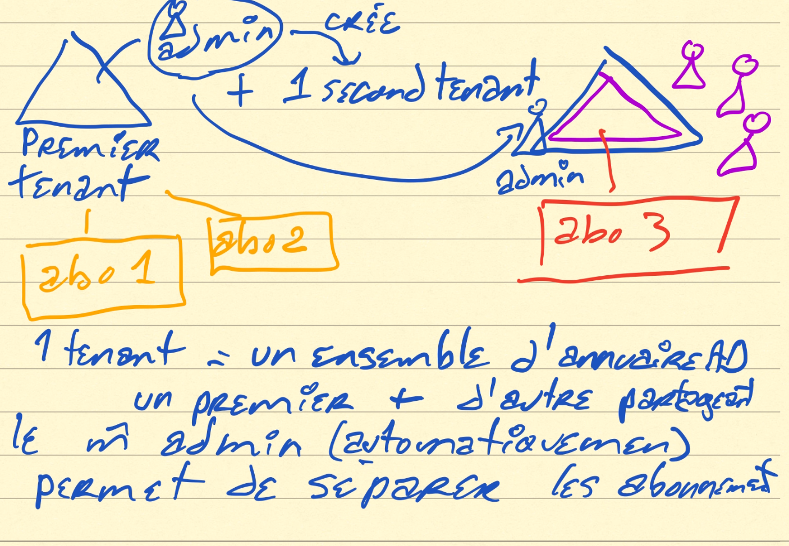
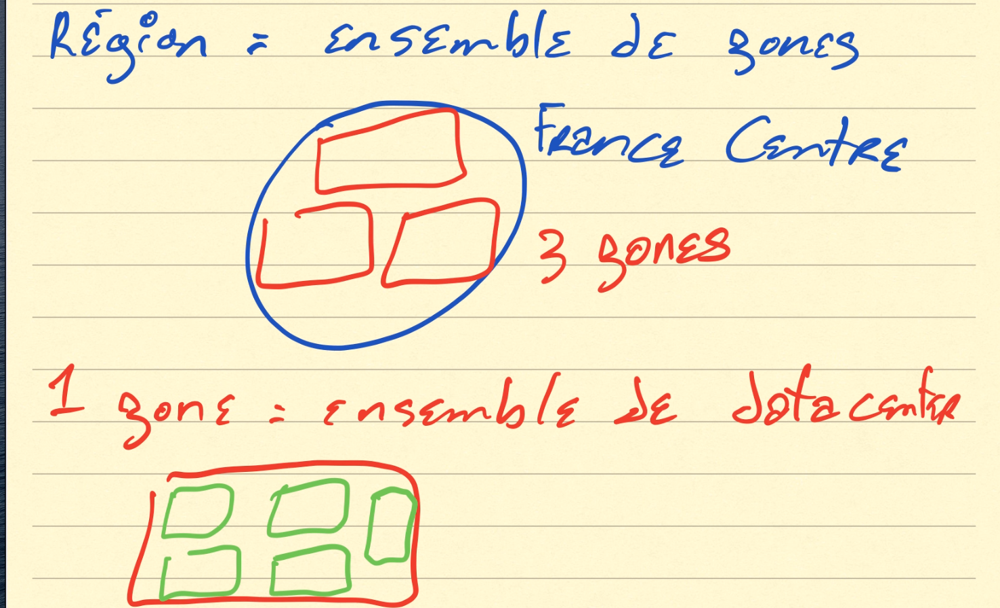
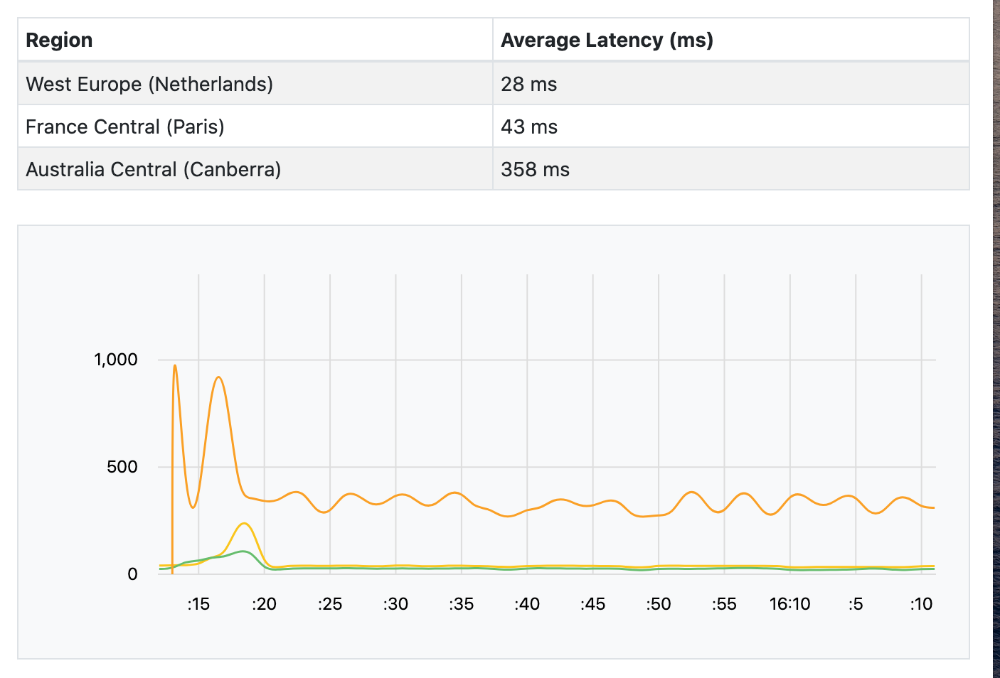
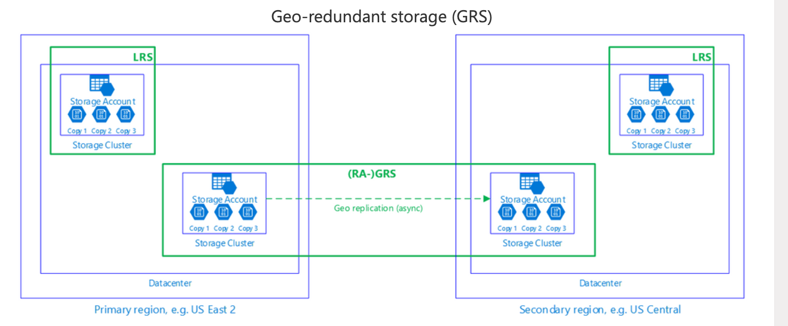
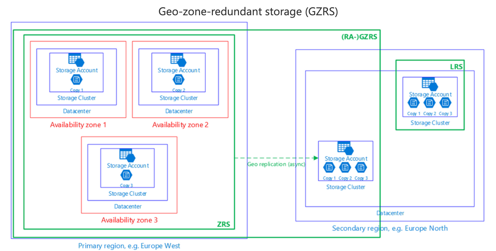
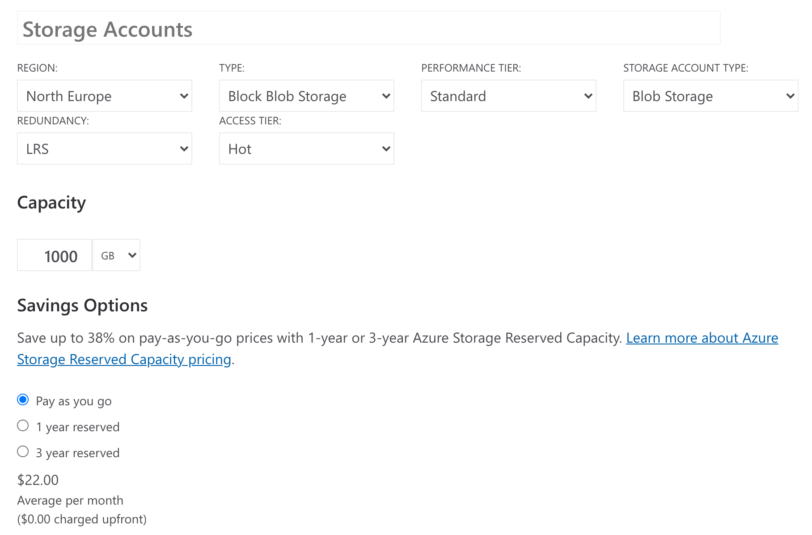
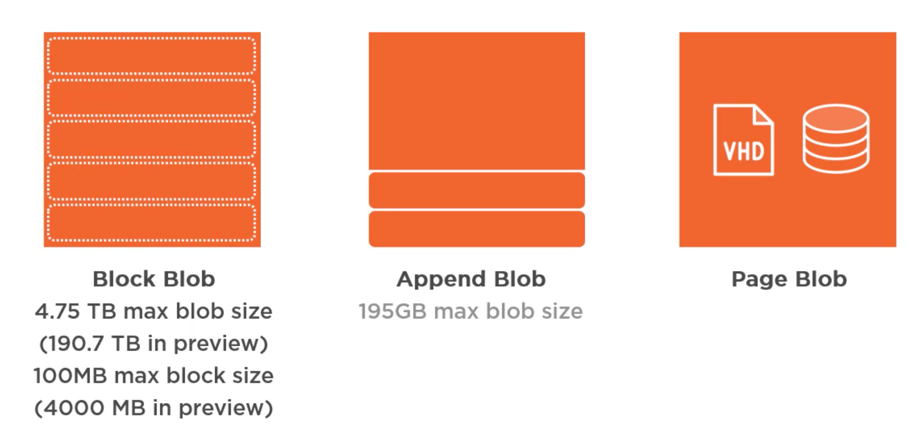

# 01 Le `blob storage`

`Azure Queue` système de file d'attente, intéressant.

`Table` dico -> données ligne par ligne.

`VHD` Virtual Hard Disk disques des `VM` Virtual Machine.

compte `Azure` -> création d'un domaine -> Base de données `Azure AD` (Active Directory).

`tenant` = annuaire `Azure AD`

1 `tenant` -> plusieurs `subscription`

1 `subscription` -> 1 `tenant`



1 `tenant` -> plusieurs annuaire `Azure AD` avec le même `admin`.

## Groupe de `resources`

Un `resource group` est un groupe logique, les ressources attachés à ce groupe ont un cycle de vie commun.

Cela permet aussi de séparer les projets.

On peut aussi définir des droits communs.

## dates

`AWS` => 2006

`Azure` => 2010


## `ARM` = `Azure Resource Manager`

`API` de création de ressource en `json` sur un modèle déclaratif.

Le service de stockage expose une `API Web`, une ressource doit avoir un nom `DNS` unique.

Par exemple :

```
hukarblobstorage.core.blob.windows.net
```

`Storage v2` -> toutes les fonctionnalités.

`blob storage` pour faire que du `blob`.


## Géolocalisation



### 1 région -> 3 zones -> plusieurs Datacenter

Tester la latence entre région :

https://www.azurespeed.com/Azure/Latency



Le cloud allemand est souverain.

Le cloud français ne l'est pas.

## Redondance des données

À minima trois fois.





`LRS` trois fois dans dans un même Datacenter.

`ZRS` une copie dans trois datacenter de trois zones différente de la même région.

`GRS` x3 -> 2 datacenter dans deux régions différentes.

`GZRS` (1 -> 3 datacenter) x 3 zones + 1 `LRS` dans une autre région.



L'option `RA` = `Read Access` permet une lecture des données dans la deuxième région.

Plus de détails : https://techcommunity.microsoft.com/t5/azure-storage/understanding-azure-storage-redundancy-offerings/ba-p/1431700

## Mise en réseau

Point de terminaison privé -> juste pour les services **Azure**.


## `Data Lake` 

solution de stockage `Big data`.

Un compte de stockage = `5 Peta Octets`


## azure pricing Calculator



## Niveau d'accès

`container` accès à tous les fichiers.

Si on crée un dossier dans un conteneur, ce n'est pas vraiment un dossier mais un chemin :

```bash
# dossier titi
/titi/monfichier.pdf
```


## 3 types de `blob` `B`inary `L`arge `Ob`ject

Le type de `blob` ne peut être changé après la création.

Chaque version d'un `blob` a un `tag` unique appelé `ETag` utilisé pour gérer la concurence.



### `block blob` 

Pour tous les types de fichier, un `blob` est constitué de `block` .

Le maximum de `block` dans un seul `blob` est `50 000`.

Taille maximum d'un block : `100 MB`

Taille maximal d'un `blob` : `50 000 x 100MB = 4.75 TB` (bientôt 190.7 TB).

L'utilisation de `block` permet la parallélisation du chargement (upload ou download) des gros fichiers.

Chaque `block` a son `Id` et doit être commité pour que le `blob` soit considéré comme modifié.

### `append blob` 

Optimisé pour l'ajout des `blocks` à la fin du `blob`, c'est pour les fichiers de `log`.

Taille `50 000 x 4MB (taille du block maximum) = 195GB`.

### `Page Blob`

C'est une collection de page de `512 bytes` optimisé pour les accès aléatoire en lecture écriture.

Créer pour les VMD (Virtual Machine Disk) et `Azure SQL Database`.

Contrairement au `block blob` ou on a une semaine pour commiter les changements, ici les commit sont immédiats.

La taille maximum d'un `page blob` est de `8 TB`.