# 01 Introduction learning `Cosmos DB`

## résoudre le `Big Data` avec `NoSQL`

Les 3 V du `NoSQL` :

- Volume
- Variety
- Velocity

### Scale up et Scale out : Volume

| 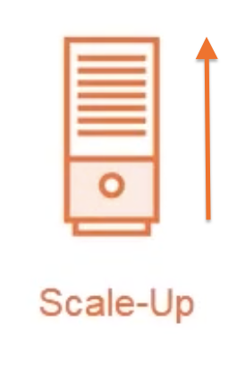 | 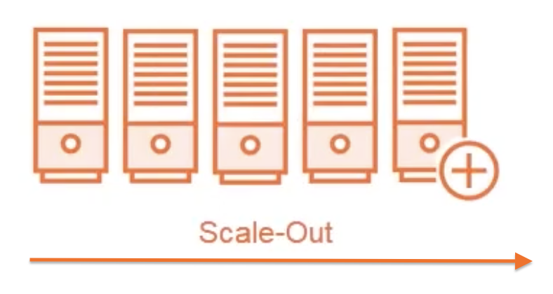 |
| :----------------------------------------------------------------------------------------------------------------: | :---------------------------------------------------------------------------------------------------------------: |
|                                                                                                                    |                                                                                                                   |

Quand se n'est plus possible de monter en puissance (`scale up`) on doit multiplier les machines (`scale out`).

`NoSQL` permet un `scale-out`

### No schema : Variety

Les données sont hétérogènes.

### Haute disponibilité, cohérence, résilience : Velocity

La vélocité est la mesure

Le `NoSQL` permet un accès rapide aux données.

## Qu'est qu'une DB `NoSQL` ?

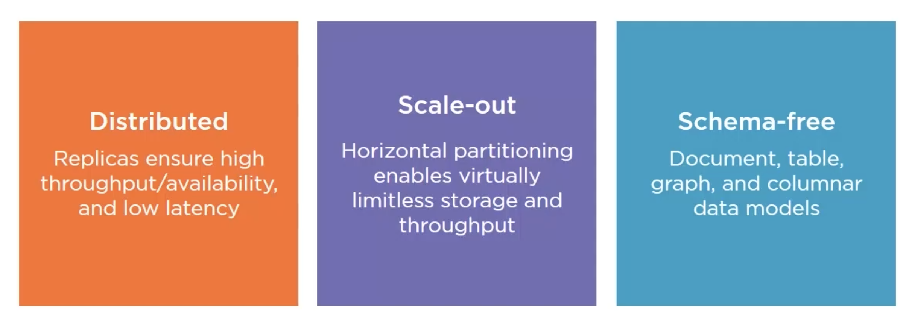

**Distribué** : La réplication des données permet un haut débit (`throughput`), une grande disponibilité et peu de latence.

**mise à l'échelle horizontale** (`scale-out`) : le partitionnement horizontal permet virtuellement de n'avoir aucune limites de stockage et de débit.

**Sans schéma** : La structure des données n'est pas figée.

## Qu'est que `Cosmos DB` ?

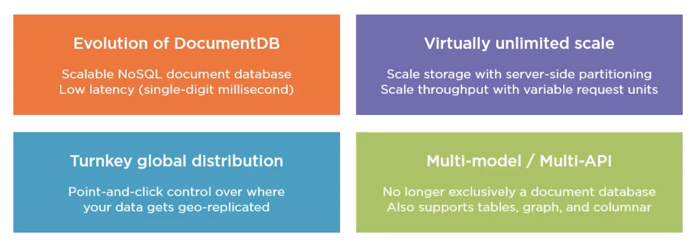

`Cosmos DB` est une évolution de `DocumentDB`.

Elle peut être distribuée mondialement et est multi-model.

## Get Started


## Créer un compte `Cosmos DB`

Via Azure.

### `Basics`

- Création d'une ressource
- Utilisation du `notebook` (pas dispo partout)
- `Account Type` n'a pas de conséquence en soi, juste une différence au niveau de l'UI
  On peut laisser à `Non-Production`

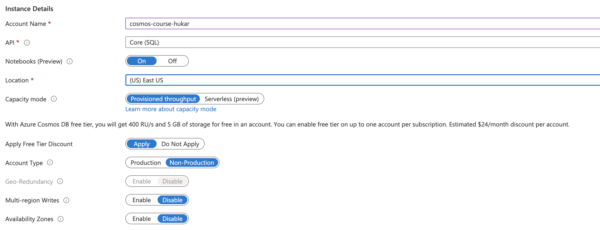

### `Networking`

`Private end point` : seulement accessible dans un `virtual network`.

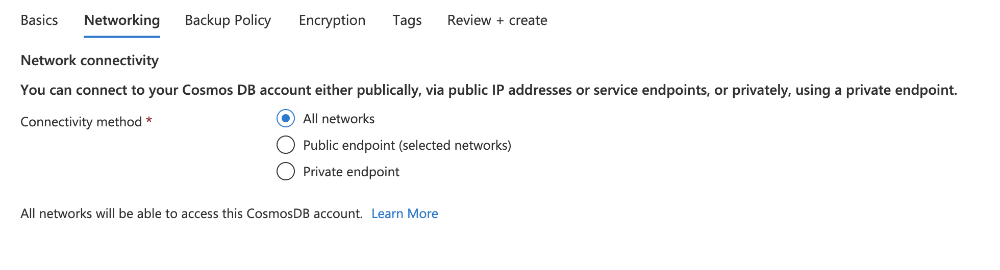

Je laisse tout le reste par défaut et on lance la création (≃ 10mn)

### `Keys`

On trouve ses `keys` de connexion ici :

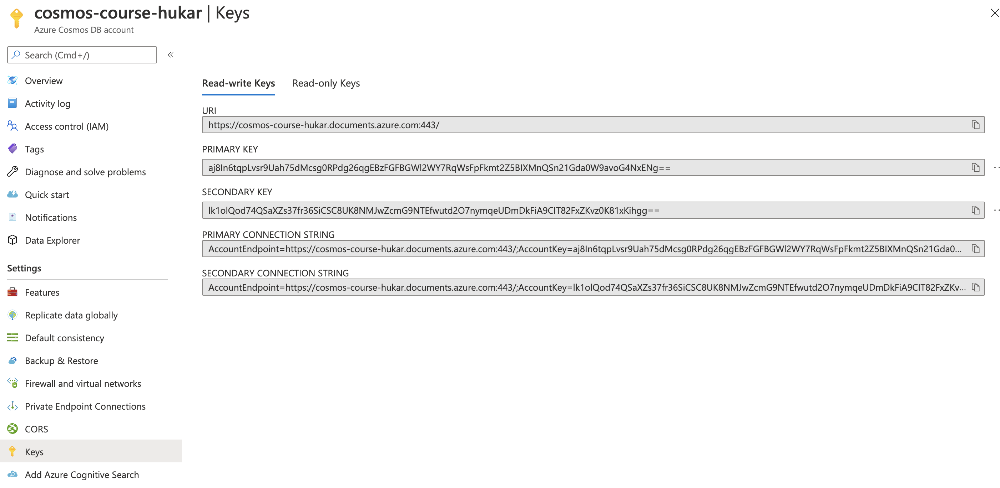

En générale on utilise seulement la clé `primary`, dans une stratégie de sécurité on peut vouloir faire tourner les clés `primary` et `secondary` à interval régulier.
Les clés doivent restés secrètes.

La version `read-only` de ces clés ne donne accès qu'en lecture à la `db`.

## Créer un `container`

On va dans le `data-explorer`, on peut se mettre en plein écran :

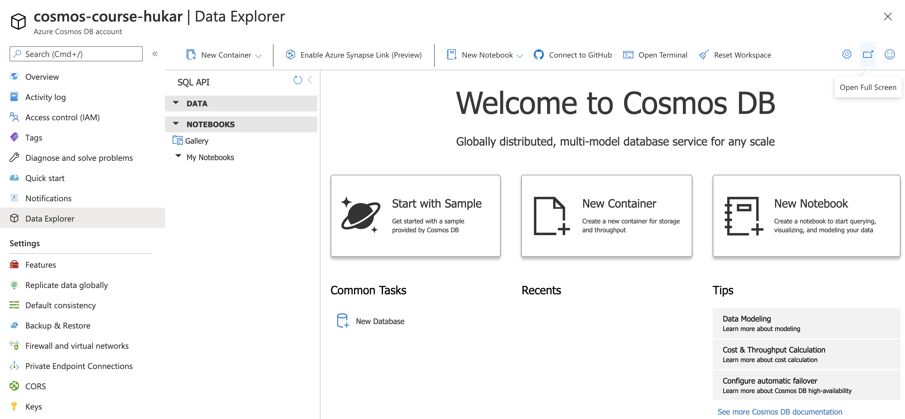

Cela ouvre un nouvel onglet

On crée un `container`, un `container` peut contenir des données de différents types et de différentes structures (`schema`).

Par contre la `Partition Key` doit être la même.

Dé-sélectionner `Provision database throughput` permet de gérer le débit par `container` et non pas pour la base de données entière.

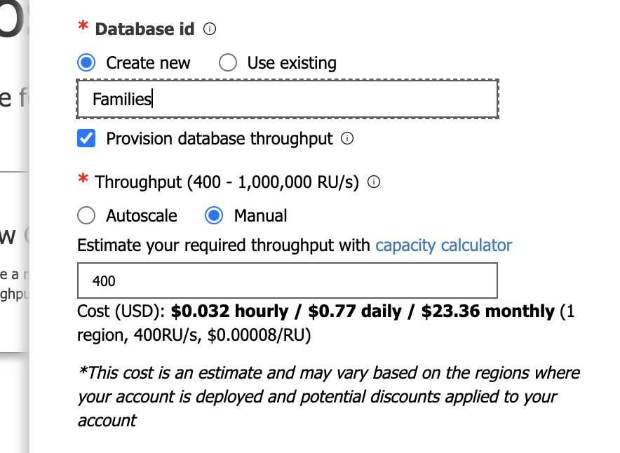


Après :

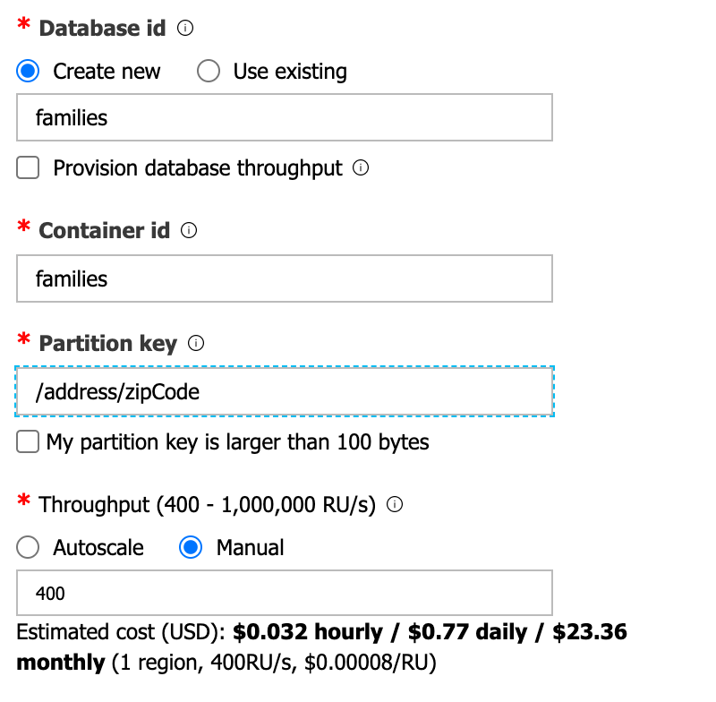

On voit que lee `throughput` est maintenant appliqué au `container`

Une Base de données peut contenir plusieurs `container`.

Ce qui différencie les `container` entre eux, c'est le débit (`throughput`) et la `partition key`.

### Pourquoi créer un nouveau `container` ?

Si on doit définir une nouvelle `partition key` ou si on souhaite un débit différent des `container` déjà existant.

## Créer un document

`item` et `document` sont des termes synonymes.

```json
{
  "familyName": "Snugg",
  "address": {
    "addressLine": "67642 Merry",
    "city": "Fort Worth",
    "state": "Texas",
    "zipCode": "76178"
  },
  "parents": ["Lotta", "Quill", "Evan", "Samuele", "Malachi"],
  "kids": ["Patten", "Raynor", "Jade"]
}
```

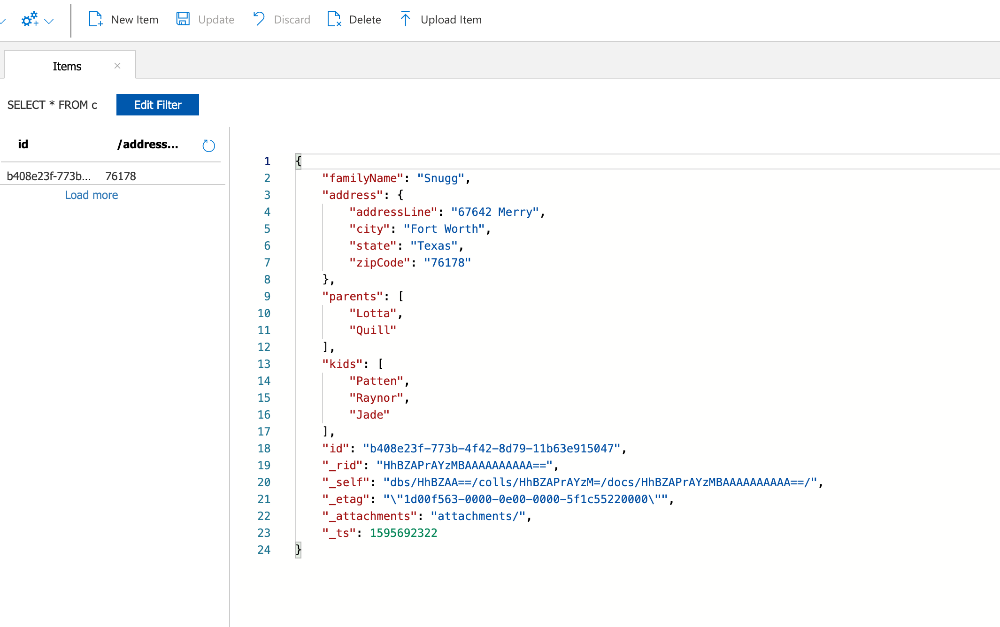

Si on ne fournit pas d'`id`, celui-ci est créé automatiquement.

### Pas de schema

Un nouvel item peut très bien avoir un nouveau champ : `pets`.


On peut aussi ajouter des `item` sans `zipCode`, qu'elle est la conséquence ??


## Exécuter une requête


On clique sur le bouton `new SQL query`.

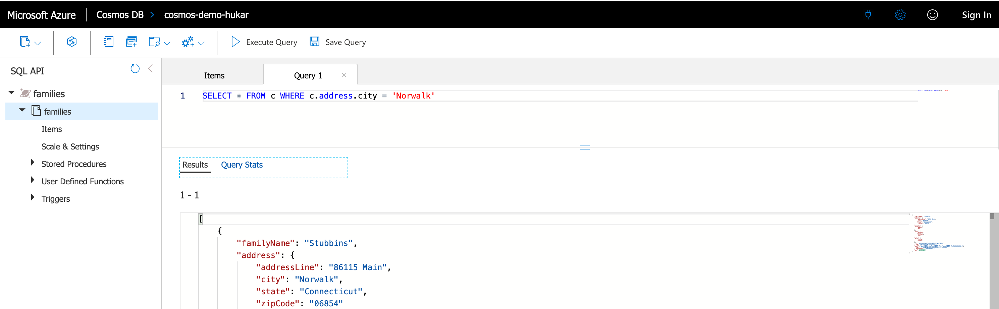

```sql
SELECT * FROM c WHERE c.address.city = 'Norwalk'
```

La requête renvoie un `item`.

### `IS_DEFINED`

```sql
SELECT * FROM c WHERE IS_DEFINED(c.pets)
```

renvoie les `items` où la propriété `pets` est définie.

### `ARRAY_LENGTH`

```sql
SELECT * FROM c WHERE ARRAY_LENGTH(c.kids) > 2
```

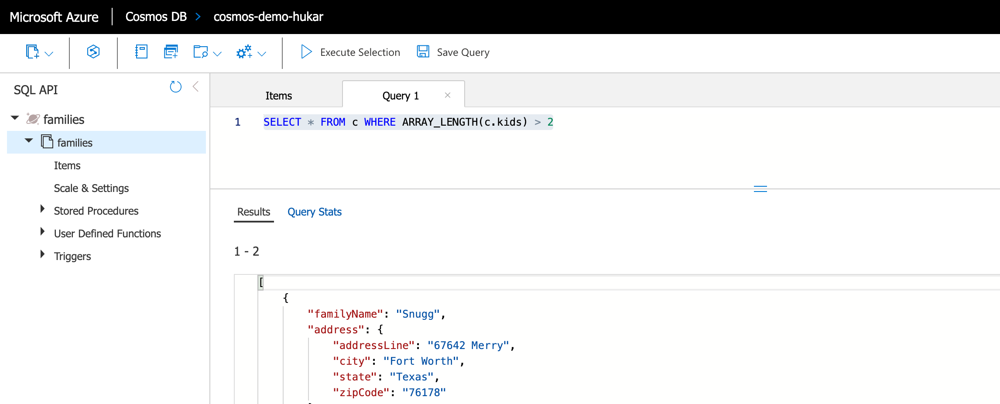

Deux `items` ont plus de deux `kids`.

Les requêtes portant sur des `items` avec des `zipCode` différents sont dites `cross-partition` car le `zipCode` est une `partition key`.


## Notebook

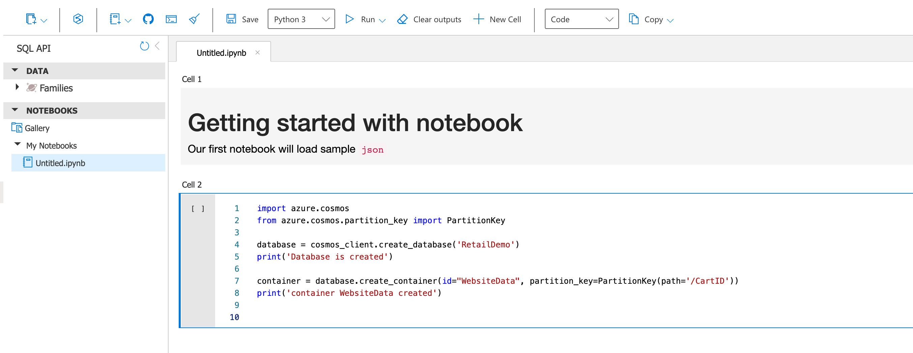

L'interface `Azure` propose un `Notebook` pour interagir avec CosmoDB.

Les langages disponibles sont `python` et `c#`.

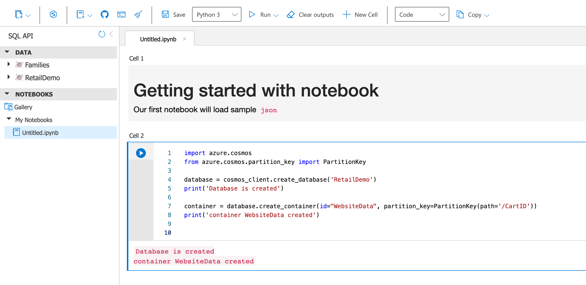

On voit que la `database` et le `container` sont bien créer.

### `%%upload`

Méthode magique pour télécharger des données depuis un fichier `json` :

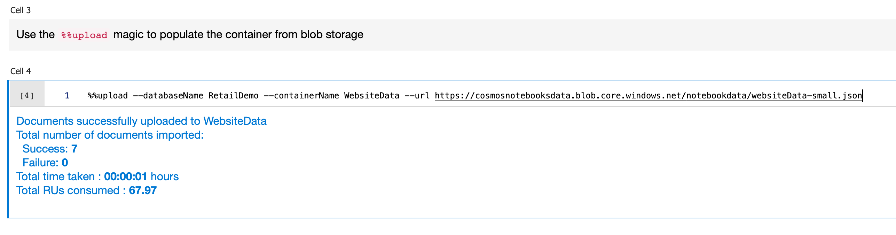

```
%%upload --databaseName RetailDemo --containerName WebsiteData --url https://cosmosnotebooksdata.blob.core.windows.net/notebookdata/websiteData-small.json
```

Voici les données :

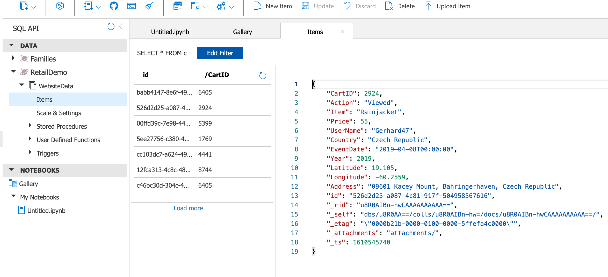

### `%%sql`

Une méthode magique pour effectuer des requêtes :

```
%%sql --database RetailDemo --container WebsiteData
SELECT c.Action, c.Price AS Revenue, c.Country, c.Item FROM c WHERE c.CartID = 2924
```

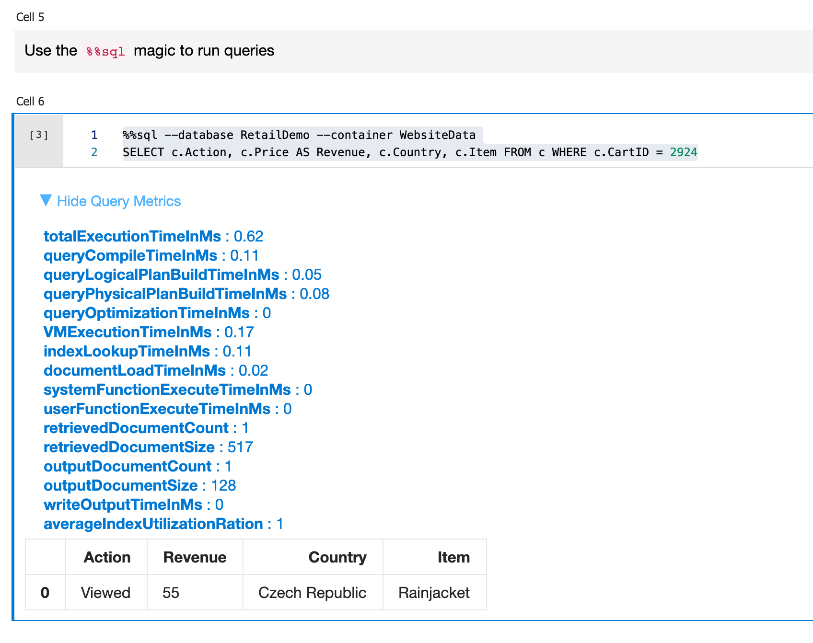

Ajouter un `item` à un `container` :

```python
wakefield = {
	"id": "WakefieldFamily",
	"parents": [
		{
			"familyName": "Wakefield",
			"givenName": "Robin"
		},
		{
			"familyName": "Miller",
			"givenName": "Ben"
		}
	],
	"children": [ ... ]
		}
}

families.create_item(body=wakefield)
print('Created Wakefield document')
```


## Multi Model

`SQL APi` est l'`api core` de `cosmos db`.

Les autres `api` ont été conçu par compatibilité avec des technologies existantes (sauf `Gremlin API`).

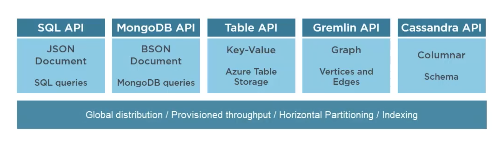

Derrière les données sont représentées en `Atom Record Sequence` : `ARS` , une technologie Microsoft agnostique à l'`api` choisie et utilisant des paires `key/value`.


Normalement on ne peut pas switcher d'une `api` à l'autre.

Cependant il y a une exception, on peu switcher entre `SQL api` et `Gremlin api` car cette dernière utilise une forme de `json` pour stocker ses relations : `GraphSon`.


## Automatic Index

`Cosmos DB` indexe automatiquement toutes les propriétés dans tous les `items`.

On appelle aussi ce procédé `inverted indexing`.

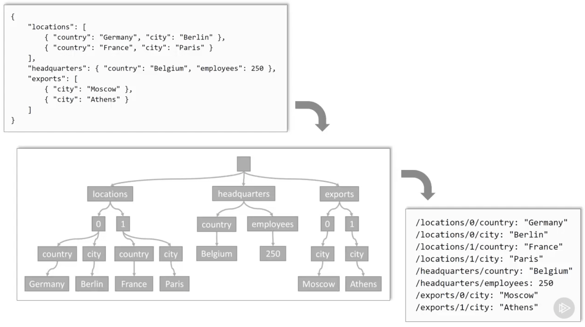

___

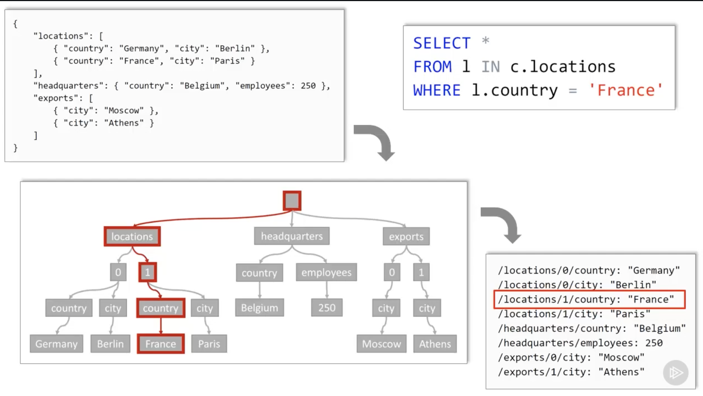

Le `json` est transformé (parser) en arbre, les tableaux sont représenté juste avec un index numérique.

Chaque valeur est associée à son chemin dans l'arbre.

Le chemin est donc l'`index` permettant de retrouver une valeur, on obtient une liste `index/valeur`.

