# 02 Le débit : `throughput`

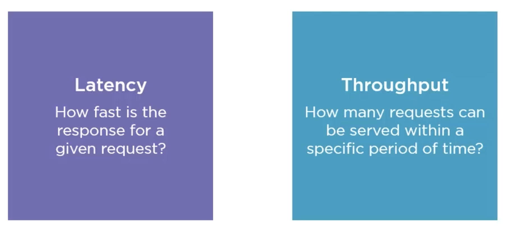

### La latence

Combien de temps doit on attendre entre la requête et la réponse.

### Le débit

Le nombre de requête par seconde que la DB peut gérer.

## `RU` : Request Unit

C'est l'unité de mesure du débit.

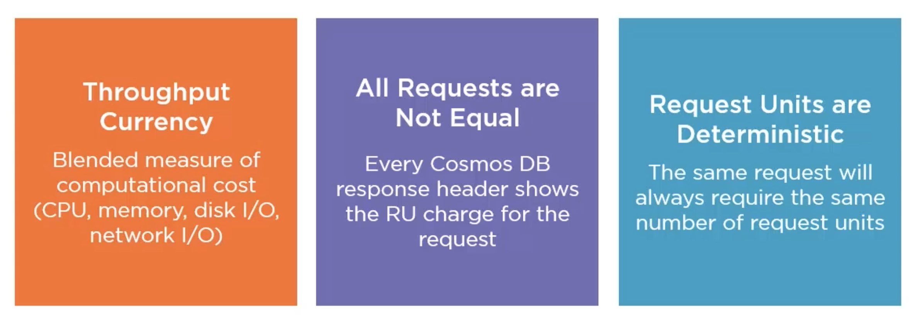

Les `RU` mesure le coût d'une requête en tenant compte des divers facteurs hardware.

Toutes les requêtes n'ont pas le même prix, une écriture est plus chère qu'une lecture car implique plus de serveurs par exemple.

Une même requête coutera toujours un même nombre de `RU`, Les `Request Units` sont déterministes.

## Réserver des `RU`

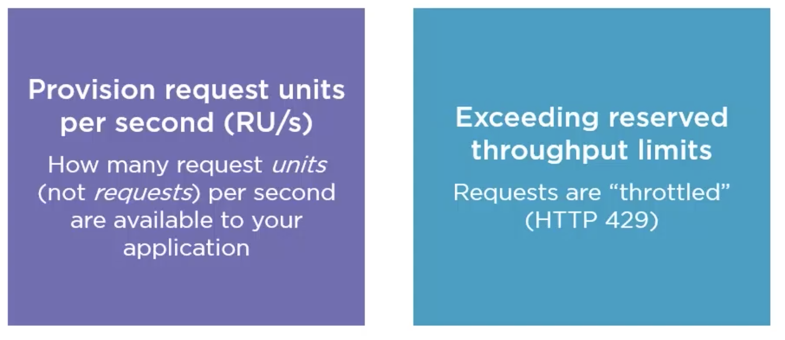

On réserve des `Request Units` pour un `container`.

Si on dépasse notre réserve de débit, nos requêtes arrivent dans un goulot d'étranglement et une requête de rejet nous est adressée `HTTP 429` : `Too many request`.

Une stratégie de ré-envoie peut être implémentée.

## Observer la consommation en `Request Units`

On peut facilement savoir combien de `RU` sont dépensés par une requête dans l'interface de `Cosmos DB` :

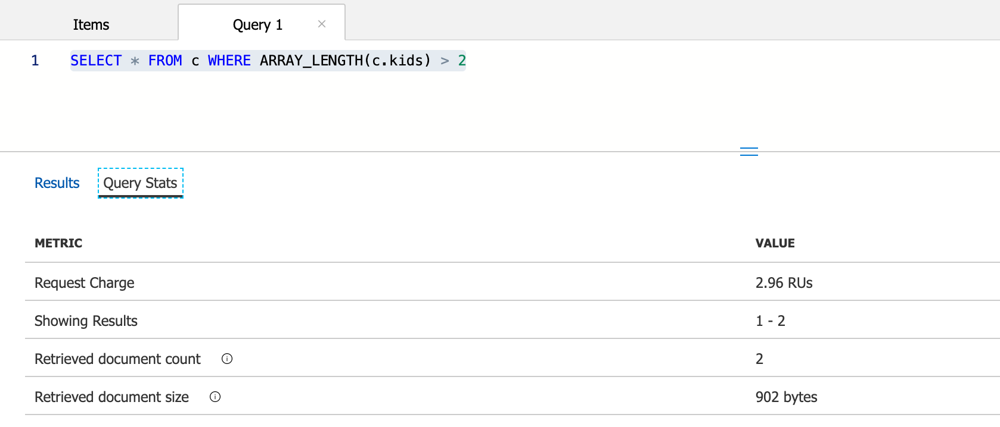

On voit ici `2.96 RUs`.

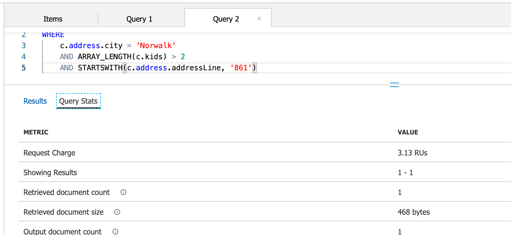

Maintenant `3.13 RUs` pour requête plus complexes.

On peut le savoir programmatiquement grace au `sdk` (ici en `dotnet`)

```c#
var result = await container.CreateItemAsync(document, new PartitionKey(document.address.zipCode));
var consumdRUs = result.RequestCharge
```

### `result.RequestCharge`

Ce sera certainement très proche dans `Node js`.

Dans le portail on a accès à toutes les infos dans `Metrics` :

> **update** maintenant on trouve cet écran dans `Metrics (Classic)` , `Metrics` étant paramétrable.

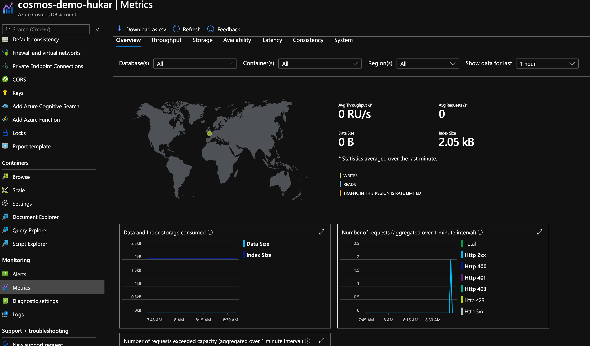

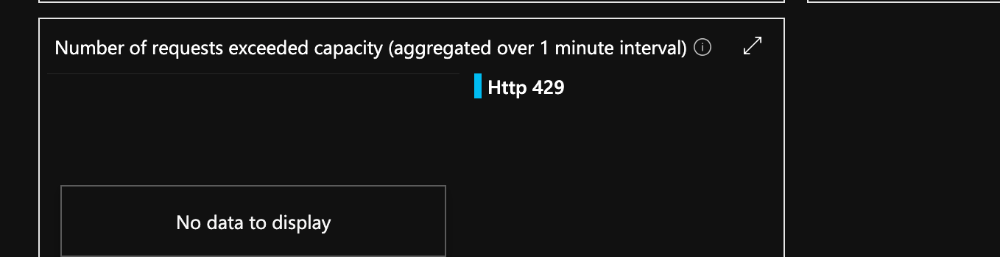

Tout en bas on peut voire `Number of request exceed capacity Http 429`, cela peut nous permettre de savoir s'il faut gérer ce cas de figure et/ou ajouter du débit.

### Nouvel interface `Metrics`

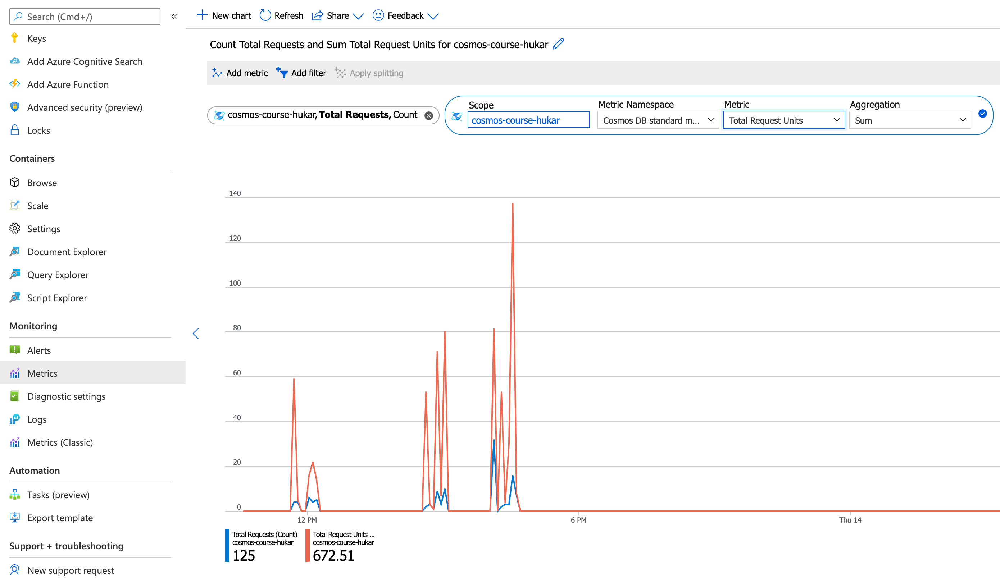


## `HTTP 429 Too Many Requests`

Si on dépasse le `throughput` alloué, une erreur `HTTP 429` est levée.

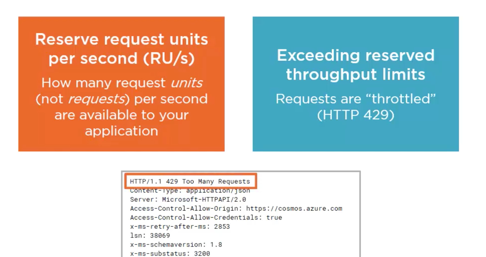

`x-ms-retry-after-ms: 2853` indique le temps en milliseconde avant que la requête soit relancée automatiquement.

Une conception judicieuse de sa `DB` peut éviter des surcoûts et un effet de `throttling` lorsque l'approvisionnement est dépassé.

### Gestion programmatique

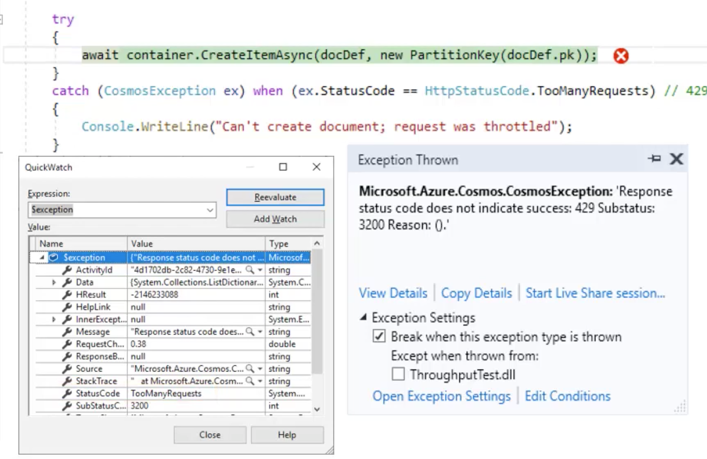

```c#
try
{
  await container.createItemAsync(docDef, new PartitionKey(docDef.pk));
}
catch(CosmosException ex) when (ex.StatusCode == HttpStatusCode.TooManyRequests) // 429
{
  Console.WriteLine("Can't create document, request was throttled")
}
```

On peut renvoyer la requête, le `SDK .net` a déjà ré-essayer d'envoyer la requête avant de lancer l'exception.

## Outil : `Fiddler Everywhere`

Pour observer les requêtes.

On peut voire que Azure relance automatiquement la requête `Cosmos DB` avant d'envoyer une erreur `429`.


## Les offres de débit (`throughput`)

### 1. Provisioned Throughput (manual) : manuellement

Quand on a un débit prévisible :

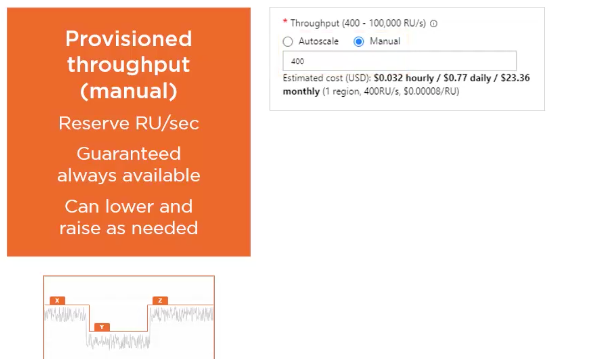

Il suffit d'ajuster manuellement son débit à la densité de la période :

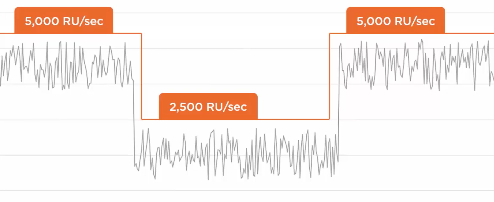

Pour cela il faut pouvoir prédire les périodes

### 2. Provisioned Throughput (auto-scale) : mise à l'échelle automatique

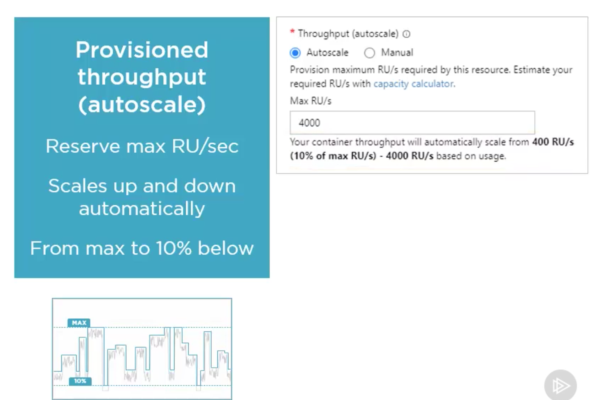

Ce service est plus cher par `RU` que la version `manual`.

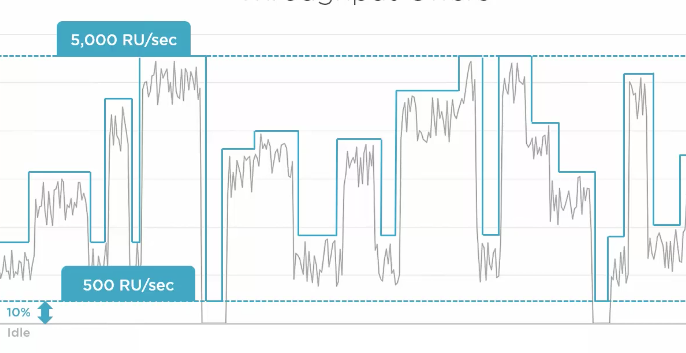

### 3. Serverless

On ne paye que les `RU` dépensés au moment où ils sont utilisés.

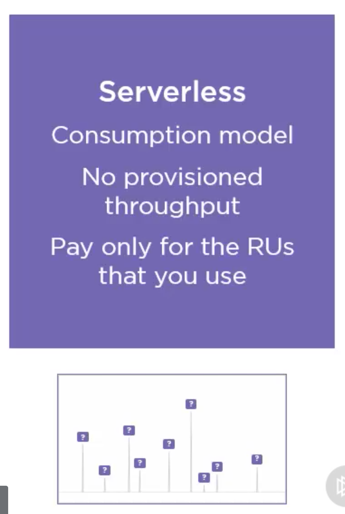


Avec ce système on ne paye que ce qu'on consomme.


## Approvisionner le débit de la DB


On peut approvisionner :

- chaque `container` indépendamment.
- La base de données qui partagera son débit entre les différents `container`.
- Un mix des deux, en sachant que l'approvisionnement d'un `container` override celui de la `DB`.


`provision database throughput` n'est pas coché.

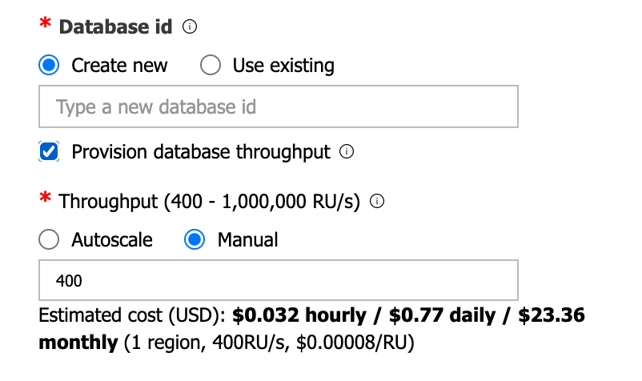

Ici on approvisionne le `container` indépendamment de la `DB`.


## Approvisionner le débit

3 scénario sont possible :

### Approvisonner `container` par `container`

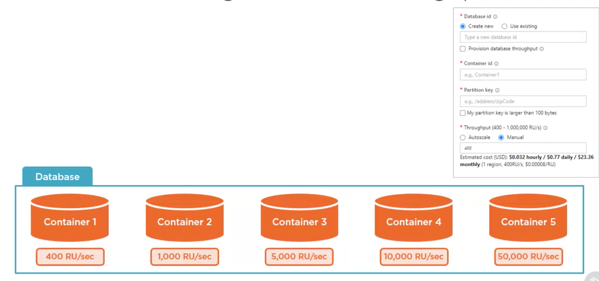

C'est la solution la plus courante.

### Approvisionner la `database`

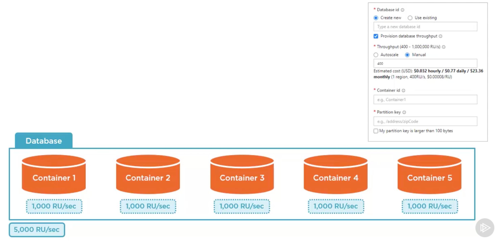

Le débit (`throughput`) est divisé également (? ou pas justement : par exemple 100RU sur un et 2000RU sur un autre si nécessaire ?) entre les `container`.

- Pour des raisons de migration d'application.
- Quand on a différentes clés de partition.

### Mix des deux stratégies

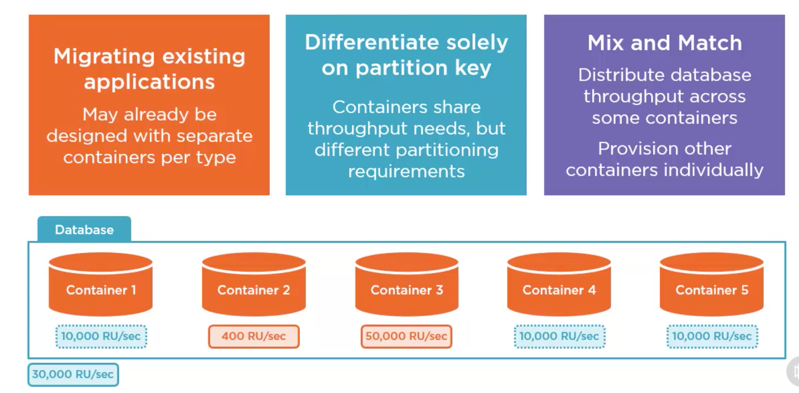


## Établir les coûts

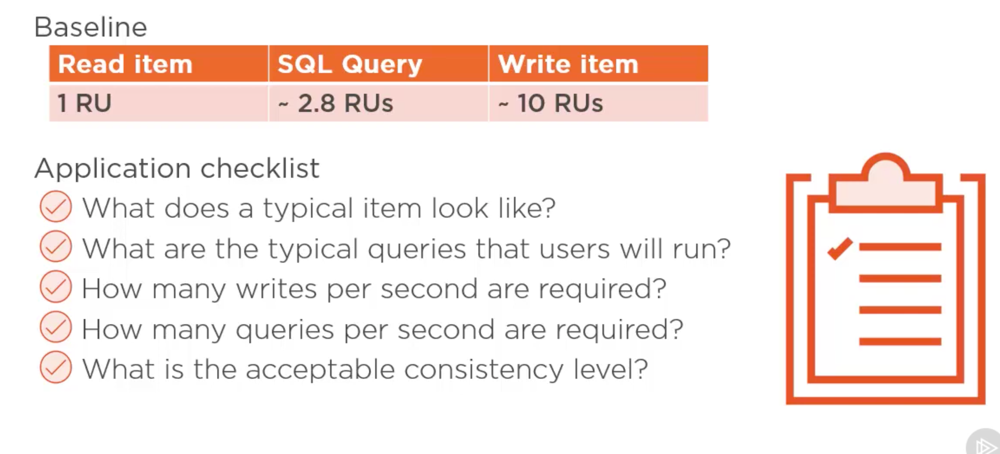

De manière générale, les lectures coûtent moins que les écritures et plus une requête est complexe, plus elle coûte.

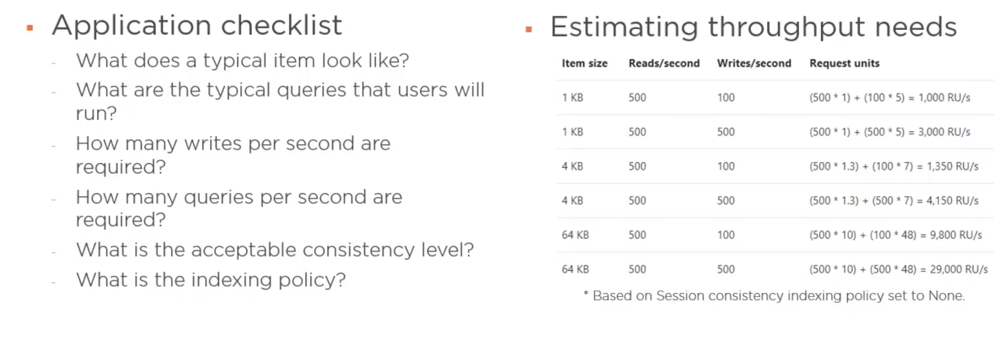

Une estimation des coûts peut être réalisée en listant les requêtes et les items, en évaluant le nombre d'écriture et de lectures par seconde et en choisissant la politique d'indexation et de cohérence (`consistency`).

## Capacity calculator

https://cosmos.azure.com/capacitycalculator/

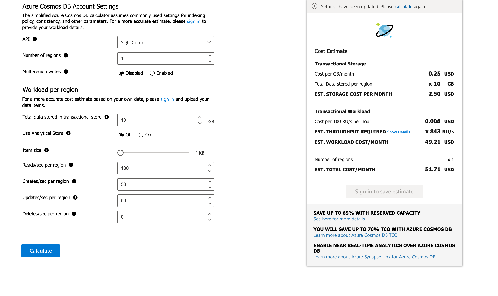

## Le prix

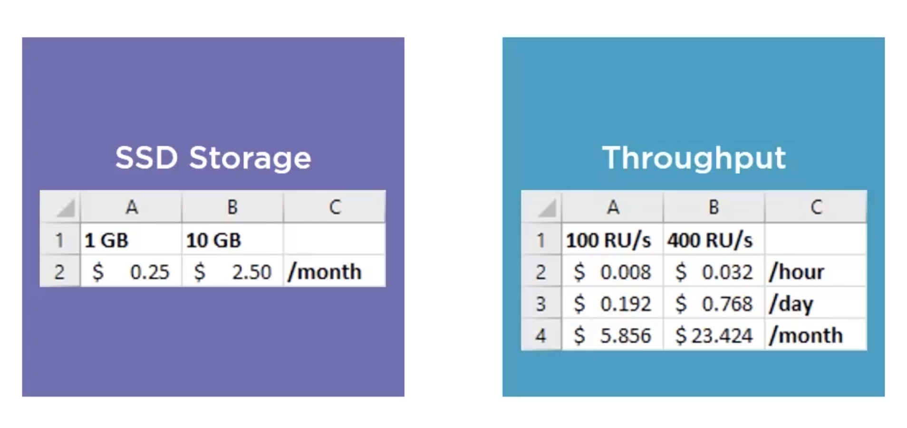

Le `storage` est facturé mensuellement. Le prix est fixé à la consommation.

Pour le `throughput` le prix est fixé à la réservation. Il est facturé à l'heure (si on le change manuellement par exemple ou en auto-scaling).

Le minimum est donc `24$`.

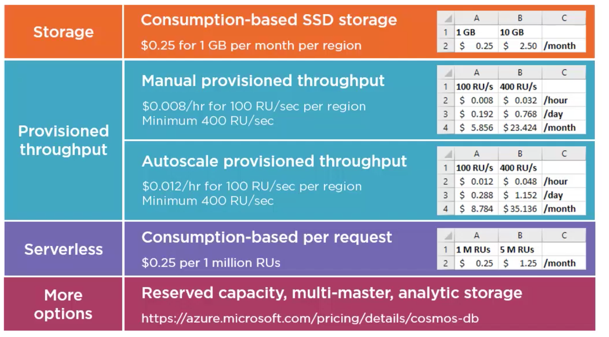

Il est clair que pour un petit projet, `serverless` est le plus adapté.

