# 03 Horizontal Partitioning

## Mise à l'échelle élastique

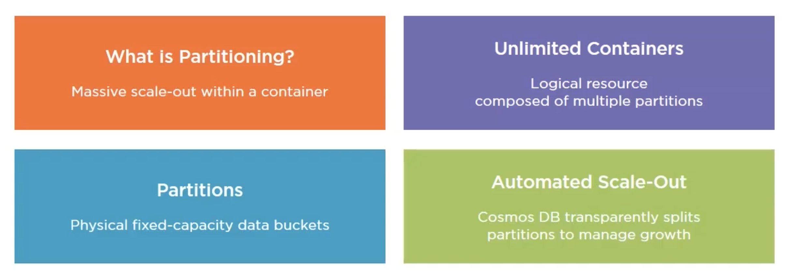

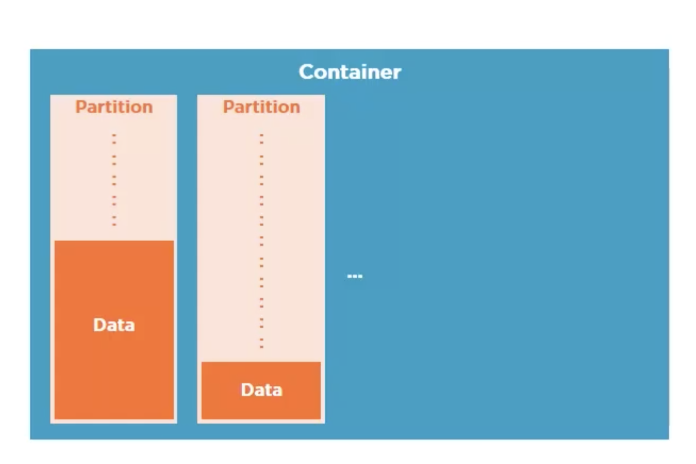

Quand une partition est remplie dans un `container`, **Cosmos DB** en crée une nouvelle automatiquement.

Un `container` logique est reparti sur plusieurs `partition`  physiques. Il est aussi dupliqué sur au moins 4 `replicas` pour garantir une haute disponibilité des données.

Comment ces données sont réparties entre les différentes partitions ? `partition Key`.

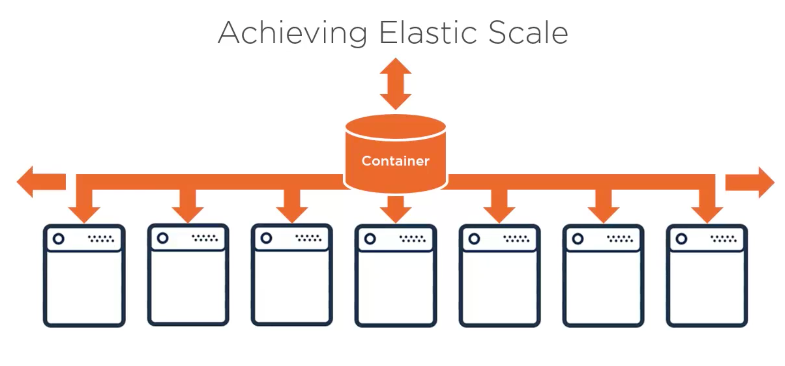

La conséquence est d'avoir un `storage` et un `throughput` illimité :


## `partition` logique

Toutes les données d'une `partition` logique sont sur une même `partition` physique.

Alors que les `partition` physique sont gérées de manière transparente pour l'utilisateur, les `partitions` logique sont créé à l'aide de la `partition key`.

Cette `partition key` formée d'un ou plusieurs champs des documents, permet de ranger les documents ensemble.

Si on utilise le `username` comme `partition key` on pourrait avoir :

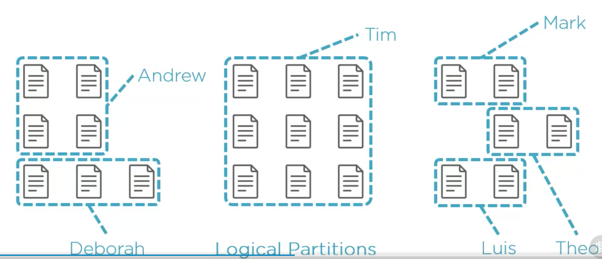

Ces `partitions` logiques sont elles-même dispatchées sur des `partitions` physiques.

### Un document ne peut excéder `2 MB`

C'est une limite qui nous dit quand on doit créer un deuxième document au lieu d'encapsuler toujours plus de données dans un seul.

### Une `partition` logique ne peut excéder `20 GB`

Il vaut mieux alors que la `partition key` prenne une large étendue de valeurs, pour avoir beaucoup de `partitions` logiques de petite taille.

Ainsi le `container` peut se mettre à l'échelle indéfiniment.

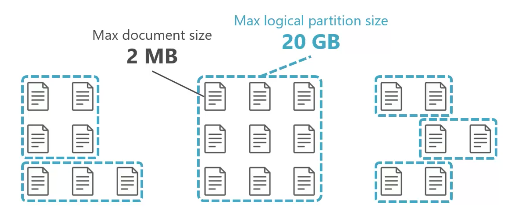


`Cosmos DB` ajoute automatiquement, sans interruption et instantanément une `partition` physique pour répartir les `partions` logique si nécessaire

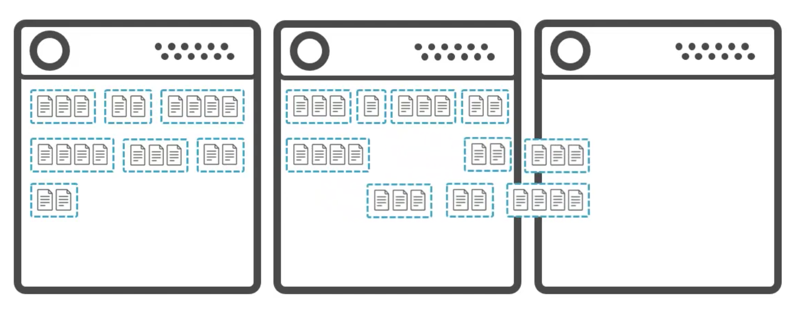

## `hot partition`

Si la `partition key` est mal choisie, on peut avoir une partition logique qui se remplie plus vite que les autres. Cela crée une `hot partition`.

En fait le `throughput` global est partagé entre les `partition` physique, ce qui a comme conséquence un étranglement du `throughput` en cas de `hot partition`.

Par exemple si on a un `throughput` de `5000RUs/s` pour le `container`, si on attaque une seule `partition` physique, le `throughput` réel sera alors `700RUs/s`. 

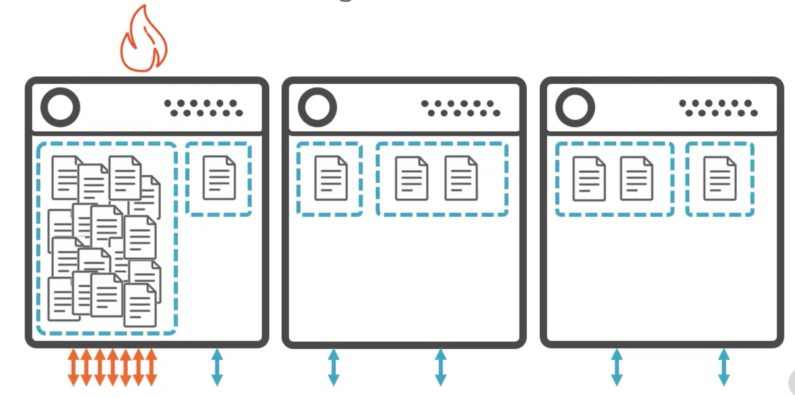

À la place, on veut une `partition key` permettant une répartition uniforme des documents.

La répartition doit-être pensée en terme de stockage mais aussi de débit.

Si on prends la date du jour comme `partition key`, la répartition sera bonne, mais le débit ne sera pas uniforme car il est probable que seul les plus récent documents soit demandés (news) :


On a de nouveau une `hot partition`, plus sur le `storage` mais sur le `throughput`.

Le choix du nom comme `partition key` permet une bonne répartition en terme de `storage` et de `throughput` dans le cadre d'une application sociale :

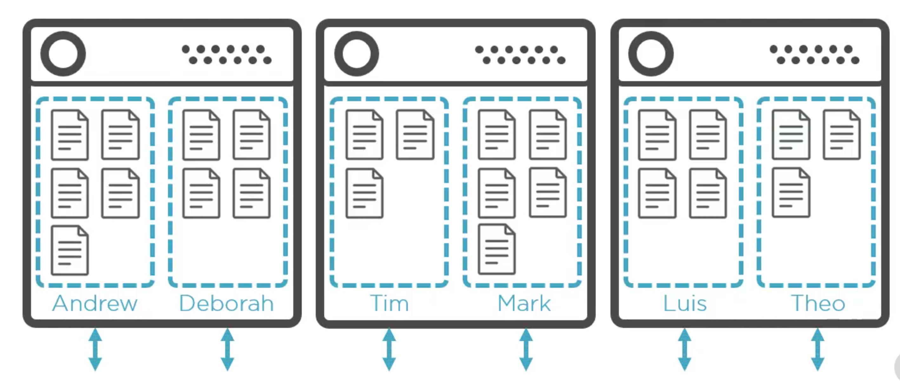

## Choisir une `partition key`

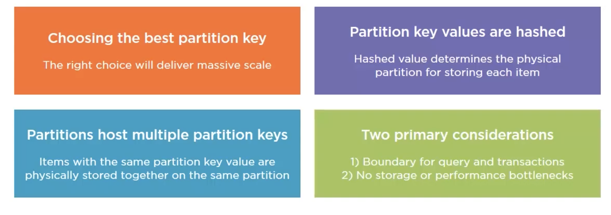

#### ! Un choix judicieux permettra une mise à l'échelle très grande, un coût plus bas (`cross query`) et une vitesse plus grande (meilleur distribution du `throughput`).

Les `items` doivent pouvoir se répartir correctement avec une bonne `partition key`.

Une `partition` réunis physiquement tous les `items` de même valeur de `partition key`.

Une partition est une limite pour les procédures stockées.

Il faut éviter les goulot d'étranglement pour le stockage et les performances => repartition uniforme des `items` dans les partitions.

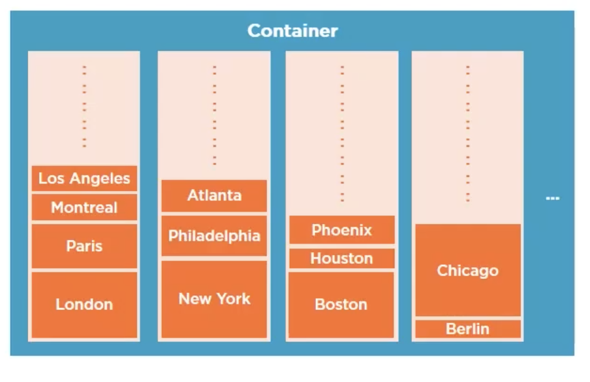

Ici le choix de la ville comme `partition key` n'est pas forcement judicieux, car il y a des grosses villes et des petites villes.

Le code postal (`zipCode`) serait un choix plus judicieux au niveau de la repartition des données.

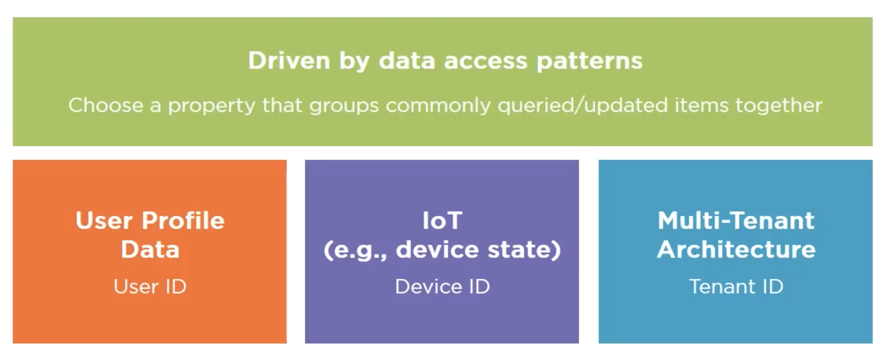

Une requête sera toujours plus efficace si elle n'impact qu'une partition (une machine physique).

La `partition key` doit être choisie en fonction des requêtes les plus courantes.

Pour un réseau social l'`userID` peut être un choix judicieux pour récupérer tous les `posts` de quelqu'un.

### Choisir la date de création : mauvaise idée


la répartition des données est bonne, mais par contre toutes les écritures se font sur la même partition => `hot partition`.

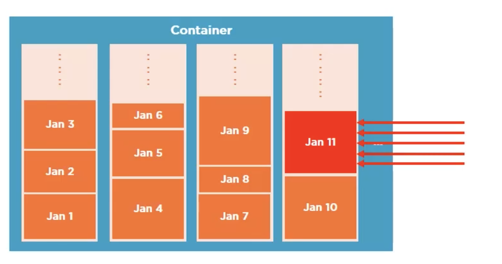

Si on a `400 RUs` de débit pour un `container`, celui-ci est distribué uniformément entre toutes les partitions.

Si on a dix partitions, le débit (`throughput`) est donc de `40RUs` , avec la **date de création** comme `partition key` on risue de vite dépasser le `throughput` alloué.

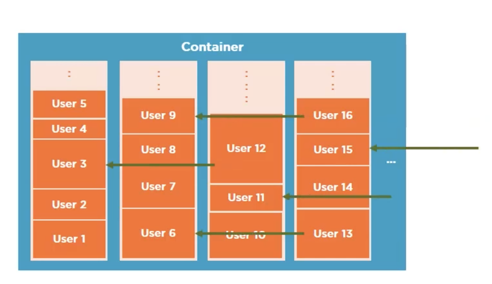

Avec `UserId` comme `partition key` les écritures sont uniformément réparties.

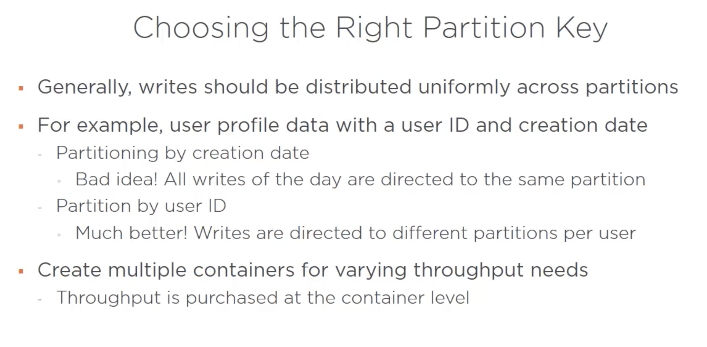

## Résolution de problème

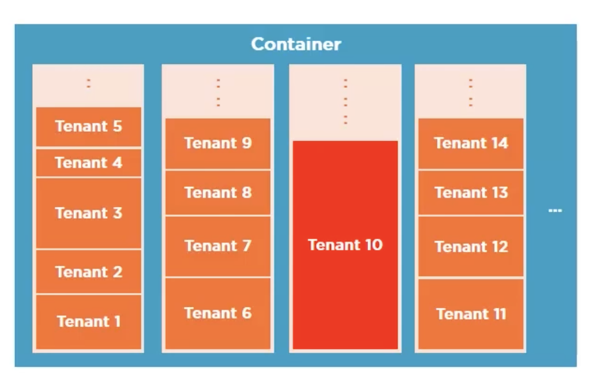

Il est possible qu'un habitant (`tenant`) est plus de données que les autres, par exemple une grosse compagnie.

On peut alors dédier un container spécialement à ce `tenant 10` et organiser les partitions avec une autre `partition key`.

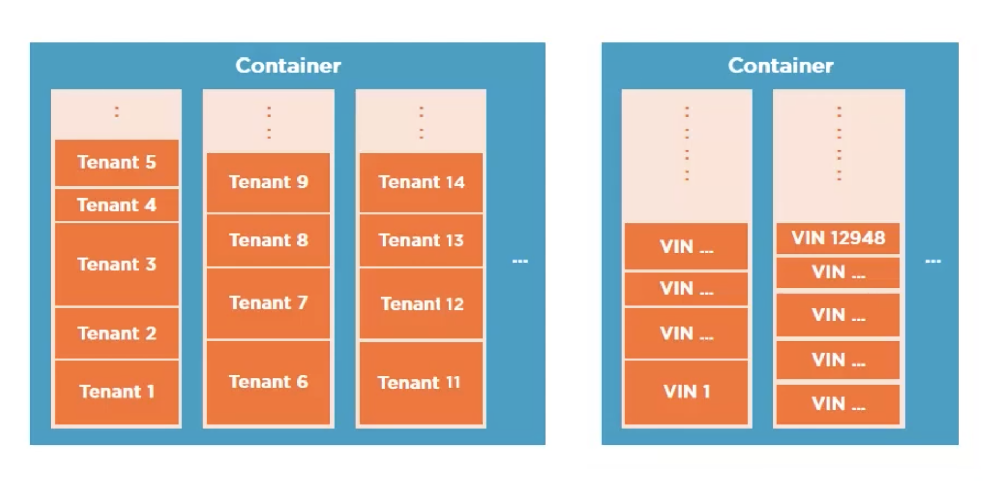

ce `container` possède alors son propre débit (`throughput`).

## Cross Partition Query

### `Single partition query`

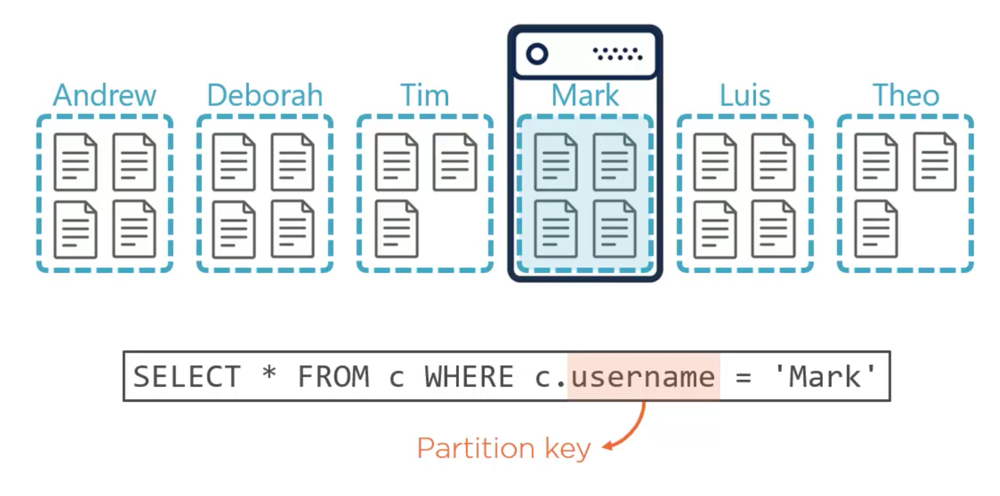

Une `query` exécutée sur une même `partition` logique est peu coûteuse en terme de `RU`.

Voici une requête faite sur la même `partition key` : `location/state`.

```sql
SELECT * FROM c WHERE c.location.state = "NY"
```

Elle me renvoie deux documents et coûte `2.87RUs`

Maintenant une requête `cross-partition` :

```sql
SELECT * FROM c WHERE ARRAY_LENGTH(c.children) = 2
```

Dans ce cas la requête renvoie aussi deux documents mais son coût est de `3RUs`

### `cross-partition query`

Elle sont parfois inévitable, mais un bon ratio serait `80%` de `single partition query` pour `20%` de `cross-partition query`.

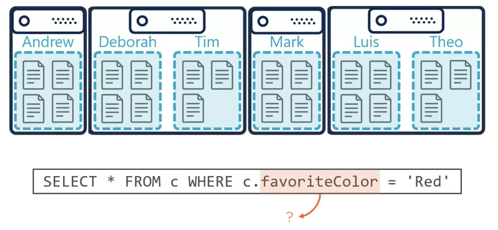

### Utiliser un sous-ensemble de `partition`

Pour éviter le surcoût d'une `cross-partition query`, on peut utiliser l'opérateur `IN` :

#### Pas bien

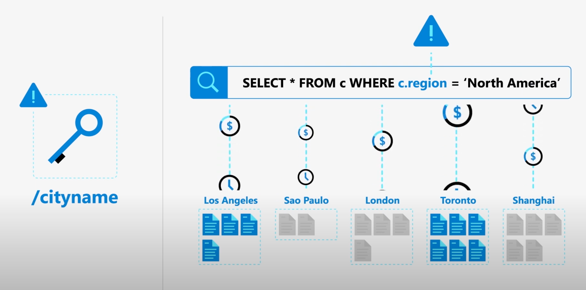

#### Bien

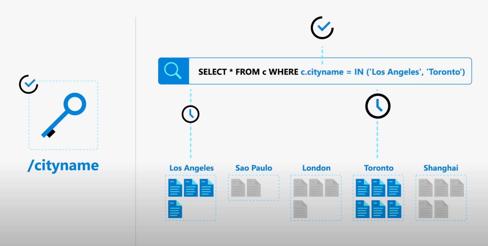

#### ! de manière générale, il faut essayer d'utiliser sa `partion key` dans la pluspart des requêtes

## Définir sa `partition key`

Comprendre comment ses données sont demandées permet de choisir la bonne `partition key`.

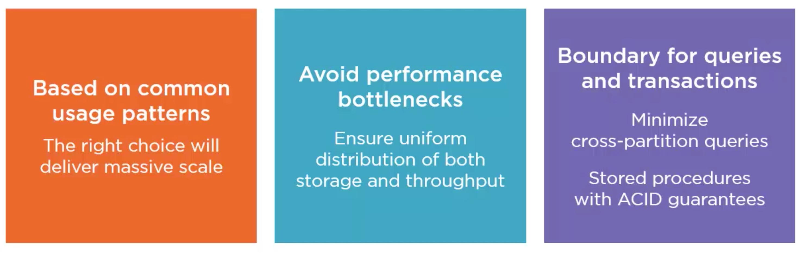

- Il faut la choisir en fonction des usages fréquents.
- elle doit garantir une bonne répartition du `storage` et du `throughput`.
- elle définit les limites pour les requêtes et les `transactions` : procédure stockées.

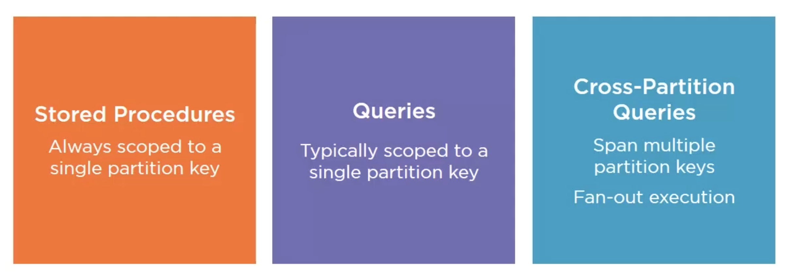

`fan-out execution` : déployer l'exécution.

Une requête Cross-Partition sera exécuté à travers plusieurs machines physique, elle sera donc plus coûteuse qu'une requête sur une même partition.


## Pattern de partitionnement communs

### Utiliser l'`id`.

Si on doit lire ou écrire un document à la fois, cela peut être un bon pattern.

Ici on a une `partition` / `document`.

Pour de l'`iot` où chaque document représente une machine et son état, et que cet état est mis très régulièrement à jour par les capteurs, cela va bien convenir :

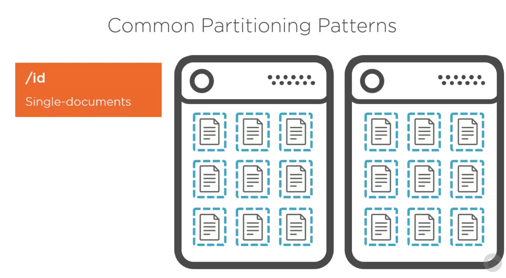

Bien entendu si on doit modifier ou consulter plusieurs documents en même temps, c'est une mauvaise idée que de choisir l'`Id` comme `partion key`.

### Utiliser le `type`

Un avion et tous ses documents, un aéroport, une catégorie de produit, un département.

On défini une liste de recherche : `lookup list`

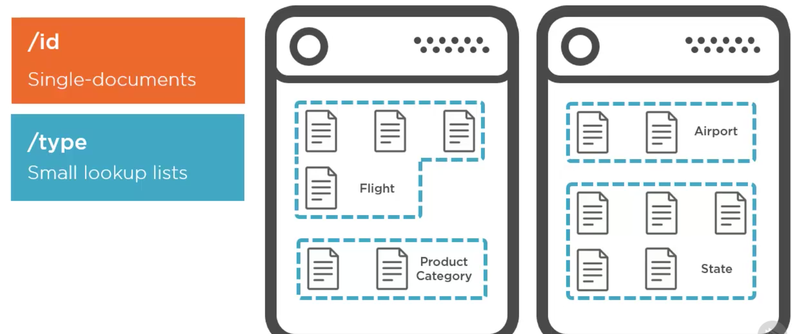

### Autre scénario

Pour un e-commerce on peut utiliser le `customerId` comme `partition key`.

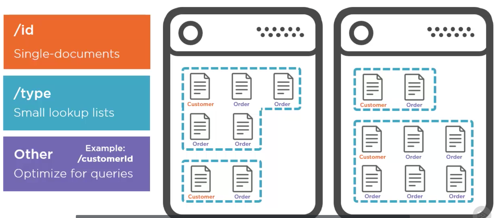

Pour `eprolex` le `representativeId` serait certainement le bon choix.

Comme `Cosmos DB` est `schema-free`, on peut enregistrer des documents très différents sur la même `partition key`.


## Changer de `partition key`

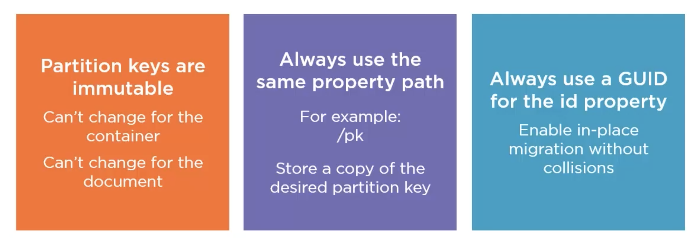

La `partition key ` ne peut pas être changée.

Il est donc préférable de créer une propriété `pk` avec une copie de la valeur de la `partition key` réel choisie.

Deux documents peuvent avoir le même `id` à partir du moment où il sont dans deux `partitions` logiques différentes.

C'est la combinaison de l'`id` et de la `partition key` qui doit être unique.

Cependant Il vaut mieux toujours utiliser un `guid` comme propriété `id` pour éviter les collisions en cas de migration sur place.
