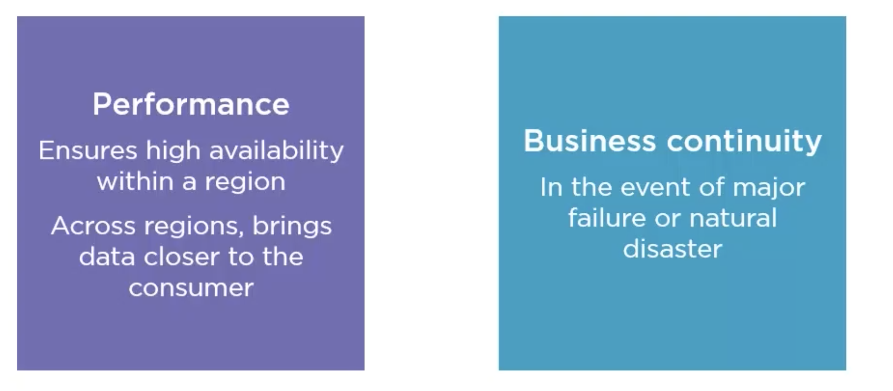
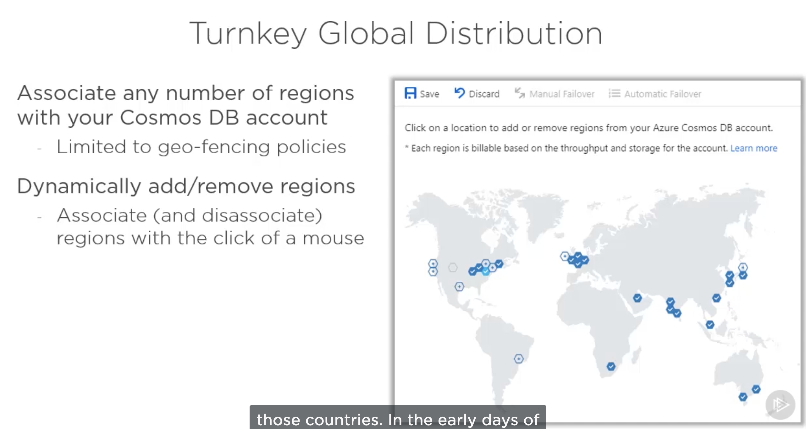
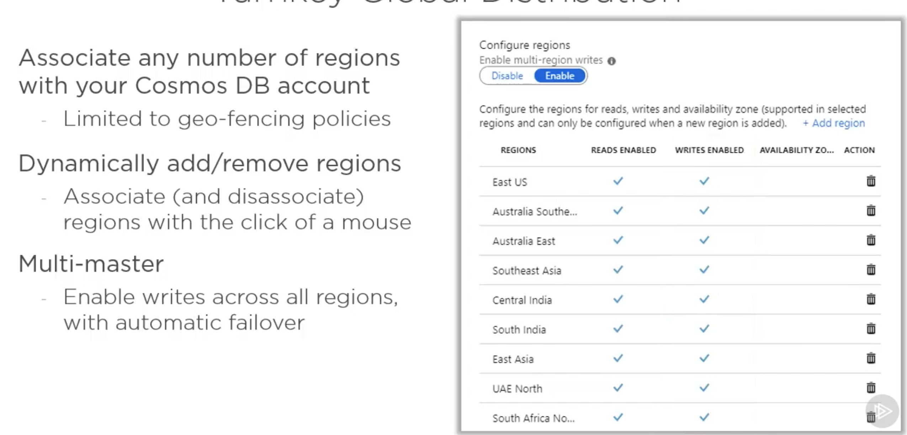
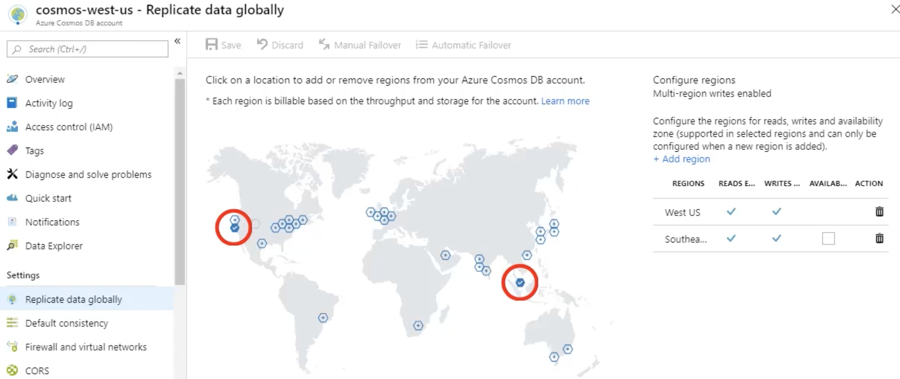
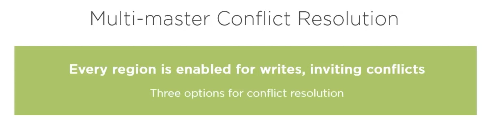
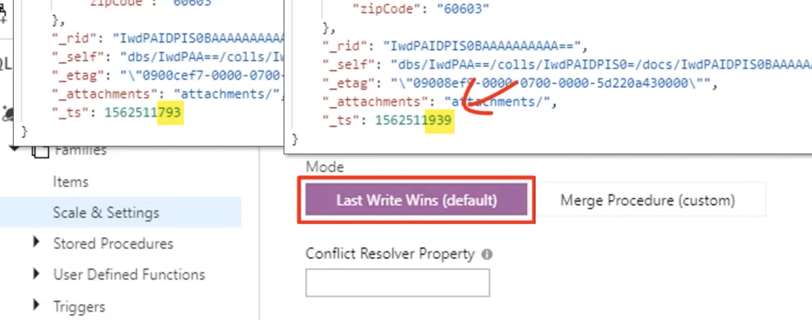
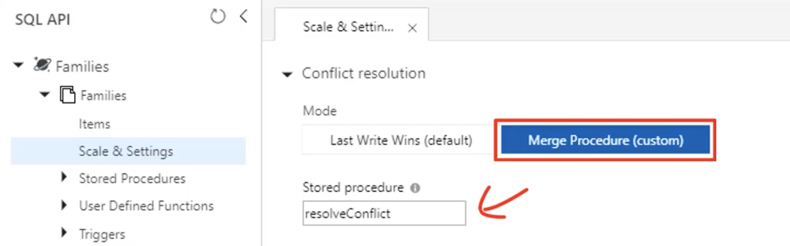
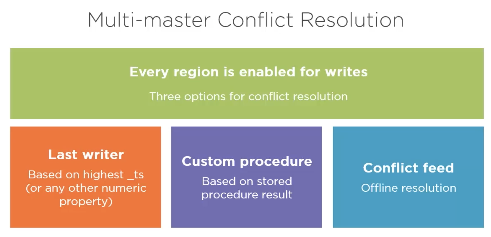
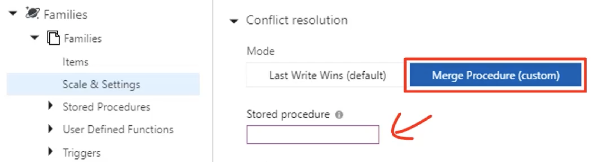
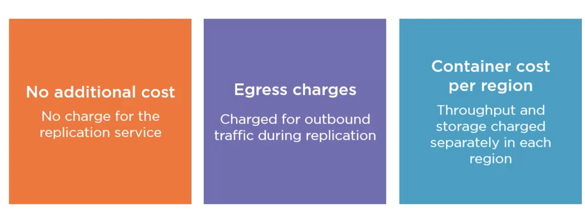

# 04 Distribution globale des données



La réplication des données à travers le monde permet de meilleurs performance (les données données sont plus proches des utilisateurs), mais aussi la possibilité de récupérer ses données en cas de désastre dans un data-center.

## Global distribution



Certaine régions ne permettent pas la `global distribution` pour des raisons géo-politique comme l'Allemagne ou la Chine.



`Multi-master` est une option qui permet de rendre global à la fois la lecture et l'écriture (au lieu de seulement l'écriture).

## Test avec une application éloignée de la `DB`

Si le coût en `RUs` reste le même, la latence par contre augmente drastiquement si l'application et le `DB` sont dans des régions éloignées.


Apparemment ces options ne sont pas disponible pour ma subscription.



Voila ce qu'on pourrai avoir.

`Cosmos DB` bascule (`failover`) automatiquement sur la région la plus proche en cas de problème.

## Résolution des conflits

Si l'option `multi-master` permet de lire et écrire rapidement à travers le monde, il peut provoquer des conflits si la réplication et plus lente que l'écriture de nouvelles données.



`Cosmos DB` stocke automatiquement le `timestamp` comme propriété :

```json
{
  // ...
  "_ts": 1595692322
}
```

### 1 Le plus récent gagne



### 2 merge procédure



On utilise les procédures stockées pour résoudre le conflit.



### 3 `Conflict feed` : flux de conflits

Pour choisir ce mode il faut cocher `Merge procedure` et ne rien renseigner dans `Stored procedure` :



`Conflict feed` résout rapidement et arbitrairement le conflits.

On peut ensuite programmer la gestion du flux des items refusés et les remettre en place ou les supprimer.

## Les prix de la réplication



La réplication n'ajoute pas de charge, par contre chaque région doit être approvisionnées séparément.

Ce qui signifie pour deux régions minimum `2 X 400 RUs`.

