# 05 `data modeling` et `migration`

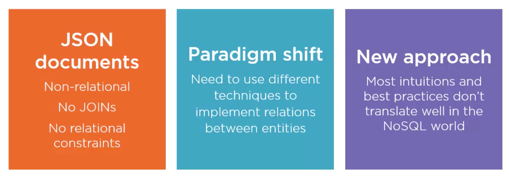

L'approche de conception de la `database` ainsi que l'organisation des données doit être différente de celle employé pour des base de données relationnelles.


## Relationnelle vs Document


#### ! c'est une bonne pratique d'ajouter la propriété type dans chaque document

Il est donc possible de faire évoluer les schémas au cours du temps sans conséquence pour la `database`.

On peut aussi ajouter une propriété `version` pour faciliter les `queries`.

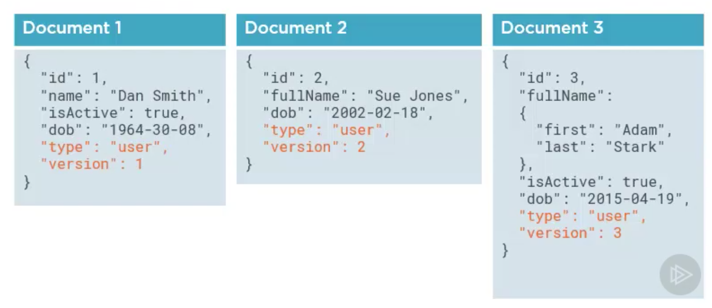


## Dé-normaliser le modèle


Dans un modèle relationnel, on cherche à normaliser la `db` en évitant la redondance des données.

Une requête peut couramment utiliser une dizaine de `JOIN` pour récupérer un ensemble de données.

Un `ORM ` (comme `entity framework`) devient nécessaire.

`ORM` : `Object Relational Mapper`.

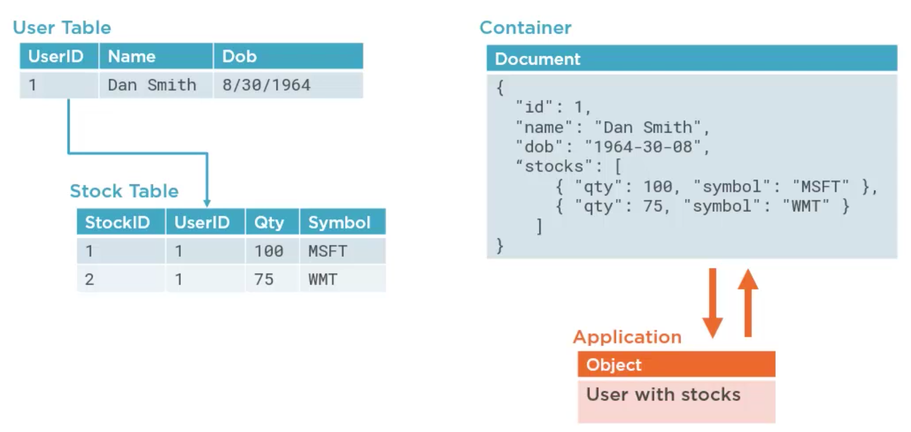

Dans une `DB NoSQL` on va dé-normaliser les données en les encapsulant dans un même `Document`, simplifiant la `query`. 

L'encapsulation peut être vu comme un pré-`JOIN` des données.

On peut alors facilement se passer d'un `ORM` et simplement sérialiser et dé-sérialiser les données.


### Des données sans limites

Par exemple un article peut avoir potentiellement une infinité de commentaire.

Comme un `Document` dans `Cosmos DB` est limité à `2MB` on ne peut pas encapsuler à l'infini.

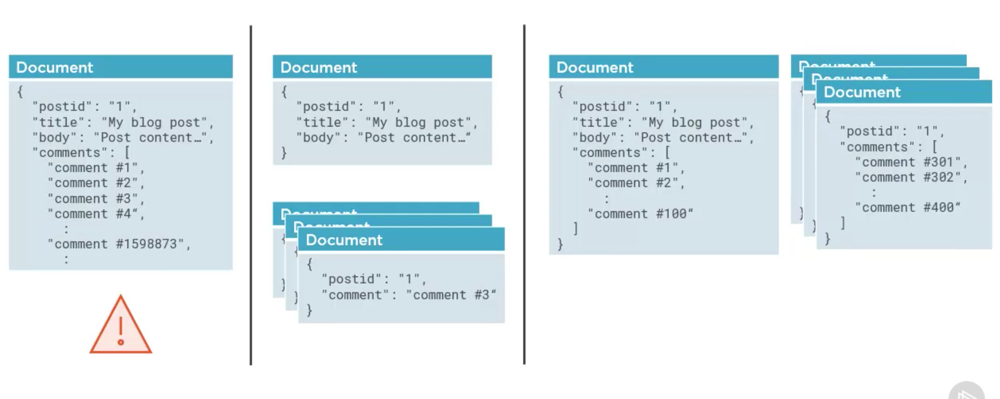

On peut par exemple créer un `Document` pour le `Post` et un pour chaque `Comment`.

On peut aussi encapsuler par exemple les cent premiers `Comment` et créer un document par tranche de cent en plus.

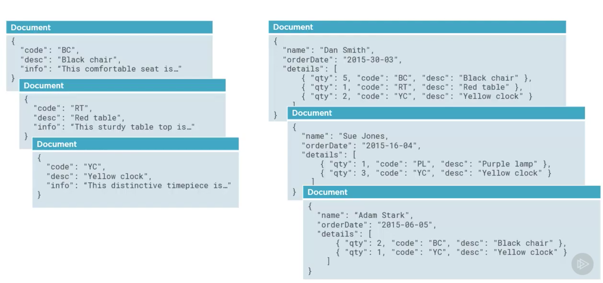

Plutôt que d'enregistrer seulement l'`id` des produits dans sa commande, on enregistre le produit entièrement pour éviter des requêtes inutile par la suite.

Pour conserver la cohérence des données, chaque `container` possède un `change feed` qui s'occupera de mettre à jour les données en cas de changement.


## data migration

L'approche recommandée est d'utilisé `Azure Data Factory`.

Cette approche utilise la `Cosmos DB BulkExecutor library`.

On peut aussi utiliser `Cosmos DB BulkExecutor Library` dans son application, cela fonctionne pour de très larges ensembles de données.

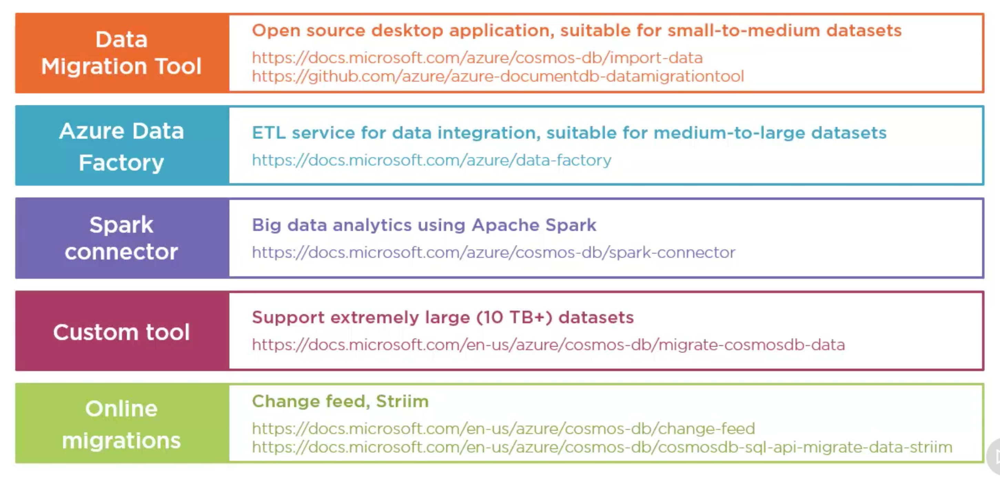

Les quatre premières options sont `offline`.

La dernière option peut être réalisée à chaud.

`Striim` est un service Azure.

`ETL` : `Extract Transform Load`

> **Wiki :**https://fr.wikipedia.org/wiki/Extract-transform-load
>
> **Extract-transform-load** est connu sous le sigle ETL, ou extracto-chargeur, (ou parfois : datapumping). Il s'agit d'une technologie informatique [intergicielle](https://fr.wikipedia.org/wiki/Intergicielle) (comprendre *[middleware](https://fr.wikipedia.org/wiki/Middleware)*) permettant d'effectuer des synchronisations massives d'information d'une source de données (le plus souvent une base de données) vers une autre. 


## Simple Data Migration

On crée une `database` :  `adventures-work` et un `container` : `stores`.

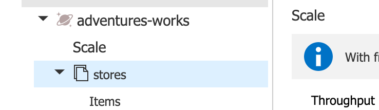

On va créer une nouvelle ressource `Data Factory` :

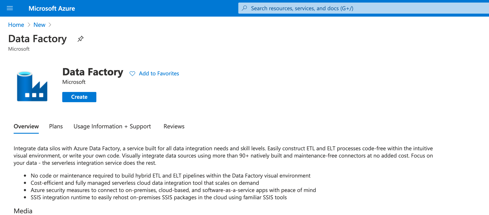

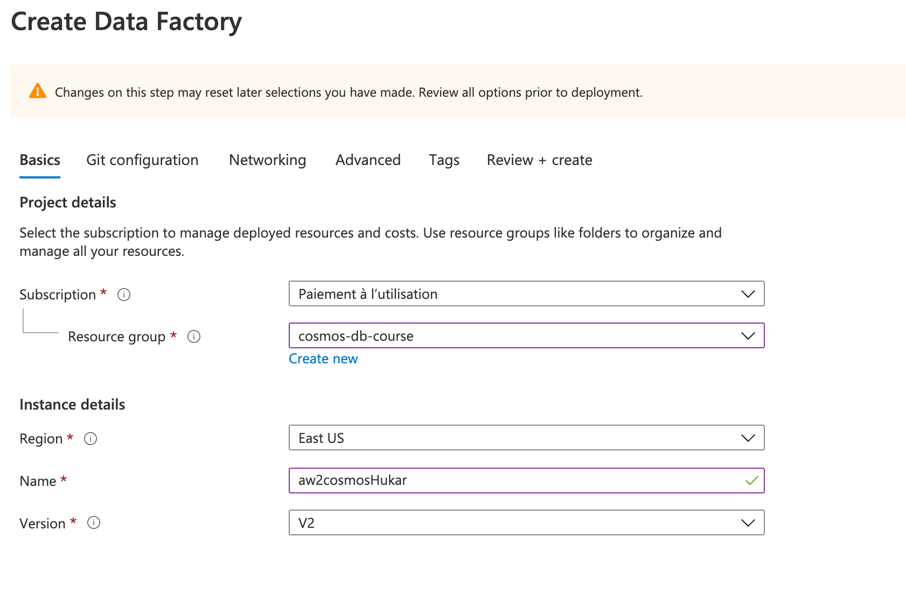

Et voici la ressource :

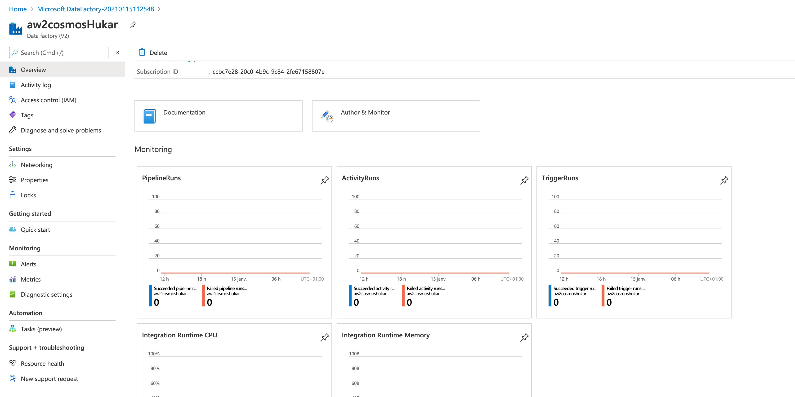

On va dans `author & monitor` :

#### ! attention il faut désactiver `ad block`.

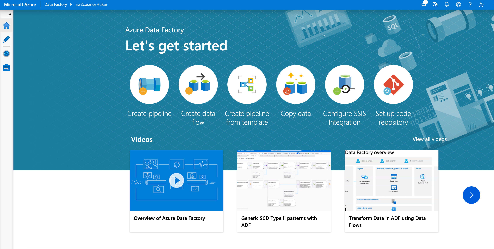

Il faut ajouter un nouveau `pipeline` :

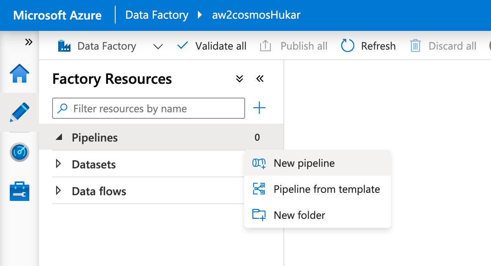

On glisse un `copy data` au milieu :

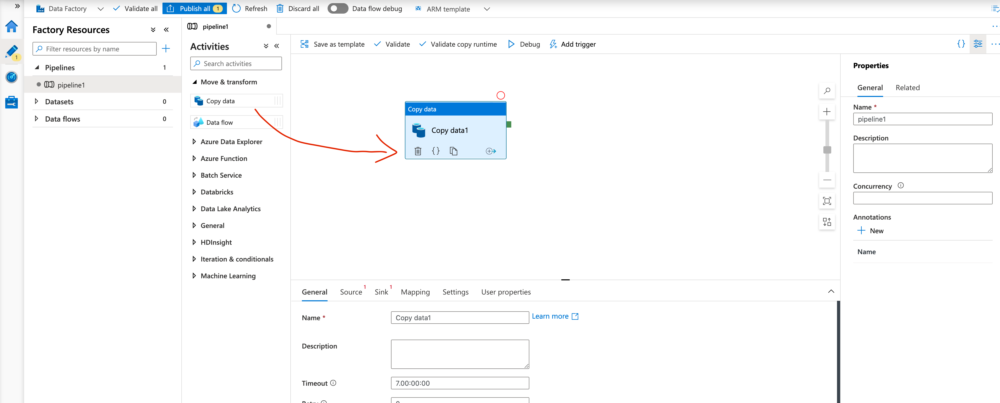

On ajoute un nom au `pipeline` et à la copie :

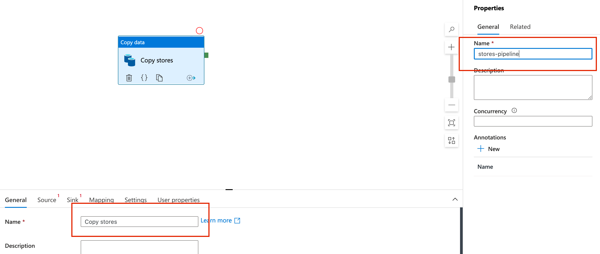

On choisi la `source` :

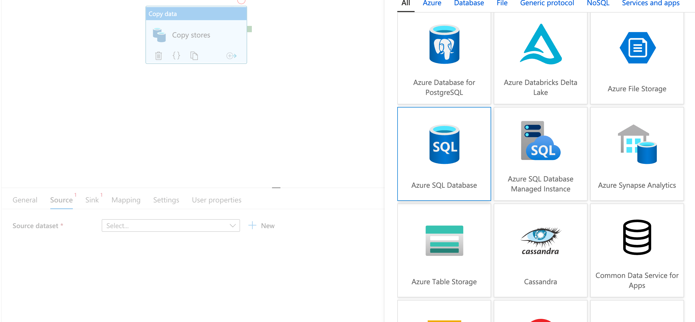

Pour la suite c'est une demo, il faut revoir les deux videos si besoin.

## Migration Denormalized Data

Utilisation du `data flow`.

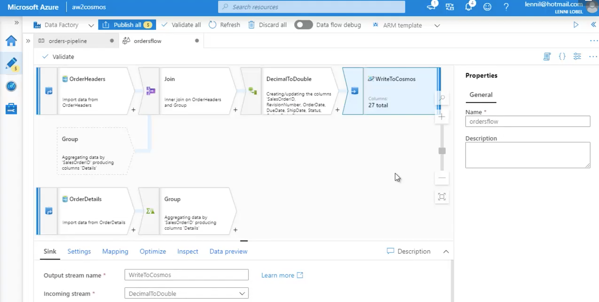

Voire la video.


## Special `Document` Proprties

Ce sont les propriétés ajoutées par `Cosmos Db`.

```json
"_rid": "OJIIAKQh8L8BAAAAAAAAAA==",
"_self": "dbs/OJIIAA==/colls/OJIIAKQh8L8=/docs/OJIIAKQh8L8BAAAAAAAAAA==/",
"_etag": "\"00008b00-0000-0100-0000-6001795a0000\"",
"_attachments": "attachments/",
"_ts": 1610709338

"_rid": "OJIIAKQh8L8CAAAAAAAAAA==",
"_self": "dbs/OJIIAA==/colls/OJIIAKQh8L8=/docs/OJIIAKQh8L8CAAAAAAAAAA==/",
"_etag": "\"00008c00-0000-0100-0000-6001796d0000\"",
"_attachments": "attachments/",
"_ts": 1610709357
```

La `partition key` et l'`id` doivent rendre un document unique dans l'entiéreté du `container .`

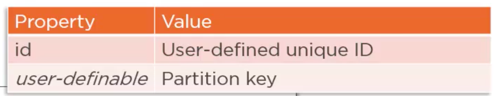

Les propriétés commençants par `_` sont des propriétés système.

- `_rid` : est une Ressource ID immutable et  défini par `Cosmos DB`.

- `-self` : est le lien vers la ressource, composé de la `database` `id` et du `container` `id` attaché à `_rid`. C'est le `path` vers la ressource.

- `_etag` : Utiliser pour gérer la concurrence. Le sytème peut ainsi gérer les modifications multiple d'un même `Document` car chaque changement du `Document` crée un nouvel `_etag`.

  ```json
  {
      "id": "hukar",
      "_rid": "OJIIAKQh8L8EAAAAAAAAAA==",
      "_self": "dbs/OJIIAA==/colls/OJIIAKQh8L8=/docs/OJIIAKQh8L8EAAAAAAAAAA==/",
      "_etag": "\"00008e00-0000-0100-0000-600197780000\"",
      "_attachments": "attachments/",
      "_ts": 1610717048
  }
  
  {
      "id": "hukar",
      "strenght": 456,
      "_rid": "OJIIAKQh8L8EAAAAAAAAAA==",
      "_self": "dbs/OJIIAA==/colls/OJIIAKQh8L8=/docs/OJIIAKQh8L8EAAAAAAAAAA==/",
      "_etag": "\"00008f00-0000-0100-0000-600197ed0000\"",
      "_attachments": "attachments/",
      "_ts": 1610717165
  }
  ```

  On voit que `_rid` reste le même, alors que `_etag` et `_ts` changent.

- `_attachments` :  lien vers les `attachments`, n'est plus utilisé, lui préféré un lien dans une propriété vers le `Blob storage` par exemple

- `_ts` : le `timestamp` nombre de secondes écoulées depuis le premier janvier 1970. C'est celui de la création ou de la dernière modification.

- `ttl` ce n'est pas une propriété système, pas de `underscore` devant. `Time To Live`. C'est une propriété en seconde que l'on ajoute manuellement qui défini le temps après lequel le `document` sera supprimé. Pour que cela fonctionne il faut activer `ttl` dans les ` Settings` du `container`:
  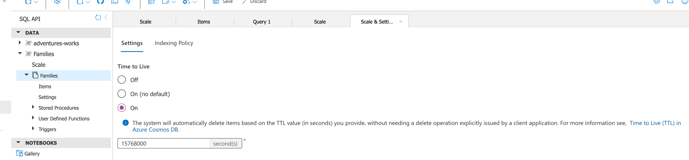
  Dans le mode `on`, par défaut tout les documents vont se supprimer suivant le temps défini (ici 6 mois), on peut ajouter une propriété `ttl` individuellement, `-1` permettant de ne pas supprimer le `document`.

  ```json
  {
      "id": "hukar",
      "ttl": 60,
      "strenght": 456,
      "_rid": "OJIIAKQh8L8EAAAAAAAAAA==",
      "_self": "dbs/OJIIAA==/colls/OJIIAKQh8L8=/docs/OJIIAKQh8L8EAAAAAAAAAA==/",
      "_etag": "\"0000be00-0000-0100-0000-6001b8270000\"",
      "_attachments": "attachments/",
      "_ts": 1610725415
  }
  ```

  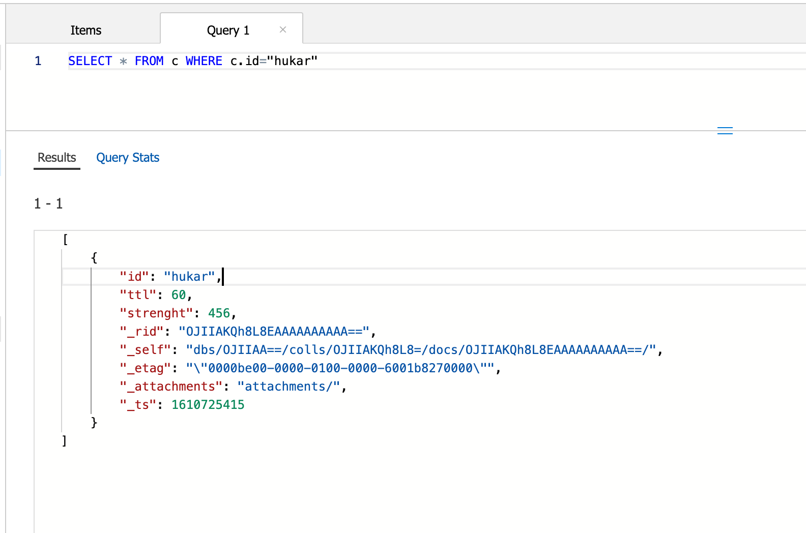

  Après `60 s` :

  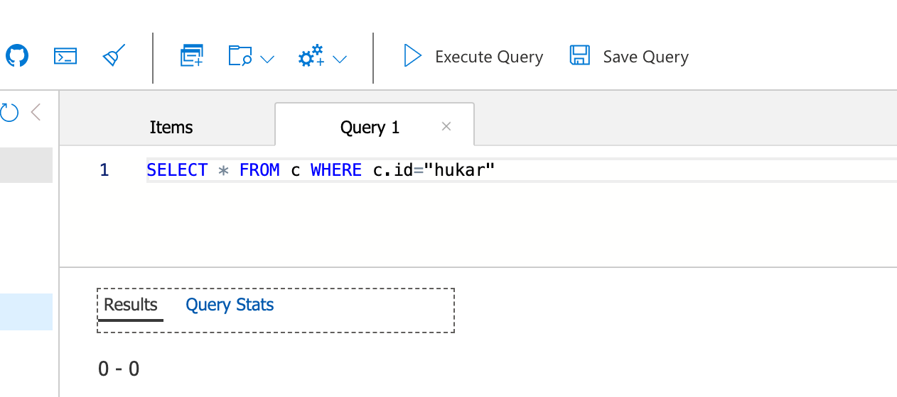

