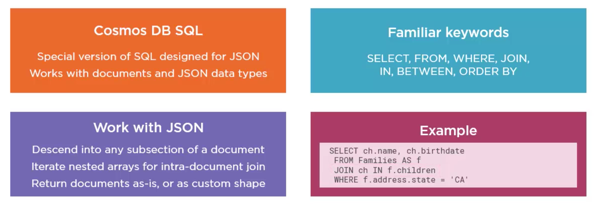
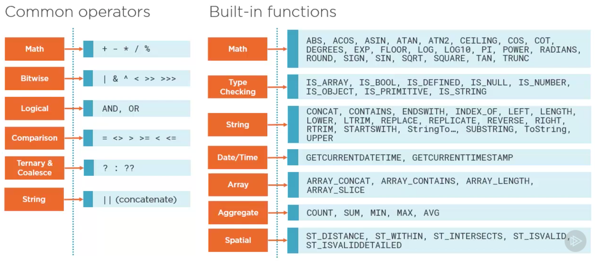
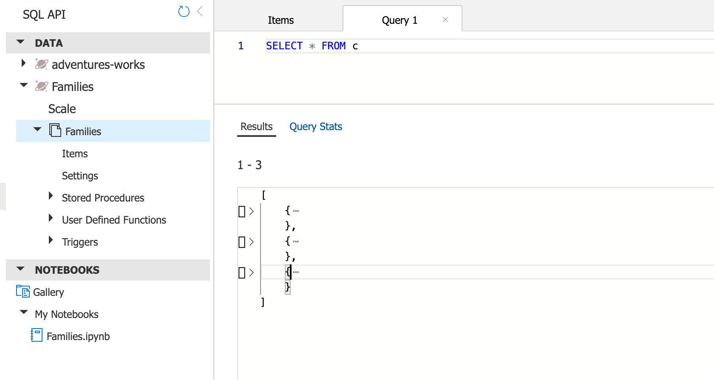
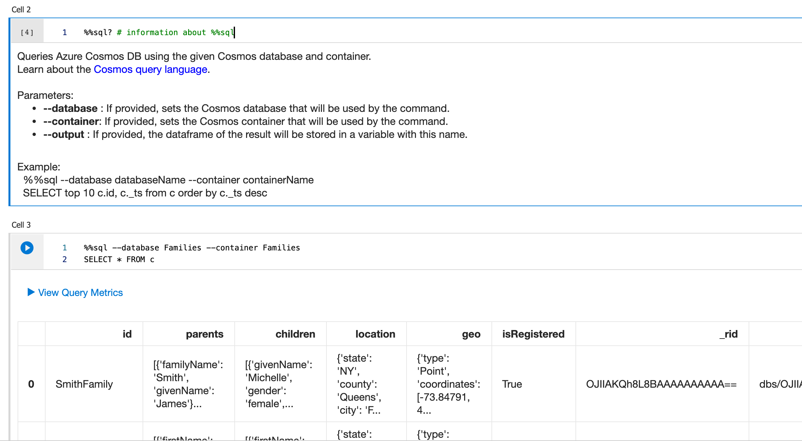

# L'`API SQL`



On utilise la notation par point `.` pour accéder aux propriété.


## Opérateurs et Fonctions




## Simple `query`

```sql
SELECT * FROM c
```

`Cosmos Db` retourne un tableau `json` avec les documents correspondants.



### `Select *`

Cela signifie qu'on veut les `document` tel qu'ils sont stockés dans la `database`.

`*` permet de ne pas se soucier de la forme du `document` comme chaque `document` peut avoir son propre schéma.

Par exemple :

```sql
SELECT c.name FROM c
```

Renverra :

```json
[
    {},
    {},
    {},
    {
        "name": "bob"
    },
    {}
]
```

Car seul un élément a une propriété `name`.

### Utiliser le `notebook`



#### `%%sql` et `%%sql?` pour obtenir les infos

`--database` : databaseName

`--container` : containerName


## Utiliser `ARRAY_CONTAINS`

```sql
SELECT * FROM c WHERE ARRAY_CONTAINS(c.tags,'600592ba8082fa97d2b15f90')
```

Le premier paramètre est le nom du tableau (de la propriété tableau), le deuxième paramètre est l'élément recherché.