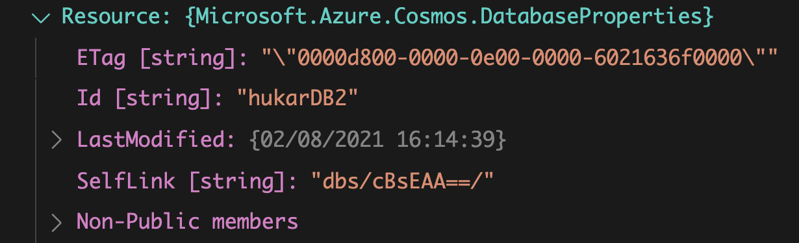

# 08 Travailler avec les `Database`

## Rappel: classe `Shared` pour instancier le `Client`

`Shared.cs`

```cs
using Microsoft.Azure.Cosmos;
using Microsoft.Extensions.Configuration;

namespace azure_cosmos_connection
{
    public class Shared
    {
        public static CosmosClient Client { get; private set; }

        static Shared()
        {
            var config = new ConfigurationBuilder().AddJsonFile("appsettings.json").Build();
            var endpoint = config["CosmosEndpoint"];
            var masterKey = config["CosmosMasterKey"];

            Client = new CosmosClient(endpoint, masterKey);
        }
    }
}
```


## Lister ses `Databases`

Dans `Program.cs`:

```csharp
using System;
using System.Threading.Tasks;
using Microsoft.Azure.Cosmos;

namespace azure_cosmos_connection
{
    class Program
    {
        async static Task Main(string[] args) => await ViewDatabases();

        async static Task ViewDatabases()
        {
            
            var iterator = Shared.Client.GetDatabaseQueryIterator<DatabaseProperties>();
            var databases = await iterator.ReadNextAsync();

            foreach(var database in databases)
            {
                Console.WriteLine($"Dtabase Id: {database.Id} Modified: {database.LastModified}");
            }
            Console.WriteLine($"number of databases: {databases.Count}");
        }
    }
}
```

### `GetDatabaseQueryIterator<T>` retourne les `databases`.

`DatabaseProperties` : type générique appartenant au `SDK Microsoft.Azure.Cosmos`.


## Créer une `Database`

dans `Program.cs`

```csharp
async static Task CreateDatabase(string newDatabase)
{
  Console.WriteLine("\n>>> CreateDatabase Database <<<");

  var result = await Shared.Client.CreateDatabaseAsync(newDatabase);
  var database = result.Resource;
}
```

### `CreateDatabaseAsync(newDatabase)`

Observons l'objet `Resource` (avec le `debuger` de **VSCode**):




## Supprimer une `Database`

Dans `Program.cs`:

```csharp
async static Task DeleteDatabase(string databaseIdToDelete)
{
  Console.WriteLine(">>> Delete Database <<<");

  await Shared.Client.GetDatabase(databaseIdToDelete).DeleteAsync();
  Console.WriteLine($" {databaseIdToDelete} is deleted");
}
```

```cs
// Dans la méthode Main
await ViewDatabases();

await DeleteDatabase("hukarDB");
await DeleteDatabase("hukarDB2");

await ViewDatabases();
```

### `GetDatabase(databaseToDelete).DeleteAsync()`

```bash
🧨 hukar:azure-cosmos-connection$ dotnet run
Database Id: hukarDB2 Modified: 08/02/2021 16:14:39
Database Id: hukarDB Modified: 08/02/2021 16:14:06
Database Id: Users Modified: 07/02/2021 06:32:05
number of databases: 3

>>> Delete Database <<<
 hukarDB is deleted
 
>>> Delete Database <<<
 hukarDB2 is deleted
 
Database Id: Users Modified: 07/02/2021 06:32:05
number of databases: 1
```

