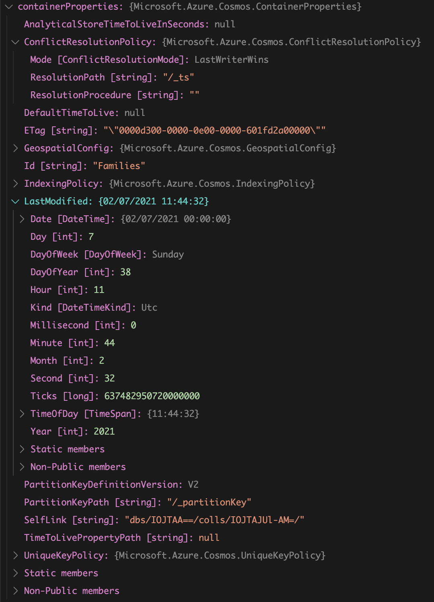
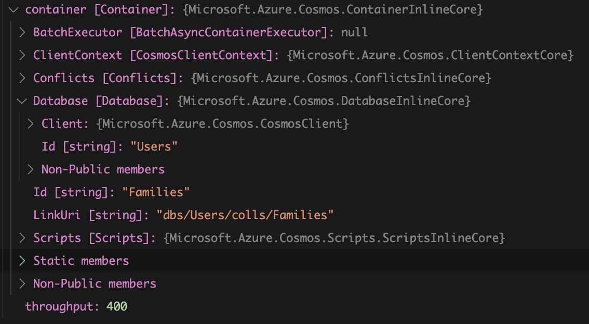

# 09 Gérer les `Container`

## Lister les `Container`

On va écrire deux méthodes dans `Program.cs`

```csharp
async static Task ViewContainer()
{
  Console.WriteLine(">>> View Container <<<");

  var database = Shared.Client.GetDatabase("Users");
  Console.WriteLine($"In database: {database.Id}");
  var iterator = database.GetContainerQueryIterator<ContainerProperties>();
  var containers = await iterator.ReadNextAsync();

  foreach(var container in containers)
  {
    Console.WriteLine("");
    Console.WriteLine($" There are {containers.Count} container(s)");
    await ViewContainer(container);
  }
}
```

`client.GetDatabase(string databaseId)` pour récupérer la base de données.

### `database.GetContainerQueryIterator<ContainerProperties>`

Cette méthode renvoie un `iterator`.

On récupère tous les `containers` avec `iterator.ReadNextAsync`.

On crée une deuxième méthode pour afficher les propriétés du `container` et récupérer son `throughput` (débit).

```csharp
async static Task ViewContainer(ContainerProperties containerProperties)
{
  System.Console.WriteLine($"\tContainer Id: {containerProperties.Id}");
  System.Console.WriteLine($"\tLast Modified:: {containerProperties.LastModified}");
  System.Console.WriteLine($"\tPartition Key: {containerProperties.PartitionKeyPath}");

  var container = Shared.Client.GetContainer("Users", containerProperties.Id);
  var throughput = await container.ReadThroughputAsync();

  Console.WriteLine($"\tThroughput: {throughput}");
  Console.WriteLine();
}
```

`ContainerProperties` classe contenant les données sur le `container`.

`Container` classe avec laquelle on peut agir sur le `container`.

Pour récupérer le `container` de classe `Container` on fait :

```cs
var container = Shared.Client.GetContainer(string dbId, string containerId)
```

### `client.GetContainer(<DB_ID>, <CONTAINER_ID>)`

Ensuite il suffit de lire le `throughput` avec `container.ReadThroughputAsync`.

```bash
>>> View Container <<<
In database: Users

 There are 1 container(s)
        Container Id: Families
        Last Modified:: 07/02/2021 11:44:32
        Partition Key: /_partitionKey
        Throughput: 400
```

### `ContainerProperties`



### `Container`




## Créer les `Container`

```csharp
async static Task CreateContainer(
  string containerId,
  int throughput = 400,
  string partitionKey = "/partitionKey")
{
  Console.WriteLine(">>> Create Container <<<");

  var database = Shared.Client.GetDatabase("Users");
  var result = await database.CreateContainerAsync(containerId, partitionKey, throughput);
  var container = result.Resource;

}
```

On récupère la `DB` et on utilise sa méthode `CreateContainerAsync`.

### `db.CreateContainerAsync(<CID>, <PK>, <Throughput>)`

```csharp
await CreateContainer("Wolf", 400, "/wolfId");
await CreateContainer("Mage", 1000, "/mageId");
```


```bash
Container Id: Wolf
Last Modified:: 09/02/2021 10:01:48
Partition Key: /wolfId
Throughput: 400


Container Id: Mage
Last Modified:: 09/02/2021 10:01:49
Partition Key: /mageId
Throughput: 1000
```


## Supprimer les `Container`

```csharp
async static Task DeleteContainer(string containerId)
{
  Console.WriteLine(">>> Delete Container <<<");
  var database = Shared.Client.GetDatabase("Users");

  var container = database.GetContainer(containerId);
  await container.DeleteContainerAsync();

  Console.WriteLine($"container: {containerId} id deleted");
}
```

### `container.DeleteContainerAsync()`


## Code entier

`Program.cs`

```csharp
using System;
using System.Threading.Tasks;
using Microsoft.Azure.Cosmos;

namespace azure_cosmos_connection
{
    class Program
    {
        async static Task Main(string[] args)
        {
            await ViewContainer();
            await CreateContainer("Wolf", 400, "/wolfId");
            await CreateContainer("Mage", 1000, "/mageId");

            await ViewContainer();
            await DeleteContainer("Wolf");
            await DeleteContainer("Mage");

            await ViewContainer();
        }

        async static Task QueryForDocuments()
        {
            using (var client = Shared.Client)
            {
                var container = client.GetContainer("Users", "Families");
                var sql = "SELECT * FROM c WHERE ARRAY_LENGTH(c.children) > 1";
                var iterator = container.GetItemQueryIterator<dynamic>(sql);

                var page = await iterator.ReadNextAsync();

                foreach (var doc in page)
                {
                    Console.WriteLine($"Family {doc.id} has {doc.children.Count} children");
                }
            }
        }

        async static Task ViewContainer()
        {
            Console.WriteLine(">>> View Container <<<");

            var database = Shared.Client.GetDatabase("Users");
            Console.WriteLine($"In database: {database.Id}");
            var iterator = database.GetContainerQueryIterator<ContainerProperties>();
            var containers = await iterator.ReadNextAsync();

            Console.WriteLine($" There are {containers.Count} container(s)");
            foreach (var container in containers)
            {
                Console.WriteLine("");
                await ViewContainer(container);
            }
        }

        async static Task ViewContainer(ContainerProperties containerProperties)
        {
            System.Console.WriteLine($"\tContainer Id: {containerProperties.Id}");
            System.Console.WriteLine($"\tLast Modified:: {containerProperties.LastModified}");
            System.Console.WriteLine($"\tPartition Key: {containerProperties.PartitionKeyPath}");

            var container = Shared.Client.GetContainer("Users", containerProperties.Id);
            var throughput = await container.ReadThroughputAsync();

            Console.WriteLine($"\tThroughput: {throughput}");
            Console.WriteLine();
        }

        async static Task CreateContainer(
                                    string containerId,
                                    int throughput = 400,
                                    string partitionKey = "/partitionKey")
        {
            Console.WriteLine(">>> Create Container <<<");

            var database = Shared.Client.GetDatabase("Users");
            var result = await database.CreateContainerAsync(containerId, partitionKey, throughput);
            var container = result.Resource;

        }

        async static Task DeleteContainer(string containerId)
        {
            Console.WriteLine(">>> Delete Container <<<");
            var database = Shared.Client.GetDatabase("Users");

            var container = database.GetContainer(containerId);
            await container.DeleteContainerAsync();

            Console.WriteLine($"container: {containerId} id deleted");
        }
    }
}
```

`Shared.cs`

```csharp
using Microsoft.Azure.Cosmos;
using Microsoft.Extensions.Configuration;

namespace azure_cosmos_connection
{
    public class Shared
    {
        public static CosmosClient Client { get; private set; }

        static Shared()
        {
            var config = new ConfigurationBuilder().AddJsonFile("appsettings.json").Build();
            var endpoint = config["CosmosEndpoint"];
            var masterKey = config["CosmosMasterKey"];

            Client = new CosmosClient(endpoint, masterKey);
        }
    }
}
```

