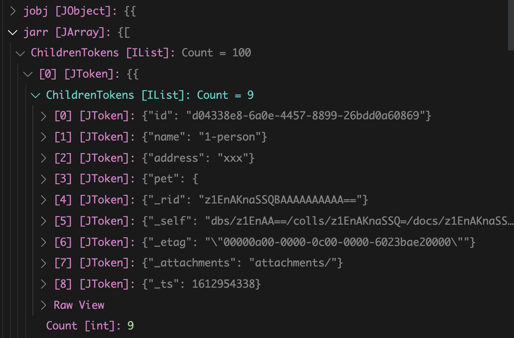

# 12 `iterator` de `streaming`

Cosmos DB doit transformer le `json` de base d'un document avant de l'envoyer.

Pour des raisons de performance, ou pour directement envoyer le `raw json` à un client on peut utiliser les `streams`.

Il faut alors déserialiser le résultat reçu soi-même si on l'utilise dans le code `c#`.

## `stateful` version

```csharp
async static Task QueryWithStatefulPagingStreamed()
{
  Console.Clear();
  System.Console.WriteLine("\n>>> Query Documents (SQL) with streaming <<<\n");

  // On récupère le container
  var container = Client.GetContainer("Users", "Families");
  var sql = "SELECT * FROM c";

  var streamIterator = container.GetItemQueryStreamIterator(sql, requestOptions: new QueryRequestOptions { MaxItemCount = 100 });

  var itemCount = 0;
  var pageCount = 0;

  while (streamIterator.HasMoreResults)
  {
    pageCount++;
    var result = await streamIterator.ReadNextAsync();
    var stream = result.Content;

    using (var sr = new StreamReader(stream))
    {
      var json = await sr.ReadToEndAsync();
      var jobj = JsonConvert.DeserializeObject<JObject>(json);
      var jarr = (JArray)jobj["Documents"];
      foreach (var item in jarr)
      {
        itemCount++;
        var person = JsonConvert.DeserializeObject<Person>(item.ToString());
        System.Console.WriteLine($"name: {person.Name}, address: {person.Address}, pet: {person.MyPet.Nickname}");
      }
    }

    System.Console.WriteLine($"end page {pageCount}\n");
  }
  System.Console.WriteLine($"There are {pageCount} pages an {itemCount} documents");
}
```

`c.GetItemQueryStreamIterator` on récupère un `StreamIterator`.

Ensuite on récupère le `stream`, on crée un `streamReader`.

On lit et on met le `stream` dans une variable de type `string` `json` :`sr.ReadToEndAsync`.


On transforme la variable `json` en `JObject` puis en `JArray`.

À ce niveau on voit que chaque document est un `JToken` composé de `JToken`.

On déserialise tout ça vers un objet `Person` :

#### `JsonConvert.DeserializeObject<Person>(item.ToString())`




## `stateless` version

```csharp
async static Task QueryWithStatelessPagingStreamed()
{
  // Récupérer toutes les page en utilisant le continuation token
  System.Console.WriteLine("Querying for all documents (full result, stateless) w/ stream iterator");

  var continuationToken = default(string);
  do
  {
    continuationToken = await QueryFetchNextPageStreamed(continuationToken);
  } while (continuationToken != null);

  System.Console.WriteLine("all document retrieved stateless w/ streaming iterator");
}

async static Task<string> QueryFetchNextPageStreamed(string continuationToken)
{
  var container = Client.GetContainer("Users", "Families");
  var sql = "SELECT * FROM c";

  var streamIterator = container.GetItemQueryStreamIterator(sql, continuationToken, requestOptions: new QueryRequestOptions { MaxItemCount = 100 });
  var response = await streamIterator.ReadNextAsync();

  var itemCount = 0;

  if (continuationToken != null)
  {
    Console.WriteLine($"...resuming with continuation {continuationToken}");
  }

  var stream = response.Content;
  using (var sr = new StreamReader(stream))
  {
    var json = await sr.ReadToEndAsync();
    var jobj = JsonConvert.DeserializeObject<JObject>(json);
    var jarr = (JArray)jobj["Documents"];
    foreach (var item in jarr)
    {
      itemCount++;
      var person = JsonConvert.DeserializeObject<Person>(item.ToString());
      Console.WriteLine($"name: {person.Name}, address: {person.Address}, pet: {person.MyPet.Nickname}");
    }
  }

  System.Console.WriteLine($"There are {itemCount} documents");
  continuationToken = response.Headers.ContinuationToken;

  if (continuationToken == null)
  {
    System.Console.WriteLine("...No more continuation; resultset complete");
  }

  return continuationToken;
}
```

La seul chose à ajouter c'est que pour récupérer le `continuation token` on fait :

#### `continuationToken = response.Headers.ContinuationToken;`


## `code` complet

```csharp
using System;
using System.IO;
using System.Threading.Tasks;
using Microsoft.Azure.Cosmos;
using Newtonsoft.Json;
using Newtonsoft.Json.Linq;

namespace azure_cosmos_connection
{
  class Program
  {
    static CosmosClient Client { get; set; } = Shared.Client;

    async static Task Main(string[] args)
    {
      // await QueryWithStatefulPagingStreamed();
      await QueryWithStatelessPagingStreamed();
    }

    async static Task QueryWithStatefulPagingStreamed()
    {
      Console.Clear();
      System.Console.WriteLine("\n>>> Query Documents (SQL) with streaming <<<\n");

      // On récupère le container
      var container = Client.GetContainer("Users", "Families");
      var sql = "SELECT * FROM c";

      var streamIterator = container.GetItemQueryStreamIterator(sql, requestOptions: new QueryRequestOptions { MaxItemCount = 100 });

      var itemCount = 0;
      var pageCount = 0;

      while (streamIterator.HasMoreResults)
      {
        pageCount++;
        var result = await streamIterator.ReadNextAsync();
        var stream = result.Content;

        using (var sr = new StreamReader(stream))
        {
          var json = await sr.ReadToEndAsync();
          var jobj = JsonConvert.DeserializeObject<JObject>(json);
          var jarr = (JArray)jobj["Documents"];
          foreach (var item in jarr)
          {
            itemCount++;
            var person = JsonConvert.DeserializeObject<Person>(item.ToString());
            System.Console.WriteLine($"name: {person.Name}, address: {person.Address}, pet: {person.MyPet.Nickname}");
          }
        }

        System.Console.WriteLine($"end page {pageCount}\n");
      }
      System.Console.WriteLine($"There are {pageCount} pages an {itemCount} documents");
    }

    async static Task QueryWithStatelessPagingStreamed()
    {
      // Récupérer toutes les page en utilisant le continuation token
      System.Console.WriteLine("Querying for all documents (full result, stateless) w/ stream iterator");

      var continuationToken = default(string);
      do
      {
        continuationToken = await QueryFetchNextPageStreamed(continuationToken);
      } while (continuationToken != null);

      System.Console.WriteLine("all document retrieved stateless w/ streaming iterator");
    }

    async static Task<string> QueryFetchNextPageStreamed(string continuationToken)
    {
      var container = Client.GetContainer("Users", "Families");
      var sql = "SELECT * FROM c";

      var streamIterator = container.GetItemQueryStreamIterator(sql, continuationToken, requestOptions: new QueryRequestOptions { MaxItemCount = 100 });
      var response = await streamIterator.ReadNextAsync();

      var itemCount = 0;

      if (continuationToken != null)
      {
        Console.WriteLine($"...resuming with continuation {continuationToken}");
      }

      var stream = response.Content;
      using (var sr = new StreamReader(stream))
      {
        var json = await sr.ReadToEndAsync();
        var jobj = JsonConvert.DeserializeObject<JObject>(json);
        var jarr = (JArray)jobj["Documents"];
        foreach (var item in jarr)
        {
          itemCount++;
          var person = JsonConvert.DeserializeObject<Person>(item.ToString());
          Console.WriteLine($"name: {person.Name}, address: {person.Address}, pet: {person.MyPet.Nickname}");
        }
      }

      System.Console.WriteLine($"There are {itemCount} documents");
      continuationToken = response.Headers.ContinuationToken;

      if (continuationToken == null)
      {
        System.Console.WriteLine("...No more continuation; resultset complete");
      }

      return continuationToken;
    }
  }
}

```


