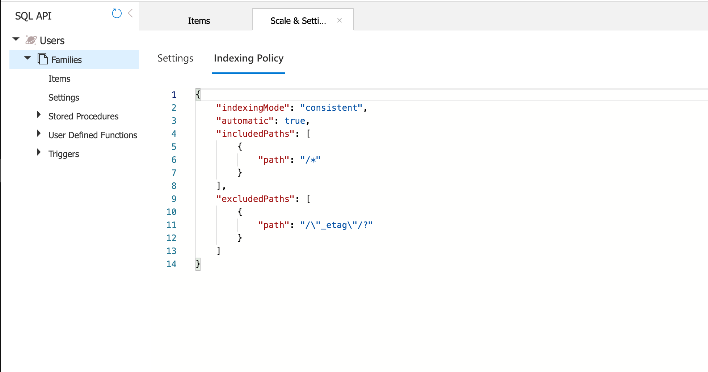
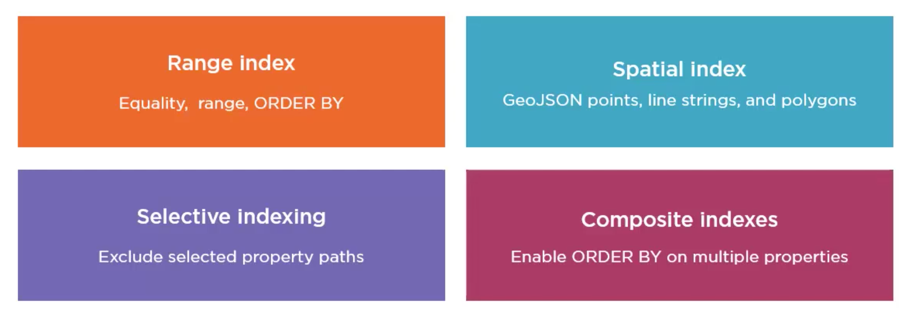
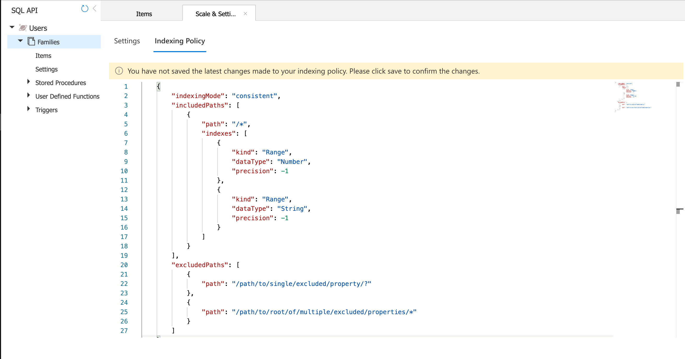

# 13 Indexing

Par défaut `Cosmos DB` indexe tous les `documents` dans la `db`.



On voit que le `_etag` est exclus de l'indexation, car il sert en interne pour gérer la concurrence, pas dans une requête.

Il y a diverse stratégie `custom` que l'on peut mettre en place :



- Définir un index de trie `range index`
- Un index de géolocalisation `spatial index`
- On peut exclure des propriétés n'intervenant jamais dans les requêtes `selective index`
- ON peut créer des `composite index` pour utiliser `ORDER BY` sur plusieurs propriétés.

Si on inclus dans la clause `WHERE` des propriétés non-indexées, la charge en `RUs` sera plus élevée.

On peut inclure et exclure des chemins indexés (notamment grâce au SDK).

On peut modifier l'indexation directement dans le portail `Azure` :



https://docs.microsoft.com/en-us/azure/cosmos-db/how-to-manage-indexing-policy?tabs=dotnetv2%2Cpythonv3

#### ! Pour pouvoir utiliser `ORDER BY` on est obligé d'avoir un `composite index`.

```json
{  
  "automatic":true,
  "indexingMode":"Consistent",
  "includedPaths":[  
    {  
      "path":"/*"
    }
  ],
  "excludedPaths":[],
  "compositeIndexes":[  
    [  
      {  
        "path":"/name",
        "order":"ascending"
      },
      {  
        "path":"/age",
        "order":"descending"
      }
    ]
  ]
}
```


