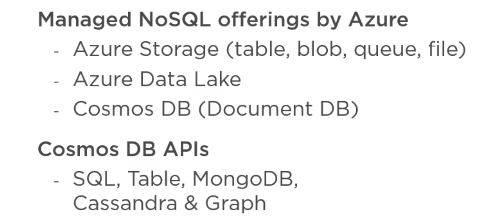
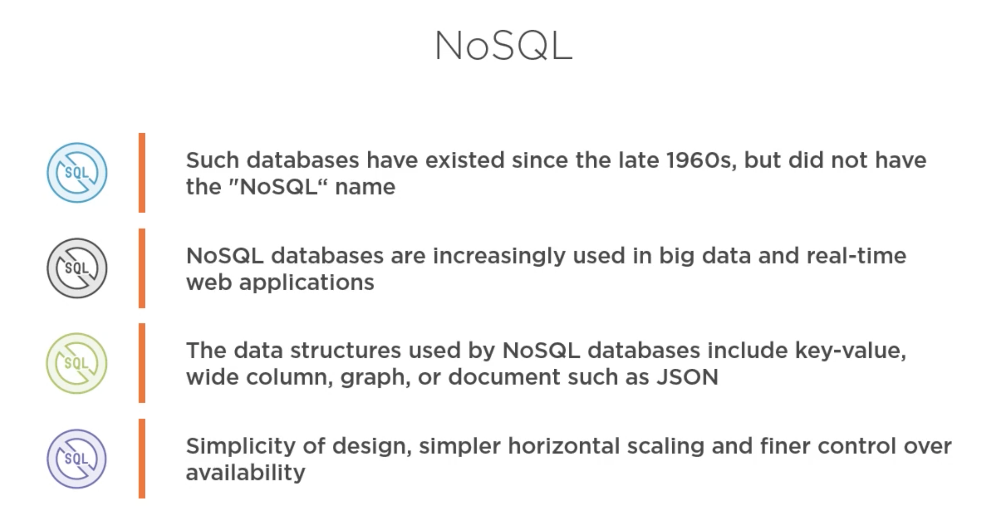
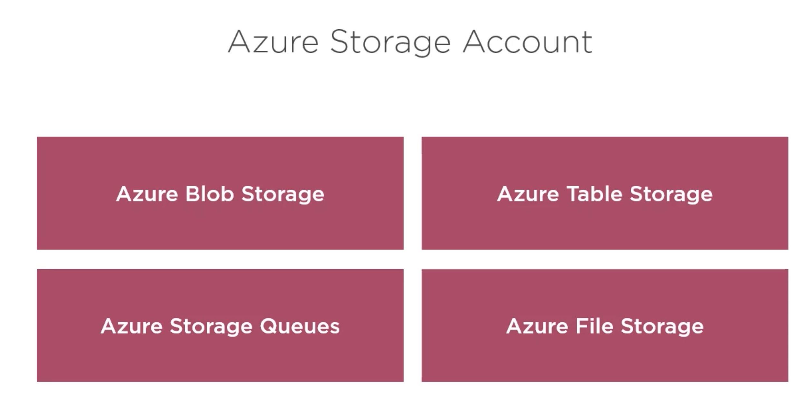
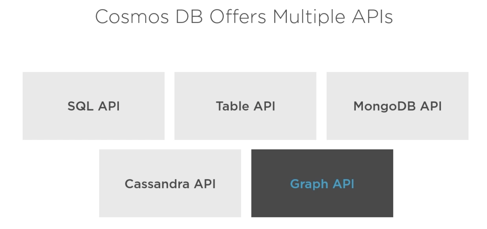
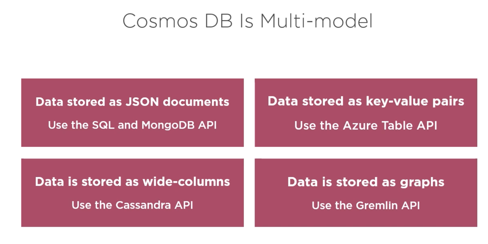

# 01 Introduction

`horizontal scaling` plusieurs machine (de faible puissance).

`vertical scaling` une machine plus puissante.

## Azure Storage

## Cosmos DB

Pour le JSON on a MongoDB et SQL API.
