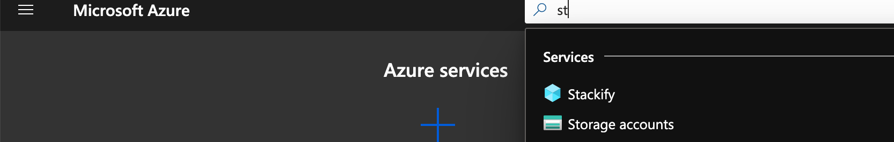
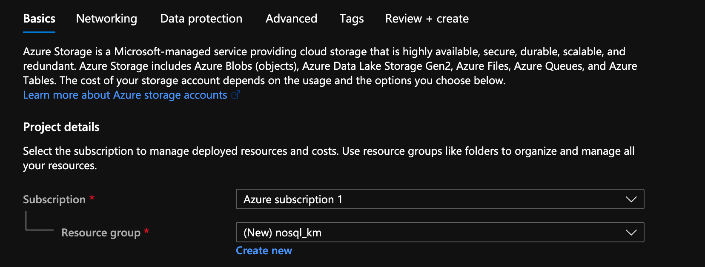
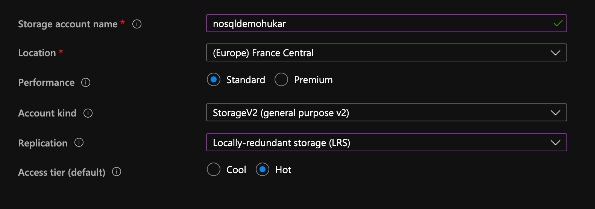
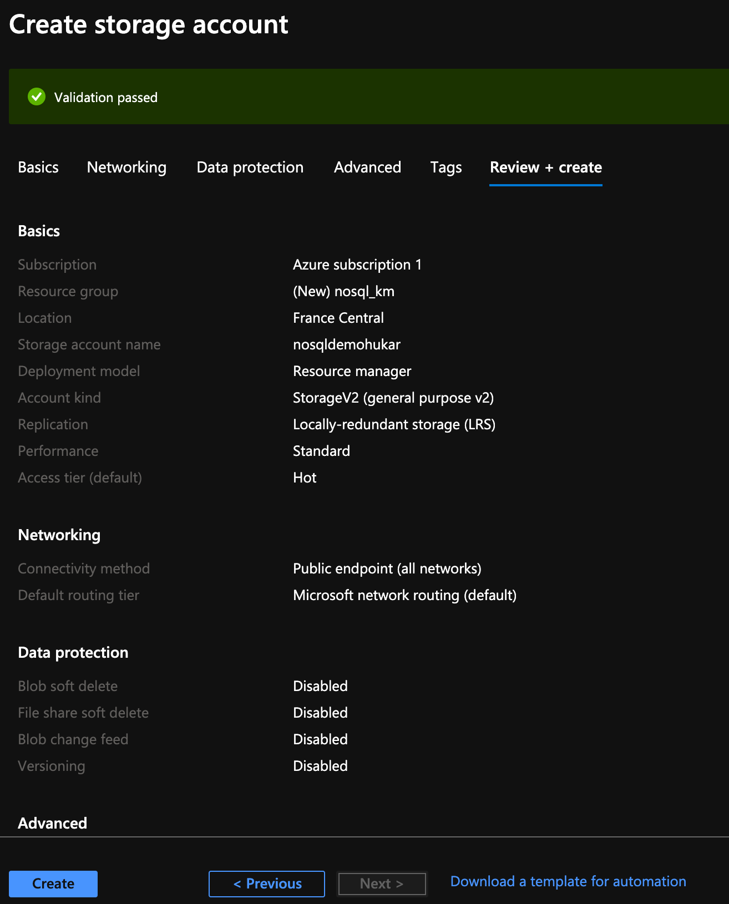
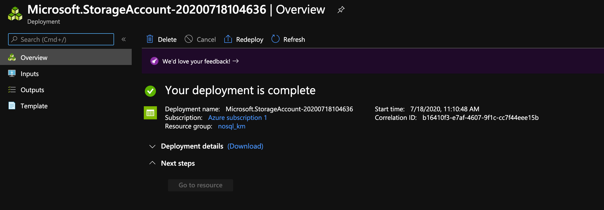
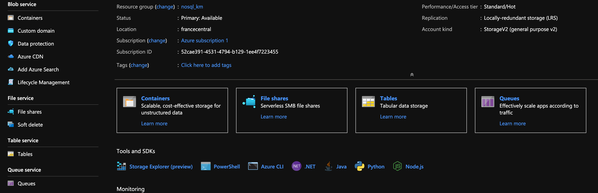

# 02 Créer un compte Azure Storage

On va créer un nouveau groupe de ressources : `nosql_km`.

Performance : `Standard` dd magnétique | `Prenium` ssd

`Cool` est pour le stockage froid d'archivage.

`Replication` stratégie de réplication des données.

On garde les options par défaut pour le reste.

`Create`.

## 4 types `Blob` `File` `Table` `Queue`

