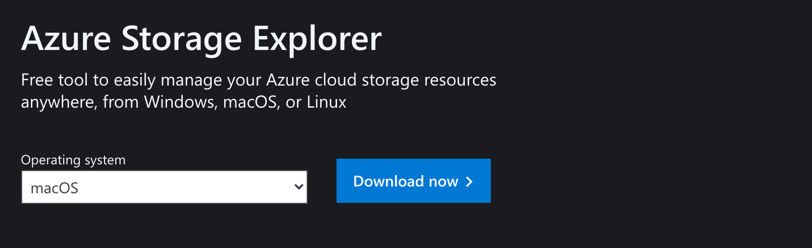
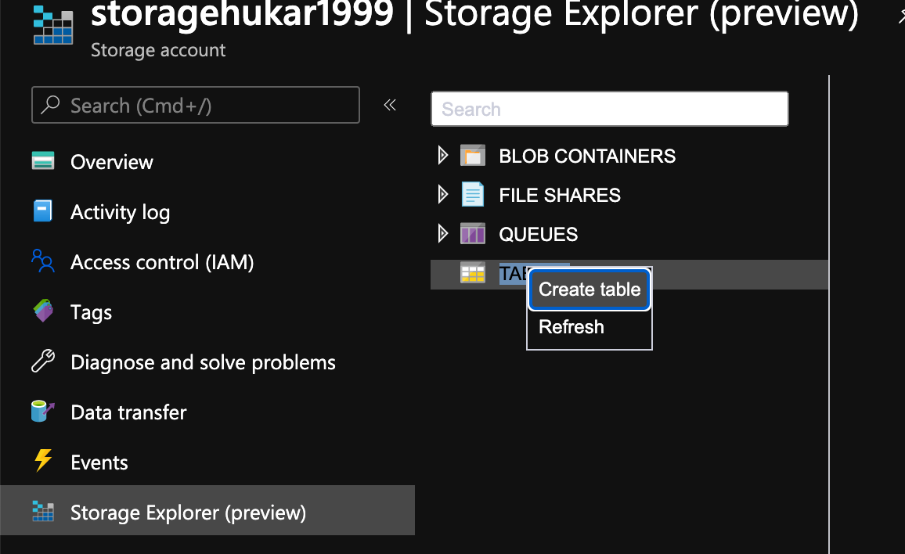
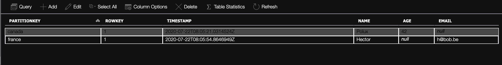

# 04 Storage Explorer

Une version Desktop existe et permet aussi de visualiser `Cosmos DB`.

## Utilisation de `storage explorer online`

On peut facilement créer une table dans l'interface.

Les `entity` n'ont pas forcement le même schéma.
