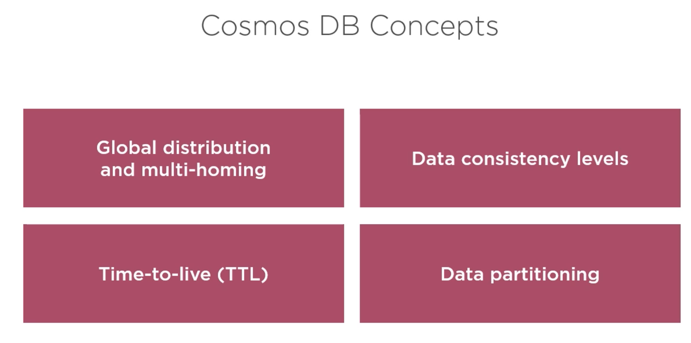
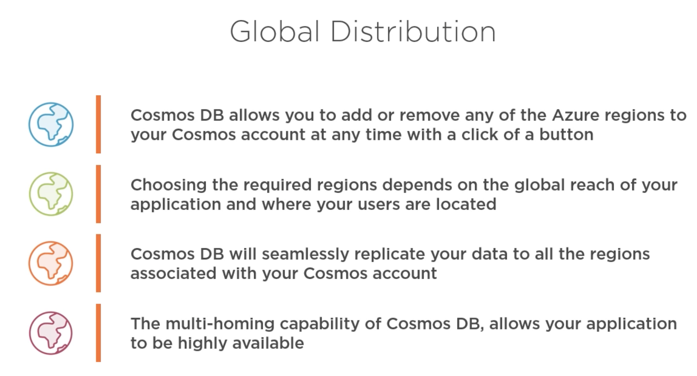
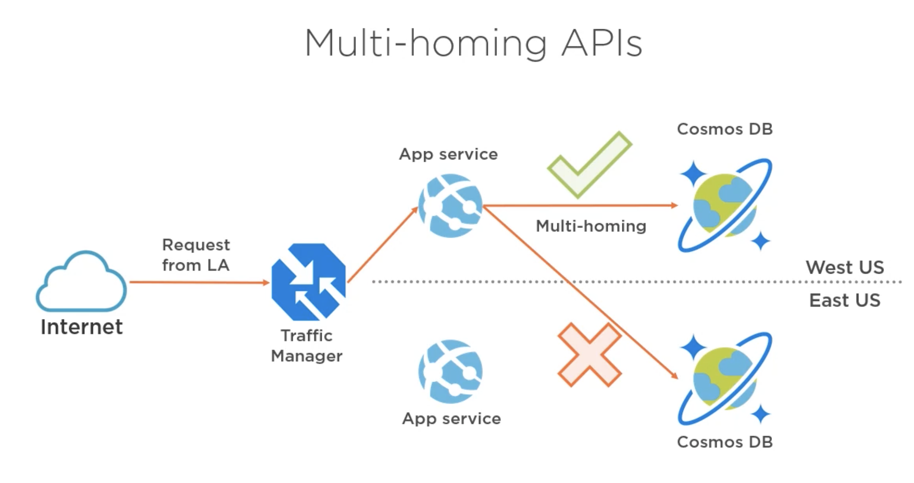
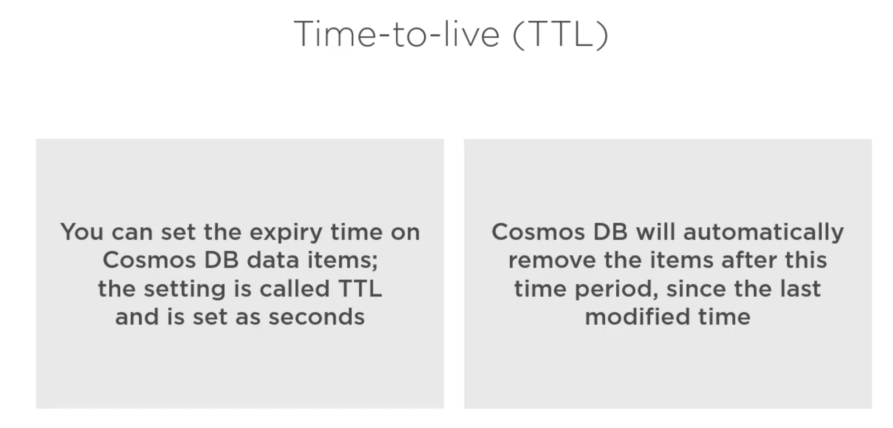
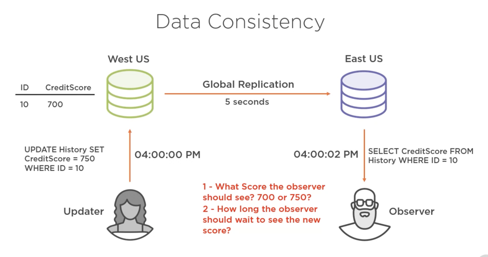
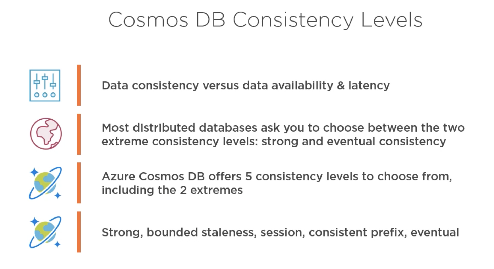
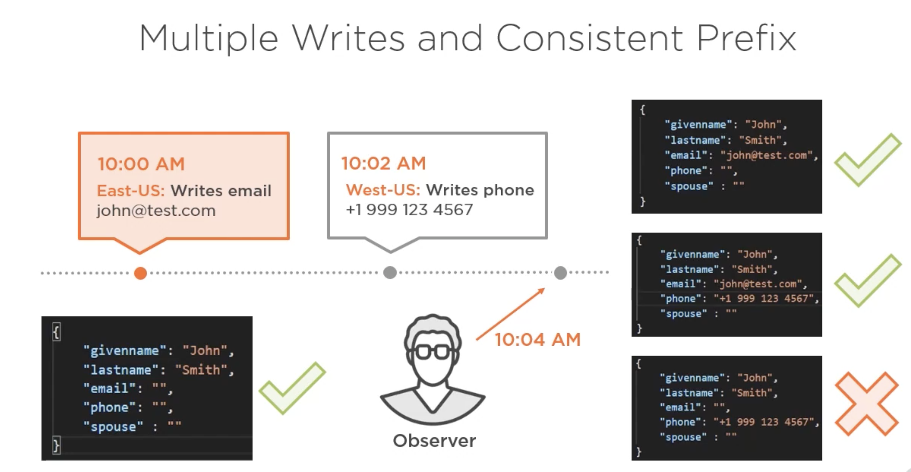
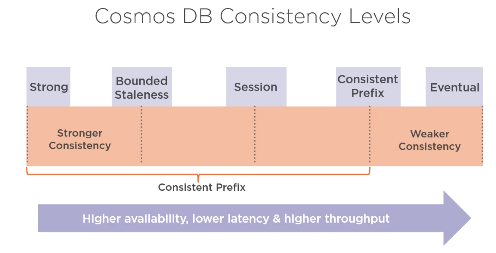
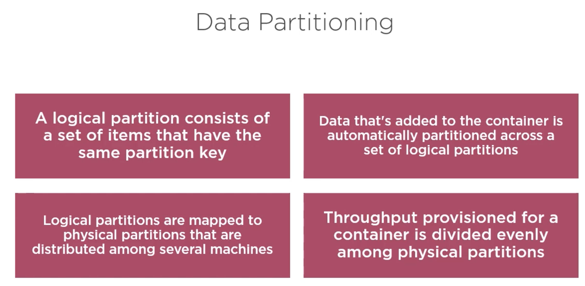
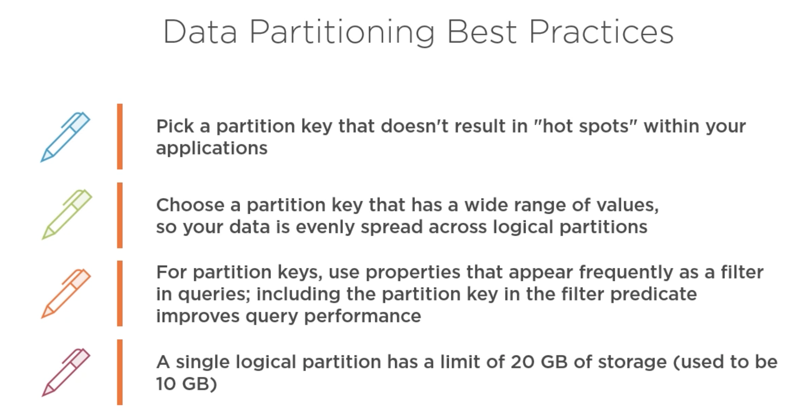

# 05 Cosmos DB

`Cosmos DB` peut ajouter ou retirer des régions.

Cela lui permet d'être hautement disponible, les données sont répliquées à l'identique, utile pour certaine politique de sécurité des données.

## Multi Homing API

`Multi-Homing` plusieurs fournisseurs.

`Cosmos DB` est distribué de façon mondial, le centre le plus proche sera sélectionné.

- plus rapide
- plus fiable
- disponibilité du service même en cas de panne sur un site

## `TTL` Time To Live

Temps de vie des objets de la base de données.

Date d'expiration avec suppression automatique.

 

## Data consistency : cohérence des données

consistency = cohérence.

Cela dépend, pur un réseau social l'ancien solde instantanément est tout à fait acceptable.

Pour un service bancaire, il serait plutôt préférable d'attendre les `5s` de latence.

Il est possible de régler la cohérence dans `Cosmos DB`.

### Niveau de cohérence

`Cosmos DB` offre 5 niveaux de cohérence.

cohérence des données ---------------------------- disponibilité et latence

## Écriture multiple et cohérence Prefix

L'observateur ne doit pas voire une version où l'action 2 serait réalisée avant l'action 1.

L'observateur voit les données dans **l'ordre** de leurs mise à jour.

 

`Bounded Staleness` crée une fenêtre en dehors de laquelle le niveau est `strong`, on peut traduire par limite de l'obsolescence.

`weaker consistency` la cohérence la plus faible.

## Partitioning

- une partition logique est un lot d'items qui ont la même clé de partition : `partition key`.

- Les données ajoutées à un conteneur sont automatiquement partitionnées entre plusieurs partitions logiques.

- Une partition logique correspond à une partition physique distribuée parmi plusieurs machine.

- L'accès d'un conteneur est découpé uniformément parmi les partitions physiques.

Choisir une `partition key` qui a un grand éventail de valeurs.

Par ville ou par pays peut être une bonne idée pour grouper les utilisateurs.

Pour déterminer la `partition key` il faut penser aux requêtes les plus commune qui seront effectuées.
