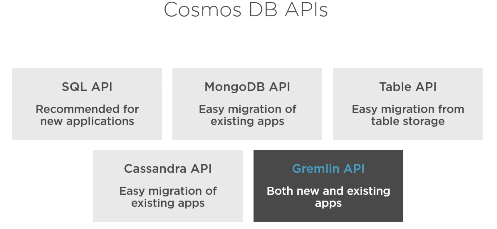
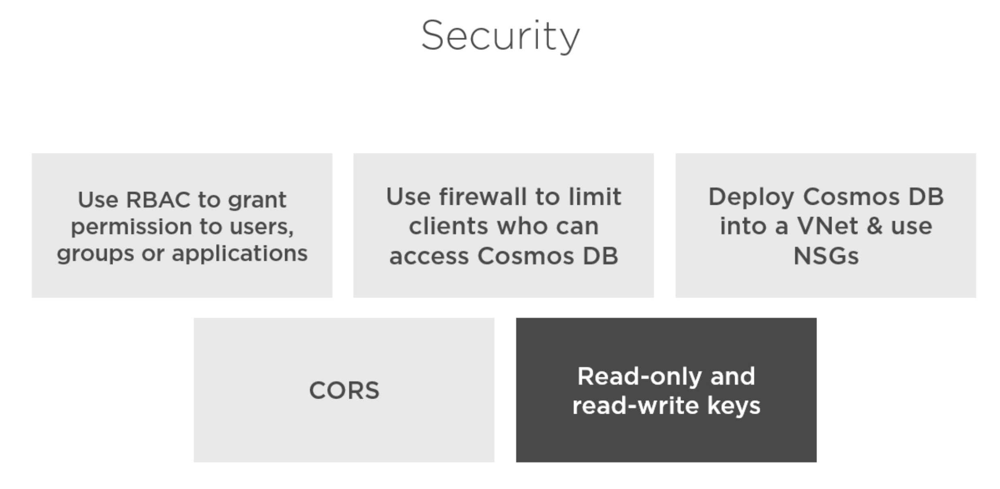

# 06 Cosmos DB API and Security

## `API`

Pour un nouveau projet `SQL` et `Gremlin` semblent être les meilleurs choix.

## Sécurité

`VNET` Virtual Network une option à réfléchir.

`NSG` Network Security Group pour contrôler qui a accès à `Cosmos DB`.

`CORS` Cross Origin Resource Sharing = partage de ressource entre domaine (origine différente).

Cela améliore de manière drastique la sécurité des accès à `Cosmos DB`.
