# Créer une DB `Cosmos DB`

## Basic

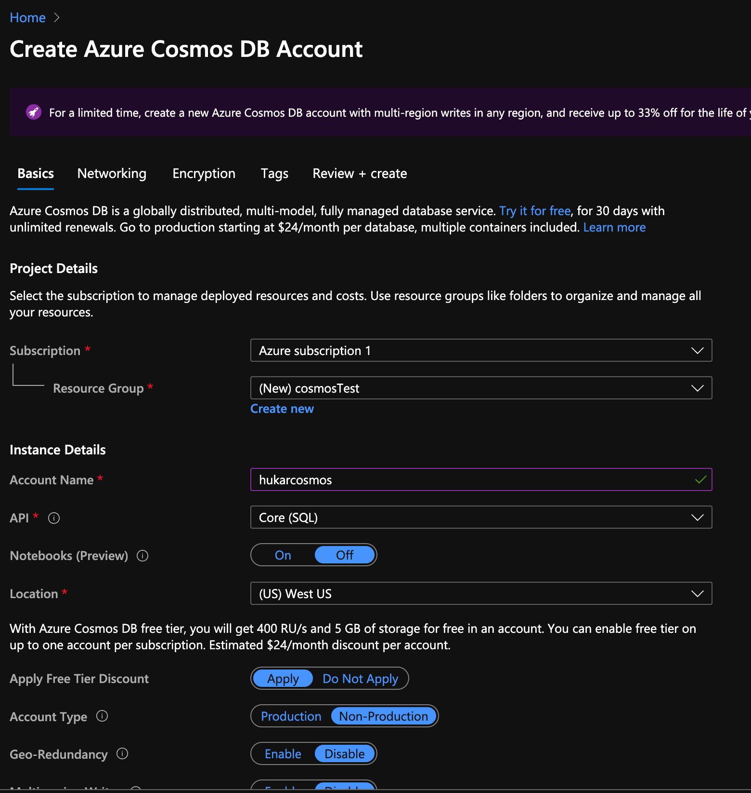

`Account Type` : `Non-production` permet d'avoir une DB moins chère pour le développement.

## Networking

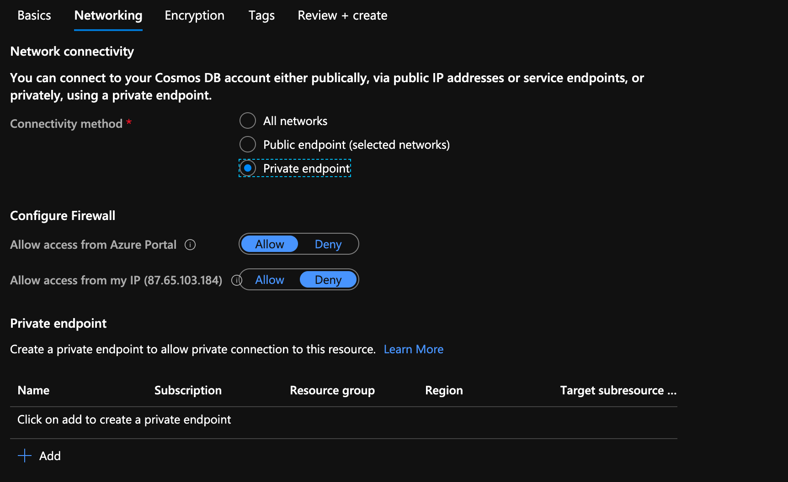

Pour la production `Private endpoint` permet de ne pas faire passer la connexion sur internet.

C'est un choix à retenir pour `eprolex`.

## Encryption et Tags

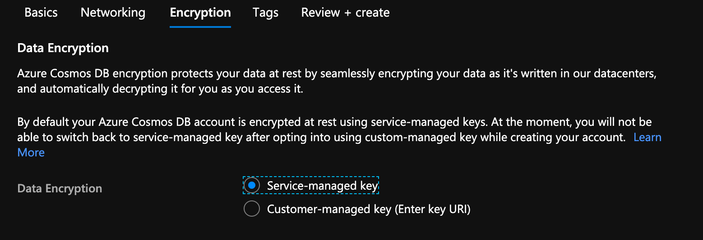

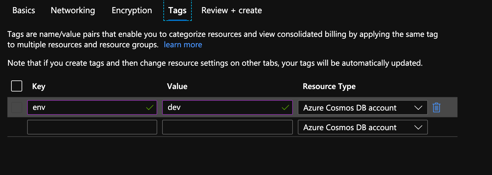

On peut proposer une clé d'encryptage personnel ou utiliser celle d'Azure.

Ajouter des tags est une bonne pratique pour un projet réel.

## Ressource `Cosmos DB`

Ma ressource est créée, on voit qu'elle est gratuite pour `400RU/s` et `5 GB`.

## Recommendations

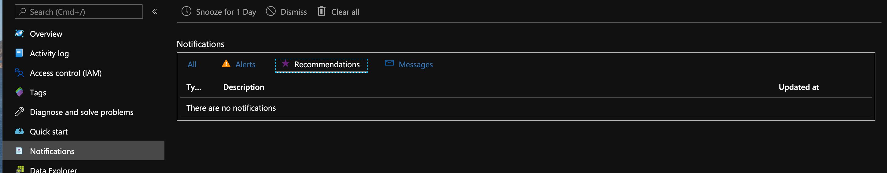

Dans les notifications j'ai accès aux recommendations.

## Création d'un `container`

Une base de données peut avoir un ou plusieurs `container`.

Un `container` est une unités définissant la scalabilité du débit ains que le stockage.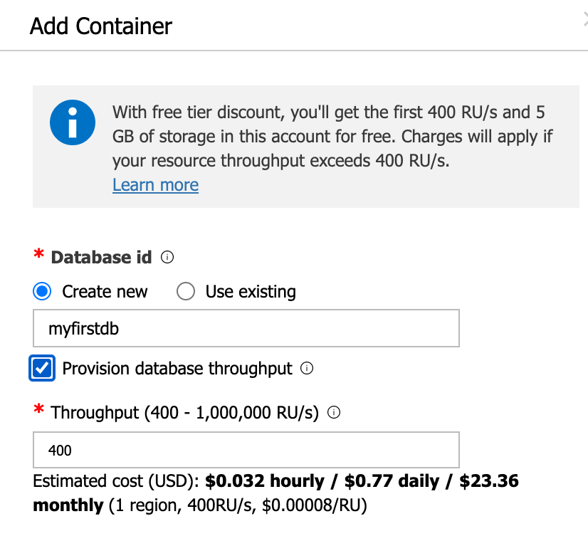

Avec `Provision database throughput` coché, le débit est partagé entre tous les `container` de la base de données.

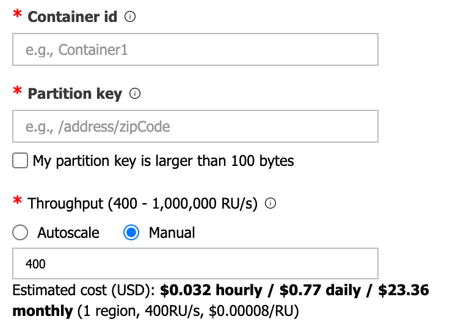

Sinon le débit (`throughput`) est défini pour ce seul `container`.

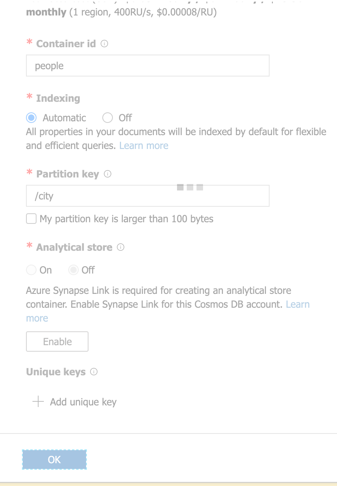

Bien choisir sa `partition key`.

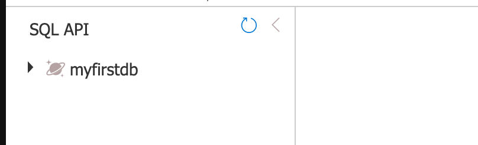

## Ajout d'un item

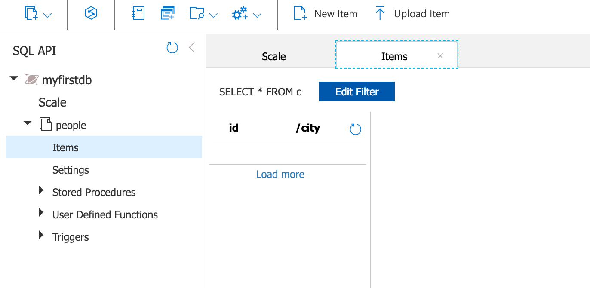

On clique sur `New Item` :

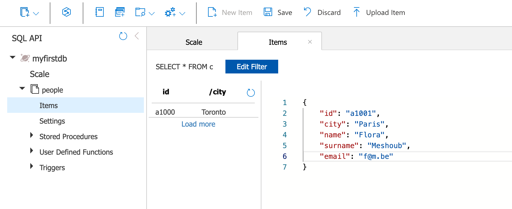

On insère ses données et on clique cette fois sur `save` :

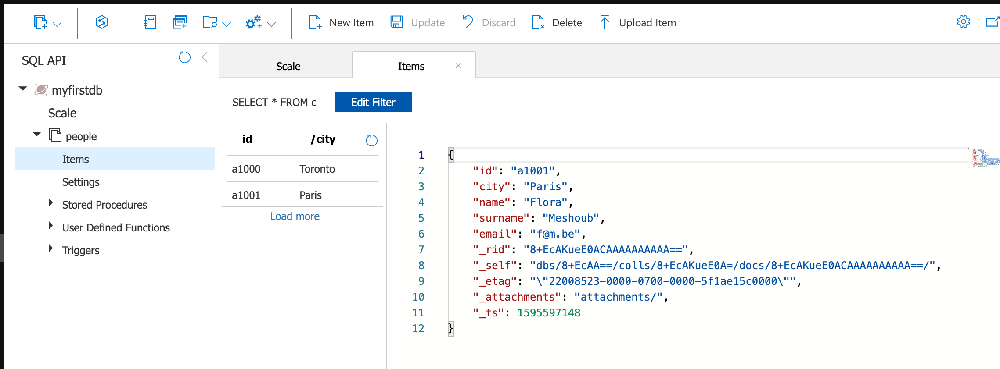

`Cosmos DB` ajoute cinq attributs automatiquement.

## TTL Time To Live

On peut régler la durée de vie :

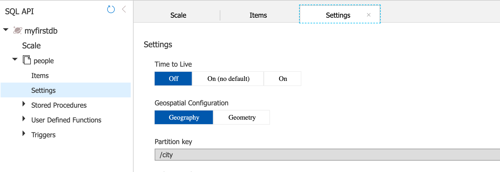

Dans `settings` on passe `Time To Live ` à `On`.

On défini ensuite une durée de vie en secondes :

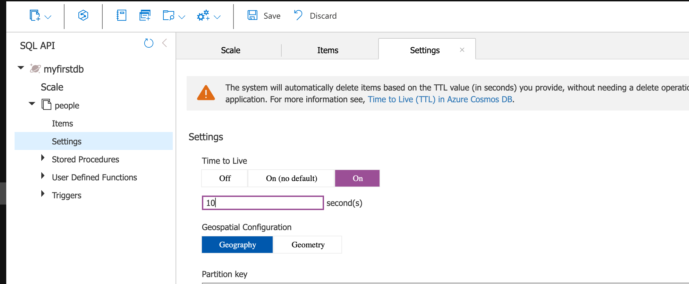

Ici la durée de vie est réglée à `10 s`.

J'ai deux `items` dans mon `container`:

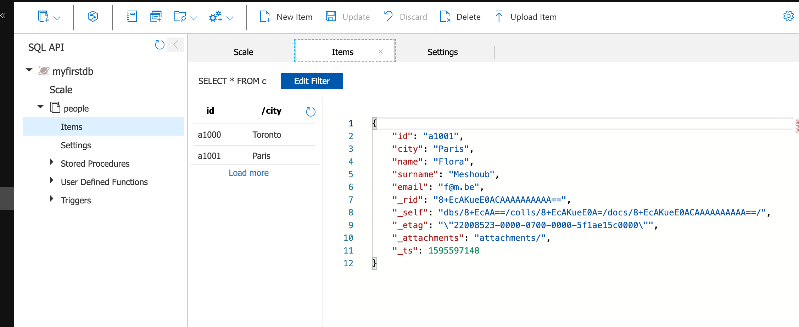

Et après `10 s` le nettoyage automatique est opéré :

## Supprimer son `container` et sa `DB`

### le `container`

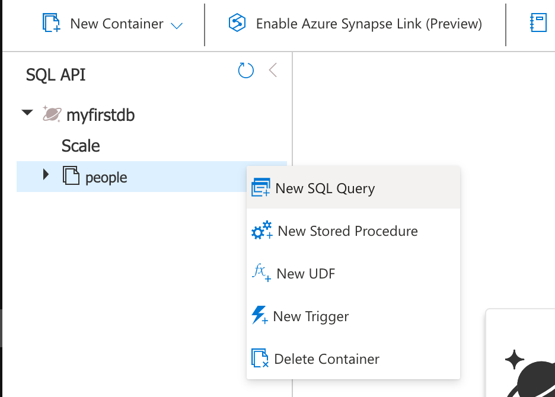

### Puis la `DB`

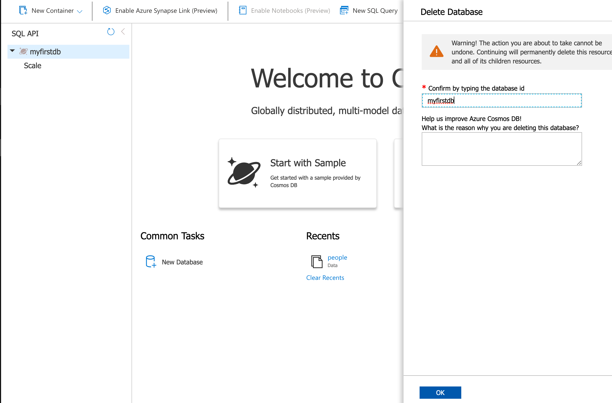
