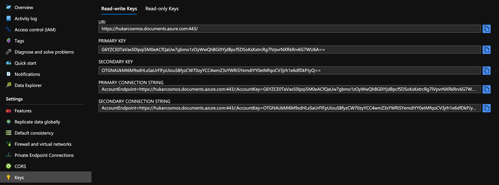
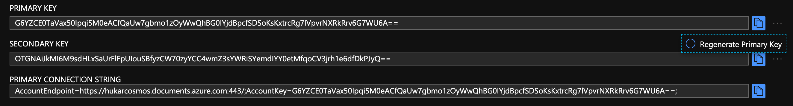
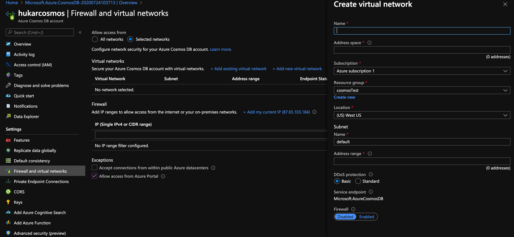
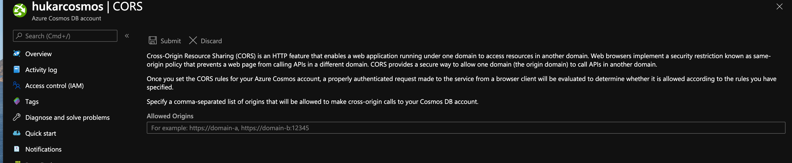
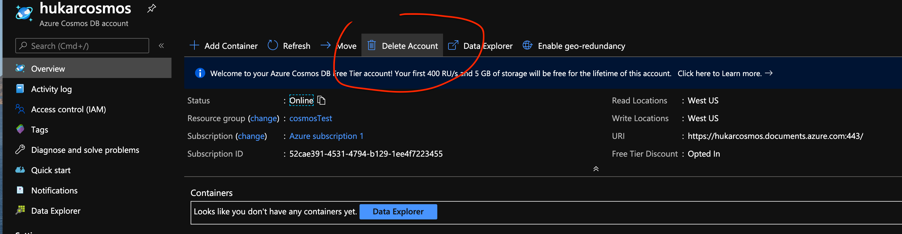

# 08 Gérer la sécurité

## Les clés

On a deux types de clés : `read-write` et `read-only`.

On peut régénérer une clé qui a été compromise `Regenerate Primary Key`.

## Firewall

on peut créer une `white list` ou bien créer un `Virtual Network`.

## `CORS`

On peut définir des domaines dans le cadre de `Cross Origin Resource Sharing`, pour qu'un client puisse directement appelé l'API de `Cosmos DB`.

## Supprimer l'acompte `Cosmos DB`

