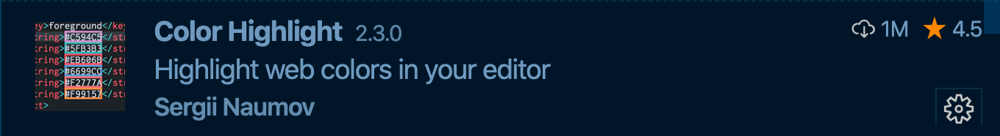
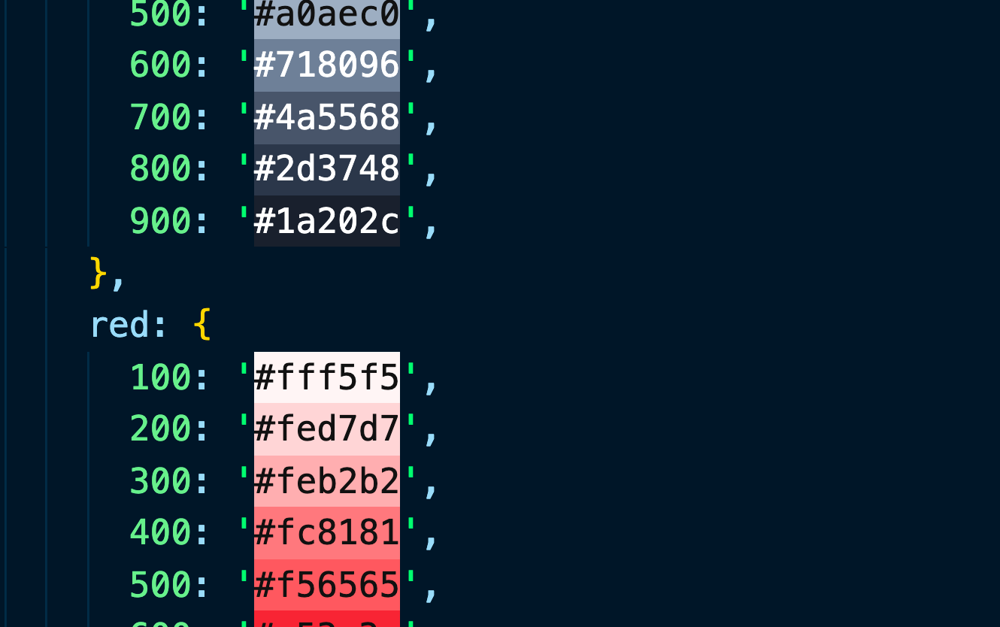
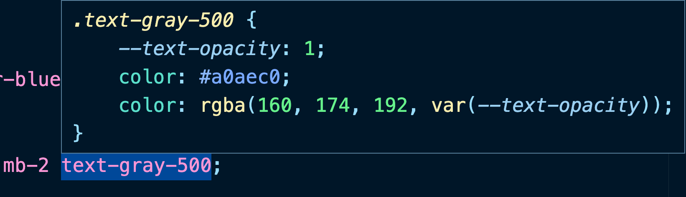

# 01 configuration de `VSCode` pour `Tailwind css`

## Installation d'extensions


Pour ne pas avoir d'erreurs avec la syntaxe `postcss`.

Il faut ajouter dans `settings` :

```json
"files.associations": {
        "*.css": "postcss"
    },
```

---



Permet de visualiser les couleurs :



---


Permet d'avoir une aide à la saisie et des infos :


