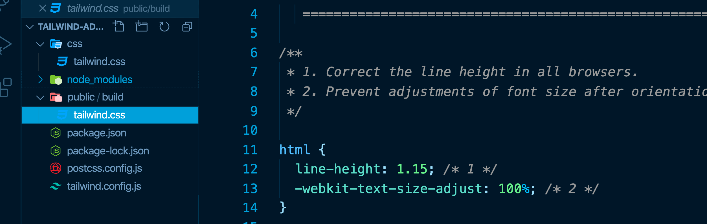
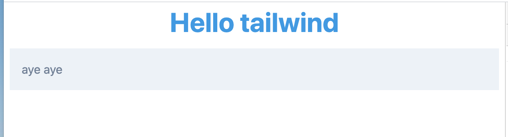

# Installation

```bash
npm init -y
```

`-y` pour prendre les options par défaut.

```bash
npm i tailwindcss postcss-cli autoprefixer
```

`tailwindcss` fonctionne avec `post-css`.

`autoprefixer` c'est un `postcss plugin` qui permet d'ajouter automatiquement les préfixes propriétaire `moz-` , `webkit-` ou `ms-`.

---

```bash
npx tailwind init
```

Cela va créer le fichier `tailwind.config.js` :

```js
module.exports = {
  purge: [],
  theme: {
    extend: {},
  },
  variants: {},
  plugins: [],
};
```

---

On va ensuite créer `postcss.config.js` :

```js
module.exports = {
  plugins: [require("tailwindcss"), require("autoprefixer")],
};
```

---

On crée ensuite `css/tailwind.css`

```css
@tailwind base;
@tailwind components;
@tailwind utilities;
```

## Script de build

Dans `package.json` :

```json
"scripts": {
    "build": "postcss css/tailwind.css -o public/build/tailwind.css"
},
```

On utilise `postcss` pour notre build.

On tape alors

```bash
npm run build
```



On obtient le build

## script de `watch`

Dans `package.json` on ajoute une option de `watch` :

```json
 "scripts": {
    "build": "postcss css/tailwind.css -o public/build/tailwind.css",
    "watch": "postcss css/tailwind.css -o public/build/tailwind.css --watch"

  },
```

Et on relance :

```bash
npm run watch
```

C'est une option de `postcss`.

## Inclure Tailwind dans son `HTML`

```html
<link rel="stylesheet" href="build/tailwind.css" />
```

## Serveur de développement

Utilisation de `live-server`

```bash
sudo npm i -g live-server
```

```bash
live-server public
```

## Premier exemple

```html
<body>
  <h1 class="text-4xl font-bold text-blue-500 text-center">Hello tailwind</h1>
  <p class="p-4 bg-gray-200 text-gray-600 m-2">aye aye</p>
</body>
```


