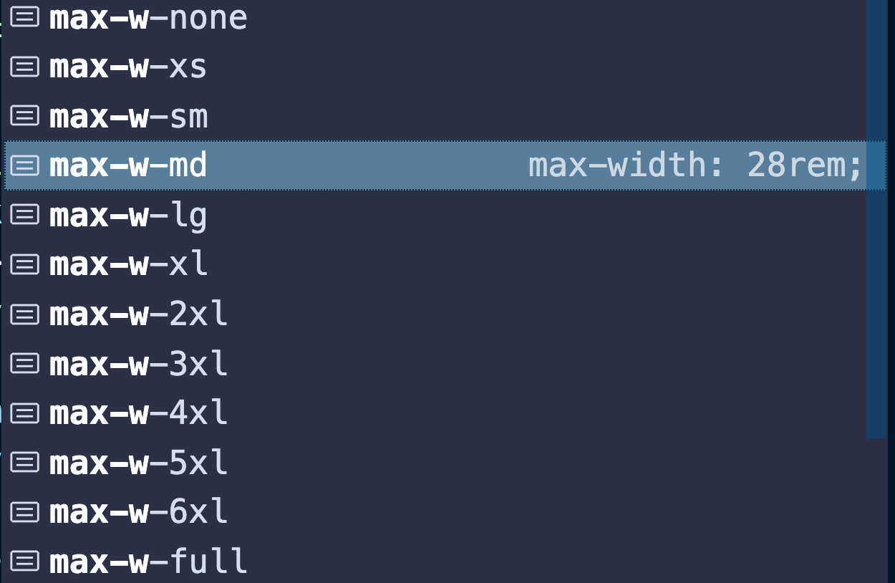

# responsive design

## Garder la largeur fixe



```html
<div class="py-12 px-8 max-w-md mx-auto"></div>
```

`mx-auto` pour centrer.

## Breakpoint

Quatre : `sm` `md` `lg` `xl`

## Utilisation des préfixes

```html

```

`object-cover` et `object-center` permettent de conserver les proportions de l'image et de la garder centrée.

## Taille de la police

`text-base` taille de base de la police = `1 rem`.

## Deux colonnes

```html
<div class="flex">
  <div class="lg:w-1/2"></div>
  <div class="lg:w-1/2"></div>
</div>
```

## Régler un `line breaker` de manière responsive

```html
<br class="hidden lg:inline" />
```
