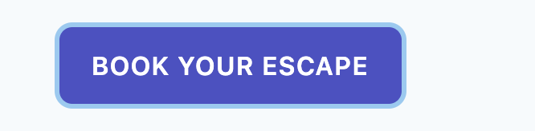

# 04 `focus` `active` `hover`

## `focus` et `hover`

### `focus` par défaut :


### Custom `focus`

```html
<button class=" ... focus:outline-none focus:shadow-outline ... ">hello</button>
```


C'est une ombre qui sert de `outline`.

### `hover`



```html
<button class=" ... hover:bg-indigo-700 ... ">Hello</button>
```

## `active`

Cette pseudo classe est désactivée par défaut.

Il faut aller dans `tailwind.config.js`

```js
module.exports = {
  purge: [],
  theme: {
    extend: {},
  },
  variants: {
    backgroundColor: ["responsive", "focus", "hover", "active"],
  },
  plugins: [],
};
```

L'ordre est important si on veut que tout fonctionne.

Puis re-build

```bash
npm run build
```

## Combiner les pseudo classes et les préfixes responsive

```html
<a class="... bg-indigo-500 hover:bg-indigo-300 md:hover:bg-green-400 ...">
  hello
</a>
```

### `md:hover:class-css`

## Changer la taille de la police au survol

Les effets non courant comme celui-ci sont désactivé par défaut pour l'activer comme précédemment :

```js
module.exports = {
  purge: [],
  theme: {
    extend: {},
  },
  variants: {
    backgroundColor: ["responsive", "focus", "hover", "active"],
    fontSize: ["responsive", "hover"],
  },
  plugins: [],
};
```

```html
<a class="... md:hover:text-4xl ..."> hello </a>
```


